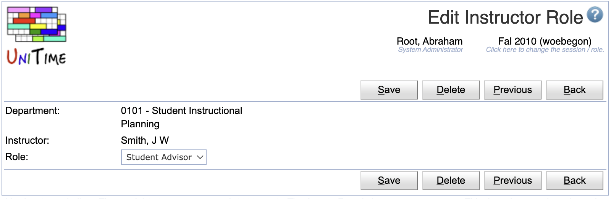
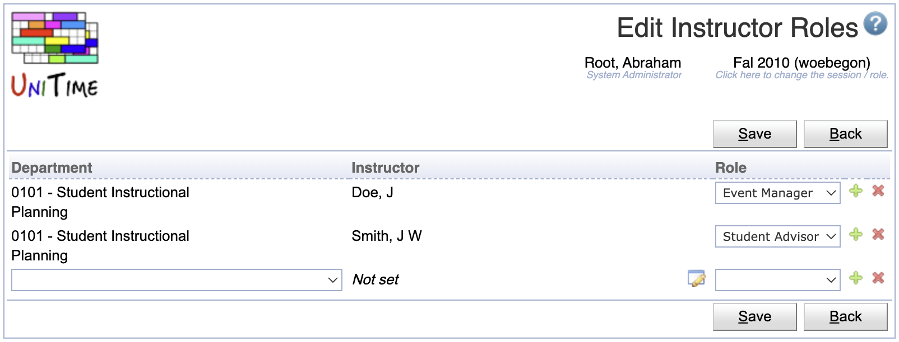

## Screen Description

Instructor Roles page can be used to assign a role (that has the Instructor toggle checked, see [Roles](roles) page) to an instructor or other department personel. That is to anyone from the [Instructors](instructors) page for a particular department. This feature may be handy if a schedule manager or event manager is allowed to dedicate some (usually lesser) roles to people within his/her department. For instance, an event manager can give other people from the department to request and/or approve event in the departmental event rooms. Or, a schedule manager can dedicate some part of the data entry to his/her assistants. To enable this functionality, appropriate roles need to be created on the [Roles](roles) page with the appropriate permissions provided on the [Permissions](permissions) page first.

{:class='screenshot'}

Permission Instructor Roles is needed to access the page, changes can be made (for a particular department) when the Instructor Role Edit permission.

## Details

Each instructor of a department can be given a role. If a new person is looked up, an appropriate instructor is also created on the [Instructors](instructors) page. Administrative uses do only see instructors which already have a role given on this page. Users of department dependent roles (e.g., an event manager or a schedule manager) can see all instructors of their department(s).

**Note:** Only roles that have the **Instructor** toggle checked on the [Roles](roles) page can be used.

## Operations

The table can be ordered by any of the columns. To do so, click on the column header and select **Sort by ...** option.

The user needs to have Instructor Role Edit permission to be able to make changes.

### Add Instructor Role
A role can be assigned to a new instructor by clicking the **Add** button. This page also allow for adding a new person into the department.

{:class='screenshot'}

* Click  to lookup a person. This will open the [People Lookup](people-lookup) dialog.
* Click **Save** to create a new instructor role
* Click **Back** to return to the list without making any changes

### Edit Instructor Role
To change or remove a role from an instructor, click on the appropriate line.

{:class='screenshot'}

* Click **Save** to make changes, **Back** to return to the list without making any changes
* Click **Previous** or **Next** to save the changes and go to the previous or next instructor role respectively
* Click **Delete** to delete an instructor role.

### Edit Instructor Roles
All instructor roles can be edited at once with the **Edit** button.

{:class='screenshot'}

* Click  to lookup a person. This will open the [People Lookup](people-lookup) dialog.
* Use the  icon to add a new line and  to delete a line
* Click **Save** to make changes, **Back** to return to the list without making any changes
