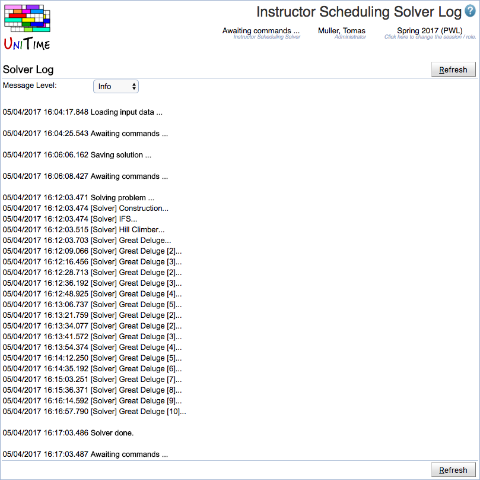

## Screen Description

The Instructor Scheduling Solver Log page can be useful to see what the solver has been doing. Also, any solver warnings and errors are listed in here.

## Details

The amount of information displayed depends on the **Debug Level** chosen from the drop-down list:

* Trace - Most detailed log information

* Debug - Detailed log information

* Progress - All of the below plus details about solver stages (such as "improving found solution" during the "Solving" stage)

* Info - All of the bellow plus information about loading that does not constitute warnings

* Stage - All of the bellow plus names of the stages the solver goes through

* Warn - Display warnings and errors

* Error - Display errors only

* Fatal - Display fatal errors only

## Operations

* **Refresh**
	* Refresh this page

{:class='screenshot'}
