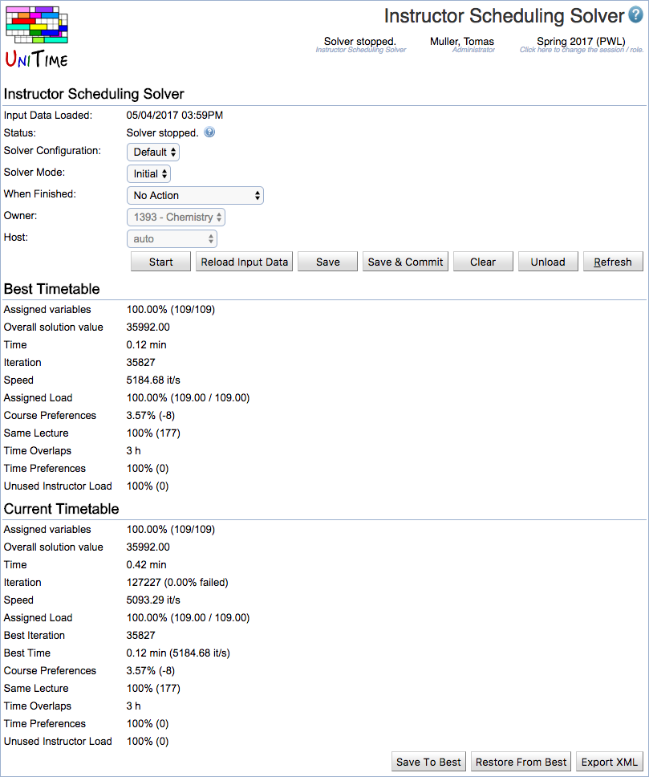

## Screen Description

 The instructor scheduling solver works much like any other UniTime solver. It can be loaded, unloaded, started, saved, etc. using this page.

## Details

 The solver works with two solutions, current solution and the best ever found solution. This helps the solver to keep a record of the best solution is has seen while it is making changes in the current solution. A number of properties about the best and the current solutions are listed, these include the number of assigned variables (teaching requests, a complete solution should have 100%), the overall solution value (this is a weighted sum of all the optimization criteria, which the solver is trying to minimize), time and iteration when the current solution was reached and a number of optimization criteria that are being considered (criteria that are not used are not displayed):

* **Attribute Preferences**
	* This criterion counts how well are the soft attribute preferences (that are set on teaching requests) met

* **Back To Back**
	* Instructor back-to-back preferences

* **Course Preferences**
	* How well are the soft course preferences (which are set on instructors) are met

* **Instructor Preferences**
	* This criterion counts how well are the soft instructor preferences (that are set on teaching requests) met

* **Original Instructor**
	* When the solver is used in the MPP (Minimal Perturbation Problem) mode, this criterion penalizes teaching assignments that are not given to the initial instructor

* **Same Common**
	* This criterion counts how well are the soft same common preferences (that are set on teaching requests) met

* **Same Course**
	* This criterion counts how well are the same course preferences (that are set on teaching requests) met

* **Same Days**
	* Instructor same days preferences

* **Same Room**
	* Instructor same room preferences

* **Teaching Preference**
	* This criterion counts how well are the soft teaching preferences (that are set on instructors) met

* **Time Overlaps**
	* Total overlapping time (in hours) for all assignments that are allowed to overlap. This criterion counts times during which an instructor has to teach (or attend) two things that are overlapping in time (the time overlaps must be allowed in this case).

* **Time Preferences**
	* This criterion counts how well are the soft instructor time preferences met

* **Unused Instructor Load**
	* If an instructor is being used (has at least one teaching assignment),  this criterion can penalize the remaining (unused) load of the instructor. That is the difference between instructor maximal load and the assigned load of the instructor

 Any attribute, course, time, instructor, same common, same course, or distribution preferences that have Required or Prohibited preference must be satisfied. The strongly preferred, preferred, discouraged, and strongly discouraged preferences are counted in the above criteria and a weighted sum of these criterions is used to compare two solutions.

 The various solver weights and other parameters are configured on the Administration > Solver > [Configurations](solver-configurations) page. See the configuration with Instructor Scheduling Solver appearance.

## Operations

 The solver page has the following operations:

* **Load**
	* Load the data (instructors and teaching requests) into the solver

* **Unload**
	* Unload the solver

* **Start**
	* Start the solver

* **Stop**
	* Stop the solver

* **Refresh**
	* Refresh the page

* **Reload Input Data**
	* Reload input data while keeping the current instructor assignments

* **Clear**
	* Clear current assignments (make all variables unassigned)

* **Save**
	* Save the current solution (teaching assignments)

* **Save & Commit**
	* Save the current solution and populate course coordinators and class instructors (commit the solution)

* **Save & Uncommit**
	* Save the current solution, but remove the course coordinators and class instructors associated with this problem (uncommit the solution)

* **Save To Best**
	* Copy the current solution over the best ever found solution

* **Restore From Best**
	* Copy the best solution into the current solution

* **Export XML**
	* Export the problem in the solver-compatible XML format

{:class='screenshot'}
