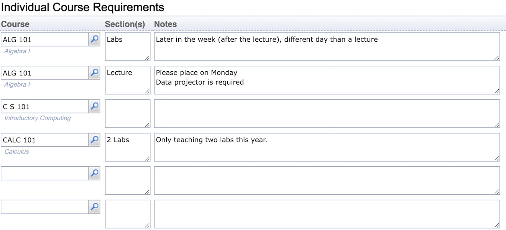

## Screen Description

The Instructor Survey Note Types defines additional columns for the [Instructor Survey](instructor-survey) page, Individual Course Requirements table.

{:class='screenshot'}

Each note type (column) has a **name**, **description**, and **width** (in the number of characters).

In the Individual Course Requirements table of the [Instructor Survey](instructor-survey) page, all columns except for the **Course** can be changed:

{:class='screenshot'}

## Operations

The table can be sorted by any of its columns, just by clicking on the column header and the sorting option that opens.

### Add Instructor Survey Note Type
Click **Add** to add a new instructor survey note type

{:class='screenshot'}

* Click **Save** to create a new instructor survey note type
* Click **Back** to return to the list without making any changes

### Edit Instructor Survey Note Type
Click a particular instructor survey note type to make changes or to delete the instructor survey note type

{:class='screenshot'}

* Click **Save** to make changes, **Back** to return to the list without making any changes
* Click **Previous** or **Next** to save the changes and go to the previous or next instructor survey note type respectively
* Click **Delete** to delete the instructor survey note type.

### Edit Instructor Survey Note Types
Click **Edit** to edit all instructor survey note types

{:class='screenshot'}

* Use the  and  arrows to move a line up and down
* Use the  icon to add a new line and  to delete a line
* Click **Save** to make changes, **Back** to return to the list without making any changes

### Export CSV/PDF
Click the **Export CSV** or **Export PDF** to export the list of instructor survey note types to a CSV or PDF document respectively