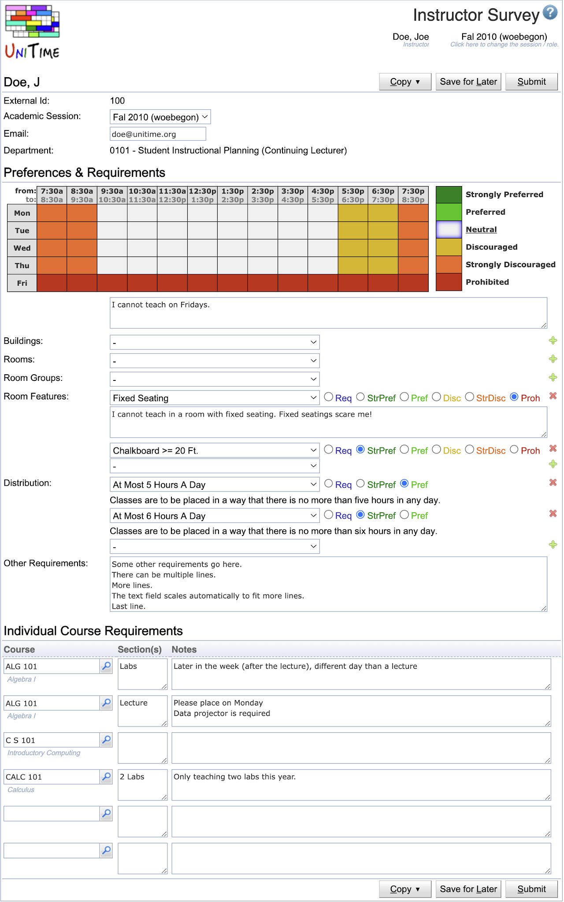
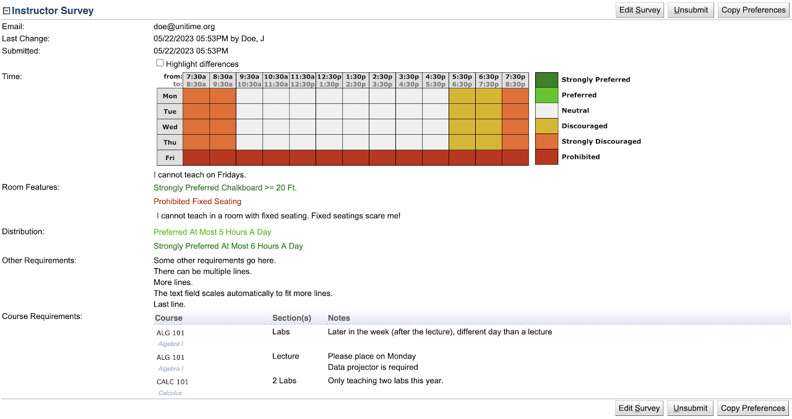
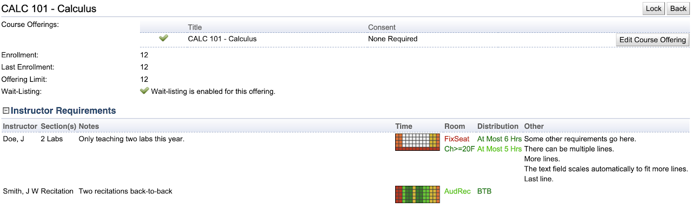

## Screen Description

The Instructor Survey page can be used to collect requirements from instructors.  It consists of two sections. The Preferences & Requirements are common to all courses the instructor is teaching and can be directly copied to the instructor's preferences. The Individual Course Requirements section can contain individual requirements for the courses that the instructor is teaching, planning to teach, or just wishes to comment on.

{:class='screenshot'}

While the data entry is only available during certain times (based on the status of the academic session and/or the department), an instructor can always see the surveys he/she has filled in in the past. It is also possible to copy preferences & requirements or the individual course requirements using the Copy button (only available when older surveys have been filled in).

## Preferences & Requirements

When hard requirements are used (required or prohibited), an additional text field where the instructor can provide reasons for the hard constraints is provided.

Depending on the UniTime configuration, only certain preferences can be enabled. For instance, the ability to provide room preferences may be disabled, or it may not be allowed to require or prohibit a building.

Additional requirements can be entered as text in the Other Requirements section. All the text areas grow automatically with the number of lines entered.

## Individual Course Requirements

The list of courses is automatically pre-populated with the courses the instructor is already teaching (which could be the last year's assignments when used shortly after the roll forward of the academic session). This way, the instructor may also indicate that he/she will not teach the course next semester.

Additional courses can be looked up. It is also possible to put multiple lines for the same course, e.g., if different requirements are needed for a lecture and a lab or if the instructor is teaching multiple lectures with different requirements.

While the list is populated with the courses that already exist in UniTime, it is possible to enter a course that does not exist.

The additional columns for the Individual Course Requirements table can be configured by the administrator to fit the institutional needs.

## Operations

* **Copy**
	* Preferences or course requirements can be copied from a previous academic session.
	* Only available when the survey has been filled in for the previous term(s). 

* **Save for Later**
	* Save changes made to the survey while keeping it editable for the instructor.
	* This indicates that the instructor is not done with the changes.

* **Submit**
	* Submit the instructor survey. No changes can be made once the survey is submitted.
	* A submitted survey can be unsubmitted by the Schedule Deputy (or an admin) using the [Instructor Detail](https://sites.google.com/unitime.org/help48/instructor-detail) page.

## Integration

The schedule deputy can see which instructors have filled in their survey and whether they have submitted it on the Instructor page. Additional information is available on the [Instructor Detail](instructor-detail) page, in the Instructor Survey section.

The schedule deputy can copy preferences and requirements directly to the instructor's preferences using the [Instructor Detail](instructor-detail) page. Additional changes can be made to the instructor preferences, and the [Instructor Detail](instructor-detail) page can highlight these differences.

Individual course requirements are listed on each course (on the [Instructional Offering Detail](instructional-offering-detail) page, Instructor Requirements section), consolidated from all the instructors that provided requirements for the course. Only submitted surveys are visible.

## Administration

* Only users with a role that has the Instructor Survey permission can fill in the survey.

* The survey is only available when the academic session (or the department) is in a status that allows for Instructor Survey (see [Status Types](status-types)).

* The survey is linked to the external id of the instructor. So, only instructors with an external id can fill in the survey, and there is only one survey for all the departments that the instructor is teaching.

* When a survey is submitted, the instructor cannot change it. A timetabling manager (typically a Schedule Deputy for the appropriate department can re-open the survey for the instructor and/or copy the information over to the instructor's preferences). Instructor Survey Admin permission is needed for that.

* Additional columns for the Individual Course Requirements table can be configured using the Administration > Other > [Instructor Survey Note Types](instructor-survey-note-types) page.

* For the Preferences & Requirements, it is possible to enable/disable which preference types the instructor will be able to see (e.g., Rooms can be disabled) or whether Required/Prohibited preferences are allowed, using the Administration > Defaults > [Configuration](application-configuration) page. See properties starting with unitime.instructorSurvey.
	* This can also be configured individually for each department, adding department code in the property. E.g., to disable room preferences for department 101, set `unitime.instructorSurvey.roomPrefs.101` to false.
	* The days and times of the time preferences can be configured using the unitime.instructorSurvey.timePrefs property. The format is `first day|last day|first slot|last slot|increment`, e.g., `0|4|90|246|12` means Monday - Friday, starting at 7:30 am, ending at 8:30 pm, in one-hour increments

* It is possible to create a URL that opens the Instructor Survey page after an instructor has logged into UniTime by using the following URL (for example, see [here](https://demo.unitime.org/UniTime/login.action?target=gwt.jsp%3Fpage%3DinstructorSurvey%26session%3Dauto))
	* Parameter **session** can be used to select a particular academic session (e.g., session=Fal2010woebegon), or session=auto will automatically select the most recent academic session where the instructor survey is available for the instructor to fill in.
	* `UniTime/login.action?target=gwt.jsp%3Fpage%3DinstructorSurvey%26session%3Dauto` (explicitly going through authentication) 
	* `UniTime/gwt.jsp?page=instructorSurvey&session=auto` (direct link)

### Instructor Survey section on the Instructor Detail page

{:class='screenshot'}

### Instructor Requirements section on the Instructional Offering Detail page

{:class='screenshot'}

