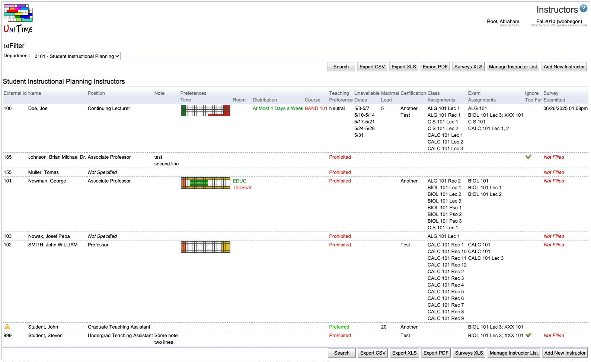

## Screen Description

 The Instructors screen displays a list of instructors that can be used throughout the application - for example, to assign instructors to classes/examinations or to add instructors to a designator list. Clicking on any instructor will take you to his/her [Instructor Detail](instructor-detail) screen.

## Top Line with Search

* **Department**
	* The department for which you want to view a list of instructors. If you are responsible for more than one department, you will need to select a department in the drop down list and click on **Search** (Alt+S)
	* If you are responsible for only one department, this field will be pre-populated for you

* **Export PDF** (Alt+P)
	* You can export your list of instructors into a PDF document
	* There are more details about export to PDF in the description of the [Instructional Offerings](instructional-offerings) screen

## Details

 For each instructor, you can see

* **External Id**
	* Instructor's Id as used in other systems; used to identify instructors throughout UniTime
	* If the instructor does not have an External Id assigned, or you have not yet matched the instructor to their Id, you will see a big red cross in this column
	* To find instructor's External Id, go to the [Edit Instructor](edit-instructor) screen and click the on the Lookup button

* **Name**
	* Name of the instructor
	* To change the format in which names are displayed, click on "Settings" under "Preferences" in the main menu; this takes you to the [Manager Settings](manager-settings) screen.

* **Position**
	* Position classification of this instructor
	* Note: This field is user maintained and is not required elsewhere in UniTime. It may be useful, however, for grouping instructors or in exports for departmental report.

* **Designator**
	* In this column you can see the designator number of the given instructor
	* If you manage more than one subject area, the subject area will be displayed with the designator number
	* An instructor can have different designator numbers for different subject areas; in this screen, you will only see the designator numbers for your subject areas (even if the instructor is teaching for other departments too)

* **Note**
	* Note on the instructor
	* For your use only (you can enter anything you want there and this note will not be used elsewhere)
	* To change the note, go to the [Edit Instructor](edit-instructor) screen

* **Preferences**
	* **Time**, **Room** and **Distribution** preferences of the instructor
	* Instructor preferences are optional; they may be set up using the [Instructor Preferences](instructor-preferences) screen (accessible from the [Instructor Detail](instructor-detail) screen)
	* The preferences will be considered only for those classes on which the "conflict checking" is turned on for the instructor  (this can be changed e.g. in the [Edit Class](edit-class) screen)

* **Class Assignments**
	* Indicates which classes this instructor has been assigned to for the semester that is being timetabled
	* To make changes in this assignment, you need to go to the [Assign Instructors](assign-instructors) or [Edit Class](edit-class) screen (you can get there e.g. from the [Instructional Offerings](instructional-offerings) screen) - you CANNOT assign classes to an instructor in any instructor-related screen
	* Conflicts are checked for classes displayed in bold letters

* **Exam Assignments**
	* Names of examinations assigned to an instructor
	* Final examinations are in bold

* **Ignore Too Far**
	* By default (when unchecked), the solver prohibits placement of back to back classes taught by the same instructor in rooms that are more than a short distance apart
	* If checked, the solver will strongly discourage but not prohibit long distances between back to back classes of this instructor
		* Use with caution!
		* When your timetable is created, make sure you check whether the instructor for whom you chose to ignore too far distances has a feasible timetable (that the instructor can in fact teach the classes that are back to back)
	* This check about distances will be performed only for those classes for which the instructor is has conflict checking on

 You can sort by any column which tells you so when you roll the mouse over its header. An arrow will be displayed next to the column header to indicate by which column and in which order the list of instructors is sorted.

## Operations

* **Manage Instructor List** (Alt+M)
	* Go to the [Manage Instructor List](manage-instructor-list) screen which allows you to import staff members or to remove instructors from your list

* **Add New Instructor** (Alt+A)
	* Go to the [Add Instructor](add-instructor) screen to add a new instructor

{:class='screenshot'}
