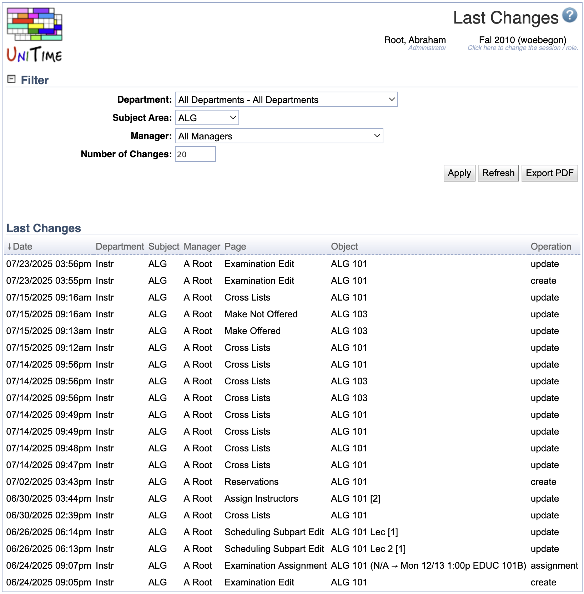

## Screen Description

The Last Changes screen provides a log of times/authors/screens of the changes in the application (it does not contain information about what has changed in a given screen).

{:class='screenshot'}

## Details

### Filter

It is possible to filter the list of changes by **Department**, **Subject Area**, and **Manager**. You can also change the **Number of Changes** to be displayed. After you make changes to the filter, click **Apply** to display the log in the form you want.

### Last Changes

The list of last changes contains the following columns

* **Date**
	* Date and time of the change

* **Department**
	* Department whose data has been changed

* **Subject**
	* Subject area if the change was made on a class/scheduling subpart/instructional offering

* **Manager**
	* The manager who made the change

* **Page**
	* The name of the page (screen) in which the change was made

* **Object**
	* The object (class/instructor/...) that was changed

* **Operation**
	* The operation used to make the change (create/update/delete)

## Operations

* **Apply**
	* Apply changes made to the filter
		* Displayed only if filter is unfolded

* **Export PDF**
	* Export the list of changes into a PDF document

* **Refresh**
	* Refresh this screen
