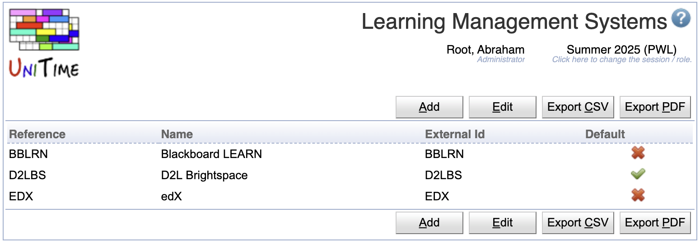
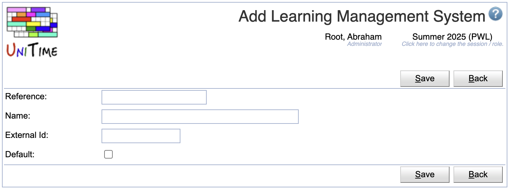
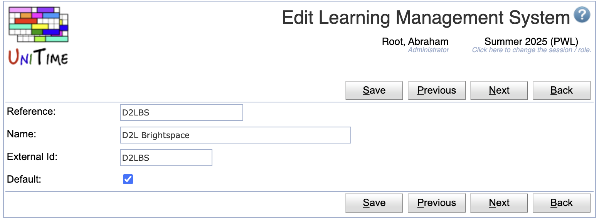
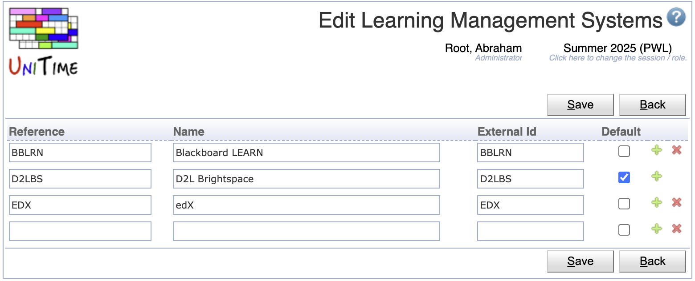

## Screen Description

The Learning Management Systems screen displays and allows editing of the list of available learning management systems (LMS) for the current academic session.

{:class='screenshot'}

The LMS can be set on a class (e.g., using the [Multiple Class Setup](multiple-class-setup) page). It has no meaning for UniTime, but can be used for reporting purposes and data exchange.

## Properties

Each LMS contains the following properties:

* Reference
	* Reference of the LMS (short name)

* Name
	* LMS name

* External Id
	* External ID of the learning management system

* Default
    * Default LMS
    * There can be only one default LMS

## Operations

The table can be sorted by any of its columns, just by clicking on the column header and the sorting option that opens.

### Add Learning Management System
Click **Add** to add a new LMS

{:class='screenshot'}

* Click **Save** to create a new LMS
* Click **Back** to return to the list without making any changes

### Edit Learning Management System
Click a particular LMS to make changes or to delete the LMS

{:class='screenshot'}

* Click **Save** to make changes, **Back** to return to the list without making any changes
* Click **Previous** or **Next** to save the changes and go to the previous or next LMS respectively
* Click **Delete** to delete the LMS.

### Edit Learning Management Systems
Click **Edit** to edit all learning management systems

{:class='screenshot'}

* Use the  icon to add a new line and  to delete a line
* Click **Save** to make changes, **Back** to return to the list without making any changes

### Export CSV/PDF
Click the **Export CSV** or **Export PDF** to export the list to a CSV or PDF document respectively