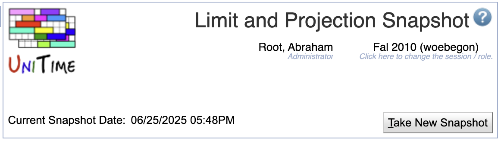

## Screen Description

The Limit and Projection Snapshot screen lists the timestamp the most recent limit and projection snapshot was taken.  It provides users with the appropriate rights to take a new limit and projection snapshot.

{:class='screenshot'}

## Details

The data displayed on the page is as follows

* **Current Snapshot Date** - the date and time the current snapshot of limit and projection data was taken.

## Operations

* **Take New Snapshot** (Alt+T)
	* Take a snapshot of the current limit and projection data.

## Notes

Taking a new snapshot of the limit and projection data overwrites any existing snapshots of limit and projection data.
