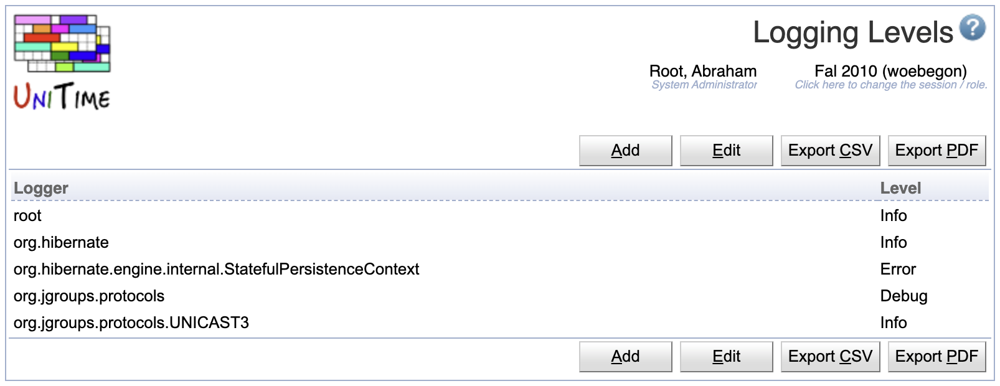
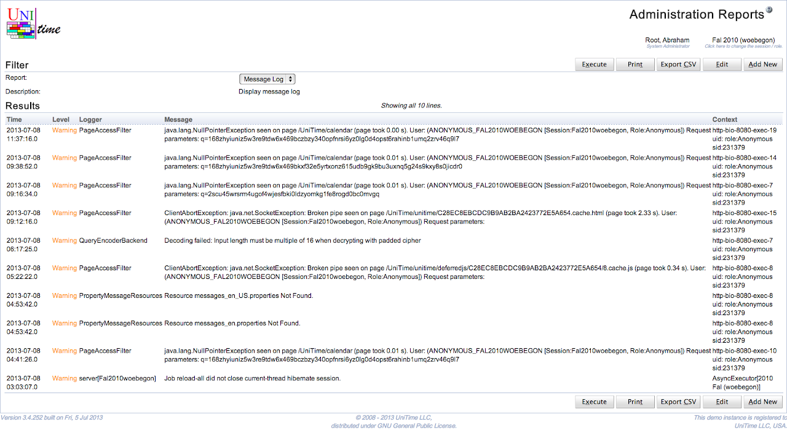

## Screen Description

The Logging Levels page can be used to modify logging levels of various classes.

{:class='screenshot'}


UniTime is using [log4j](http://logging.apache.org/log4j/1.2/) for logging. Each class writing messages into the log is using a separate **logger**, typically named after the class. The loggers form a tree in a similar manner as the classes do. A logging level can be changed for a particular class (logger) or for all classes (loggers) of a given package. For instance, all org.hibernate.cfg classes have the logging level set to Warning, meaning that only warnings or higher messages (errors, fatals) appear in the log. The following logging levels are available:

* All (all messages are logged)
* Trace
* Debug
* Info
* Warning
* Error
* Fatal
* Off (no messages are logged)

If a logging level is set to a particular level, only messages of the level or higher are printed in the log. The page requires Application Config permission.

## Details

UniTime logging is defined in the application properties (see [application.properties]( https://github.com/UniTime/unitime/tree/master/JavaSource/application.properties#78)) and can be overridden using custom properties (see [customization](installation#customization)). The changes to the logging made on the Logging Levels page are saved in the custom properties as well (see [Application Configuration](application-configuration) page). The format is

```
log4.logger.<logger>=<level>
```
where `<logger>` is the name of the logger and `<level>` is the level, i.e., one of TRACE, DEBUG, WARN, ERROR, or FATAL.

By default, the logging messages are written in Tomcat/logs/unitime.log. Warning and higher messages are also written in the [MessageLog]( https://github.com/UniTime/unitime/tree/master/JavaSource/MessageLog.hbm.xml) table using the [MessageLogAppender]( https://github.com/UniTime/unitime/tree/master/JavaSource/org/unitime/timetable/util/MessageLogAppender.java). The logging level for the MessageLog can be changed using the unitime.message.log.level application property (it defaults to WARN). The messages from the message log can be seen on the [Administration Reports](administration-reports) page, Message Log report.

## Operations

To edit or delete a logging level, click on the appropriate line, [Edit Logging Level](edit-logging-level) page will appear. All the roles can be edited on the [Edit Logging Levels](edit-logging-levels) page. To do so, click on the **Edit** button.

A new logging level can be added on the [Edit Logging Levels](edit-logging-levels) page (button **Edit**) or using [Add Logging Level](add-logging-level) page (button **Add**).

The table can be ordered by any of the columns. To do so, click on the column header and select Sort by <column name> option.

## Notes

The Message Log report has the following HQL:

{:class='screenshot'}

MySQL
```
 select
  timeStamp as Time,
  (case level when 50000 then '<font color="red">Fatal</font>' when 40000 then '<font color="red">Error</font>'
   when 30000 then '<font color="orange">Warning</font>' when 20000 then 'Info' when 10000 then 'Debug' else 'Other' end) as Level,
  logger as Logger,
  (case when exception is null then message when message is null then exception else (message || '\\n' || exception) end) as Message,
  (case when ndc is null then thread else (thread || '\\n' || ndc) end) as Context
from MessageLog order by timeStamp desc
```

Oracle
```
 select
  timeStamp as Time,
  (case level when 50000 then '<font color="red">Fatal</font>' when 40000 then '<font color="red">Error</font>'
   when 30000 then '<font color="orange">Warning</font>' when 20000 then 'Info' when 10000 then 'Debug' else 'Other' end) as Level,
  logger as Logger,
  (case when exception is null then to_char(message) when message is null then to_char(exception) else
   (to_char(message) || '\n' || to_char(exception)) end) as Message,
  (case when ndc is null then thread else (thread || '\n' || to_char(ndc)) end) as Context
from MessageLog order by timeStamp desc
```
