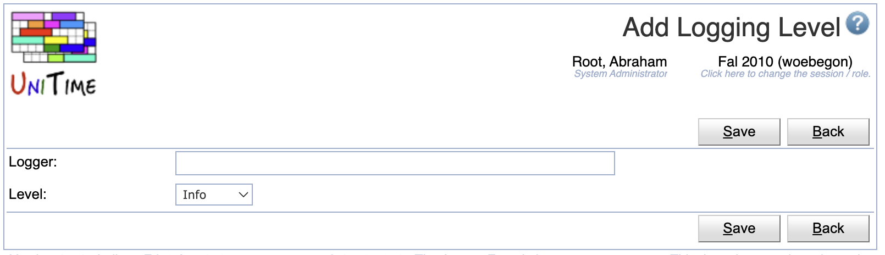
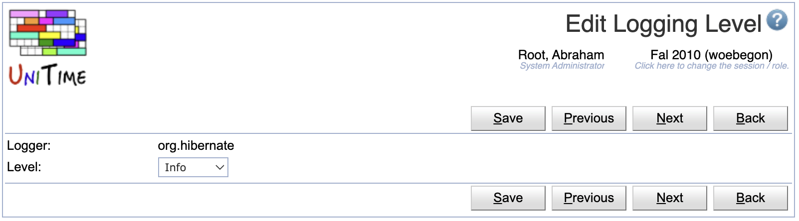
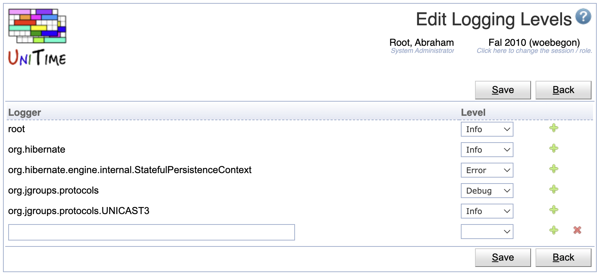

## Screen Description

The Logging Levels page can be used to modify logging levels of various classes.

{:class='screenshot'}

UniTime is using [log4j](https://logging.apache.org/log4j) for logging. Each class writing messages into the log is using a separate **logger**, typically named after the class. The loggers form a tree in a similar manner as the classes do. A logging level can be changed for a particular class (logger) or for all classes (loggers) of a given package. For instance, all `org.hibernate.cfg` classes have the logging level set to Warning, meaning that only warnings or higher messages (errors, fatals) appear in the log. The following logging levels are available:

* All (all messages are logged)
* Trace
* Debug
* Info
* Warning
* Error
* Fatal
* Off (no messages are logged)

If a logging level is set to a particular level, only messages of the level or higher are printed in the log. The page requires Application Config permission.

## Details

UniTime default logging is defined in the [log4j2-UniTime.xml](https://github.com/UniTime/unitime/blob/master/JavaSource/log4j2-UniTime.xml). The changes to the logging made on the Logging Levels page are saved in the [Application Configuration](application-configuration). The format is

```
log4.logger.<logger>=<level>
```
where `<logger>` is the name of the logger and `<level>` is the level, i.e., one of TRACE, DEBUG, WARN, ERROR, or FATAL.

By default, the logging messages are written in Tomcat/logs/unitime.log. Warning and higher messages are also written in the [MessageLog]( https://github.com/UniTime/unitime/tree/master/JavaSource/MessageLog.hbm.xml) table using the [MessageLogAppender]( https://github.com/UniTime/unitime/tree/master/JavaSource/org/unitime/timetable/util/MessageLogAppender.java). The logging level for the MessageLog can be changed using the unitime.message.log.level application property (it defaults to WARN). The messages from the message log can be seen on the [Administration Reports](administration-reports) page, Message Log report.

## Operations

The table can be sorted by any of its columns, just by clicking on the column header and the sorting option that opens.

### Add Logging Level
Click **Add** to add a new logging level

{:class='screenshot'}

* Click **Save** to create a new logging level
* Click **Back** to return to the list without making any changes

The new logging level will also appear on the [Application Configuration](application-configuration) page, with the `log4j.logger.` prefix. However, only changing the logging levels through the [Logging Levels](logging-levels) pages will have the immediate effect on the logging.

{:class='screenshot'}

### Edit Logging Level
Click a particular logging level to make changes or to delete the logging level

{:class='screenshot'}

* Click **Save** to make changes, **Back** to return to the list without making any changes
* Click **Previous** or **Next** to save the changes and go to the previous or next logging level respectively
* Click **Delete** to delete the logging level. Only logging levels that have been created/updated on this page (exist in [Application Configuration](application-configuration)) can be deleted.

### Edit Logging Levels
Click **Edit** to edit all logging levels

{:class='screenshot'}

* Use the  icon to add a new line and  to delete a line
* Only logging levels that have been created/updated on this page (exist in [Application Configuration](application-configuration)) can be deleted
* Click **Save** to make changes, **Back** to return to the list without making any changes

### Export CSV/PDF
Click the **Export CSV** or **Export PDF** to export the list of logging levels to a CSV or PDF document respectively

## Notes

The Message Log report has the following HQL:

{:class='screenshot'}

MySQL
```
 select
  timeStamp as Time,
  (case level when 100 then '<font color="red">Fatal</font>' when 200 then '<font color="red">Error</font>'
   when 300 then '<font color="orange">Warning</font>' when 400 then 'Info' when 500 then 'Debug' else 'Other' end) as Level,
  logger as Logger,
  (case when exception is null then message when message is null then exception else (message || '\\n' || exception) end) as Message,
  (case when ndc is null then thread else (thread || '\\n' || ndc) end) as Context
from MessageLog order by timeStamp desc
```

Oracle
```
 select
  timeStamp as Time,
  (case level when 100 then '<font color="red">Fatal</font>' when 200 then '<font color="red">Error</font>'
   when 300 then '<font color="orange">Warning</font>' when 400 then 'Info' when 500 then 'Debug' else 'Other' end) as Level,
  logger as Logger,
  (case when exception is null then to_char(message) when message is null then to_char(exception) else
   (to_char(message) || '\n' || to_char(exception)) end) as Message,
  (case when ndc is null then thread else (thread || '\n' || to_char(ndc)) end) as Context
from MessageLog order by timeStamp desc
```
