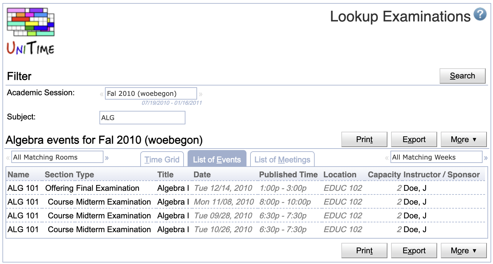

## Screen Description

Examinations page is a variant of the [Events](http://help34.unitime.org/Events) page that allows to see all final and midterm examinations of a particular subject area or a course. The subject area or course can be entered in the Subject field.

{:class='screenshot'}

{:class='screenshot'}


**Note:** The examination timetable is available for students and instructors only if the academic session is in a status that includes no-role midterm exam schedule and / or final exam schedule (the status type's properties can be changed in the [Edit Status Type](edit-status-type) screen).

**Note:** Filter settings may be passed on the URL, e.g., the following URL will select all examinations of ALG subject area for Fall 2010 on woebegon campus:
```
https://<portal>/UniTime/gwt.jsp?page=exams&name=ALG&term=Fal2010woebegon
```
