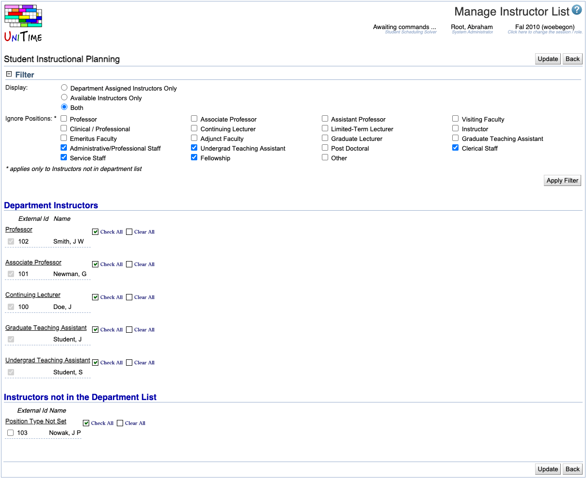

## Screen Description

The Manage Instructor List screen is populated with names of employees of a given department. The source of the information about employees is the university staff table (see [staff import](https://www.unitime.org/uct_interfaces.php)). The schedule manager can indicate which people from this list should be included in the list of instructors in the [Instructors](instructors) screen.

{:class='screenshot'}

## Filter

* **Display**
	* Department Assigned Instructors Only
		* Instructors already in the list in the [Instructors](instructors) screen
	* Available Instructors Only
		* Staff memebers that are not in the list in the [Instructors](instructors) screen
	* All the staff, regardless whether they are displayed in the [Instructors](instructors) screen or not

* **Ignore Positions**
	* Check the checkbox next to the position that you do not want to be displayed (for example, check "Clerical Staff" if you do not want to display people in this position - for example, if none of them teaches your classes)

* **Apply Filter** (Alt+A)
	* You need to click this button if you have changed anything in the filter

## Instructors

The employees of a given department are divided between those that appear in the [Instructors](instructors) screen (those are the **Department Instructors**) and the ones who do not appear there (**Instructors not in the Department List**). Each of these groups is then sorted by position and within a position by the last name.

For each instructor in the list, you can see his/her ID and name (as it appears in the staff database). Check/uncheck the checkbox in front of that person's ID if you want/don't want the person to appear in your list of instructors in the [Instructors](instructors) screen. You can also Check All or Clear All checkboxes of a given position (on the line with the name of the position).

## Operations

* **Update** (Alt+U)
	* Save changes and go back to the [Instructors](instructors) screen

* **Back** (Alt+B)
	* Go back to the [Instructors](instructors) screen without saving any changes
