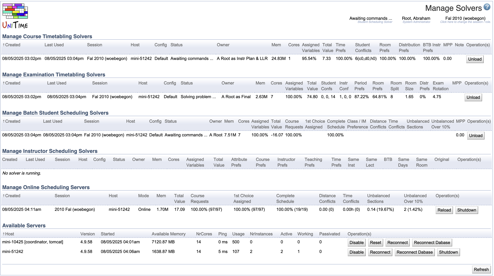

## Screen Description

The Manage Solvers screen provides an overview of all running solvers and servers available for running the solvers. The administrator can also access any of the running solvers and work with them the same way as the user who started them.

{:class='screenshot'}

Click **Refresh** at the bottom of the page to refresh the page.

## Manage Solvers

The page shows a table of the solvers loaded in memory, one of each type:

* **Manage Course Timetabling Solvers**
    * [Course timetabling](course-timetabling) solvers loaded on the [Course Timetabling Solver](course-timetabling-solver) page, or [Saved Timetables](saved-timetables) page

* **Manage Examination Timetabling Solvers**
    * [Examination timetaling](examination-timetabling) solvers loaded on the [Examination Solver](examination-solver) page

* **Manage Batch Student Scheduling Solvers**
    * [Student scheduling](student-scheduling) solvers loaded on the [Student Scheduling Solver](student-scheduling-solver) page

* **Manage Instructor Scheduling Solvers**
    * [Instructor Scheduling](instructor-scheduling) solvers loaded on the [Instructor Scheduling Solver](instructor-scheduling-solver) page

**Note:** Please note that each user can only run one solver for each solver type. The old solver will get automatically unloaded when a new solver for a different academic session is about to be loaded for the user.

The following properties are common for all Manage Solvers tables:

* **Created**
    * Timestamp when the solver was created (first loaded into memory)
* **Last Used**
    * Timestamp when the solver was last used
* **Session**
    * Academic session for which the solver was loaded
* **Host**
    * Machine (one of the [Available Servers](#available-servers)) where the solver is running
* **Status**
    * Solver status (such as Loading data, Solving problem, or Awaiting commands)
* **Owner**
    * The user who loaded the solver (and under whom the solver is running) and the problem (e.g., the solver group(s) or the examination type for which the solver is running in)
* **Mem**
    * An estimated amount of memory used to hold the solver instance
* **Cores**
    * Number of CPU cores (solver threads) the solver is allowed to use
    * Typically defaults to half of the cores of the machine or just one (can be changed by the `Parallel.NrSolvers` solver parameter)
* **Operations**
    * A list of available operations
    * For most, there is just **Unload** that can be used to unload the solver

The remaining parameters are a subset of the solver properties of the current or the best found solution of the solver.

#### Operations

Click on a solver line to access the solver. Please note that you need to be in the same academic session as the solver is loaded in. The solver would appear as if it were loaded under you, until you log out, change the current academic session, unload the solver, select another solver, or use the **Deselect** button at the bottom of this page. The blue background indicates the currently selected solver.

Click **Unload** to unload the solver from memory. **The timetable will not be saved unless it has been saved before.**{:style='color:red'}

## Manage Online Scheduling Servers

The Manage Online Scheduling Servers table shows the online student scheduling servers serving [Academic Sessions](academic-sessions) that have a status that allows for the [Scheduling Assistant](student-scheduling-assistant).

#### Operations

* Click the **Shutdown** button to shut down the online student scheduling server. The online server will get loaded up again in a few minutes unless the academic session status changes.

* Click the **Reload** button to force the online student scheduling server to reload all its data.

### Available Servers

The last table on the page is the Available Servers. This table shows the UniTime web servers and solver servers that are in the same solver cluster.

The columns in the list are:

* **Host**
    * Name of the server
    * The cluster coordinator is indicated by the **coordinator** flag
    * The web server is indicated by the **tomcat** flag (and the initial Usage set to 500 in order to prefer solver servers when there are any)

* **Version**
    * Version of the application on the server

* **Started**
    * Date and time when the server was started

* **Available Memory**
    * Memory available for the solvers

* **Number of CPU Cores** (NrCores)
    * Number of CPU cores of the machine

* **Ping**
    * Response time

* **Usage**
    * Usage = Number of Instances + Active + Working (+ 1000 if disabled)
    * Used for selecting which server to use for a new solver: From servers that have at least 200 MB of memory, the one with the lowest Usage is selected.

* **Number of Instances** (NrInstances)
    * Number of solvers in the Manage Solvers list

* **Active**
    * Number of active solvers (i.e., solver instances stored in memory)

* **Working**
    * Number of solvers actively searching for a solution

* **Passivated**
    * Number of passivated solvers
    * A solver instance is passivated when it has not been used for 30 minutes. In this state, the instance is removed from memory and stored on disk. It is automatically activated (brought back into memory) when the solver instance is accessed.
    * The passivation time can be adjusted with the `unitime.solver.passivation.time` property in the [Application Configuration](application-configuration)

#### Operations

For each server, the following operations are available:

* **Disable**
    * Do not allow any new solvers to start running on this server
    * This is done by adding 1000 to the Usage number

* **Enable**
    * If disabled, enable the server again (remove the 1000 penalty from the Usage number)

* **Reset**
    * Run the check for the online scheduling servers running (usually run every 5 minutes)
    * This will load the online servers that need to be loaded and unload those that are no longer needed

* **Reconnect**
    * Re-connect the server in the cluster
    * This will force the solver to leave the cluster and connect to it again
    * Only available when the solver cluster is enabled (`unitime.solver.cluster` is `true`)

* **Reconnect Database**
    * Re-connect all the database connections 
    * This will shut down the Hibernate session factory and start it up again

* **Shutdown**
    * Shut down the server
    * When a server is shut down, all instances are stored on disk, so once it is started again, those instances are restored and can be used again.

