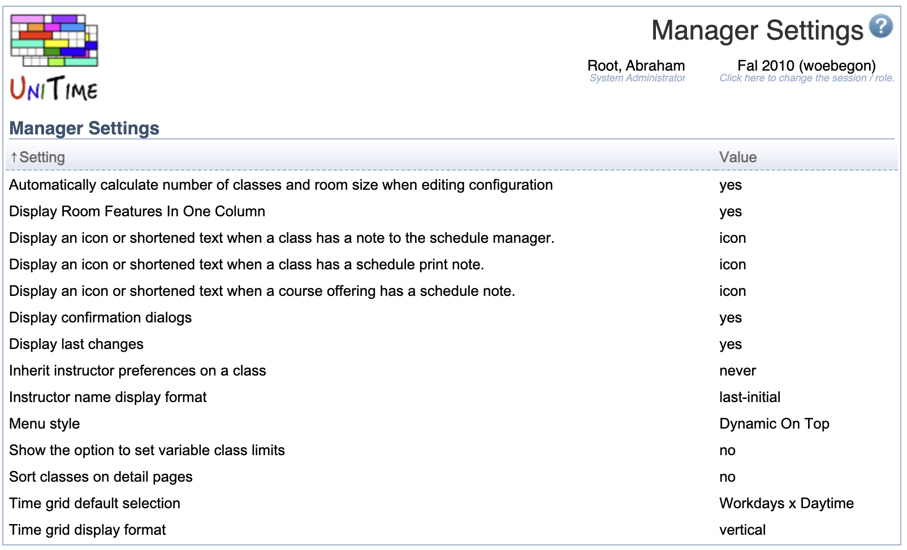

## Screen Description

The Manager Settings screen provides a list of manager's settings, which can easily be changed by clicking on any of them.

{:class='screenshot'}

Manager Settings help the users display information and select functionality that is most helpful for them in the input data section of the application.

## Details

The following settings are available

* **Automatically calculate number of classes and room size when editing configuration**
	* Yes (default) - Automatically calculate the number of classes in a scheduling subpart after the limit per class is entered in the [Instructional Offering Configuration](instructional-offering-configuration) screen
	* No - Do not calculate

* **Display last changes**
	* Yes (default) - in each non-editable screen, list who and when made the last change to the information displayed in the screen
	* No - do not display this section

* **Inherit instructor preferences on a class**
	* Ask - Ask about inheritance when an instructor is added in the [Edit Class](edit-class) screen
	* Always - Always apply instructor's preferences only for departmental???
	* Never (default) - Never apply instructor preferences

* **Display confirmation dialogs**
	* Yes (default) - Display pop-up windows with confirmation messages
	* No - Do not display these pop-ups

* **Sort classes on detail pages**
	* Yes - When "Sort By" is changed in the [Instructional Offerings](instructional-offerings) or [Classes](classes) screen, apply this sorting to the detail screens (such as [Instructional Offering Detail](instructional-offering-detail) or [Scheduling Subpart Detail](scheduling-subpart-detail)
	* No (default) - Keep sorting classes in the detail screens by name

* **Instructor name display format**
	* Last-first
	* First-last
	* Initial-last
	* Last-initial (default) - "Wachteunberg, V L"
	* First-middle-last
	* Short

* **Display room features in one column**
	* Yes (default) - All room features are listed in the Features column in the [Rooms](rooms) screen
	* No - Each feature has its column and for each room, a check is present in the appropriate column if the room has the feature

* **Show the option to set variable class limits**
	* Yes - The option is present in the [Instructional Offering Configuration](instructional-offering-configuration) and in the [Multiple Class Setup](multiple-class-setup) screen
	* No (default) - The option is turned off for the manager

* **Time grid display format**
	* Horizontal - Days on the left, times on top
	* Vertical (default) - Days on top, times on the left
	* Text - In the overview screens ([Instructional Offerings](instructional-offerings), [Classes](classes),...), the time preferences are spelled out as text

* **Time grid default selection**
	* Workdays x Daytime (default)
	* All Week x Daytime
	* Workdays x Evening
	* All Week x Evening
	* All Week x All Times

Click on any setting to change its value in the [Edit Manager Setting](edit-manager-setting) screen.

Settings can be added/removed by administrator in the [Default Manager Settings](default-manager-settings) screen which is placed in the Default section of the Administration part of the left hand side menu.
