### Table of Contents
{:.no_toc}
* table
{:toc} 

Disclaimer: It is assumed throughout the document that UniTime has been installed with the Woebegon example data.

# Target Audience

This manual is targeted at the system and session administrators, with description of the tasks that each of them does through the UniTime GUI. That means that this manual is useful once UniTime has been installed at an institution and a system administrator is able to log in.

## System administrator

The system administrator sets up system configuration, roles, permissions, and types of instructions, rooms, statuses, positions, etc. The system administrator also sets up new academic sessions that can later be populated managed and modified by session administrators.

## Session administrators

The session administrator manages an academic session. He has access to data that is dependent on an academic session, such as departments, buildings and rooms, date patterns, time patterns, etc. He also manages the list of timetabling managers for that academic session.

# Initial Setup of UniTime

When UniTime is used for the first time, the system administrator needs to go through the sections Other and Defaults in the Administration menu. Another part that may be helpful in the setup is the Utilities section.

## Configuration

Administration -> Defaults -> Configuration

The Application Configuration screen contains application properties. To see all available properties, click on the **Show all properties** checkbox at the bottom of the screen.

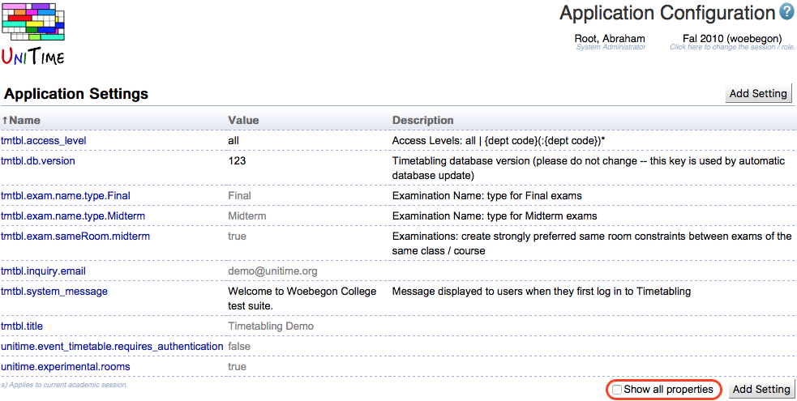{:class='screenshot'}

Click on any line to edit the application property. To add a new application property, click on the button **Add Setting**.

The description of the properties (the third column in the above screenshot) will help you with the setup.

Here is an example of properties that are usually changed to fit the institution:

tmtbl.courseNumber.pattern

unitime.timeGrid.days&lt;index&gt;

## User Settings

Administration -> Defaults -> Configuration

The Default Manager Settings screen defines mainly the ways how certain items are displayed throughout UniTime. For example, the time grids may be arranged horizontally, vertically, or displayed as texts. This is the place where it is possible to change the language for all users.

Click on any setting to get to the screen where you can modify it.

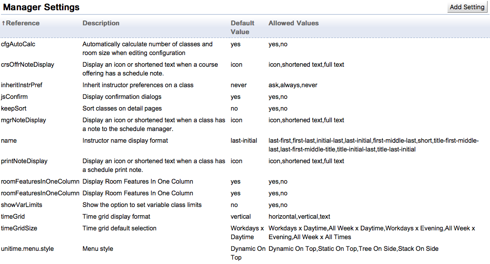{:class='screenshot'}

## Logging

Administration -> Defaults -> Configuration

There are different levels of logging by different tools in UniTime. You can modify what level to use for which type of messages. You can keep the Woebegon defaults and come back later if any modifications are needed.

## Instructional Types

Administration -> Other -> Instructional Types

These are the types of classes that will be timetabled in UniTime. The most common types are lectures, recitations, laboratories, etc. The abbreviation will be displayed anywhere where a class is displayed. For example, it will be displayed in the timetable. If the instructional types are the same as in the demo (see the picture), then the timetable will show “Lec” for Lecture, “Rec” for Recitation, etc. See below.

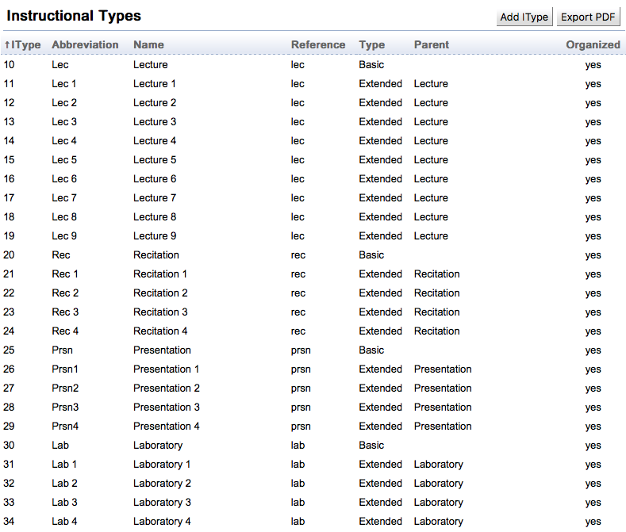{:class='screenshot'}

{:class='screenshot'}

At most institutions, it is enough to delete all the instructional types of type “Extended” and leave only Lecture, Recitation, etc. (the “basic” ones).

If the classes have “yes” in the Organized column, they should be timetabled. It is also possible to keep classes that are not organized in UniTime, e.g. if UniTime is the authoritative source of all courses that should be offered for a given semester.

Banner: The IType with the lowest number is the one that is gradable. For that reason, the lecture must have the lowest IType number.

## Class Duration Types

Can be ignored [1].

## Status Types

These are the types of the status of an academic session or department. The status type (in combination with user roles and permissions) indicates what each user can do in the given academic session.

The status types applicable to an academic session that are available in the Woebegon data set and that should work for the course timetabling process at most institutions are

* Initial Data Load

* The Administrator populates a new academic session with data through roll-forward and data imports

* The Departmental Schedule Managers do not have access to the session

* Input Data Entry

* Departmental Schedule Managers enter input data

* Timetabling

* Departmental Schedule Managers create and commit course timetables

* Timetable Published

* All users have access to the published timetables

* Session Finished

* The data or timetables in this session should no longer be edited

* Used when the academic session is over

## Room Types

The room types are useful for

1. Organizing the list of rooms (e.g. in Courses -> Input Data -> Rooms)
2. Managing events in rooms - an event status can be related to a combination of department and room type

## Room Feature Types

Room features can be organized by types. For example, a room feature type can be a “Board” with individual room features of this type being “Blackboard”, “Whiteboard 8x20 ft”, “Whiteboard 4x8 ft”, etc.

Room feature types can be ignored.

## Users

Normally, the users would be authenticated using an LDAP or a CAS system of the institution [2]. If it is needed to add users outside this system, it is possible to add their usernames and passwords here.

Note: The External ID has to match the timetabling manager in the academic session setup in order for this user to be able to work in UniTime with a role (such as a session administrator or a departmental schedule manager).

## Course Types

Each course offering can have no or one type associated with it. This allows for instance to distinguish between graduate and undergraduate courses, to separate continuing education courses, etc.

The course types are independent from academic sessions. The relation between course offerings and course types are rolled forward together with the courses.

Course types do not have to be set up for course timetabling.

## Instructional Methods

An instructional method set up here (e.g., “Online”) can be assigned to a configuration in the Instructional Offering Configuration screen.

The instructional methods do not have to be set up for course timetabling.

## Instructor Attribute Types

Instructor attribute types are used for instructors’ assignments and are not a part of course timetabling.

## Sponsoring Organizations

Sponsoring organizations set up here can be associated with events in Event Management. They are not a part of course timetabling.

## Standard Notes

Standard Event Notes set up here are not a part of course timetabling. You can read more about them in the page documentation.

## Service Providers

Event Service Providers set up here not a part of course timetabling. You can read more about them in the page documentation.

## Attachment Types

Various types of files can be attached to rooms. A type that is widely used is the “Room Picture Type”.

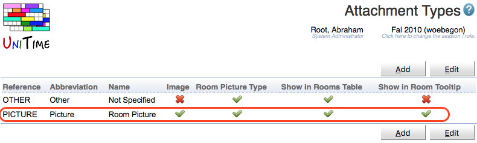{:class='screenshot'}

When this type is set up, it is then possible to upload room pictures through the Edit Room screen.

## Preference Levels

If UniTime is used in a different language than English, this is the place to translate the preference levels (such as “Prohibited”, “Preferred”, etc.).

Compare the following example of the English defaults and the Czech translation.

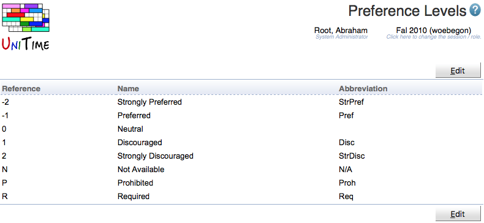{:class='screenshot'}

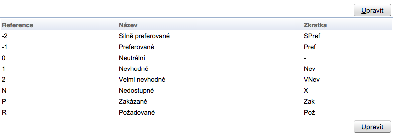{:class='screenshot'}

## Consent Types

Consent types are used for student scheduling and for reporting. They are not a part of course timetabling.

## Course Credit Formats

Course credit formats are not used in course timetabling.

## Course Credit Types

Course credit types are not used in course timetabling.

## Course Credit Units 

Course credit units are not used in course timetabling.

## Position Types

Position types are not explicitly used for course timetabling - this part has been added for reporting purposes. They can be left as set up in the sample data.

## Teaching Responsibilities

Teaching responsibilities are used during instructor assignments. This is not a part of course timetabling.

## Student Status Types

Student status types are used during student scheduling. They are not a part of course timetabling.

## Examination Types

Examination types are not a part of course timetabling.

## Roles

A role is a collections of permissions that are managed on the **Permissions** page. Unauthenticated users have **Anonymous** role, authenticated users with an appropriate record (with the matching external id) in the students table have **Student** role, instructors have **Instructor** role, and timetabling managers have one or more roles that are assigned to them on the **Timetable Managers** page. Authenticated users with no match against students, instructors, and timetabling managers have the **No Role** role. Look at the UniTime demo at demo.unitime.org for more examples.

In most cases, the default roles are sufficient for an institution. The roles needed for course timetabling are

* System Administrator

* Session Administrator

* Departmental Schedule Manager

* Instructor (if instructors should access their timetables in UniTime)

* Student (if students should access their timetables in UniTime)

## Permissions

The table in the Permissions screen lists all the roles in UniTime and all the permissions that these roles have or do not have. The permissions granted to each role can be changed by clicking on the line with that role or changes can be performed in bulk by clicking on the **Edit** button.

{:class='screenshot'}

Read the page documentation [3] to learn more about permissions.

# Solver

The solver configuration is also a task for a system administrator, since it is applicable to all the academic sessions. It can be found under Administration -> Solver.

Usually, the solver configuration is set up when course timetabling is done for the first time. There are also some default configurations (that come with the sample data) that are described in the documentation for course timetabling.

# First Academic Session                

When the initial setup is finished, a new Academic Session should be added. It can be done through an import (see [https://www.unitime.org/interface/sessionSetup.xml](https://www.unitime.org/interface/sessionSetup.xml) for an example) or through the UniTime user interface, which is described below.

## New Academic Session

Administration -> Academic Sessions -> Academic Sessions

1. Click **Add Session**
2. In the Add Academic Session screen, fill in

1. Academic Initiative (= usually name of the campus)
2. Academic Year (= usually calendar year)
3. Session Start Date (beginning of classes - it should be the same day of week each semester)
4. Classes End Date
5. Examination Start Date
6. Session End Date (end of examinations)
7. Event Start Date (from when to reserve rooms in Events)
8. Event End Date (till when to reserve rooms in Events; the period for event management should not overlap with event management for the next semester) 
9. Session Stats (usually Initial Data Load)
10. Default Class Duration (usually Minutes per Week)

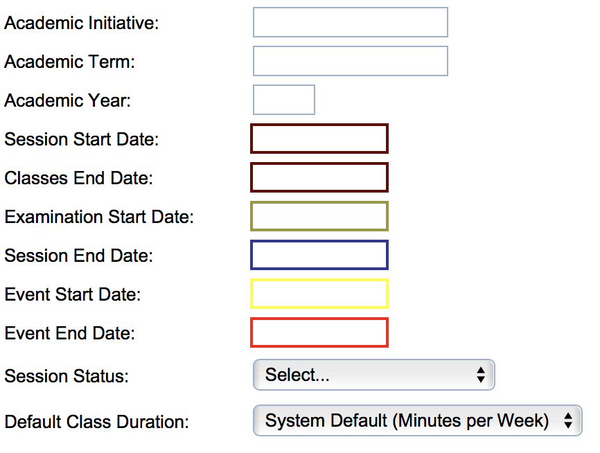{:class='screenshot'}

After this, a calendar will show for a period that includes the academic session. You can highlight holidays in this calendar. The holidays or breaks entered here are not enforced in course timetabling, they have informative role and should help when setting up date patterns.

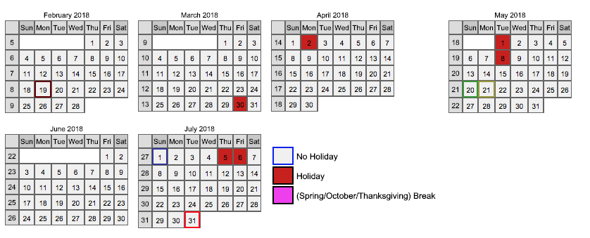{:class='screenshot'}

The following session-related data can be set up through the Administration -> Academic Sessions portion of the main menu.

## Departments

Departments are the organizational units at a campus. A lot of data in UniTime is department-related, for example

* Courses are offered by departments

* Timetables are created for courses of a department

* Rooms and staff are related to departments

* Users are related to departments

* Some permissions can be entered on the departmental level

### Adding a department 

Administration -> Academic Sessions -> Departments

Click on **Add Department**. Then set up the department in the **Add Department** screen.

The minimum information that needs to be entered is

* Code: Used in imports/exports (corresponds to the "department" element in the XML staff file)

* Abbreviation: Abbreviation displayed throughout UniTime

* Name: Name of the department

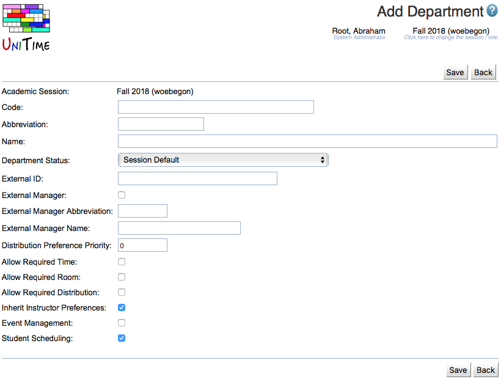{:class='screenshot'}

Departments can be imported via an XML file. See this example for more details: [https://www.unitime.org/interface/departmentImport.xml](https://www.unitime.org/interface/departmentImport.xml)

## Solver Groups

A solver group defines one or more departments for which a timetable should be created. A solver group is the smallest unit for which a timetable can be created, but several of them can be created at the same time.

Example: One college, one solver group for each of its eight departments. First, a course timetable is created centrally for all of them together, then each of them modifies the timetable on their own.

One solver group per department is the model that is used most often.

## Managers

Administration -> Academic Sessions -> Managers

This is the place to set up which user should have access to which department and for what activities. The users are matched with the authentication system through their External IDs.

Below is an example of a departmental schedule manager of the name Schedule Deputy in the demo instance of UniTime.

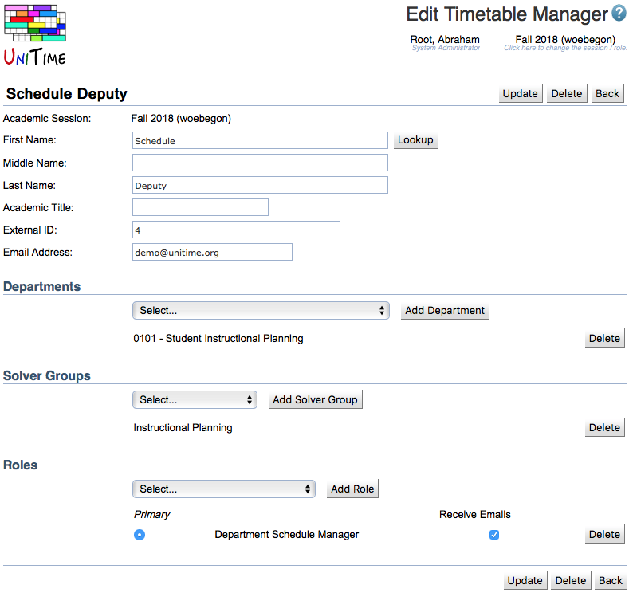{:class='screenshot'}

The minimum required information is

* First Name

* Last Name

* External ID (used for the authentication of the user)

* Email Address

Then you probably want that manager to have a Department associated with him.

1. Select a department from the drop down list.
2. Click on Add Department next to the drop down.

What role should this manager have at that department (or those departments)?

1. Select a role in the drop down list.
2. Click on Add Role next to the drop down list.
3. If the user has more roles, select which one should be used when the user logs in to UniTime (for example, if someone is both a session administrator and a departmental schedule manager, this person will probably want to log in as a session administrator). This role will be marked as Primary.

If the user should create a course timetable for a department, he should be associated with the solver group that contains the department.

1. Select a solver group from the drop down list.
2. Click on Add Solver Group next to the drop down.

Then Save (or Update) the entered information.

## Subject Areas

Subject areas help organized courses offered by a department to meaningful groups. The organization can be as follows:

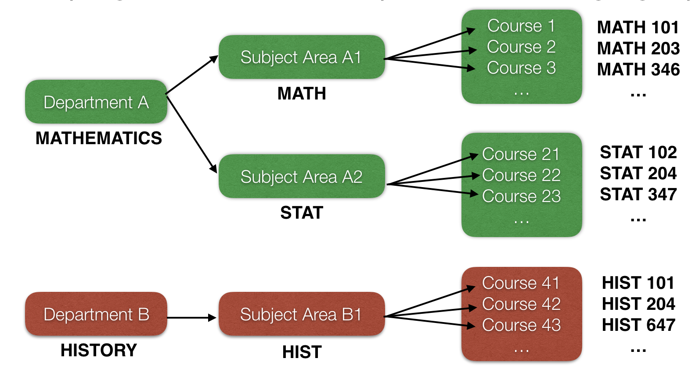{:class='screenshot'}

Note: Each course belongs to only one subject area and each subject area belongs to only one department. A department can have one or more subject areas.

Subject areas can be imported via an XML file. See this example for more details: [https://www.unitime.org/interface/subjectAreaImport.xml](https://www.unitime.org/interface/subjectAreaImport.xml)

(Note: The deprecated attributes schedBookOnly and pseudoSubjArea should not be used.)

## Buildings And Rooms

Buildings can be set up in Administration -> Academic Sessions -> Buildings.

The minimum information that is required for a building is

* Name: Name of the building

* Abbreviation: This is used as a part of the room label

Optional information

* External ID: Matches the building with external systems

* Coordinates: Help calculate distances between locations; the coordinates are used for the setup of rooms in this building if “Update room coordinates to match the building coordinates” is checked

The coordinates can be derived from the address of the location which can be entered in the line in the Google map (if enabled) after clicking on the Geocode button. See the example of the Edit Building screen below.

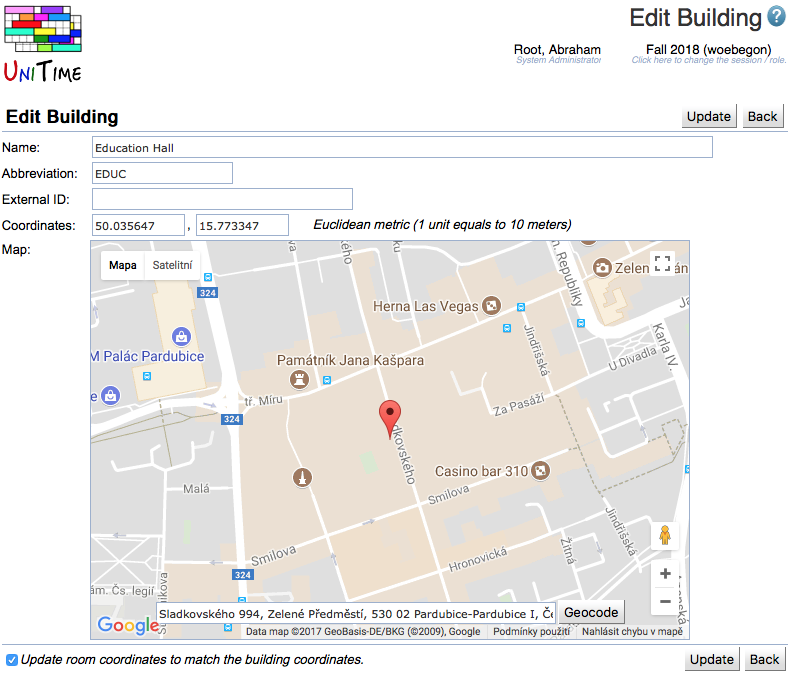{:class='screenshot'}

Rooms can then be entered by the session administrator in Courses -> Input Data -> Rooms. Adding a room is described in the data entry documentation.

Buildings and rooms can be imported via an XML file. See this example for more details: [https://www.unitime.org/interface/buildingRoomImport.xml](https://www.unitime.org/interface/buildingRoomImport.xml)

It is recommended to include roomDepartments (defining who can use the room).

Note: To see the buildings and rooms after the import, you need to click on “Update Data” in the Buildings screen.

## Date Patterns

A date pattern indicates on what weeks of the semester the classes should be held.

When adding a new date pattern, it is necessary to enter the name and to indicate the weeks of instructions (by clicking on Classes offered and then highlighting the necessary dates in yellow).

The most common date patterns are

* Full term

* Odd weeks

* Even weeks

Note that holidays are not highlighted in yellow - classes should usually not be held on holidays. The example below shows the even weeks in the month of September, where September 6 was a holiday (and therefore is white).

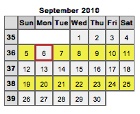{:class='screenshot'}

You can see more examples in the sample data at demo.unitime.org .

Each academic session must have a default date pattern. It is usually the “Full Term” date pattern that includes all weeks of the semester. To make a date pattern the default date pattern, go to **Edit Date Pattern** screen and click on the **Make Default** button.

## Time Patterns

Time patterns indicate possible time assignments within a week. The final time assignment of a class will be a combination of a date pattern and a time from a time pattern.

A time pattern is presented as a grid where each square corresponds to one possible time assignment of a class. The possible time assignments can overlap in time.

Example: A time pattern for classes that meet twice a week for 50 minutes. The meetings should start at the same time. There is a 10 minutes break after each 50 minutes of classes.

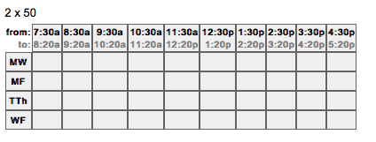{:class='screenshot'}

## Academic Areas

Academic areas are a part of information about students and their plans of study. In most cases, an academic area corresponds with a program of study - e.g. Agriculture, Chemistry, Computer Science, etc.

Academic areas can be imported via an XML file. See this example for more details: [https://www.unitime.org/interface/academicAreaImport.xml](https://www.unitime.org/interface/academicAreaImport.xml)

## Academic Classifications

Academic classifications are a part of information about students and their plans of study. In most cases, they are the years of study or the semesters of study.

Academic classifications can be imported via an XML file. See this example for more details:

[https://www.unitime.org/interface/academicClassificationImport.xml](https://www.unitime.org/interface/academicClassificationImport.xml)

## Majors

Majors are also a part of information about students and their plans of study. A major is a field of study (or specialization). For example, in the academic area “Computer Science”, there can be majors such as “Databases”, “Computer Vision”, etc. A curriculum (in Courses -> Input Data -> Curricula) is usually setup for one or more majors and the information about students can also include their academic area - major - classification details.

Majors can be imported via an XML file. See this example for more details:

[https://www.unitime.org/interface/posMajorImport.xml](https://www.unitime.org/interface/posMajorImport.xml)

## Minors

Minors are not used in UniTime at the moment.

## Student Groups

Student groups are a way how to reserve space in classes for a group of students. A student can be in any number of groups. It is possible to configure the solver so that it tries to keep students of a group as much together as possible (for example, if there are multiple alternatives for a lecture, the students should be in the same lecture).

## Student Accommodations

Student accommodations are not used in course timetabling (but they are used in student scheduling).

## Staff

The staff table is an underlying table that is not directly editable in UniTime. However, if the Staff XML [4] is imported, it will pre-populate the **Manage Instructor List** (accessible from Courses -> Input Data -> Instructors) and it will make adding new managers, instructors, or event contacts easier since the Lookup that is available in different screens in UniTime uses this table, too (among others).

## Courses

Courses can be set up in Courses -> Input Data -> Instructional Offerings, but it is in general easier if at least some of the data is imported before the departmental schedule managers start editing it.

The format for the XML is available at [https://www.unitime.org/interface/courseOfferingExport.xml](https://www.unitime.org/interface/courseOfferingExport.xml) .

Note: Not all the parts are required. For example, you can leave out

* Credit information (&lt;courseCredit&gt;, &lt;subpartCredit&gt;)

* Consent (&lt;consent&gt;)

* Classes (unless the goal is to load last year’s timetable)                        

Below is an example of a very simplified XML with offerings.

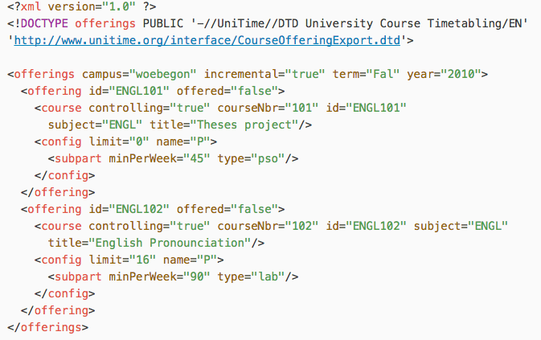{:class='screenshot'}

## Curricula

Similarly as with courses, it would be helpful to import curricula if curriculum-based is used at your institution (although they can set up manually in Courses -> Input Data -> Curricula). To import curricula, it is necessary to import academic areas, academic classifications, and majors first.

A sample file for curricula import can be found at [https://www.unitime.org/interface/curricula.xml](https://www.unitime.org/interface/curricula.xml)

## Student Demands

Student demands help identify which courses should not overlap in the course timetable. If curricula are not used, either of the following can be imported.

* Student Course Requests - the planned courses for each student
	* See [https://www.unitime.org/interface/woebegonStudents.xml](https://www.unitime.org/interface/woebegonStudents.xml) 
* Last-like Course Demands - for each student from last year, there is a list of courses the student took
	* See [https://www.unitime.org/interface/studentInfoImport.xml](https://www.unitime.org/interface/studentInfoImport.xml) and [https://www.unitime.org/interface/studentCrsDemandImport.xml](https://www.unitime.org/interface/studentCrsDemandImport.xml)

# Next Academic Session

Any following academic session can be set up using a combination of a roll forward and data imports.

## Roll Forward Session

When you already have an academic session in UniTime for your institution, you can reuse some of the entered data during a roll forward. It is accessed through

Administration -> Academic Sessions -> Roll Forward Session

You can only roll forward data to a session that is in the “Initial Data Load” status. You can combine previous semesters in UniTime during the roll forward - for example, for a Spring semester, you can take the latest rooms from Fall, but the previous Spring’s courses. The table shows a sample combination of past semesters when populating Spring 2019.

| | From Spring 2018 (last-like) | From Fall 2018 (last timetabled) |
| Departments | X |  |
| Session Configuration |  | X |
| Manager Data |  | X |
| Building and Room Data |  | X |
| Date Pattern Data | X |  |
| Time Pattern Data | X |  |
| Subject Areas | X |  |
| Instructor Data |  | X |
| Course Offerings | X |  |
| Class Instructors | N/A | N/A |
| Roll Curricula Forward | X |  |
| Roll Reservations Forward | X |  |

The roll forward should be done in the order listed. Please do not roll forward more than a few lines at a time. For example, the courses should be rolled forward separately after everything else above them has been rolled forward.

## Data Imports

The following data may be helpful to import.

* Courses - only new courses, using the attribute incremental=”true” in the &lt;offerings&gt; element

* Course Catalog - using the format from [https://www.unitime.org/interface/courseCatalogImport.xml](https://www.unitime.org/interface/courseCatalogImport.xml) 

* Instructors - only using the Staff import; drawing instructors from the table is the responsibility of the departmental schedule managers - it is often the case that they do not need all the names listed as instructors in other systems

* Buildings and Rooms - if there is a significant change; otherwise it is easy enough to enter the buildings and rooms manually

* Curricula information can be completely imported instead of rolled forward, if there is a good source of this data outside of UniTime

* Students and their course demands (either current course requests or last-year’s course enrollments)

# Utilities

In Administration -> Utilities, there are a few screens that provide a lot of additional flexibility to the administrator when working with UniTime. It depends on the permissions whether access to these screens will be allowed for session administrators or only system administrator. Normally, a session administrator would have access to a subset of the scripts and to the Clear Cache screen. The rest would be for a system administrator only.

## Test HQL

HQL queries can be entered in the text field and executed by the Submit button. It is allowed to update or delete data from tables using the HQL queries but please, do this with caution. You can “break” some of the data if modifying the tables directly.

## Clear Cache

Click on Administration -> Utilities -> Clear Cache (just on this menu item) to clear the Hibernate cache. This is helpful if you have done something that is done rarely, such as delete an instructor or an instructional offering. If you do not clear the cache, it takes time to propagate that information to other screens and you might get some errors in the meantime (when the screens expect the information to still be there, but the information cannot be found).

## Scripts

Many different scripts can be used to adjust data for the academic session or for the whole instance of UniTime. For example, there are scripts to add new distribution preferences.

[1] If interested, see [https://help.unitime.org/class-duration-types](https://help.unitime.org/class-duration-types) for more details.

[2] See [https://help.unitime.org/LDAP](https://help.unitime.org/LDAP) for more details.

[3] See [https://help.unitime.org/permissions](https://help.unitime.org/permissions) for more details about permissions.

[4] Note: The Staff table and Buildings and Rooms can be imported at any time (the staff table does not necessarily need the departments to be set up first).
