### Table of Contents
{:.no_toc}
* table
{:toc}

## UniTime Code Checkout and Build Procedures for Using the UniTime Banner Add On

The purpose of this document is to describe how to check the UniTime and UniTimeBannerAddOn projects out of their respective source code repositories and then build the project.  This documentation expects the user to have Eclipse version Mars or later as their development environment. Eclipse version Mars has support for Git which is the source code repository for UniTime and the UniTimeBannerAddOn built into it.  This can be downloaded freely at: [http://www.eclipse.org/](http://www.eclipse.org).

### Checkout UniTime

Create a new Eclipse workspace.  Right click in the **Project Explorer** tab to bring up a menu.  Select ‘**Import**’ -> ‘**Import…**’.

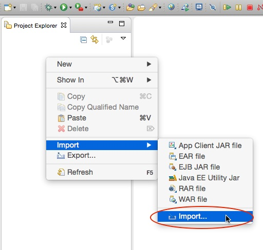{:class='screenshot'}

In the **Import** window expand ‘**Git**’ and select ‘**Projects from Git**’.  Press the ‘**Next >**’ button to continue to the next step.

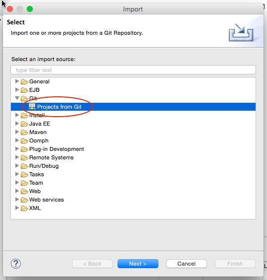{:class='screenshot'}

Select ‘**Clone URI**’ and click the ‘**Next >**’ button.

{:class='screenshot'}


Enter `https://github.com/UniTime/unitime.git` as the URI.  Press the ‘**Next >**’ button to continue.

{:class='screenshot'}

Press the ‘**Next >**’ button on the **Branch Selection** screen.

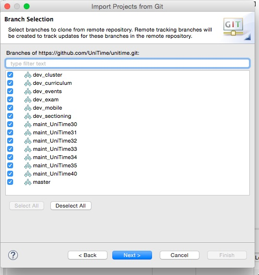{:class='screenshot'}

Press the ‘**Next >**’ button on the **Local Destination** screen.

{:class='screenshot'}

Select the ‘**Next >**’ button on the **Select a wizard to use for importing projects** screen.

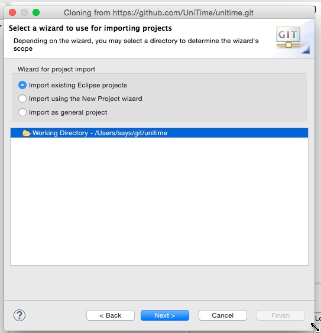{:class='screenshot'}

Press the ‘**Finish**’ button on the **Import Projects** screen.

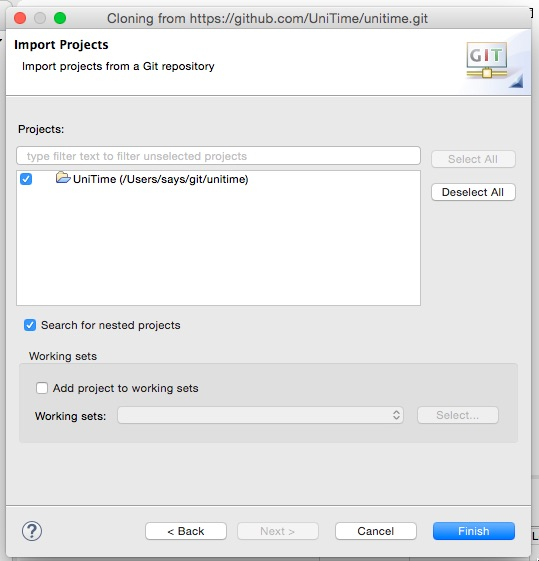{:class='screenshot'}

Once the import is finished, the user may switch to the appropriate maintenance branch if the master branch is not the version of UniTime the user wishes to use.

**Note:**  In general the master branch is the current production branch and should be the version used so the following steps can be skipped unless an older version of UniTime is needed.

To do this right click on the UniTime project the select the ‘**Team**’ -> ‘**Switch To**’ -> ‘**Other...**’ menu item.

{:class='screenshot'}

On the **Branches** screen expand the ‘**Remote Tracking**’ item and select the appropriate maintenance branch to switch to and press the ‘**Checkout...**’ button.  An example of this is origin/maint_UniTime40.

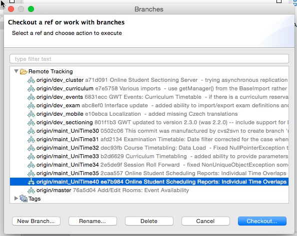{:class='screenshot'}

A prompt will appear asking what type of checked is desired.  Press the ‘**Checkout as New Local Branch**’ button.

{:class='screenshot'}

On the **Create a new branch** screen take the defaults and press the ‘**Finish**’ button.

{:class='screenshot'}

When complete the project will show that it is pointing to the maintenance branch.

{:class='screenshot'}

The UniTime project is now configured.

### Checkout UniTime Banner Add On

Right click in the **Project Explorer** tab to bring up a menu.  Select ‘**Import**’ -> ‘**Import…**’.

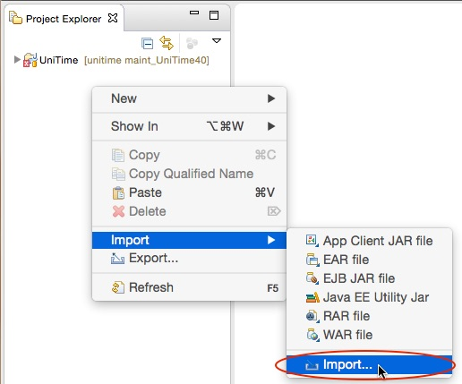{:class='screenshot'}


In the **Import** window expand ‘**Git**’ and select ‘**Projects from Git**’.  Press the ‘**Next >**’ button to continue to the next step.

{:class='screenshot'}

Select ‘**Clone URI**’ and click the ‘**Next >**’ button.

{:class='screenshot'}

Enter `https://github.com/UniTime/unitime-addons.git` as the URI.  Press the ‘**Next >**’ button to continue.

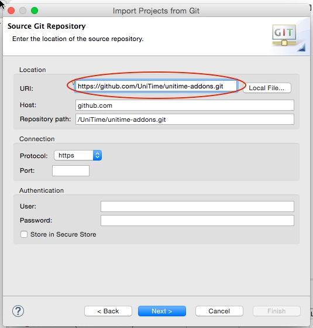{:class='screenshot'}

Press the ‘**Next >**’ button on the **Branch Selection** screen.

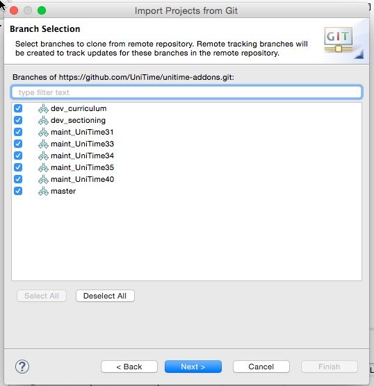{:class='screenshot'}

Press the ‘**Next >**’ button on the **Local Destination** screen.

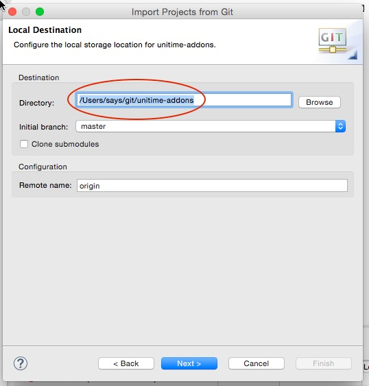{:class='screenshot'}

Select the ‘**Next >**’ button on the **Select a wizard to use for importing projects** screen.

{:class='screenshot'}

Press the ‘**Finish**’ button on the **Import Projects** screen.

{:class='screenshot'}

Once the import is finished, switch to the matching branch for the version of core UniTime used above.

**Note:**  In general the master branch is the current production branch and should be the version used so the following steps can be skipped unless an older version of UniTime is needed.

To do this right click on the UniTimeBannerAddOn project the select the ‘**Team**’ -> ‘**Switch To**’ -> ‘**Other...**’ menu item.

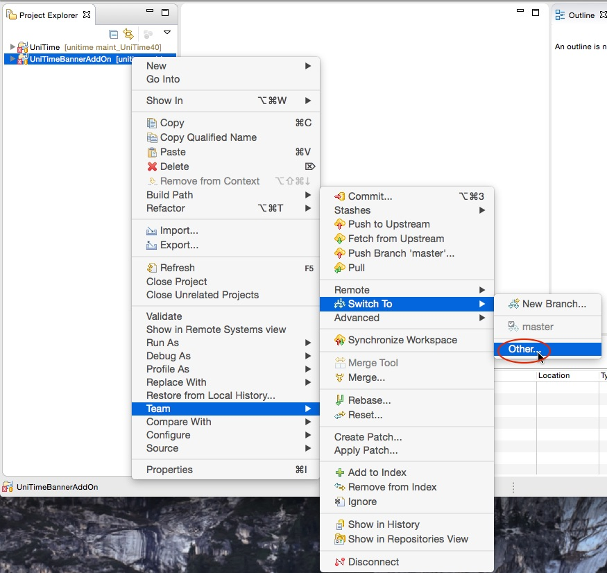{:class='screenshot'}

On the **Branches** screen expand the ‘**Remote Tracking**’ item and select the appropriate maintenance branch to switch to and press the ‘**Checkout...**’ button.  If as in the example above origin/maint_UniTime40 was selected, then origin/maint_UniTime40 should be selected.

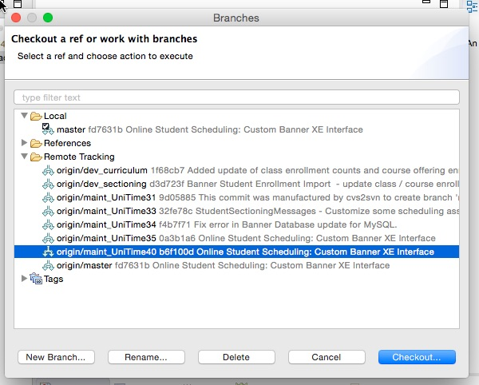{:class='screenshot'}

A prompt will appear asking what type of checked is desired.  Press the ‘**Checkout as New Local Branch**’ button.

{:class='screenshot'}

On the **Create a new Branch** screen take the defaults and press the ‘**Finish**’ button.

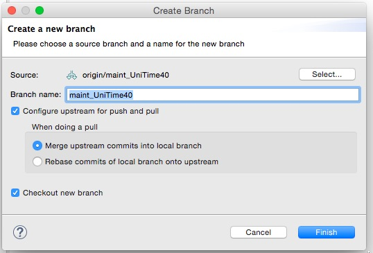{:class='screenshot'}

When complete the project will show that it is pointing to the maintenance branch.

{:class='screenshot'}

The UniTimeBannerAddOn project is now configured.

## Retrieving the Latest Code Changes

### UniTime

To get any changes to the UniTime code that have been made since the last time the code was retrieved, a pull should be done.  This can be done by right clicking on the project and selecting the ‘**Team**’ -> ‘**Pull**’ menu item.

{:class='screenshot'}

Once the update of the code is complete, a **Pull Result for unitime** window will be displayed.  This window summarizes the updates that were made as a result of retrieving the latest changes from GitHub.  When you have finished reviewing the changes, press the ‘**OK**’ button to dismiss the window.

{:class='screenshot'}

### UniTimeBannerAddOn

To get any changes to the UniTimeBannerAddOn code that have been made since the last time the code was retrieved, a pull should be done.  This can be done by right clicking on the project and selecting the ‘**Team**’ -> ‘**Pull**’ menu item.

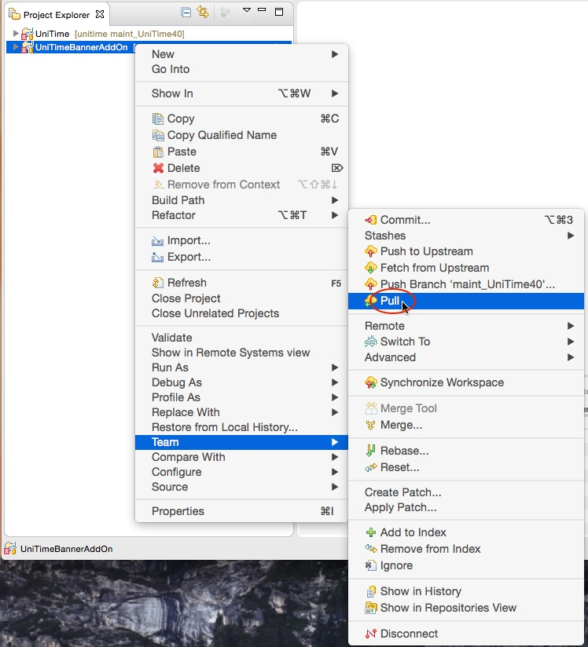{:class='screenshot'}

Once the update of the code is complete, a ‘**Pull Result for unitime-addons**’ window will be displayed.  This window summarizes the updates that were made as a result of retrieving the latest changes from GitHub.  When you have finished reviewing the changes, press the ‘**OK**’ button to dismiss the window.

{:class='screenshot'}

## Building Unitime Customizations


In the Java EE perspective, expand the UniTimeBannerAddOn project and right click on ‘**build.xml**’.  In the menu select ‘**Run As**’ -> ‘**Ant Build...**’


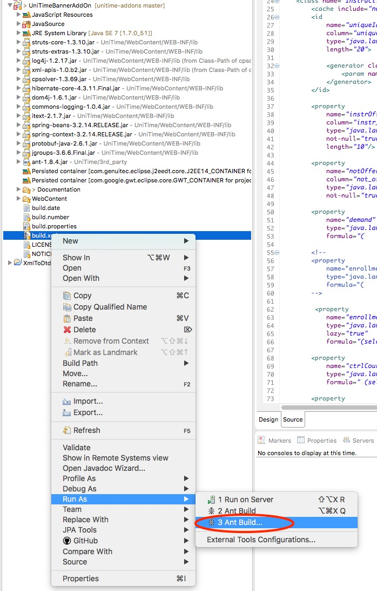{:class='screenshot'}

Select ‘**build**’ as the target and press the ‘**Run**’ button.

{:class='screenshot'}


Watch the console to make sure the build completes successfully.

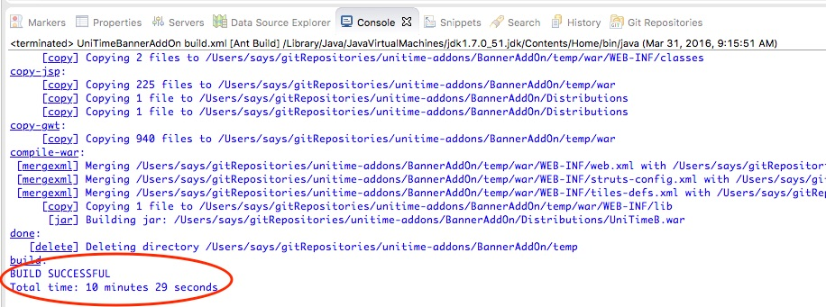{:class='screenshot'}

Once the build has completed successfully, the UniTimeB.war and timetable.jar files will be in the UniTimeBannerAddOn/Distributions folder in the eclipse project folder.  If you are only setting up a web server the file you need is UniTimeB.war.  If you are also setting up a solver server separate from the web server, timetable.jar is needed as well.

The “custom.properties” file found under the UniTimeBannerAddOn/JavaSource directory can be used as a starting point for configuring the UniTime properties to be used with the add on.  It contains the values needed to connect the add on to core UniTime.  For more information on using a custom.properties file with UniTime see the UniTime Installation notes web page: [http://help.unitime.org/installation](../installation).


When deploying UniTime Banner Add On war file to a web server it will expect to be accessed with a URL like: [http://localhost:8080/UniTimeB](http://localhost:8080/UniTime) unless the UniTimeB.war file is renamed to UniTime.war.   Note the ‘B’ at the end of the word UniTime.

## Updating the Database to Support the UniTime Banner Add On

Before starting the web server with the UniTime Banner Add On for the first time.  The database needs to be updated with the tables and stored procedures required by the add on.  These can be found in the UniTimeBannerAddOn code under the Documentation/Database directory.  There is a directory with the changes for Oracle and one for MySQL.

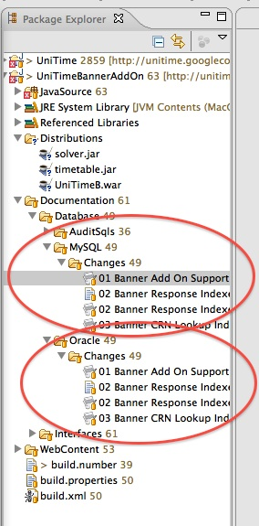{:class='screenshot'}

Use a tool you are comfortable with to apply these changes to your database.

## Updating the custom.properties file

There are changes that will need to be made to the ***custom.properties*** or ***unitime.properties*** file depending on which name you are using for the file.  Below are some properties that will need to be added and some that will need to be changed.  Please read the comments associated with each property to ensure you properly use each one.

```
#Class name of banner add on database update
tmtbl.db.addon.update.class=org.unitime.banner.commons.hibernate.util.BannerAddOnDatabaseUpdate

#Course Number pattern (this needs to be updated to match what is used 
#  in your instance of Banner) - the following is an example of a 5 digit 
#  course number that is used for Banner and an additional 2 characters 
#  that are not sent to Banner:
tmtbl.courseNumber.pattern=^[0-9][0-9][0-9][0-9][0-9]([A-Za-z]){0,2}$
tmtbl.courseNumber.patternInfo=Course Number must have 5 numbers followed by up to two optional letters (e.g. 21400, 34200X, 59000AB)

# Property to define the class that is called when a instructional offering config is added/changed.
tmtbl.external.instr_offr_config.change_action.class=org.unitime.banner.util.BannerInstrOffrConfigChangeAction
# Property to define the class that is called when an instructional offering is added.
tmtbl.external.instr_offr.add_action.class=org.unitime.banner.util.BannerChangeAction
# Property to define the class that is called when an instructional offering is deleted.
tmtbl.external.instr_offr.delete_action.class=org.unitime.banner.util.BannerChangeAction
# Property to define the class that is called when an instructional offering is made not offered.
tmtbl.external.instr_offr.not_offered_action.class=org.unitime.banner.util.BannerChangeAction
# Property to define the class that is called when an instructional offering is made offered.
tmtbl.external.instr_offr.offered_action.class=org.unitime.banner.util.BannerChangeAction
# Property to define the class that is called when an instructional offering crosslisting is changed.
tmtbl.external.instr_offr.crosslist_action.class=org.unitime.banner.util.BannerChangeAction
# Property to define the class that is called at the end of the course offering edit action
tmtbl.external.course_offering.remove_action.class=org.unitime.banner.util.BannerChangeAction
# Property to define the class that is called when a course offering is deleted
tmtbl.external.course_offering.edit_action.class=org.unitime.banner.util.BannerChangeAction
# Property to define the class that is called at the end of the assign instructors action
tmtbl.external.instr_offr_config.assign_instructors_action.class=org.unitime.banner.util.BannerChangeAction
# Property to define the class that is called at the end of the edit scheduling subpart action
tmtbl.external.sched_subpart.edit_action.class=org.unitime.banner.util.BannerChangeAction
# Property to define the class that is called at the end of the edit class action
tmtbl.external.class.edit_action.class=org.unitime.banner.util.BannerChangeAction
# Property to define the class that is called at the end of the edit reservation action
tmtbl.external.reservation.edit_action.class=org.unitime.banner.util.BannerChangeAction
# Property to define the class that is called when a solution is committed or uncommited
tmtbl.external.solution.commit_action.class=org.unitime.banner.util.BannerChangeAction
# Property to define the class that is called when a solution is committed or uncommited
tmtbl.external.instr_offr_in_crosslist.add_action.class=org.unitime.banner.util.BannerChangeAction


# Property to define the class that is called to perform a custom action during the banner session roll forward - if needed this class would be developed by your institution
tmtbl.banner.session.rollForward.custom=
# Property to define the class that is called to create a custom campus element in the banner message - if needed this class would be developed by your institution, samples can be seen in the UniTime Banner Add On code.
tmtbl.banner.campus.element.helper=
# Property to define the class that is called to create a custom session element in the banner message - if needed this class would be developed by your institution, samples can be seen in the UniTime Banner Add On code.
tmtbl.banner.session.element.helper=


# Property to define stored procedure that is called to get new banner section identifier - Uncomment the proper format of the call based on the database type you are using
# mysql version
#banner.section_id.generator={?= call get_section(?,?,?)}
# oracle version
#banner.section_id.generator={?= call section_processor.get_section(?,?,?)}

# Property to define stored procedure that is called to get new banner croslist identifier
# mysql version
#banner.crosslist_id.generator={?= call get_cross_list_id(?)}
# oracle version
#banner.crosslist_id.generator={?= call cross_list_processor.get_cross_list_id(?)}

# Property to define stored procedure that is called to validate a section index is unique for a course
# mysql version
#banner.section_id.validator={?= call section_exists(?,?,?,?)}
# oracle version
#banner.section_id.validator={?= call #sys.diutil.bool_to_int(section_processor.section_exists(?,?,?,?))}

# Property to define stored procedure that is called to get new banner crn
# mysql version
#banner.crn.generator={call get_crn(?, ?)}
# oracle version
#banner.crn.generator={? = call crn_processor.get_crn(?)}

# Property to define stored procedure that is called to get new banner link identifier
# mysql version
#banner.link_id.generator={?= call get_link_identifier(?,?,?)}
# oracle version
#banner.link_id.generator={?= call timetable.section_processor.get_link_identifier(?,?,?)}
```
Once these changes have been applied you may deploy the UniTimeB.war file to a web server.

## Turning on the Banner Data in UniTime

Once UniTime is up and running log in as an Administrator.  There is now a section for Banner under the Administration tab in the menu.

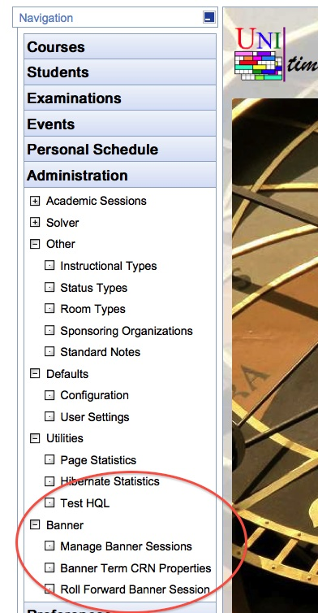{:class='screenshot'}


Select the “Manage Banner Sessions” menu item to go the the page to manage the Banner sessions.  On this page press the “Add Session” button.
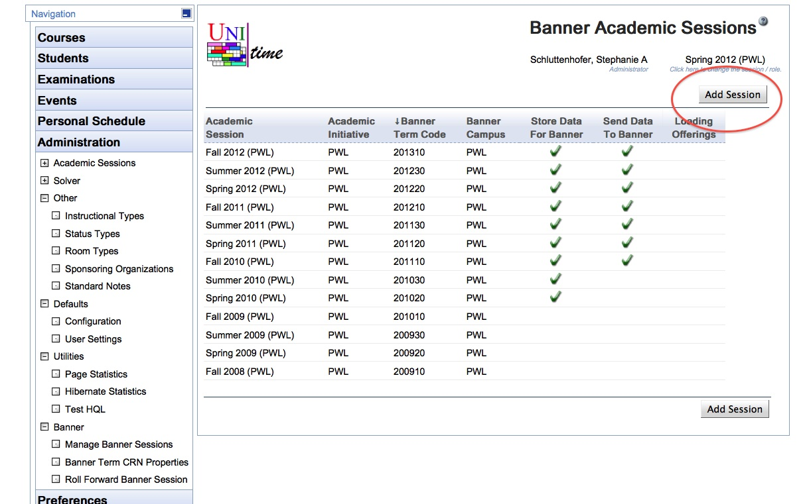{:class='screenshot'}

For each UniTime session you wish to store data for Banner you will need to add a corresponding Banner session.

* **Academic Session** - the UniTime session
* **Banner Term Code** - the code used in Banner to identify a session, i.e. 201220
* **Banner Campus** - the string used to identify the campus in Banner.
* **Store Data for Banner** - Whenever a change is made to a course in UniTime, store the appropriate data that is needed for Banner.
* **Send Data to Banner** - Whenever a change is made to a course in UniTime, send the appropriate data to Banner.  This is often turned off during session setup until Banner is ready to receive data for a session.

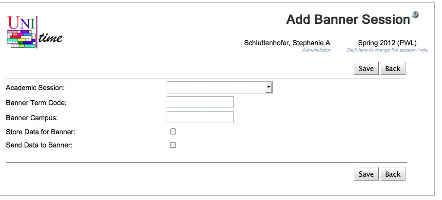{:class='screenshot'}

Once a session is set to store data for Banner, whenever a change is made to a course, CRNs are automatically generated for all classes within the course.  If the courses are structured, the appropriate link identifiers are automatically created to tie the Banner sections together.  If a course is crosslisted, multiple banner sections are created for the course and they are automatically tied together with appropriate crosslist identifiers.

Next select “Banner Term CRN Properties” in the menu and on this page press the “Add Session” button.

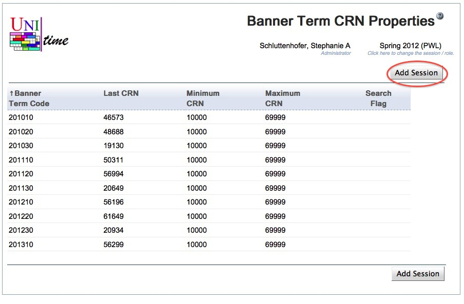{:class='screenshot'}

For each Banner session you will need to configure the CRN properties.

* **Banner Term Code** - the code used in Banner to identify a session, i.e. 201220
* **Last CRN** - the last CRN used on a Banner section
* **Minimum CRN** - the lowest CRN available to UniTime to use on a Banner Section
* **Maximum CRN** - the highest CRN available to UniTime to use on a Banner Section
* **Search Flag** - search though all CRNs used for the Banner session and pick one that is not in use.  This is used when the Maximum CRN is in use and the system needs to find unused CRNs.

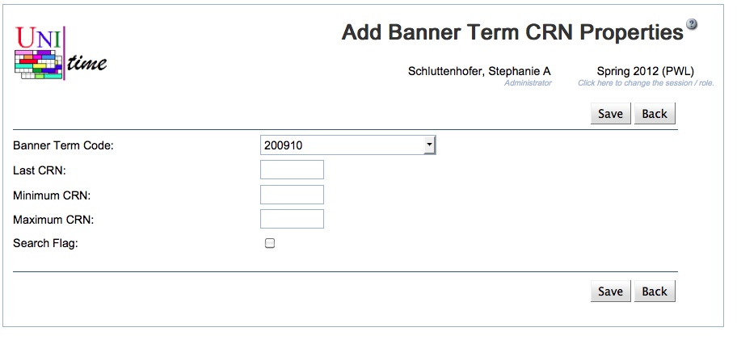{:class='screenshot'}


## Other Banner Related Pages

The third Banner related page under Administration is the “Roll Forward Banner Session” page.  This page is used to roll forward the Banner data associated with a UniTime session to the next like session.  Depending on the amount of data you have this roll forward can take a long time.  It copies all Banner related data from the session select to roll forward from to the session selected to roll forward to. When rolling forward the data for a session the roll creates the Banner session data so you do not have to create it yourself.  You will need to update the Banner CRN data for the session when it is done.

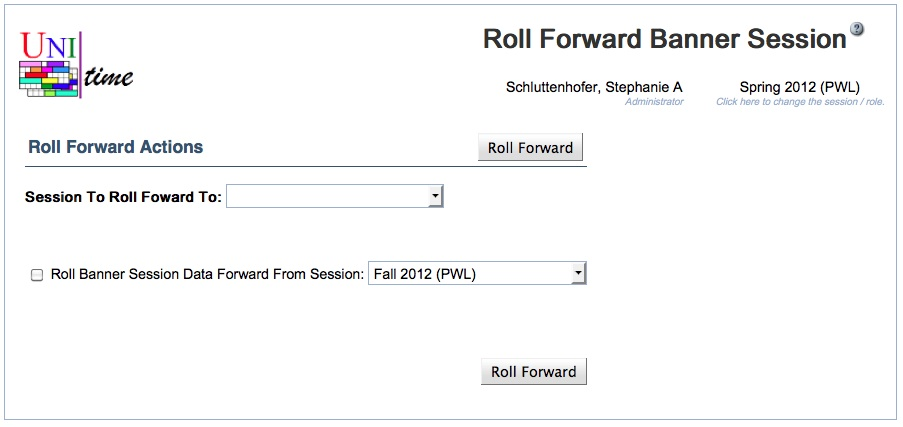{:class='screenshot'}

The UniTime Banner Add On also adds a Banner sub-menu under the Courses menu.  The items under this sub-menu allows the user to see the Banner related data and make some edits to the Banner sections.

{:class='screenshot'}

The Banner Message Responses page allows schedule manages to see information about the success or failure of the messages that pass between UniTime and Banner.

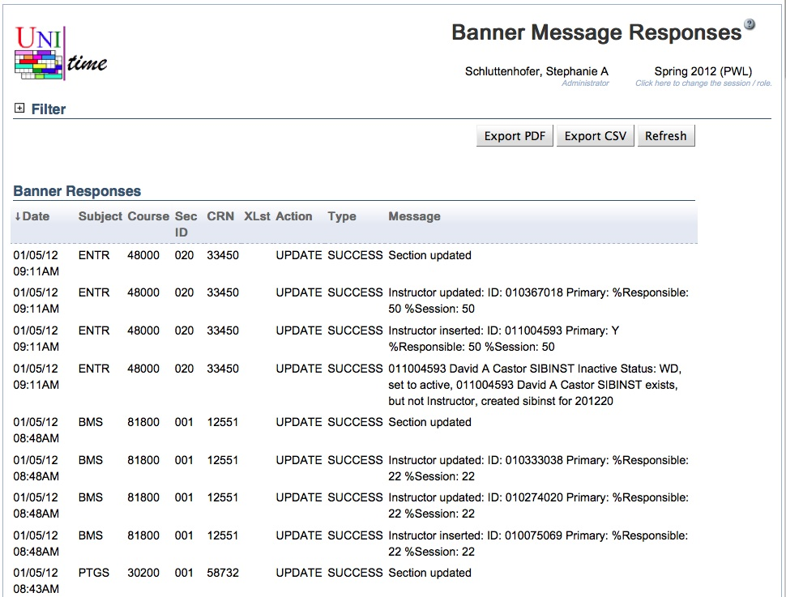{:class='screenshot'}

The Banner Offerings page provides schedule managers with a list of the Banner Sections and the associated data that is sent to Banner.  If the user clicks on a Banner offering they are taken to a page that allows the schedule manager to make changes to the Banner Sections.

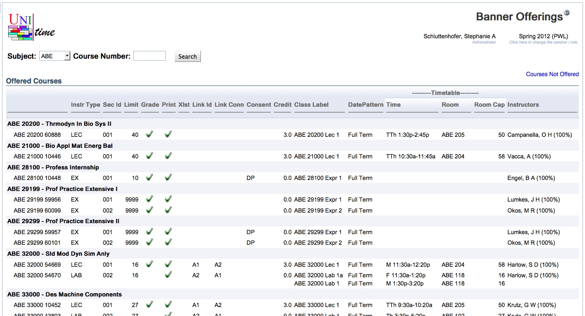{:class='screenshot'}

## Queue Processor

In order to transfer the data to Banner a set of Banner related pl/sql packages must be installed on the Banner side.  They are then called by the UniTime queue processor to push updates into Banner and retrieve student information from Banner.

You may contact Purdue University to request use of the code they have developed for their implementation of the interface with Banner. UniTime is independent of Purdue University and cannot provide any guarantee they will be able to share this code.  However, they have been willing to share this code in the past.  The contact person at Purdue University to discuss the sharing of the code for the Banner side of the interface is Joe Faulkner, [faulkner@purdue.edu](mailto:faulkner@purdue.edu).

The queue processor runs separately from the web server.  A script like the following can be used to run the queue processor:

```
export JAVA_OPTS="-Xmx8g -Dtmtbl.custom.properties=/Applications/apache-tomcat-7.0.40/conf/custom.properties -XX:+UseConcMarkSweepGC -XX:MaxPermSize=128m"

CP=/Users/says/gitRepositories/unitime-addons/BannerAddOn/Distributions/timetable.jar:/Applications/apache-tomcat-7.0.40/lib/mysql-connector-java-5.1.26.jar

for a in /Users/says/gitRepositories/unitime/WebContent/WEb-INF/lib/*.jar; do
    	CP=$a:$CP
done
for a in /Users/says/gitRepositories/unitime/3rd_party/*.jar; do
    	CP=$a:$CP
done

echo Class-path: $CP

java $JAVA_OPTS \
    -cp $CP \
    org.unitime.banner.queueprocessor.ProcessQueue
```
