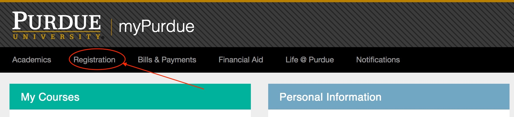
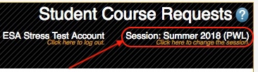
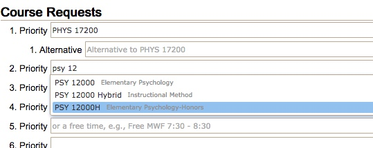
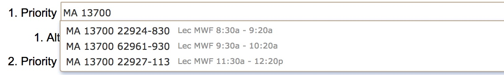
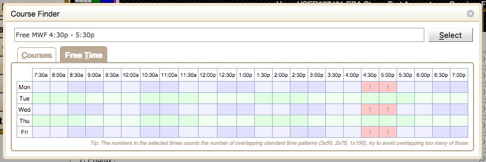
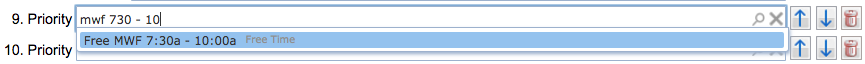
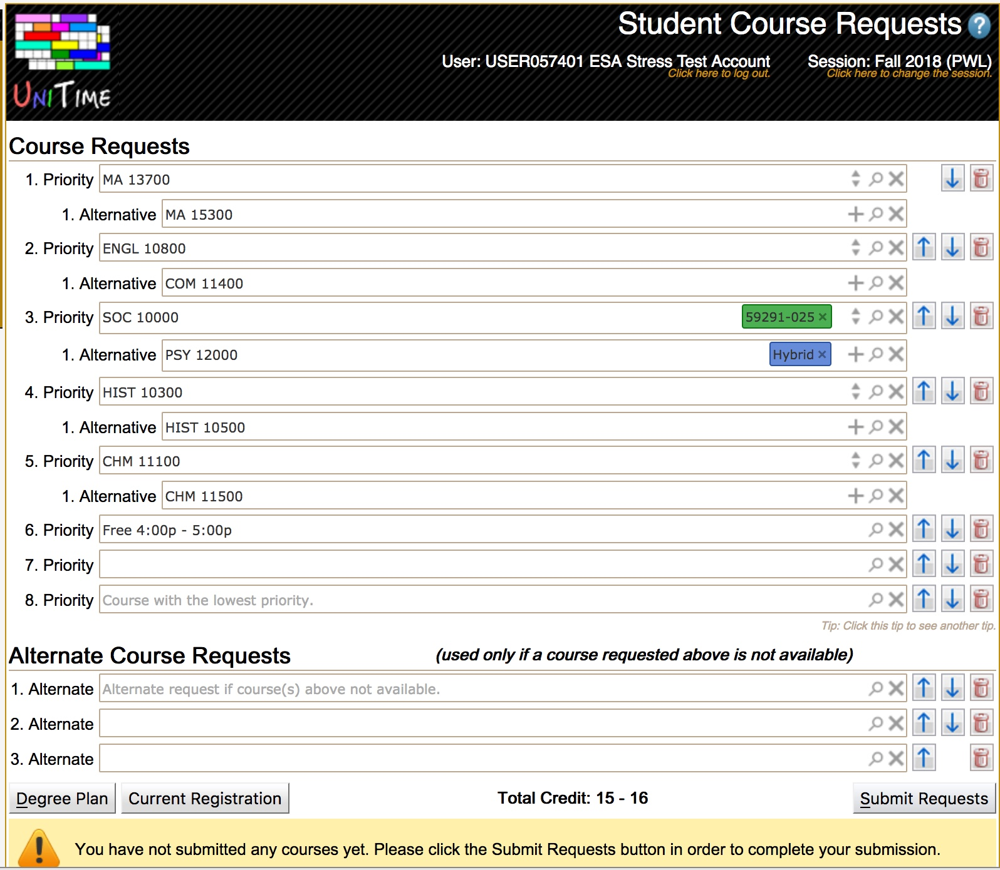
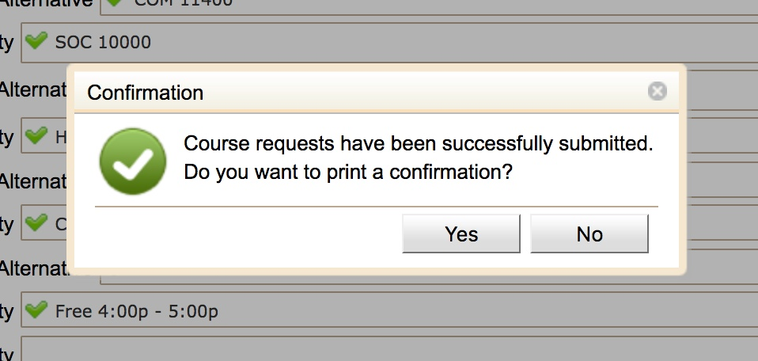

### Table of Contents
{:.no_toc}
* table
{:toc}

# UniTime Course Requests User Manual 

The Student Course Requests Page was created to help students quickly enter their course requests.  It takes a list of courses a student is interested in and calls a validation routine to determine whether there are any roadblocks in the way of the student being able to register for the selected courses.  If there are issues with a student’s course request that can be resolved by receiving the proper overrides, then the student may use the page to request the overrides.

# Navigating to the Course Requests Page

To use the Student Course Requests Page, go to myPurdue.purdue.edu and enter your career account name and password on the login screen and press the ‘**Login**’ button.

 

{:class='screenshot'}

 

Find the ‘**Registration**’ item along the top of the page and click on it.

 

{:class='screenshot'}

Find the ‘**Register for Classes**’ box and click the ‘**Use Scheduling Assistant**’ link.

 

{:class='screenshot'}

 

This brings up the Student Course Requests Page.

 

{:class='screenshot'}

# Validating the Academic Session

Review the ‘**Session**’ in the upper right corner to ensure the correct academic session is being used for registration.

 

{:class='screenshot'}

 

If the academic session listed is incorrect, click on the session that is listed.  If there are multiple terms available for scheduling, a dialog with session choices will appear.  Select the academic session in which you want to register.

 

{:class='screenshot'}

 

The ‘**Session**’ in the upper right hand corner will reflect the term you selected.

 

{:class='screenshot'}

# Configuring Your Course Requests

Depending on the status of your course registration, when you enter the Student Course Requests Page you may either see a Course Requests Form with no courses listed or a Course Requests Form with a set of courses listed and icons next to them indicating the status of each course requested.

 

If you have not previously registered for any courses, the Student Course Requests Page will display the Course Requests Form for entering your course requests with no courses listed.

 

{:class='screenshot'}

 

If you are currently enrolled in courses such as those from a Learning Community, those courses will be listed on the course request form with a grey lock ({:class='icon'}) icon before them and a grey check mark ({:class='icon'}) to the right side of their text box.  These courses cannot be removed from your course request.

 

{:class='screenshot'}

 

 

If you have an existing plan in myPurduePlan, you can use the ‘**Degree Plan**’ button at the bottom of the Student Course Requests Page to import courses from your myPurduePlan planner.

 

Enter all courses you wish to take in the Course Requests grid.  You should enter the courses in descending order from your highest priority to your lowest priority.  If there is an alternative to any specific course you want to take, you can enter that information entering the alternative course into the ‘**1. Alternative**’ indented line that appears underneath the primary course request once you select the course.  It is possible to enter more that one alternative for a primary course request by clicking the plus ({:class='icon'}) icon at the right hand side of the ‘**1. Alternative**’ text box. This will bring up an additional Alternative text box.  This can be repeated as many times as needed.   Also, if you want to take a specific number of courses in order to make progress toward a degree, you may use the ‘**Alternate Course Requests**’ section of the form to request a set of alternative courses that are acceptable if any course in the prioritized list is not available.

## Using the Course Finder

From the Course Requests grid, you can add courses to your list by clicking the magnifying glass icon ({:class='icon'}). This brings up a dialog that allows you to search for courses.  You can enter a course number or a set of words that may be found in the title of the course.  The Course Finder dialog will display a set of courses that match your search criteria. You can click on each course listed to see more details about it from the course catalog.

 

{:class='screenshot'}

 

 

If you select the ‘**List of classes**’ tab in the Course Finder you will be presented with information about the times a course is offered and you will have the ability to prefer an instructional method if the course has more than one mode of operation.  You also have the ability to prefer one or more sections of a course.

 

{:class='screenshot'}

 

**Note:** UniTime will use the preference information to try to build a schedule that satisfies both your need to make progress toward your degree and to receive instruction in your preferred mode or at your preferred time.  However, if the only way UniTime can schedule you to a course you requested is to place you in a course section that does not meet your preferences, it will do that as getting a course you requested takes priority over getting the time or instructional method you preferred.

 

Once you have picked a course you would like to request and chosen any preferences, either double click the course to select it or press the ‘**Select**’ button.  This closes the window and populates the appropriate field in the Course Requests grid.

 

{:class='screenshot'}

 

Any instructional method or course section preferences entered will appear on the right hand side of the course request text box.  The preferences can be removed by clicking the ‘x’ inside of the colored box of the preference.

## Entering Course Requests by Typing

In addition to using the magnifying glass icon ({:class='icon'}) to bring up the Course Finder dialog, you can type your search directly into an input box and it will show you a drop down list of the courses that match your search criteria.  You can then select a course from the drop down.

 

{:class='screenshot'}

 

 

**Note:**  The Course Requests Form may suggest multiple suffixed course offerings for a course number.  These are different variations of the same course.  These suffixes will not be shown in myPurdue.  You should pay attention to the suffix to make sure you select the correct version for your needs.  For example, if you want to take an honors version of a course, you would pick the one with an H suffix and the word “Honors” in the title.

 

 

It is possible to add instructional method and course section preferences by typing into the input box.

 

As you are typing a course number, if UniTime detects a hybrid or online instructional method of delivery is available it will list the method as an option to select.

 

{:class='screenshot'}

 

In addition, once you have selected a course number, if you press the spacebar it will list the sections available for preferences.

{:class='screenshot'}

 

This process can be repeated multiple times to add preferences for more than one section.

 

{:class='screenshot'}

 

It is also possible to lookup a course by its CRN. To do so, just start typing in the CRN.

{:class='screenshot'}

 

 

## Entering Free Time Requests

You can also use the magnifying glass icon ({:class='icon'}) to enter free time requests from the course finder dialog.  To use the course finder dialog to enter a free time request, select the ‘**Free Time**’ tab and click on each half hour grid square that should be free and a free time request will be built in the text box.  Clicking on a grid square a second time will deselect it.  It is also possible to click multiple grid squares by pressing the mouse button over the first square and holding it down while dragging it over the other squares you wish to select.  This will cause multiple squares to be highlighted and then selected once the mouse button is released.  Press the ‘**Select**’ button or use the enter key to insert the free time request into the Course Requests grid.

 

{:class='screenshot'}

 

It is also possible to enter free time requests by typing them into the input box and selecting a suggestion.

 

Free time request can be also typed in directly in the input text box, without opening the Course Finder dialog.

 

{:class='screenshot'}

{:class='screenshot'}

 

**Note:** A high priority free time request may prevent the student scheduling process from placing you into a lower priority course if that course meets during the requested free time.

 

Continue filling in the course request input boxed until you have entered all your course and free time requests along with any alternatives.

 

{:class='screenshot'}

## Making Changes to Course Requests

You can make changes to the course request form list by adding courses to the empty spots in the grid.  To remove courses use the trashcan icon ({:class='icon'}) to the right of the line associated with the course. To change priorities use the up ({:class='icon'}) and down ({:class='icon'}) arrows. To swap a course request with its alternate press the swap ({:class='icon'}) icon on the right hand side of its text box.  To submit a free time request use the magnifying glass icon ({:class='icon'}) to take you to the Course Finder dialog where you can build a free time request. More experienced users may also enter a time statement covering the desired free time.

 

{:class='screenshot'}

# Submitting Courses Requests

Once you are satisfied with your course, alternatives and free time requests, press the ‘**Submit Requests**’ button in the bottom right hand corner of the page.

 

{:class='screenshot'}

 

This triggers UniTime to submit a validation request to determine whether you are eligible to register for the courses listed in your course request.  If the validation finds no errors, a dialog will appear acknowledging the submit was successful and asking if you would like to print a confirmation.

 

{:class='screenshot'}

 

If you select yes, then your browser print dialog will be opened and you can print the confirmation.

 

 

Once you have printed your course request submission confirmation you are returned to the Course Requests Form.  If no errors were found you will see a green check mark ({:class='icon'}) next to each course request.  You will also see a message at the bottom of the page stating the course requests were successfully submitted.

 

{:class='screenshot'}

 

 

 

 

 

## Course Request Validation Warnings

The validation of your course requests could trigger a number of warnings.  If warnings are found a dialog will appear to allow you to review the warnings.  Items listed in the warnings are informational and will not prevent UniTime from scheduling you into a course.

 

{:class='screenshot'}

 

It is important to review the warnings.  To agree to the warnings and submit your course requests click ‘**Accept & Submit**’.  To make changes to your course requests to resolve the warnings click ‘**Cancel Submit**’.  When you are returned to the Course Requests Form after you click ‘**Accept & Submit**’ or ‘**Cancel Submit**’ the warnings will be displayed in the smaller text under the input box for the affected course.

## Course Request Validation Overrides

The validation of your course requests could detect the need for overrides to allow you to be registered to one or more of the courses on your list.  If the overrides are not obtained for a course, then that course will be removed from your course requests before your schedule is created.  When the need for an override is detected a dialog is displayed documenting all overrides needed and provide you with the opportunity to decide to request the overrides or change your course requests.

 

{:class='screenshot'}

 

If you have not discussed the courses needing overrides with your advisor or would prefer to edit your course request rather than request the overrides, then press the ‘**Cancel Submit**’ button to return to the Course Requests Form so you can change your request.  If you have discussed the courses needing overrides with your advisor and believe you will granted the overrides, then press the ‘**Request Overrides & Submit**’ button to request the required overrides and submit your course requests.

 

# Interpreting the Course Request Form after Requests Submission

Once a submitted course request exists, then additional data about each of the submitted course requests will appear on the course request form.

 

{:class='screenshot'}

 

 

## Individual Course Information

If there are warnings or override requests associated with a course then there will be messages beneath the input box associated with the course requests detailing the warnings and/or override requests.

 

{:class='screenshot'}

 

In the input box next to the course will be a clickable icon that provides information about the status of the course request.

 

{:class='screenshot'}

 

The clickable icon can also be found next to the total credit to indicate whether a credit increase is not needed, pending, or denied.

 

{:class='screenshot'}

 

 

Any of following clickable icons may be displayed depending on the status of the individual course request:

 

{:class='icon'} - The course request has been successfully submitted and is ready to be used for building your schedule.  Clicking on the success ({:class='icon'}) icon brings up popup confirming the course is part of your current submission.

 

{:class='screenshot'}

 

{:class='icon'} - You are already enrolled in the course. Clicking on the lock ({:class='icon'}) icon brings up popup confirming you are currently enrolled in the course and cannot change the request.

 

{:class='screenshot'}

 

 

{:class='icon'} - You have requested overrides that are still in the awaiting approval state.  This course is not yet ready to be used for building your schedule.  Clicking the waiting ({:class='icon'}) icon brings up a popup that lists the overrides that are awaiting approval for the course.

 

{:class='screenshot'}

 

{:class='icon'} - Your override request has been denied.  This course will not be used for building your schedule.  Clicking on the denied ({:class='icon'}) icon brings up a popup that provides more information about the override that has been denied and displays the denial note.

 

{:class='screenshot'}

 

## General Course Request Form Messages

General informational messages that apply to the entire Course Requests Form are displayed at the bottom of the Student Course Requests Page.

 

If your time window for the using the Student Course Requests Page is not open a message will display that lists the window of time you can access the page.

 

{:class='screenshot'}

 

It will also display messages indicating that you still need to submit your changes to your course requests.

 

{:class='screenshot'}

 

If you have a denied override request it will show a warning advising you to remove the denied course from your request.

 

{:class='screenshot'}

 

 

If you have successfully submitted your course requests a message indicating the success will appear.

 

{:class='screenshot'}

 

 
