### Table of Contents
{:.no_toc}
* table
{:toc}

 

# Rooms


The first step in timetabling data entry is to ensure that all rooms to be scheduled are maintained in UniTime.


 


**Select Courses > Input Data > Rooms in the menu**


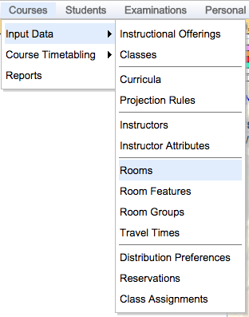{:class='screenshot'}

## Rooms Page


The rooms page, shown below, provides an overview of rooms that can be used for your classes or examinations together with the properties of these rooms, such as room features or room availability.


 


Select a department in the filter, or leave Managed in there. You can also choose to see the rooms for examinations. The rooms that can be used by this department will appear. To export this list to a PDF or a CSV, use the More > Export button.


 


The filter can be used to filter the list of rooms by department, type, size, room features, room groups, or only to show rooms that are available for event management. Use More > Columns to show/hide certain columns, More > Sort By to order the table by certain column, More > Department and Availability to control how departments and room sharing is displayed.


 


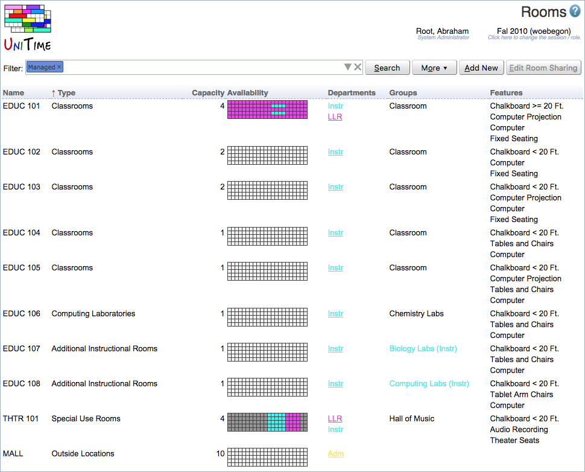{:class='screenshot'}

### Room Types


The rooms are divided based on their room types. Typically, you will see classrooms, teaching labs, department rooms, special use rooms, and non-university locations. For example, the following room types can be used:

#### Classrooms


Instructional rooms assigned to the selected department from the central pool of rooms.

#### Computing Laboratories


Computing laboratories assigned to the selected department from the central pool of rooms.

#### Teaching Labs


Departmental teaching labs used for instruction, such as chemistry and biology labs.

#### Departmental Rooms / Additional Instructional Rooms


Additional departmental space used for class meetings, such as departmental conference rooms.

#### Special Use Rooms


Special Use Rooms that belong to the department, such as offices, exist in the room inventory. However, they are not considered as being instructional rooms.

#### Non-University Locations


Non-University locations are places that are not listed in the room inventory (e.g., a hospital in town).

### Room Columns

#### Name


Building abbreviation and room number for rooms. The location name for non-university locations.

#### Capacity


Seating capacity of the room is the maximum number of students who can have a class there at the same time. Note: Use 9999 for unlimited capacities. Rooms on campus (not non-university locations) usually need to match the official room inventory. You can request a change in capacity for Rooms other than Classrooms in the Contact Us screen (use the category "Request any other administrative change").

#### Availability


Availability is a time grid showing how times in the room are divided among departments that share this room (the list of these departments is in the Departments column). All times in white, which is the default color, are shared by all departments listed in the Departments column (and no one else). All times in gray are not available for timetabling. Roll your mouse over the grid to see exact times of special assignments (e.g., a department assigned particular hours - English department has a departmental meeting on Wednesdays from 3:30 p.m. – 5:20 p.m.).


The department that controls this room can change the availability on the Edit Room page. The controlling department is underlined in the Departments column. Otherwise, a department can only change sharing of the times that are already assigned to it (e.g., to pass some of these times to another department).

#### Departments


The Departments column lists the departments sharing this room. The department that controls the room can add/remove departments to/from the list on the Edit Room page.

#### Groups


This category lists the groups to which this room belongs (e.g., EDUC 101 belongs to the Classroom room group). You can add/remove the room to/from a group in the Edit Room form. This form is accessed from the Room Detail form by clicking on the Edit Room button). Read more about room groups in the description of the Room Groups form.

#### Features


The Features column shows a list of items or equipment found in the room. There can be a list of global room features that are defined and maintained administratively for all rooms, for example:

* 2 Computer Projectors (2CmptProj)

* Audio Recording (AudRec)

* Chalkboard<20 Ft (Ch<20Ft)

* Chalkboard>=20 Ft (Ch>=20Ft)

* Computer (Comp)

* Computer Projection (CompPr)

* Document Camera (Docucam)

* Fixed Seating (FixSeat)

* Horseshoe Arrangement (Horseshoe)

* Tables and Chairs (Tbls&Chrs)

* Tablet Arm Chairs (TblArmChr)

* Theater Seats (ThtrSeat)


The room features can be grouped into categories using room feature types. You can define your own (departmental) features for the rooms owned by your department on the Room Features screen; all such features also will be displayed on the Rooms screen.

## Room Detail Page


When working with rooms from your department, click on any line with information about a room to get to a **Room Detail** form. If you hover your mouse over a row containing room information, you will notice that the row appears in blue. You will be able to change some properties of the room, such as availability or room sharing, in screens accessible from this **Room Detail** screen.


{:class='screenshot'}

## How to Add Rooms


If you cannot see the rooms you want to use and you do not have the necessary permissions to add the room yourself (the Add New button is not displayed on the Rooms page), use the Help > Contact Us screen to send a request for the room to be added.


 


To add a new room, click the Add New button on the Rooms page. Fill in the required information.

#### Room Type


Select room type. Based on the room type (room or non-university location), you will be able to choose a Building and Room Number (for a room) or a Name (for non-university location).

#### Distance Check


By default, this checkbox is checked, which means that if a class at this location is back to back and the distance is too great, it will cause a conflict for students. Also, back-to-back classes cannot be taught by the same instructor.


When unchecked, there is no time conflict between back-to-back classes (one at this location, the other one in some other room), and the classes can be taught by the same instructor.

#### Room Check


By default, this checkbox is checked, which means that the location is considered to be an equivalent of a room. This means that there cannot be two classes at the same time.


When the checkbox is unchecked, there can be two or more classes taught at the same time at this location. For example, if the location is a hospital, there can be different classes held throughout the hospital at the same time.

#### Controlling Department


Use the drop down to choose the controlling department for this room or non-university location.

## Room Sharing


It is possible to share a room or a certain time in the room with another department. Follow the steps below to share a room:

* In the **Rooms** screen, click on the room that you want to share with another department. This will open the **Room Detail** screen for the selected room.

* The next screen shows **Room Detail**. Click on **Edit Room** button. That takes you to the **Edit Room** screen. See the **Room Sharing** section.

* Select the department with which you want to share the room (either using the plus icon or **Add Department** button. This adds the department to the list of departments who share the room – this list is displayed to the right from the time grid.

* If needed, assign particular times to the other department and keep the rest for yourself. You may assign a time to a department if you click on the department in the list to the right from the time grid and then click on times that the department should use. An example of this kind of sharing is depicted in the following screenshot.


Note: If you do not assign times explicitly, both of the departments will be able to timetable their classes at any times (that is the “free for all” color) and the department which commits the timetable first gets the requested time. The other department will need to use the times that remain.

* Click **Update Room**


 


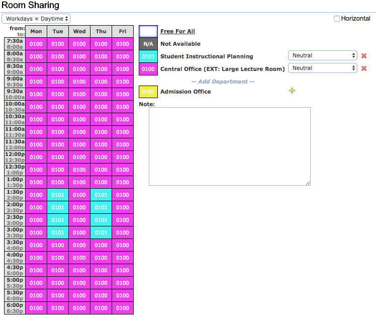{:class='screenshot'}


 


Note: If you are not the owner of the room (your department is not the controlling department), when you set up sharing of a room with another department, you cannot take the room back from the department. You will need to ask the other department to give up that room (in a similar way as setting up room sharing – they would just select their department from the list and click the X icon, then Update), or you will need to contact the administrator (e.g., using the Contact Us screen).

## Setting and Editing Room Preferences


Room preference on a particular room allows the user to exclude some of his/her rooms from the timetabling process, or use that room only if absolutely necessary (for example, if the department wants to keep one of its rooms empty for unexpected events).


 


To set up room preferences proceed with the following steps:

* Select Courses > Input Data > Rooms in the menu. This takes you to the **Rooms** screen.

* Select your department (or Managed Rooms) and hit Search.

* Click on the room in your list of rooms. That takes you to the **Room Detail** screen.

* Click on the **Edit Room** button

* This takes you to the **Edit Room** screen. Set the room preference in the Room Sharing section, next to your department.

* Click **Update Room**


 


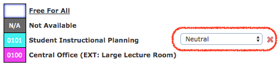{:class='screenshot'}


 


The meaning of the preference levels is as follows:

* **Prohibited** – never ever use this room (even if required on a class).

* **Strongly Discouraged** – this room is used only if either: 

	* The room is required for a class, or 

	* The room is preferred or strongly preferred for a class and the solver is not able to put this class into another room.

* **Discouraged** – this room is used if either: 

	* The room is required for a class, or 

	* The solver is not able to put this class into another room.

* **Neutral** – the default value for room preference.


It is not recommended that you use any other preference level on the room itself.

## Room Features


There might be special features you want to choose in your rooms (e.g. Audio Input Mac computer labs).


 


The following instructions will guide you through setting up a feature for your departmental room and indicate which rooms have this feature:


 

* Click on Courses > Input Data > **Room Features** in the menu. That takes you to the **Room Features** screen. Here, you will see the features currently listed as your room features, as well as a list of your rooms which have been flagged as having those features.


 


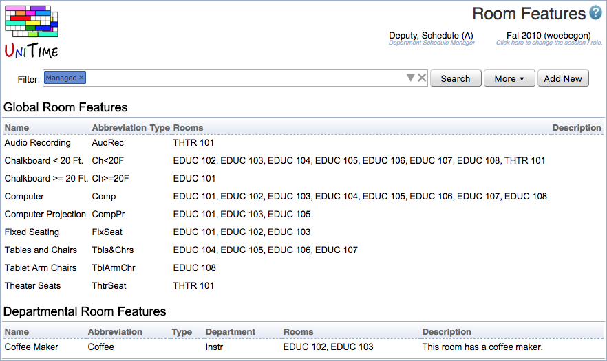{:class='screenshot'}

### Adding Room Features


You only may update your features for departmentally owned rooms. The Global Room Features must be updated by an administrator. The following steps will guide you through adding other features to your department room:


 

* Click **Add New** button. This takes you to the **Add Room Feature** screen. Here, you can set up the feature you plan to add. Select a name that is helpful to you.


Note: ignore the Global checkbox. It is for administrative use only.

* Supply the name of the feature and abbreviation.

* When applicable, select Feature Type or leave at No Type.

* Select Department.

* You can provide room feature Description. This is an optional field.

* Select rooms that the room feature applies to. Please note that only the rooms that meet the filter from the **Room Features** screen are listed.

* Click **Create Room Feature**


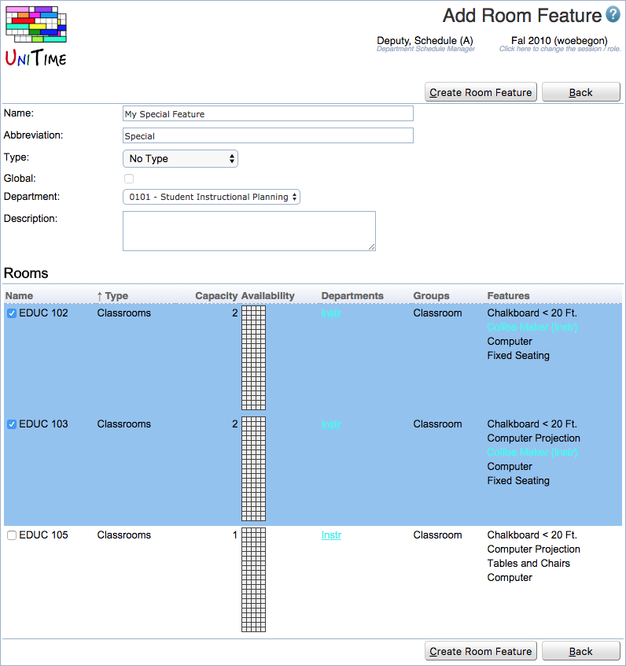{:class='screenshot'}


 

### Adjust Room Features


You only may update your (departmental) room features. The Global Room Features must be updated by an administrator. The following steps will guide you through adding other features to your department room:


 


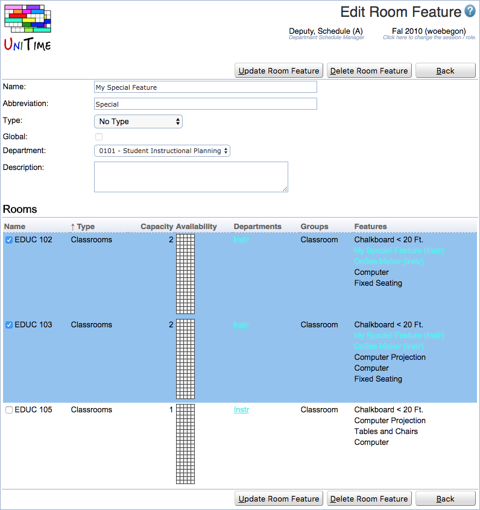{:class='screenshot'}


 

* Click on the room feature you want to adjust.

* This takes you to the **Edit Room Feature** screen. In the **Edit Room Feature** screen, you will have a list of rooms from your room list set up in the previous section. Click the box for all the rooms that have this feature. Please note that only the rooms that meet the filter from the **Room Features** screen are listed.

* Click **Update Room Feature**

## Room Groups


Within the **Room Groups** form, you can categorize multiple rooms/labs under one name e.g., if you have multiple laboratories for Biochemistry, you can create a room group named Biochm Lab. The group can be named anything that is helpful to you. Note: you may only update your Departmental Room Groups, not the Global Room Groups.


 


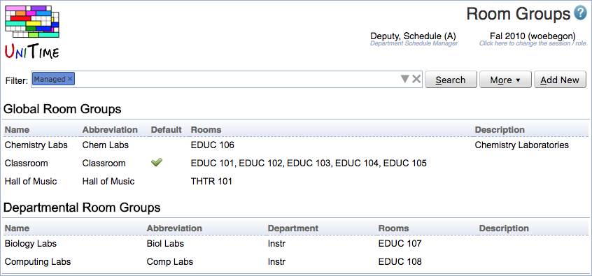{:class='screenshot'}


 


The following instructions will guide you through creating a Room Group:

* Click on Courses > Input Data > **Rooms Groups** in the menu. That takes you to the **Room Groups** screen. Here, you will see the groups currently listed as your room groups, as well as a list of your rooms which have been flagged as having those groups.

* Click **Add New** Group

* Supply the name of the group and abbreviation.

* Select Department.

* You can provide room feature Description. This is an optional field.

* Select rooms that the room group applies to. Please note that only the rooms that meet the filter from the **Room Groups** screen are listed.

* Click **Create Room Group**


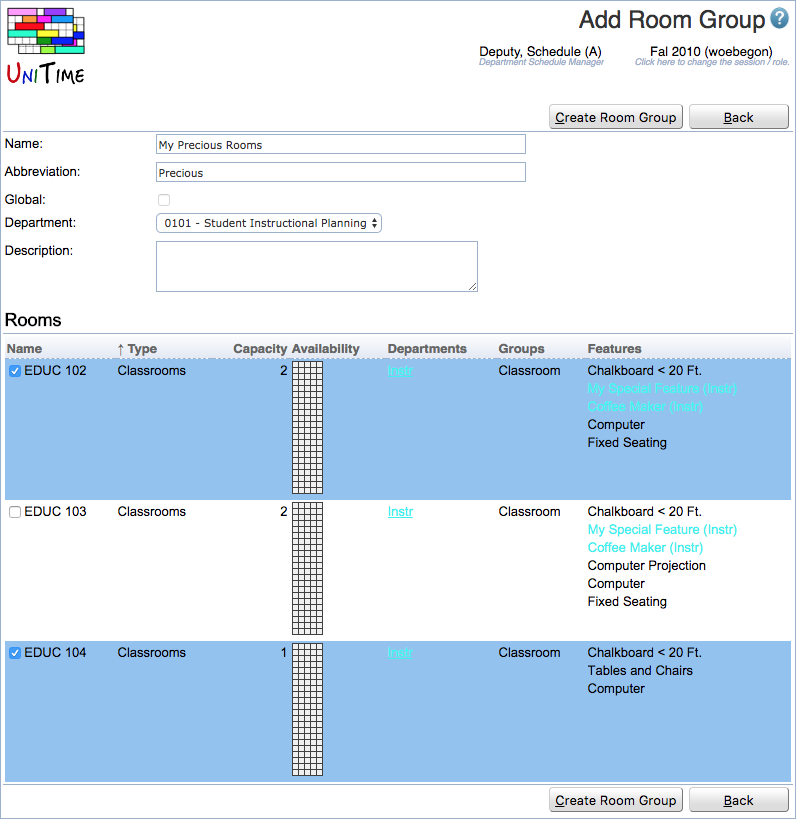{:class='screenshot'}

### Adjust Room Groups


You only may update your (departmental) room groups. The Global Room Groups must be updated by an administrator. The following steps will guide you through adding other groups to your rooms:


 

* Click on the room group you want to adjust.

* This takes you to the **Edit Room Group** screen. In the **Edit Room Group** screen, you will have a list of rooms from your room list set up in the previous section. Toggle the checkbox for all the rooms that have this group. Please note that only the rooms that meet the filter from the **Room Groups** screen are listed.

* Click **Update Room Group**


 


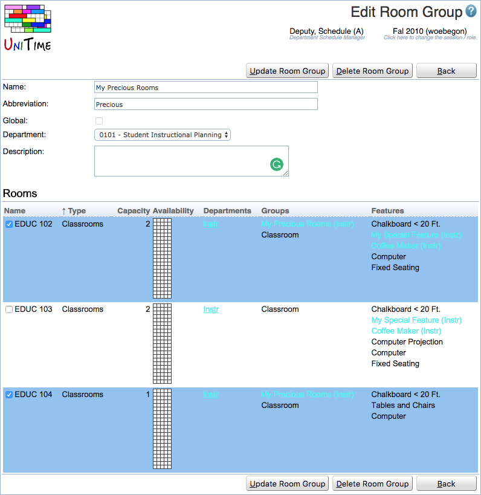{:class='screenshot'}


 


 

# Instructors


The second step with timetabling data entry will be to ensure that all instructors who will be assigned to classes are maintained within UniTime. You will see the list of your instructors when you click on Instructors in the left-hand side menu. Before you start working on classes, make sure that the instructor list is complete.


 


**Select Courses > Input Data > Instructors in the menu**


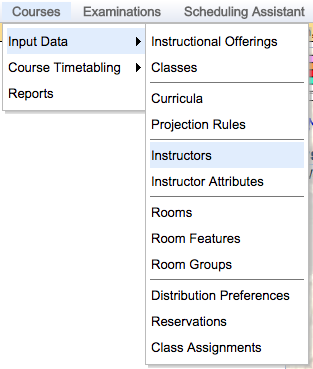{:class='screenshot'}


 


If the instructor list is not complete, you can manage your instructor list or add a new instructor.


 


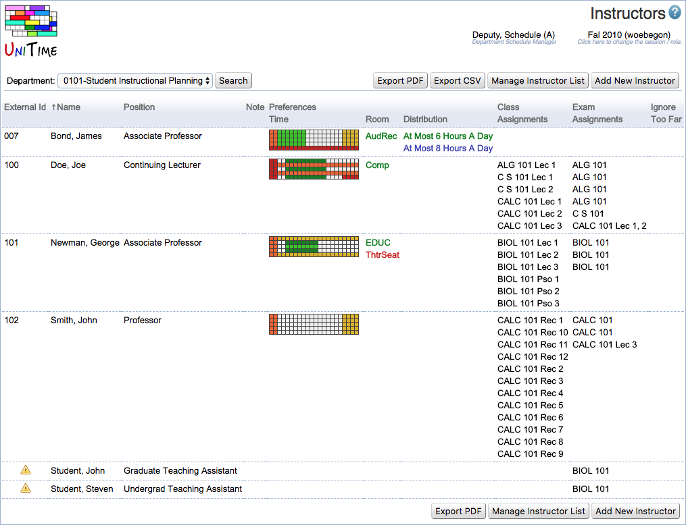{:class='screenshot'}


Note: You may use the Export PDF button to print a copy of all your listed instructors.

## Managing Your Instructor List


To view and manage your instructor list:

* Click **Manage Instructor List**. It has two parts: (a) Instructors in the Department List, and (b) Instructors not in the Department List.

* Check names to add instructors to your list.

* Uncheck names to remove them from the list (the checked ones will be in your list).

* Click **Update**.

## Adding New Instructors to Your List


To add a new instructor who is not in the **Manage Instructor List**:

* Return to the initial **Instructors** page.

* Click the **Add New Instructor** button.

* For a new instructor, the only mandatory field is his/her last name. You can also lookup the instructor by clicking the **Lookup** button.

* Provide instructor’s External Id. This way, the instructor’s name will be matched with the university records, which is necessary to get the instructor’s name to the Student Information System. It is also needed when the instructor is teaching classes from multiple departments.

* If you know the instructor’s career account username, enter it in the Account Name field.


 


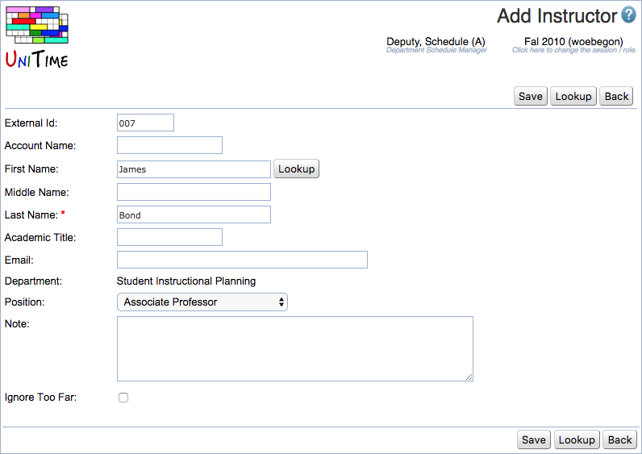{:class='screenshot'}


Note: It is sufficient to only enter instructors that should be assigned to a class.


 

## Instructor Detail


From **Instructor Detail** screen, you can also continue to other screens to edit instructor information and change their personal preferences.


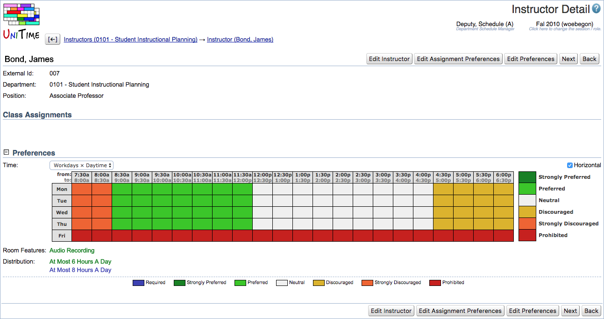{:class='screenshot'}


 


To change personal information:

* Click **Edit Instructor** button

* This takes you to the **Edit Instructor** screen. From here, you may change information for this instructor (i.e. notes, email, etc.).

* When you are finished, click **Update**

### Setting Instructor Preferences


You can set preferences of instructors in this section. These preferences are then inherited on any class to which you assign this instructor. The following instructions describe how to set an instructor’s Time, Building, Room Feature, Room Group, and Distribution preferences:


 

* In the Instructors screen, click on the name of the person whose preferences you want to enter.

* That takes you to the **Instructor Detail** screen. Click **Edit Preferences** button

* Edit the preferences.

* When finished entering instructor preferences, click **Update**


 


There are Time, Room, Building, Room Feature, Room Group, and Distribution preferences you can enter, just like on scheduling subparts or classes as described in the section on preferences. Note: It is not necessary to have an entry in every preference.


 


 


 

# Instructional Offerings


To see the list of instructional offerings, click on Courses > Input Data > Instructional Offerings in the menu. If you have more than one subject area, select the subject area you want to work with from the drop down menu and click Search. If you have only one subject area, it will display automatically.


 


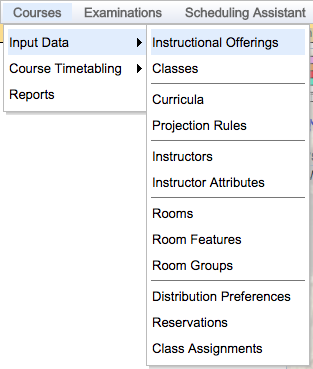{:class='screenshot'}


 


Navigation Information: In this application, the filter at the top left of the **Instructional Offerings** screen can be used to display a variety of informational items pertaining to your offerings. Click the plus sign (+) to the left of the filter to display these items. Select the checkbox(es) to choose which items you want to display. When finished, you can close the filter by clicking on the minus sign (-) to the left of the filter.


 


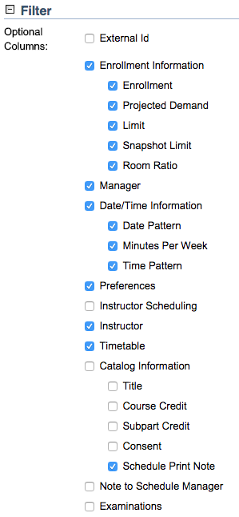{:class='screenshot'}


 


Note: In most cases, an instructional offering is an equivalent of a course. Within UniTime, if you need to get back to the **Instructional Offering Detail** screen, select and click the row that contains the subject and course number.


 


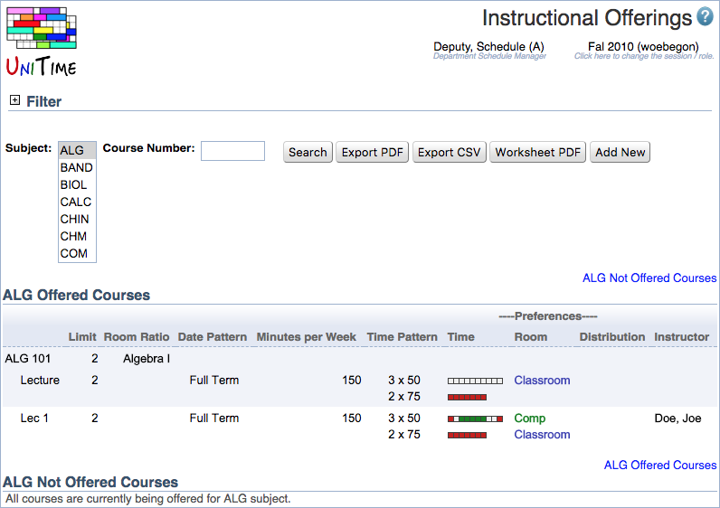{:class='screenshot'}

## Adding/Removing Courses


Check whether all of the courses that should be offered for this semester are in the list of Offered Courses. If not, scroll down to the Courses Not Offered list in the lower part of this screen or use the Not Offered Courses link located at the top right corner of this page to get to the list quickly.


Note: You may use the Edit > Find on this Page (or Ctrl+F), to search for a specific piece of data (e.g., to find a course).


 


If the course is displayed in the Not Offered Courses list, then:

* Click on the course you wish to offer. This will take you to the **Instructional Offering Detail** screen.

* Click the **Make Offered** button which takes you to the **Instructional Offering Configuration** screen.

* This screen is discussed in the Instructional Offering Configuration section of this manual.


 


If the course is not displayed in either section of this page, then:

* Click **Add New** button. This takes you to the Add Course Offering screen.

* Enter the Course Number and other information as needed.

* Hit **Save** button. This will create the course and take you to the **Instructional Offering Detail** screen discussed in the next section


 


If an instructional offering is on the list of offered courses, but it is not to be offered this term, then:

* Click on the instructional offering (the line with the course number).

* This takes you to the **Instructional Offering Detail** screen.

* Click on **Make NOT Offered**.


 


Note: This action removes most of instructional offering details for this course (classes, reservations, limits, etc.). Please use caution.


 


Banner: If you add a course that does not exist in the catalog, it will not flow to Banner. Errors such as this will be documented in Banner Messages and will need further attention.

## Instructional Offering Configuration

### Set up or Modify Instructional Offering Configuration


To set up/modify the configuration of an instructional offering (note: arranged hours offerings are described later in this section):

* In the list of **Instructional Offerings**, click on the line that contains the number of the course you want to set up or modify.

* This takes you to the **Instructional Offering Detail** screen. Click **Edit Configuration**.

* That takes you to the **Instructional Offering Configuration** screen.


 


Description of the fields:

* **Configuration Name:** Descriptive name of configuration. You may leave this field blank, and the system will generate a system name for you.

* **Configuration Limit:** Controls how many students can enroll in a configuration of the instructional offering. This field is the Master control for the configuration limit and may only be set manually.


***Banner:**Pay careful attention to setting unlimited enrollments. For unlimited enrollment enter 9999 for the Configuration Limit. DO NOT select the Unlimited Enrollment button.***

* **Instructional Type:**

	* **Add** - Select from drop down menu the additional instructional type you need for this course offering, then click **Add**. 

	* **Delete** - x icon next to instructional type already listed removes that particular instructional type. 


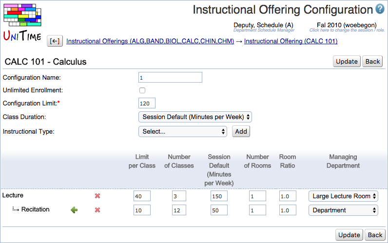{:class='screenshot'}


 

* **Limit per Class:** Limit for each section with this instructional type. 

* **Number of Classes:** The number of classes of this instructional type you want to offer. This is calculated by the application (config limit/limit per class), but can be overwritten in this field.


Note: If you can’t evenly divide your limits out to sum to the overall Configuration Limit, you will need to make one of the instructional type limits sum to greater than or equal to the overall configuration limit. See Modify Class Limits for additional information.

* **Minutes per Week:** Total number of minutes that a class meets per week. It is important that your instructional offerings have the correct number of minutes per week in this screen as this will determine the time patterns that are available for you to use for this class. Note: 1 hour of class is usually equal to 50 minutes.

* **Number of Rooms:** Number of rooms you require per class. The default is 1.

* **Room Ratio:** Used to indicate when you need a room with a capacity different from the size of the class. The default is 1.0 which means the room should seat the number of students in your class. This can be decreased or increased.


Example: A class of limit 20 with a room ratio of 0.5 needs a room of at least 10 seats, you can see the Minimal Room Capacity on the Class Detail screen.

* **Managing Department:** Used to determine which manager will timetable this class. See Setting Managing Department if you have classes within the same instructional type needing to be timetabled by different managers.

### Modifying Class Limits


Select the **Class Setup** button on the Instructional Offering Detail screen to adjust the limits individually. If a range of room sizes are possible for all classes within an instructional type (e.g., you want 10 computing labs that seat a range of 17-23 students each), contact an administrator. **Most users will never use a range.** This option adds flexibility where applicable.


Note: The ability to enable class limit range must be set in the Preferences > Settings, set ***Show the option to set variable class limits*** to yes.


 


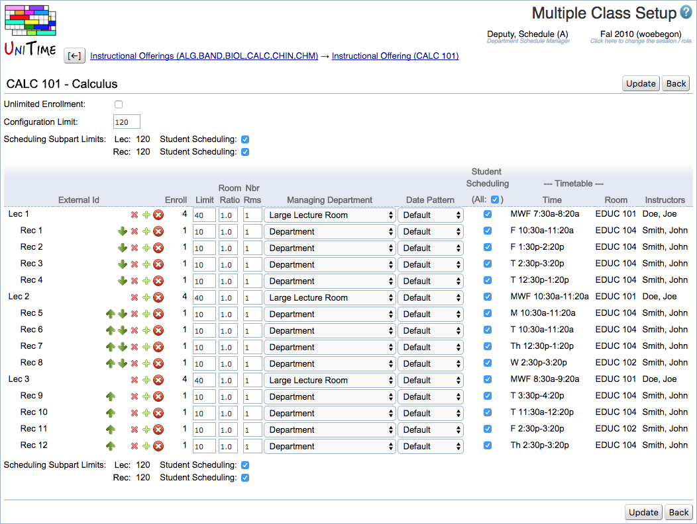{:class='screenshot'}

### Grouping


Besides filling in the fields, you need to set up grouping in the Instructional Offering Configuration screen if it is necessary for the instructional offering.


 


Banner: Grouping in UniTime is equivalent to linking within Banner.


 


If an attendance relationship must be maintained across types of instructions within a course you will need to do a grouping (e.g., Lec 01 with Rec 01 with Lab 01). Grouping should be used only when necessary as student scheduling flexibility is reduced when grouping is used.


 


If you want to group Lecture and Recitation, click on the arrow located next to the Recitation subpart.


 


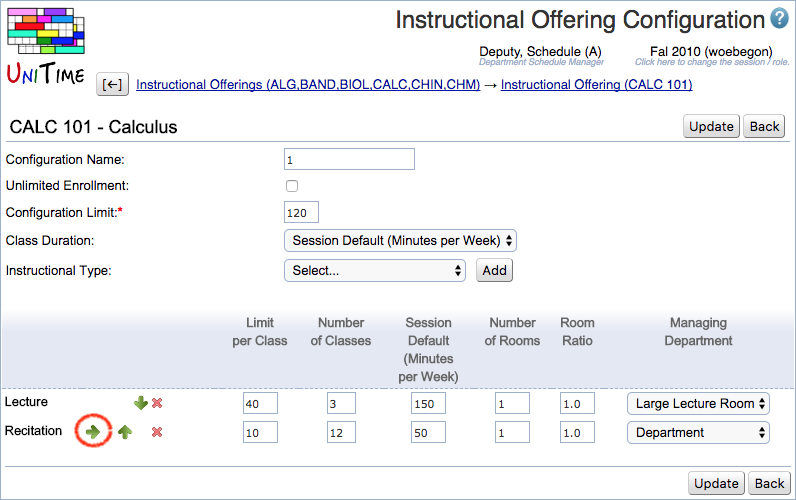{:class='screenshot'}


Consequently each of the three lectures will have four recitations. Students in the first lecture will be scheduled to the first four recitations; students in the second lecture will be scheduled to the next four recitations, etc.


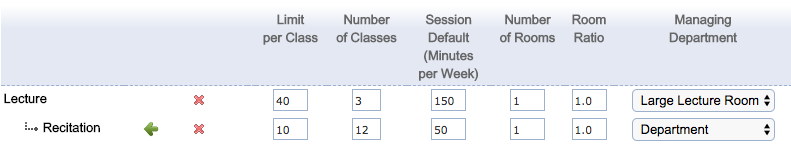{:class='screenshot'}


 


Note: In the terminology of this manual (and the terminology of the authors of the application), the instructional type that is more to the left is called a parent and the instructional type that is indented relative to the other type (after the arrow to the right has been clicked) is called a child.


 


Banner: Each of the CRNs will be assigned a link identifier within Banner (i.e., system generated). You may reference Banner form SSASECT or view the Banner Offerings form with UniTime to view the link identifier. See Banner Offerings for more information.


 


Note**:** It is important that you setup the configuration before you start adding time/room preferences on the classes, since a change in configuration could result in deleting the preferences from your classes.


 


Banner: The application does not check if the configuration that you entered is the same configuration as in the course catalog. You will need to check your Banner Message to see if you have any courses that did not flow to Banner due to configuration problems. These courses will not be timetabled.

### Configuration of Independent Study/Research Courses


For independent study courses there are two options.


 


**Option 1:** The following steps are required if the course **does not require a room** for meetings and time statement is arrange hours:

* For the Configuration Limit enter 9999.

* Choose the appropriate instructional type (IND or RES) from the dropdown menu.

* Click **Add**. The configuration name will be system generated. You also can supply your own configuration name.

* Set the limit per Class to 9999 (9999 = unlimited). Press Tab. This will automatically generate the Number of Classes.

* Tab to the number of Minutes per Week. Enter 0 (indicates arr hrs).

* Tab to the Number of Rooms. Enter 0.


 


Note: You can indicate the number of hours to meet (e.g., arr1, arr2), if applicable, by entering an amount in the Minutes per Week box (e.g., 50 minutes, 100 minutes, etc.).


 


**Option 2:** The course requires a room for meetings

* For the Configuration Limit enter 9999.

* Choose the appropriate instructional type (IND or RES) from the dropdown menu.

* Click **Add**. The configuration name will be system generated. You also can supply your own configuration name.

* Set the limit per Class to 9999. Press Tab. This will automatically generate the Number of Classes.

* Tab to the number of Minutes per Week. Enter 0.

* Tab to the Number of Rooms. Enter 1.

* Use required room preference on each class to indicate the room.


 


In this case, you need to set a limit for that offering and proceed as you would for any other course: select and add the correct instructional types, set limits per class, number of classes, then set up preferences.


 


When you are finished with settings in the **Instructional Offering Configuration** screen, click **Update**. That takes you back to the **Instructional Offering Detail** form. If you have done any grouping, you will see that one of the subparts is indented, indicating the grouping relationship.


 


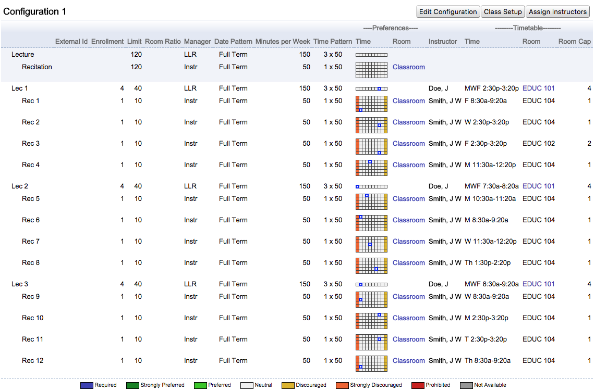{:class='screenshot'}

### Setting Managing Department and Other Class-specific Parameters


Externally managed timetables (such as Large Lectures and Computing Labs) are created and solved separately from departmental timetables. Note: The Managing Department determines who timetables the class.


 

* Select and click on the subject and course number.

* This will bring you to the **Instructional Offering Details** screen. To change the Managing Department and/or change limits on specific classes of the same instructional type (from the same scheduling subpart) click on the **Class Setup** button on the Instructional Offering Detail screen located on the right side under the Configuration line.

* This takes you to the **Multiple Class Setup** form. Make the necessary changes to the fields for the individual class.

* Click **Update**.


 


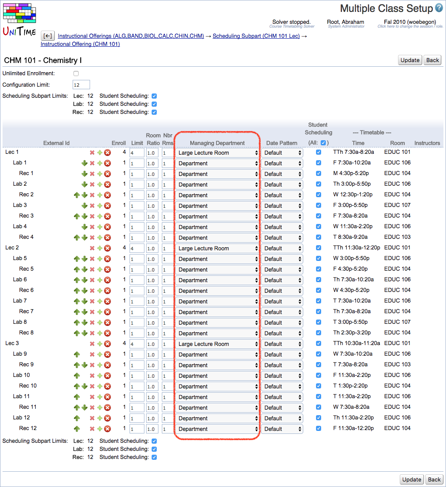{:class='screenshot'}

### Multiple Class Setup Form Fields


**Managing Department:** Used to indicate who is going to timetable the classes of this scheduling subpart (instructional type). Select from the drop down menu. The default “Department” means that the class is timetabled by the department of the subject area of the controlling course offering.


 


**Date Pattern:** Used to indicate when a class meets during the term. If other than default, select from pull-down menu.

## Assign Instructors


Banner: When a department’s solution is uncommitted, UniTime no longer sends instructors for sections that required time. Those will get picked up when a solution is committed.


 


UniTime has two methods of assigning instructors to classes.


 


**Method #1 – Assign Instructors**

* Select the row containing the subject and course number. This will take you to the **Instructional Offering Detail** form.

* From the Instructional Offering Detail screen, select the **Assign Instructors** button. 

* The Assign Instructors screen allows you to assign instructor names for each section of the course. If you wish to assign more than one instructor, you will need to click the (+) icon and an additional row will appear. If you wish to delete a row click on the (x) icon.


Banner: Remember, that for a given section your percent share needs to sum to 100%.

* Click **Update**


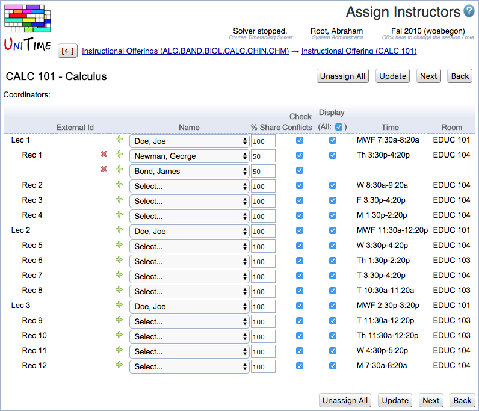{:class='screenshot'}


**Method #2 – Assign Instructors**

* Select the class/section to which you want to add an instructor.

* Within the **Class Detail** screen you may assign an instructor by selecting the **Edit Class** button.

* From the **Edit Class** form, select an instructor name from the **Instructors** drop down list. Click **Add Instructor**.

* Adjust the percent share and click **Update**.


 


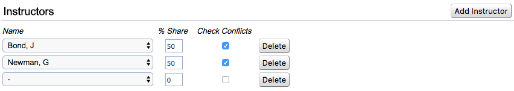{:class='screenshot'}

## Adding Notes to an Instructional Offering

### Schedule of Classes Note


If you wish to add a note that will apply to each class within the course offering, you will need to do the following:

* Select and click on the row containing the subject and course number.

* You will now be on the **Instructional Offering Detail** screen. Click **Edit Course Offering**.


 


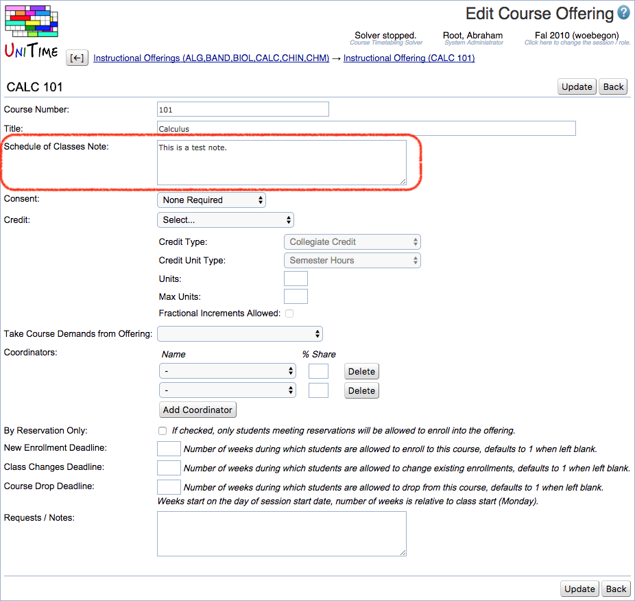{:class='screenshot'}


 


Banner: The Edit Course Offering form will allow you to type a schedule-of-classes note, which will display on every CRN associated with the course offering. The note will be represented in the Banner form SSATEXT.

### Schedule Book Notes


If you wish to add a note to a particular section(s) within an offering, you will need to do the following:

* From the **Instructional Offerings** screen, select the course offering you wish to add a note to by selecting and clicking on the row with the subject and course number.

* In order to assign a note to one of the sections you will need to select the particular section from the **Instructional Offering Detail** screen.

* This takes you to the **Class Detail** screen.

* Select the **Edit Class** button at the top of the screen. The **Edit Class** form will provide you with the opportunity to add a note to this section.

* Click **Update**.


 


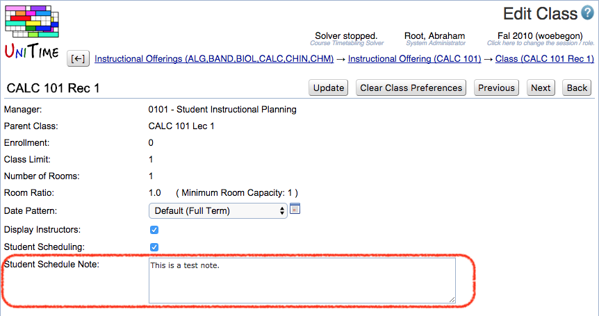{:class='screenshot'}


 


Banner: The interface will first look at the class note located within the UniTime form, Edit Class and place it in SSATEXT. Then if there is a note at the offering level, UniTime form Edit Course form, it will place a comma after the class note and append the course offering note thereafter.

## Adding Consent at the Offering Level


The user has the ability to add consent required at the offering level and at the section level.


Note: When placing a consent flag at the offering level, the consent will then apply to each class or section.


 


The following instructions illustrate this functionality:

* From the **Instructional Offerings** screen, select the course offering you wish to add consent to by clicking on the row with the subject and course number.

* Click on the**Edit Course Offering** button, and you will be directed to the **Edit Course Offering** form.

* From the **Consent** drop down list, select the type of consent you wish to place on the course (this will apply to each class associated with the offering).

* Click **Update**.


 


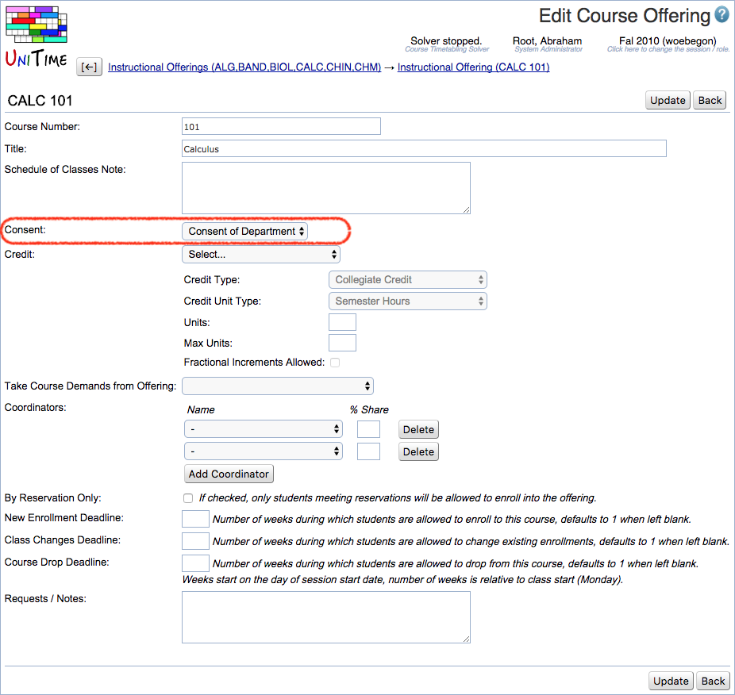{:class='screenshot'}


 


Banner: If a consent feature does not apply to each section of the offering, do NOT place the consent at the course offering level. Place the consent flag on the individual sections with the Banner Offerings form.

## Banner Message Responses


The Banner Message Responses screen allows you to search for instructional offerings that contain errors when interfacing with Banner. These offerings were not pushed to Banner.


 


You may use the filter to search by subject area, course number, CRN, Action Type, Message, Cross-List ID, Start Date, Stop Date, Manager, or Department to retrieve up to 1,000 messages. The results may be viewed in either in PDF or CSV formats. All errors must be corrected within UniTime or Banner and the offering must be pushed to Banner again.


 


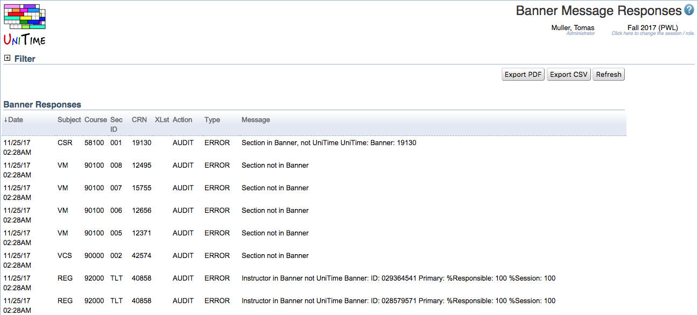{:class='screenshot'}


 


In order to push these instructional changes to Banner, you must use the **Banner Offerings** screen. Select the instructional offering you wish to resend.

* You will be redirected to the **Banner Offering Detail** screen. From this screen, you will need to click the **Resend to Banner** button.


 

## Banner Offerings


The **Banner Offering** form provides the functionality to resend classes that did not import correctly, once corrected within the application.


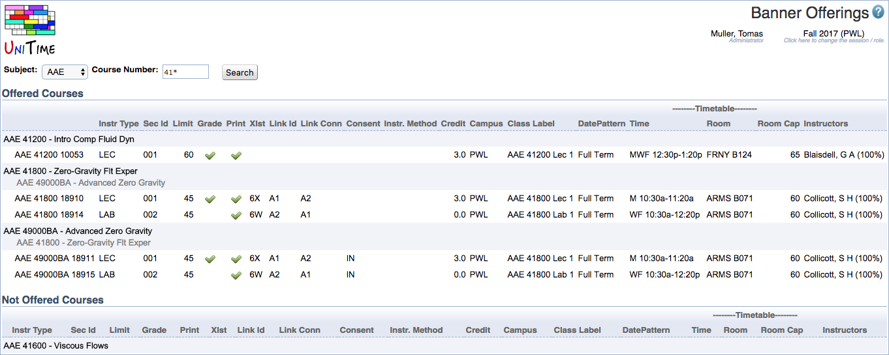{:class='screenshot'}


 


 


It also provides the user the opportunity to modify section ids, change the gradable subpart and change consent at the section level.


 


Note: These types of changes do NOT require the user to click the resend button.


 


Use Courses > Banner > Banner Offerings menu.


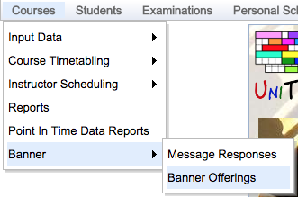{:class='screenshot'}

* You can enter a particular subject and course, or just a particular subject.

* Click on the blue row containing the subject and course number on which you wish to work


 


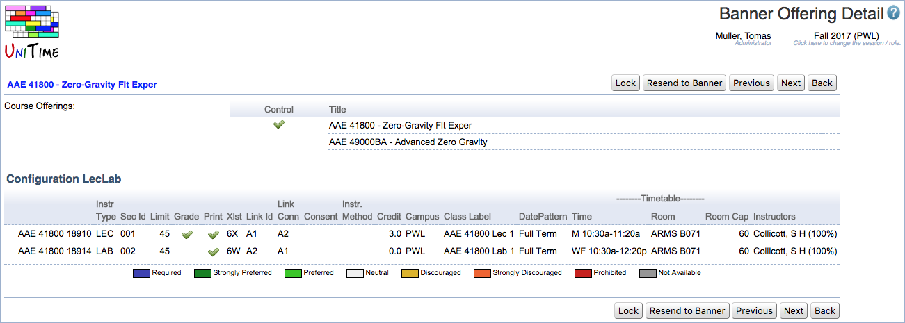{:class='screenshot'}


 

* Click **Edit** button.


 


Note: If you do NOT see the Edit button, scroll to the right or use your control button and your mouse wheel to make the screen smaller. You may also need to  **Lock** the offering first when the online student scheduling is enabled.


 


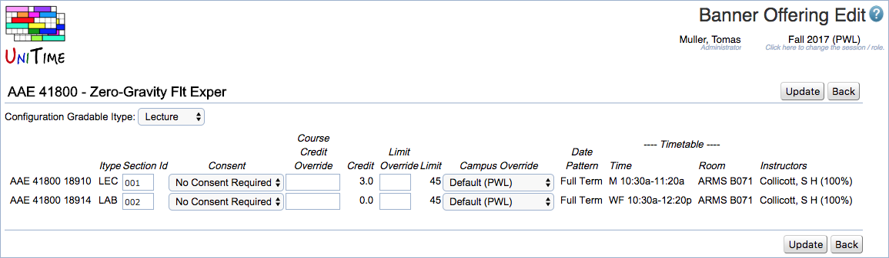{:class='screenshot'}


 


This screen allows you to change the consent on an individual section and change your section ids (system generated).


 


Note: Make sure to use three characters for your section id.


 


If you wish to change the gradable subpart select the drop down box located next to Configuration Gradable Itype and choose the desired Itype.


 


Note: By changing the gradable subpart, the Banner form SSASECT will be updated to reflect the gradable subpart, populate the approved course credit hours/billing hours and check the appropriate Banner box labeled gradable. The non-gradable subpart will have zero credit/billing hours and will be flagged as non-gradable.


 


 

# Preferences for a Scheduling Subpart


To set preferences for the whole scheduling subpart (i.e., LEC), that is, for all classes in that scheduling subpart, click on the line with the name of the subpart in the **Instructional Offering Detail** screen.


 


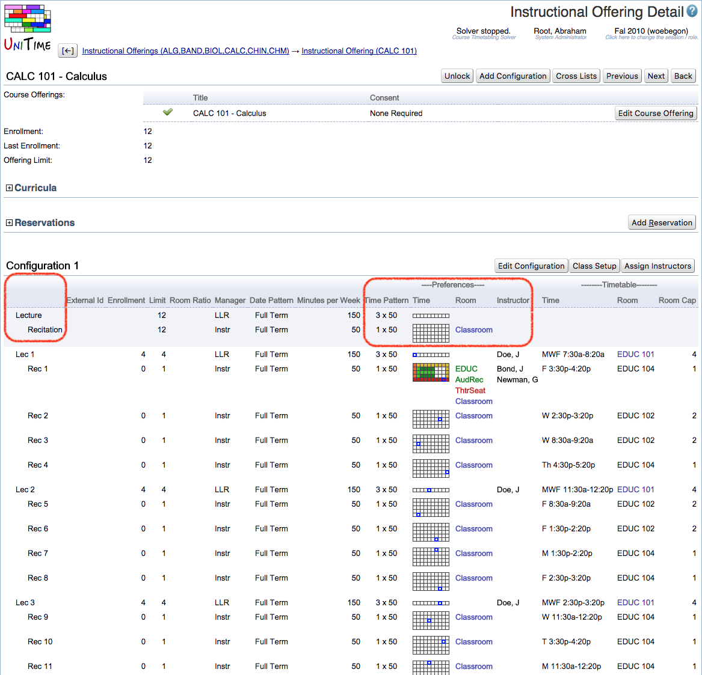{:class='screenshot'}


 


Note: Individual class preferences may be set using the **Edit Class** screen. See Preferences for an Individual Class.


 


Now you are on the **Scheduling Subpart Detail** screen. On this screen, you see information about the subpart. Click **Edit Subpart**.


 


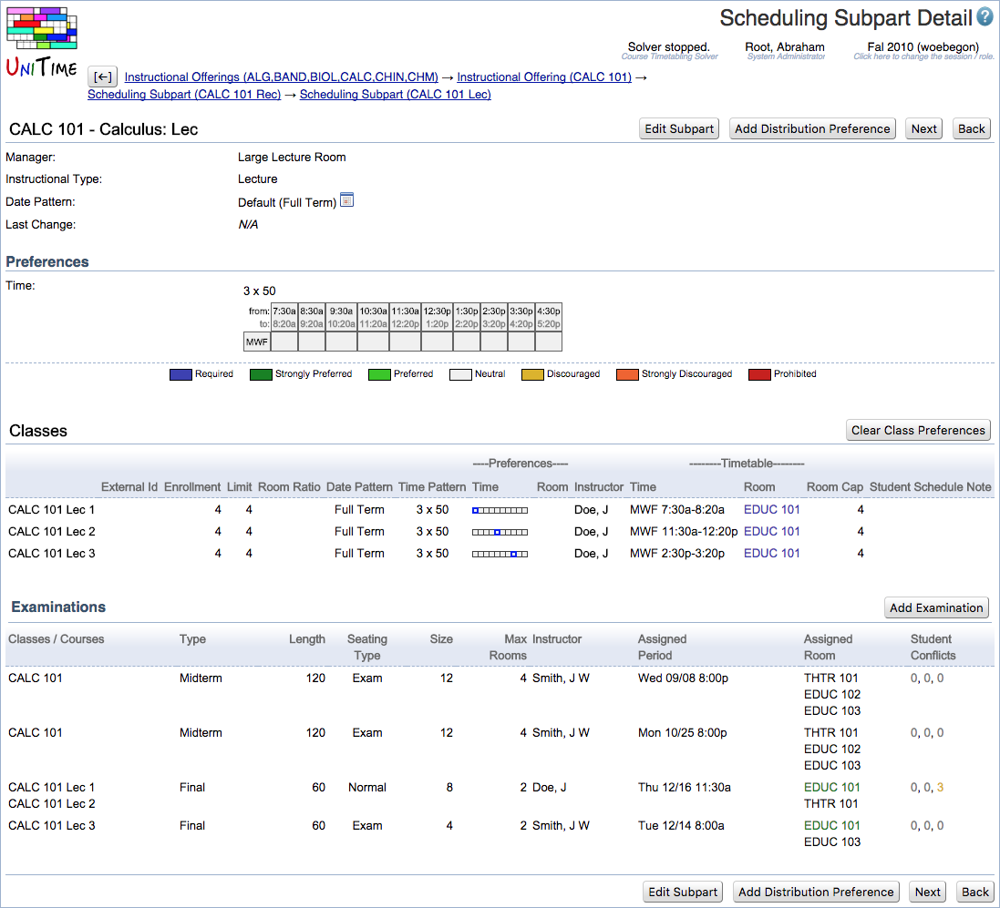{:class='screenshot'}


 


That takes you to the **Edit Scheduling Subpart** form. Here you can set preferences that will apply to all classes in that subpart.


 


 

### Time Preferences


It is essential that you select the appropriate time pattern from the drop down menu and click “**Add Time Preference**.” You will see an error message if no time pattern is selected (i.e., “Time pattern not selected”). The options you can see reflect the Minutes per Week that you setup in the configuration. If you have the correct number of minutes per week but cannot see the time pattern that you need, please contact the administrator (e.g., by using the Contact Us screen).


 


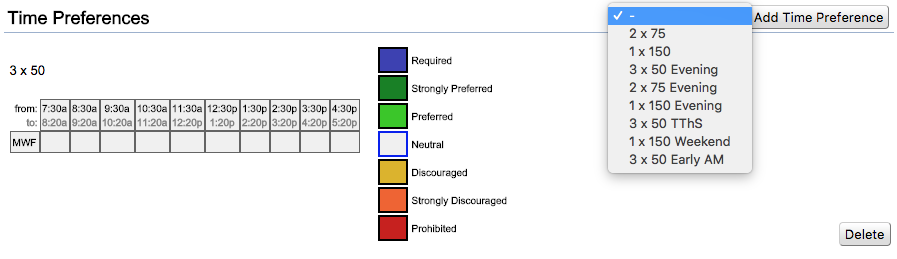{:class='screenshot'}


 


After you click “**Add Time Preference**”, a time grid appears where you can mark your time slot according to your preferences. For example, if you prefer the class to be MWF morning, you click on Strongly Preferred, and then click on the time slots corresponding to MWF morning.

### Room Group Preferences


The default room group for departmental classes is Classroom, but you can change that to any room group you have created, or just delete the default room group.

### Room Preferences


In the first column use the drop down menu to choose the room you prefer (note: the list will show the manager with whom you are working). In the second column, you must select a preference. You can add more than two rooms by clicking on **Add Room Preference** for each additional room you want to add.


 


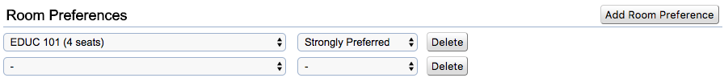{:class='screenshot'}


 


Note: If you had a room preference for a room that you had previously (e.g., during the last like semester), but you don’t get it this semester, this preference is not rolled forward.

### Building Preferences


Similar to Room Preferences, except only buildings are listed.

### Room Feature Preferences


With this drop down menu you have the capability to request rooms with specific equipment (e.g., audio recording in the lecture rooms or Mac computers in the computing lab).


 


When you finish with preferences, click **Update** at the top or bottom of this page to save all of your preferences for the scheduling subpart. This takes you back to the **Scheduling Subpart Detail** screen. This screen will allow you to verify your changes.

# Preferences for an Individual Class


To set up preferences on an individual class, click on the class you wish to adjust from the **Instructional Offering Detail** screen. This takes you to the **Class Detail** screen.


 


Click **Edit Class** to go to the **Edit Class** form. There are several more preferences you can set on a class than on a subpart. This is where you will set the instructor’s name, notes for the manager, and any other individual choices for the class. This screen works just like the subpart screens listed above (e.g., Time, Room, Building, and Room Feature Preferences).

### Add Instructors


To add Instructors, click **Add Instructor**. This will give you the ability to choose additional instructors from a drop down list of available instructors setup previously (see Instructors).

### Add Notes to Schedule Manager


Include Notes to Schedule Manager for externally managed classes by entering anything that you cannot express by preferences that you see in this screen.


 


For your departmental classes, these notes will be notes to yourself. Click **Update**.


 


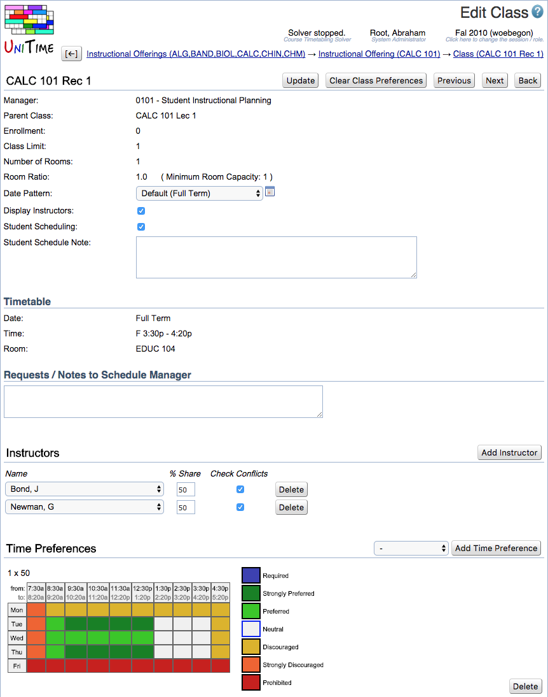{:class='screenshot'}
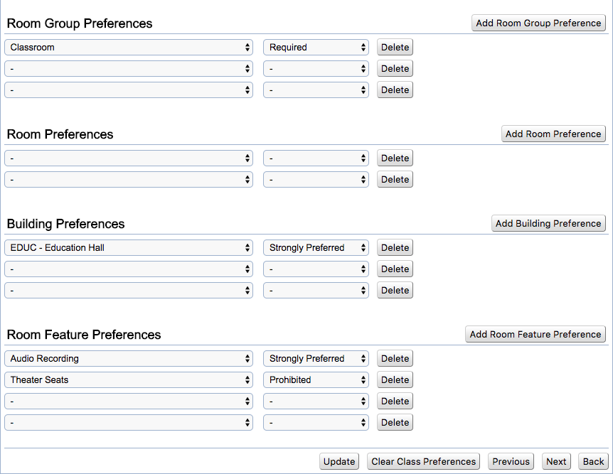{:class='screenshot'}

# Cross-listed Courses


Any courses that meet together need to be set up as a cross-listed offering. This insures student course information will reflect the total demand as well as insure the same time(s) and location(s) are assigned for all courses in the cross list.


 


The following instructions will help you set up cross listing of courses for your department(s):

* In the **Instructional Offering Detail** screen, click on **Cross Lists.** This takes you to the **Instructional Offering Cross Lists** screen.

* On the **Instructional Offering Cross Lists** form, click on the course offering drop-down menu.

* Select the other course that you want to cross list from the drop down menu, click **Add**. Only courses that are not offered are listed. If the course is not there, it needs to be added, either by the department you are cross-listing with, or by an administrator.

* After selecting/adding a Course Offering you can see that one of the courses is the controlling course. You may choose which of these you prefer to be the controlling course by clicking on the controlling button for that course. The two courses will now be treated as one instructional offering and both courses will be listed under the controlling course. The noncontrolling course will now appear in light gray directly under the controlling course on the **Instructional Offering Detail** screen.

* When finished click **Update** and this takes you back to the**Instructional Offering Detail** screen.


 


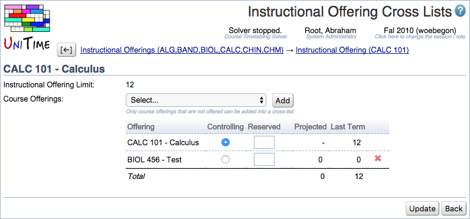{:class='screenshot'}


 


Banner: There are three basic types of cross lists in UniTime that flow to Banner.

### Banner Type 1

* Cross lists that are identical in nature, meaning same time, room, limit and dates will be set as cross list in UniTime. This means that if the overall course offering limits is 12, then each course will be set to a limit of 12 in UniTime. Regardless of which course a student enrolls in the overall enrollment for both courses must not exceed 12. 

* These fields will interface with the maximum fields in SSAXLST within Banner


 


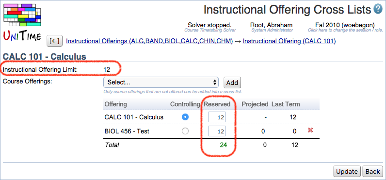{:class='screenshot'}

### Banner Type 2

* Cross lists where each course in the cross list is identical but limits need to be enforced individually. To enforce this limit constraint, we will have to use the consent feature. Although UniTime will appear as if you can designate the limit, during the conversion it will not enforce these limits and will populate Banner with 12 and 12.

* You will have to place the consent on this section in order to be able to enforce the limit. To do this, you would go to the **Banner Offering Edit** form and place consent on the class that needs limit enforced.


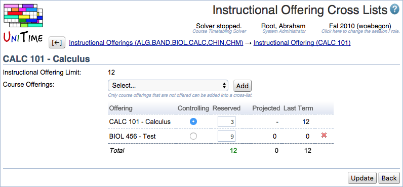{:class='screenshot'}


Note: In the example above, the limits of 3 and 9 will not be enforced.

### Banner Type 3

* Only certain sections of an offering are meeting with another section of a different instructional offering.


Not all sections are cross listed. In this case we would create separate offerings and use the “**Meets Together**” constraint.

# Add Distribution Preferences


To have your classes distributed a certain way throughout the week (e.g., back-to-back or same time/same room), select Courses > Input Data > Distribution Preferences in th menu. This takes you to the **Distribution Preferences** form.


 


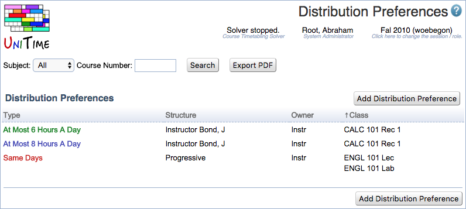{:class='screenshot'}


 


To add a new distribution preference

* Click on **Add Distribution Preference**

* Select the Distribution Type from the drop down menu. When you select one, a description will appear under the drop down box. A detailed description for each distribution type is also available in the glossary.

* Select the Structure from the drop down menu. After you select the structure, a description of the structure will appear under the drop down box. A detailed description of each type of structure is also available in the glossary.

* Select the Preference Level.


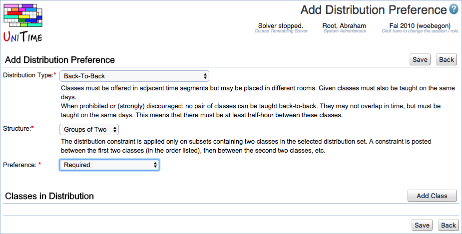{:class='screenshot'}

* Click Add Class to add the first classes to this distribution preference.

	* Select the subject area in the first column,

	* Select the course number in the second column,

	* Select the scheduling subpart in the third column,

	* Select whether you want to include all classes from that scheduling subpart or only a particular class (that is done in the last column).

* Repeat steps above until you have all the classes you need in this Distribution Preference.

* Click **Save**.


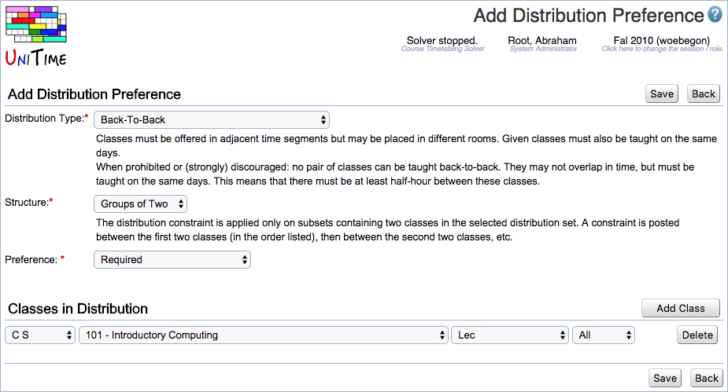{:class='screenshot'}

## Edit an Existing Distribution Preference

* To edit an existing distribution preference, click on the distribution preference line you want to edit in the list of distribution preferences and edit it.

* Make your changes and click Update.


# Tips and Tricks

* To print out your list of classes with preferences, use the Export PDF button available in the Classes or Instructional Offerings screen.

* There are shortcut keys in most screens – just roll your mouse over a button or link and you will see what the shortcut keys for that action are. A list of basic ones:

	* Update: Alt +U

	* Back: Alt +B

	* Next: Alt +N

	* Previous: Alt +P

	* Edit Subpart (in Subpart Detail screen): Alt +E

* Click on day of the week in a time grid to put preference in for all day.

* After selecting in a drop down menu click outside of drop down to insure mouse wheel does not change selection.


 


Comments about Edit Class

* For the departmental classes (those timetabled by you, not by an external manager), the Notes to Schedule Manager go to you, the departmental timetabler.

* Instructor preferences are applied to class when you are adding a new instructor and select “OK” as the answer to “Do you want to inherit preferences?” If you later update the preferences of this instructor, the preferences on your departmental class will also be updated (unless you put some particular preferences on the class itself – in that case, the class preferences have the top priority and cannot be overwritten by instructor’s preferences).


 


Order of priority in the instructor preferences and/or the room preferences:

* Class

* Instructor

* Scheduling Subpart


 


# Glossary

## Distribution Types

| Back-To-Back Day | Classes must be offered on adjacent days and may be placed in different rooms. When prohibited or (strongly) discouraged: classes cannot be taught on adjacent days. They also cannot be taught on the same days. This means that there must be at least one day between these classes. |
| Minimize Use Of 1h Groups | Minimize number of groups of time that are used by the given classes. The time is spread into the following 10 groups of one hour: 7:30a-8:30a, 8:30a-9:30a, 9:30a-10:30a, 4:30p-5:30p. |
| Minimize Use Of 2h Groups | Minimize number of groups of time that are used by the given classes. The time is spread into the following 5 groups of two hours: 7:30a-9:30a, 9:30a-11:30a, 11:30a-1:30p, 1:30p-3:30p, 3:30p-5:30p. |
| Minimize Use Of 3h Groups | Minimize number of groups of time that are used by the given classes. The time is spread into the following 3 groups: 7:30a- 10:30a, 10:30a-2:30p, 2:30p-5:30p. |
| Minimize Use Of 5h Groups | Minimize number of groups of time that are used by the given classes. The time is spread into the following 2 groups: 7:30a-12:30a, 12:30a-5:30p. |
| Same Students | Given classes are treated as they are attended by the same students, i.e., they cannot overlap in time and if they are back-to-back the assigned rooms cannot be too far (student limit is used). |
| Same Instructor |  Given classes are treated as they are taught by the same instructor, i.e., they cannot overlap in time and if they are back-to-back the assigned rooms cannot be too far (instructor limit isused). If the constraint is required and the classes are back-to-back, discouraged and strongly discouraged distances between assigned rooms are also considered. |
| Can Share Room | Given classes can share the room (use the room in the same time) if the room is big enough. |
| Spread In Time | Given classes have to be spread in time (overlapping of the classes in time needs to be minimized). |
| Minimize Number Of Rooms Used | Minimize number of rooms used by the given set of classes. |
| Precedence | Given classes have to be taught in the given order (the first meeting of the first class has to end before the first meeting of the second class etc.). When prohibited or (strongly) discouraged:classes have to be taught in the order reverse to the given one. |
| Back-To-Back | Classes must be offered in adjacent time segments but may be placed in different rooms. Given classes must also be taught on the same days. When prohibited or (strongly) discouraged: no pair of classes can be taught back-to-back. They may not overlap in time, but must be taught on the same days. This means that there must be at least half-hour between these classes. |
| Back-To-Back & Same Room | Classes must be offered in adjacent time segments and must be placed in the same room. Given classes must also be taught on the same days. When prohibited or (strongly) discouraged: classes cannot be back-to-back. There must be at least half-hour between theseclasses, and they must be taught on the same days and in the same room. |
| Same Time | Given classes must be taught at the same time of day (independent of the actual day the classes meet). For the classes of the same length, this is the same constraint as same start. Forclasses of different length, the shorter one cannot start before, nor end after, the longer one. When prohibited or (strongly) discouraged: one class may not meet on any day at a time of daythat overlaps with that of the other. For example, one class cannot meet M 7:30 while the other meets F 7:30. Note the difference here from the different time constraint that only prohibits the actual class meetings from overlapping. |
| Same Days | Given classes must be taught on the same days. In case of classes of different time patterns, a class with fewer meetings must meet on a subset of the days used by the class with more meetings. For example, if one class pattern is 3x50, all others given in the constraint can only be taught on Monday, Wednesday, or Friday. For a 2x100 class MW, MF, WF is allowed but TTh is prohibited. When prohibited or (strongly) discouraged: any pair of classes cannot be taught on the same days (cannot overlap in days). For instance, if one class is MFW, the second has to be TTh. |
| 1 Hour Between | Given classes must have exactly 1 hour in between the end of one and the beginning of another. As with the back-to-back time constraint, given classes must be taught on the same days. When prohibited or (strongly) discouraged: classes cannot have 1 hour inbetween. They may not overlap in time but must be taught on the same days. |
| 2 Hours Between | Given classes must have exactly 2 hours in between the end of one and the beginning of the next class. As with the back-to-back time constraint, given classes must be taught on the same days. When prohibited or (strongly) discouraged: classes cannot have 2 hours in between. They may not overlap in time but must be taught on the same days. |
| 3 Hours Between | Given classes must have exactly 3 hours in between the end of one and the beginning of the next class. As with the back-to-back time constraint, given classes must be taught on the same days. When prohibited or (strongly) discouraged: classes cannot have 3 hours in between. They may not overlap in time but must be taught on the same days. |
| 4 Hours Between | Given classes must have exactly 4 hours in between the end of one and the beginning of the next class. As with the back-to-back time constraint, given classes must be taught on the same days. When prohibited or (strongly) discouraged: classes cannot have 4 hours in between. They may not overlap in time but must be taught on the same days. |
| 5 Hours Between | Given classes must have exactly 5 hours in between the end of one and the beginning of the next class. As with the back-to-back time constraint, given classes must be taught on the same days. When prohibited or (strongly) discouraged: classes cannot have 5 hours in between. They may not overlap in time but must be taught on the same days. |
| 6 Hours Between | Given classes must have exactly 6 hours in between the end of one and the beginning of the next class. As with the back-to-back time constraint, given classes must be taught on the same days. When prohibited or (strongly) discouraged: classes cannot have 6 hours in between. They may not overlap in time but must be taught on the same days. |
| 7 Hours Between | Given classes must have exactly 7 hours in between the end of one and the beginning of the next class. As with the back-to-back time constraint, given classes must be taught on the same days. When prohibited or (strongly) discouraged: classes cannot have 7 hours in between. They may not overlap in time but must be taught on the same days. |
| 8 Hours Between | Given classes must have exactly 8 hours in between the end of one and the beginning of the next class. As with the back-to-back time constraint, given classes must be taught on the same days. When prohibited or (strongly) discouraged: classes cannot have 8 hours in between. They may not overlap in time but must be taught on the same days. |
| Different Time | Given classes cannot overlap in time. They may be taught at the same time of day if they are on different days. For instance, MF 7:30 is compatible with TTh 7:30. When prohibited or (strongly) discouraged: every pair of classes in the constraint must overlap in time. |
| 90 Minutes Between | Given classes must have exactly 90 minutes in between the end of one and the beginning of the next class. As with the back-to-back time constraint, given classes must be taught on the same days. When prohibited or (strongly) discouraged: classes cannot have 90 minutes in between. They may not overlap in time but must be taught on the same days. |
| 4.5 Hours Between | Given classes must have exactly 4.5 hours in between the end of one and the beginning of the next class. As with the back-to-back time constraint, given classes must be taught on the same days. When prohibited or (strongly) discouraged: classes cannot have 4.5 hours in between. They may not overlap in time but must be taught on the same days. |
| Same Room | iven classes must be taught in the same room. When prohibited or (strongly) discouraged: any pair of classes in the constraint cannot be taught in the same room. |
| At Least 1 Hour Between |  Given classes have to have 1 hour or more in between class. When prohibited or (strongly) discouraged: given classes have to have less than 1 hour in between. |
| Same Start Time | Given classes must start during the same half-hour period of a day (independent of the actual day the classes meet). For instance, MW 7:30 is compatible with TTh 7:30 but not with MWF 8:00. When prohibited or (strongly) discouraged: any pair of classes in the given constraint cannot start during the same half-hour period of any day of the week. |
| Less Than 6 Hours Between | Given classes must have less than 6 hours from end of first class to the beginning of the next class. Given classes must also be taught on the same days. When prohibited or (strongly) discouraged: given classes must have 6 or more hours between. This constraint does not carry over from classes taught at the end of one day to the beginning of the next. |
| Meet Together |  Given classes are meeting together (same as if the given classes require constraints Can Share Room, Same Room, Same Time and Same Days all together). |
| More Than 1 Day Between | Given classes must have two or more days in between. When prohibited or (strongly) discouraged: given classes must be offered on adjacent days or with at most one day in between. |
| Children Cannot Overlap | If parent classes do not overlap in time, children classes can not overlap in time as well. Note: This constraint only needs to be put on the parent classes. Preferred configurations are Required All Classes or Pairwise (Strongly) Preferred. |
| Next Day | The second class has to be placed on the following day of the first class (if the first class is on Friday, second class have to be on Monday). When prohibited or (strongly) discouraged: The second class has to be placed on the previous day of the first class (if the first class is on Monday, second class have to be on Friday). Note: This constraint works only between pairs of classes. |
| Two Days After | The second class has to be placed two days after the first class (Monday > Wednesday, Tuesday → Thursday, Wednesday → Friday, Thursday → Monday, Friday → Tuesday). When prohibited or (strongly) discouraged: The second class has to be placed two days before the first class (Monday → Thursday, Tuesday → Friday, Wednesday → Monday, Thursday → Tuesday, Friday → Wednesday). Note: This constraint works only between pairs of classes. |
| At Most 6 Hours A Day | Classes are to be placed in a way that there is no more than six hours in any day. |
| At Most 7 Hours A Day | Classes are to be placed in a way that there is no more than seven hours in any day. |
| At Most 8 Hours A Day | Classes are to be placed in a way that there is no more than eight hours in any day. |
| Linked Classes | Classes (of different courses) are to be attended by the same students. For instance, if class A1 (of a course A) and class B1 (of a course B) are linked, a student requesting both courses must attend A1 if and only if he also attends B1. This is a student sectioning constraint that is interpreted as Same Students constraint during course timetabling. |
| At Most 5 Hours A Day | Classes are to be placed in a way that there is no more than five hours in any day. |
| Back-To-Back Precedence | Given classes have to be taught in the given order, on the same days, and in adjacent time segments. When prohibited or (strongly) discouraged: Given classes have to be taught in the given order, on the same days, but cannot be back-to-back. |
| Same Days-Time | Given classes must be taught at the same time of day and on the same days. This constraint combines Same Days and Same Time distribution preferences. When prohibited or (strongly) discouraged: Any pair of classes classes cannot be taught on the same days during the same time. |
| Same Days-Room-Time | Given classes must be taught at the same time of day, on the same days and in the same room. Note that this constraint is the same as Meet Together constraint, except it does not allow for room sharing. In other words, it is only useful when these classes are taught during non-overlapping date patterns. When prohibited or (strongly) discouraged: Any pair of classes classes cannot be taught on the same days during the same time in the same room. |
| Same Weeks | Given classes must be taught during the same weeks (i.e., must have the same date pattern). When prohibited or (strongly) discouraged: any two classes must have non overlapping date patterns. |
| Ignore Student Conflicts | All student conflicts between the given classes are to be ignored. |
 


 


The following distribution types do not exist in UniTime by default, but they can be registered by one of the scripts available at [GitHub://UniTime/Documentation/Scripts](https://github.com/UniTime/unitime/tree/master/Documentation/Scripts).


 
| N Hour Work Day | Classes are to be placed in a way that there is no more than N hours between the start of the first class and the end of the last class on any day.N can be 6, 7, 8, 9, 10, 11, or 12 |
| Max X Days | Classes must / should be placed in no more than X week-days.X can be 2, 3, 4, 5, or 6 |
| No Break | There should be no break between classes during the day. Two consecutive classes are considered in the same block if the time between them is not greater than M minutes. |
| At Most 1 Break | There should be no more than one break between classes during the day. Two consecutive classes are considered in the same block if the time between them is not greater than M minutes. |
| At Most B Breaks | There should be no more than B breaks between classes during the day. Two consecutive classes are considered in the same block if the time between them is not greater than M minutes. |
| Max M Min Blocks | There needs to be a break of more than B minutes after each block of at most M minutes. Two consecutive classes are considered in the same block if the time between them is not more than B minutes. |
| Minimize Free Time On A Day | There should be less than M minutes of free time between the first and the last class during any day. |
 


 

## Distribution Structure Definitions

### All Classes


The constraint will apply to all classes in the selected distribution set. For example, a Back-to-Back constraint among three classes seeks to place all three classes sequentially in time such that there are no intervening class times (transition time between classes is taken into account, e.g., if the first class ends at 8:20, the second has to start at 8:30).

### Progressive


The distribution constraint is created between classes in one scheduling subpart and the appropriate class(es) in one or more other subparts. This structure links child and parent classes together if subparts have been grouped. Otherwise the first class in one subpart is linked to the first class in the second subpart, etc. For example, if there is a distribution constraint between subpart S1 (having classes A1, A2) and subpart S2 (having classes B1, B2, B3, B4), individual class constraints will be created as follows:


 


If S1 is the parent of S2 (e.g., recitations B1 and B2 belong to lecture A1, and recitations B3 and B4 belong to lecture A2):

```
Constraint posted between classes A1 and B1
Constraint posted between classes A1 and B2
Constraint posted between classes A2 and B3
Constraint posted between classes A2 and B4
```

 


If there is no parent/child relation between subparts S1 and S2 (e.g., they are from different offerings or the scheduling subparts are on the same level):

```
Constraint posted between classes A1 and B1
Constraint posted between classes A2 and B2
Constraint posted between classes A1 and B3
Constraint posted between classes A2 and B4
```

### Groups of Two


The distribution constraint is applied only on subsets containing two classes in the selected distribution set. A constraint is posted between the first two classes (in the order listed), then between the second two classes, etc.

### Groups of Three


The distribution constraint is applied only on subsets containing three classes in the selected distribution set. A constraint is posted between the first three classes (in the order listed), then between the second three classes, etc.

### Groups of Four


The distribution constraint is applied only on subsets containing four classes in the selected distribution set. A constraint is posted between the first four classes (in the order listed), then between the second four classes, etc.

### Groups of Five


The distribution constraint is applied only on subsets containing five classes in the selected distribution set. A constraint is posted between the first five classes (in the order listed), then between the second five classes, etc.

### Pairwise


The distribution constraint is created between every pair of classes in the selected distribution set. Therefore, if n classes are in the set, n(n-1)/2 constraints will be posted among the classes. This structure should not be used with ***required*** or ***prohibited*** preferences on sets containing more than a few classes.


 


 
