### Table of Contents
{:.no_toc}
* table
{:toc}

# Introduction

The timetabling application has been designed as a tool to assist schedule managers build class timetables that best meet student course demand while working within the limitations of room availability and instructor time constraints. It is intended to help you take all of the important restrictions on location and time placement into account as you create the class timetable for a semester. It is also able to test multiple possible solutions far more quickly than can be done manually.

The solver described in this manual is the core of the timetabling application. Based on the course structure data and instructional requirements input for all of the classes you wish to offer, it determines possible time and room assignments and then evaluates how well preferences are met for each possible placement. Depending on your needs, the solver can either create a completely new timetable from the input data you enter, modify an established timetable, or help create a hybrid somewhere in between.

There are three basic steps involved in using the solver. The first is to **Load** all of the data you have entered about your classes, rooms, and preferences into the solver's memory. This data normally resides in a database. During the load process, checks are performed for inconsistencies in the input data or missing data on classes that is required by the solver. The second step is running the solver in the **Check** configuration. Here the solver ignores any preferences entered (i.e., strongly discouraged to strongly preferred) and only checks if it is possible to find a solution that meets all of the problem requirements (e.g., classes taught by a single instructor do not overlap, more classes required at a single time than possible). The final step is to **Optimize** the solution. During this phase the solver considers all preferences and goes through many iterations to maximize the degree to which they are met.

After a solution is found, it is also possible to modify the time and room assignments of individual classes using the solver in an interactive mode. This allows you to make any adjustments you may feel are necessary. The intent is for you to remain in control of your final timetable.

# Check List

1. Load Input Data
    - ▢ A) Set solver configuration to “Check.” Click “Load”.
    - ▢ B) Upon “Awaiting commands…” refresh screen.
    - ▢ C) Review any warning messages to make sure that input data is consistent and all classes you wish to timetable are successfully loaded into solver.
    - ▢ D) Review any warning messages to make sure that input data is consistent and all classes you wish to timetable are successfully loaded into solver.
    - ▢ E) Follow links to classes and make any necessary changes to input data.
    - ▢ F) Unload.
2. Check for Complete Feasible Solution
    - ▢ A) If no unacceptable warnings, set solver configuration to “Check.” Start solver.
	- ▢ B) Upon “Awaiting commands…” refresh screen. Check percentage of variables assigned.
	- ▢ C) If less than 100% of variables assigned, look at list of non-assigned classes. Select class of interest and check conflict statistics on Suggestions page.
	- ▢ D) Make any necessary changes to input data and unload.
3. Optimize Timetable
	- ▢ A) Set solver configuration to “Default.” Load corrected input data.
	- ▢ B) Upon “Awaiting commands…” refresh screen. Check for any problems. If no problems, start solver.
	- ▢ C) Allow solver to run to 30-minute timeout. (If you choose to stop early, click on “Student Sectioning” and refresh again.)
4. Review Solution Properties, Summary Reports, and Timetables
	- ▢ A) Look over solution properties on Course Timetabling Solver screen.
	- ▢ B) For more details consult “Reports” section of sidebar menu.
	- ▢ C) View “Timetable” on sidebar menu to see time grids.
	- ▢ D) Any necessary changes to timetable (except breaking hard constraints) can be made by selecting a class and choosing an alternate assignment from the Suggestions pop-up screen. Changes are not made until the “Assign” button is clicked.
5. Save the Timetable
	- ▢ A) On Solver screen, save current solution to best if any changes have been made (click on “Save to Best” button). Save best timetable by selecting “Save as New.” Alternatively solution can be saved using the “Save as New” button on the Timetables screen.
	- ▢ B) Later changes (including breaking hard constraints) can be made to a saved timetable by loading the saved timetable into the Interactive Solver from the Timetables screen.
6. Commit Timetable

# 1. Check input data consistency

(“Check” configuration of the solver)

To use the solver, start by clicking on Courses > Course Timetabling > Solver in the menu.

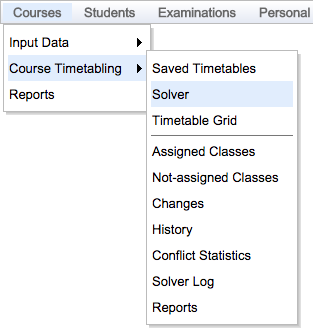{:class='screenshot'}

* Set the solver configuration to “Check,” leave other parameters as they are.

* Click Load. 

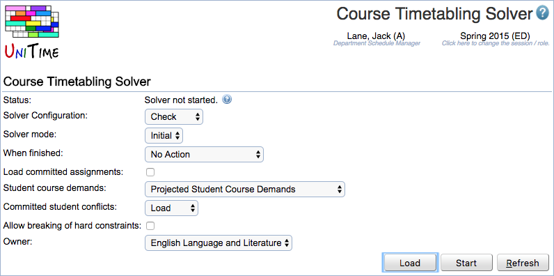{:class='screenshot'}

* The status of operations being performed by the solver can be seen at the top of the page, just below the name of the screen. When the solver is started, the Solver Status will automatically be displayed. The status is updated every few seconds. More details are visible in a mouse-over tooltip (when the mouse hovers over the status).

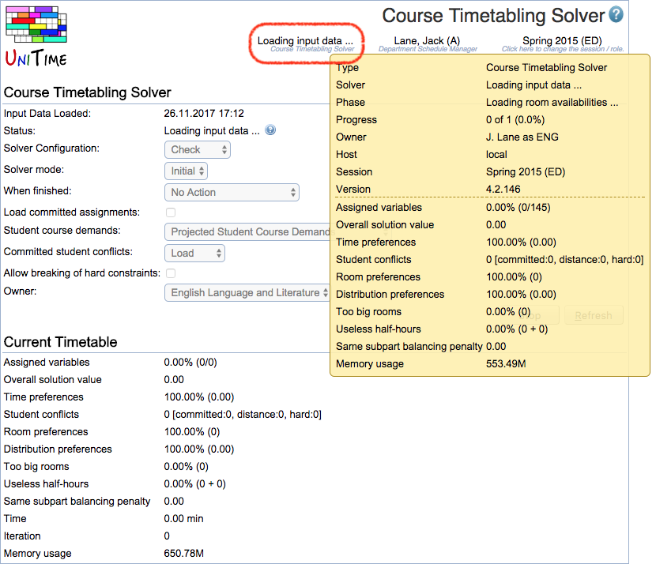{:class='screenshot'}

* When the solver status is “Awaiting commands…,” click Refresh on the Course Timetabling Solver screen. 

* Scroll down on the Course Timetabling Solver screen to the last section. If there have been any problems loading class data, a list of warnings will be displayed. For detailed warning descriptions see Appendix A.

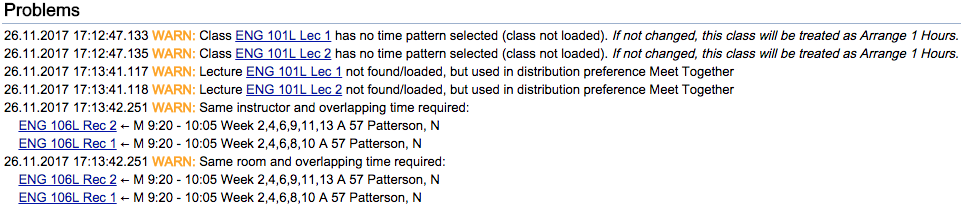{:class='screenshot'}

* Make any necessary changes to the input data to address problems described in the warning messages -- such as a class with no time pattern selected. Clicking on the underlined class will take you to the Class Detail screen where you can fix these problems. You can return to the Course Timetabling Solver screen by clicking on Courses > Course Timetabling > Solver in the menu or by clicking on the Solver Status that is visible just below the page name.

* When all problems have been corrected, you should return to the top of the Course Timetabling Solver screen and click on the Unload button. This unloads the previous input data (that you have just changed using the Class Detail or other screens).

* Repeat the steps above until all unacceptable warnings are resolved. Note - these warnings are described in Appendix A. **If a warning message says class not loaded this class will not be in your timetable.** 

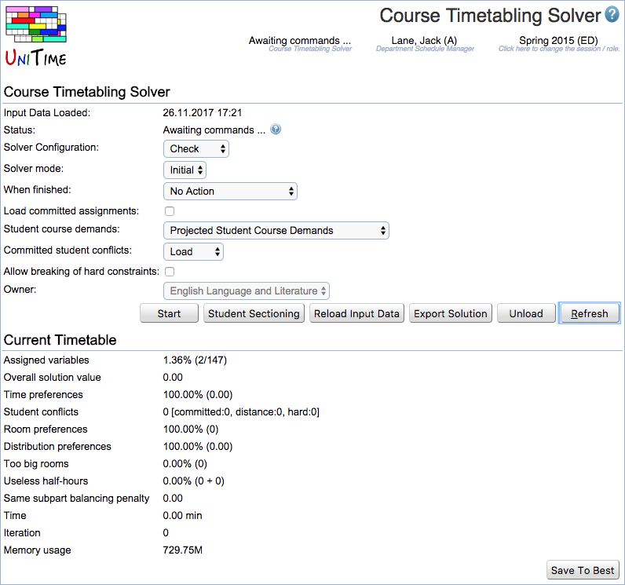{:class='screenshot'}

# 2. Search for a complete timetable 

Once checking for data consistency is complete and all warnings or errors are addressed, you can be sure that all classes will be included when you load data into the solver. Remember, if this is not the case and you ignored a warning, the solver may not load this class and a time and room will not be found for this class. See appendix A for more details.

In this phase we are looking for a complete feasible solution to the problem but that does not yet consider any preferences. This means that the solver ignores any preferences entered (i.e., strongly discouraged to strongly preferred) and only checks if it is possible to find a solution that meets all of the problem requirements (e.g., classes taught by a single instructor do not overlap, more classes required at a single time than possible).

* Set the solver configuration to “Check,” leave other parameters as they are.

* Click Load

* When the solver status is “Awaiting commands…,” click Refresh on the Course Timetabling Solver screen. 

* If no unacceptable warnings appear, click Start. 

* Check the Solver Status on the top of the page, just below the page name. If it says “Awaiting commands…” within a few minutes of runtime, click the Refresh button on the Course Timetabling Solver screen. Look at the line labeled Assigned Variables.

    * If it says 100%, it means that a complete but not yet optimized timetable has been found. You can then Unload and proceed with creating an optimized timetable (section 3 of this manual).

    * If it is not at 100%, see below. 

If you do wish to stop the solver while the Solver Status still displays “Searching for initial solution...,” click Stop in the Course Timetabling Solver screen.

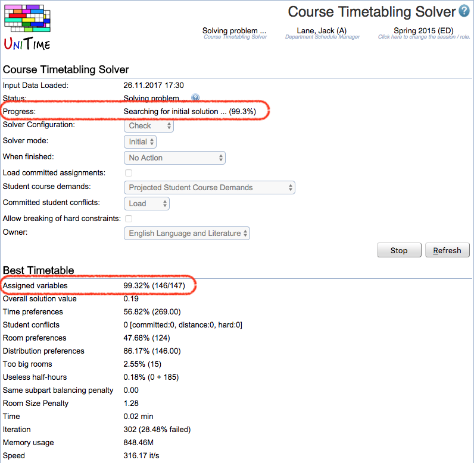{:class='screenshot'}

If the solver is not able to find a complete solution (assigned variables is below 100%), there is likely to be some problem with the input data preventing a solution from being found. The following steps will help determine what the problem is.

* Click on Courses > Course Timetabling > Not-assigned Classes in the menu

* In the **Not-Assigned Classes** screen that shows up there is a list of classes for which the solver could not find a room and time.

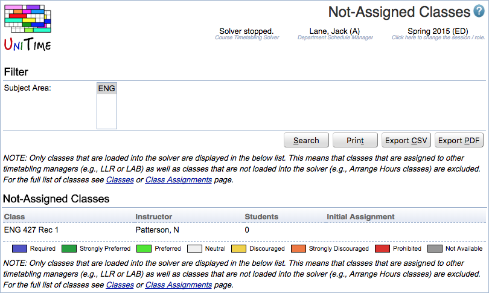{:class='screenshot'}

There could be many reasons for that. The most straightforward way to search for the reason is to;

* Click on a class from the list. The **Suggestions** screen will open in a new window. 

* Scroll down to the last part of the Suggestions screen labeled Conflict-based Statistics. This is a record of the conflicts created during the solver's attempts to assign possible rooms and times to the class (i.e., other class assignments that were incompatible) and the reasons for these conflicts. These reasons correspond to violations of various constraints on the problem (e.g., two classes requiring a single instructor at the same time, or three classes requiring the same time when only two rooms are available). Typically these conflicts are caused by too many classes competing over a fixed resource. The statistics can help point out the constraining resource, or an overly restrictive requirement, so that changes can be made to the input data which allow the problem to be solved. 

* Each line in the conflict-based statistics table contains a number indicating how many times a conflict occurred and the constraint that was in contention. Clicking on the small plus sign at the beginning of the line will provide an expanded breakdown of the conflicts for this constraint. Continue opening lines with large numbers of conflicts until you have a line with a small dot rather than a plus sign. These lines indicate the classes with which your unassigned class was competing over a constraint. If this clash reminds you of something that you did not set up, change the input data, and then continue from part one of this manual again. (**Tip** - you should check all your unassigned classes and make appropriate changes to the input data before you go back to part one of this manual – do not make changes to one class only and go back if your list is longer than one class). If you don’t know what the problem is with this class, contact administrators, and they will look into that with you. Do not **Unload** before calling. 

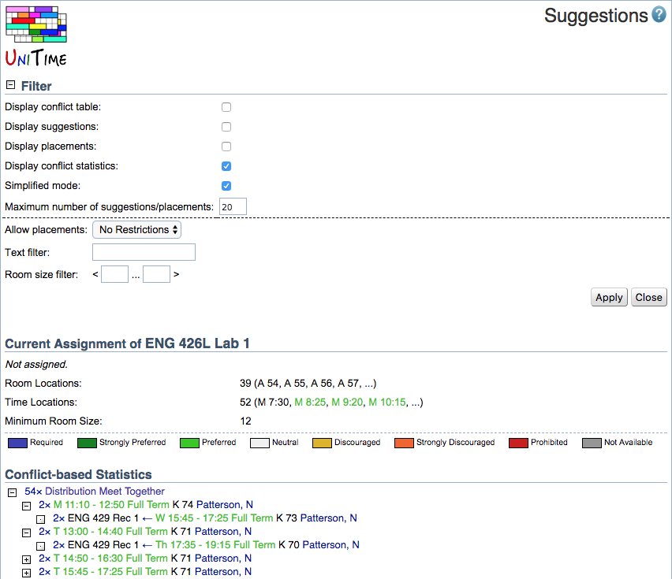{:class='screenshot'}

* You can also try to assign the class manually by selecting a room and time in the Rooms Locations and Time Locations rows and checking the Conflicting assignments. You can click on one of the conflicting class and explore the inconsistency.

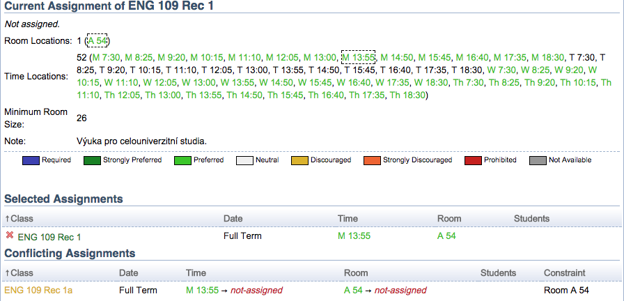{:class='screenshot'}

If you have fixed all problems with not-assigned classes and the solver found a complete solution (100% of variables are assigned and there are no classes that did not get loaded into the solver), you can Unload and proceed to the next part of this manual.

# 3. Create an optimized timetable for your department 

If running the solver in the “Check” configuration has resulted in all classes being assigned, you can proceed with creating an optimized timetable for your department. Please note, however, that the ability of the solver to optimize the solution will depend on the amount of flexibility you have allowed it in your input data. If the vast majority of your times and rooms have been marked as "Required" there is little or no room for optimization.

In this section another configuration (Default) of the solver will be used which attempts to optimize satisfaction of the preferences that you have entered as well as minimize student conflicts.

* Unload the data from the solver (click Unload in the Course Timetabling Solver screen) if you have not done this already. 

* Set the configuration to **Default** and load the data. Click **Load**

* Watch the progress in the Solver Status part of the page. When the status is “Awaiting commands…,” click **Refresh**.

* If there are no warnings indicating classes you expect to timetable have not been loaded, click the **Start** button in the top section of the Course Timetabling Solver screen. You may either wait for the solver to finish (most problems have a 30-minute time limit set on the solver) and then proceed as described in section 4, or continue as described below. You can leave the application and do other things, or even log out entirely, without affecting the solver's progress

* Progress of the solver can be monitored in the Solver Status frame in the lower left of the screen. For most departmental problems a first complete solution should be found within five minutes and the solver will move on to improving upon this initial solution. This step may take longer if, for instance, you have set many distribution constraints. If a complete solution has not been found after five minutes, you may wish to stop the solver and fix any problems as described in section 2 of this manual (it is not necessary to unload and start the solver with Check configuration).

* Wait while the solver is fixing the solution. (During the fixing stage, the solver goes through all classes and checks if there are any free times or rooms that would be better for that class – if there are any, it changes the assignment. It only searches for changes that don’t interfere with other classes.) Note: this stage may be skipped in some cases, so don’t worry if you don’t see this status.

* You can stop the solver at any time when it is trying to improve the current solution. (Improving the solution is more complex than just finding a different time or room which are currently available; that is, more complex than fixing.) The longer you run the solver, the more preferences will be met. The timeout is usually set to 30 minutes. To stop the solver, click **Stop**. 

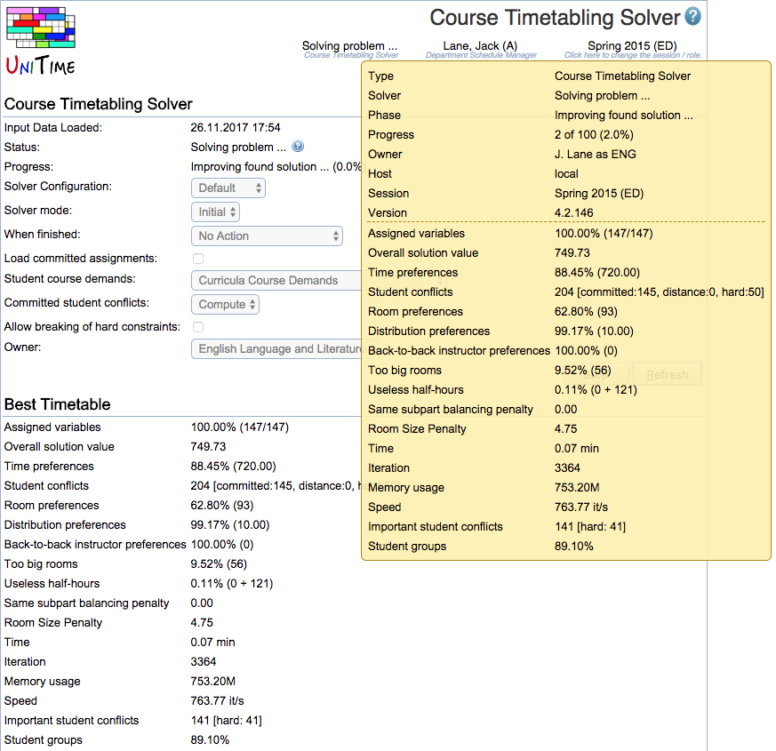{:class='screenshot'}

* After you have stopped the solver, click on Student Sectioning. That will try to move students around and reduce the number of student conflicts. When the solver is creating a timetable, it looks at the enrollment data from the last like-semester – using this data, it assigns last like-semester students to classes. (Student conflicts are computed based on last-like semester student demand.).

* Click Refresh again. 

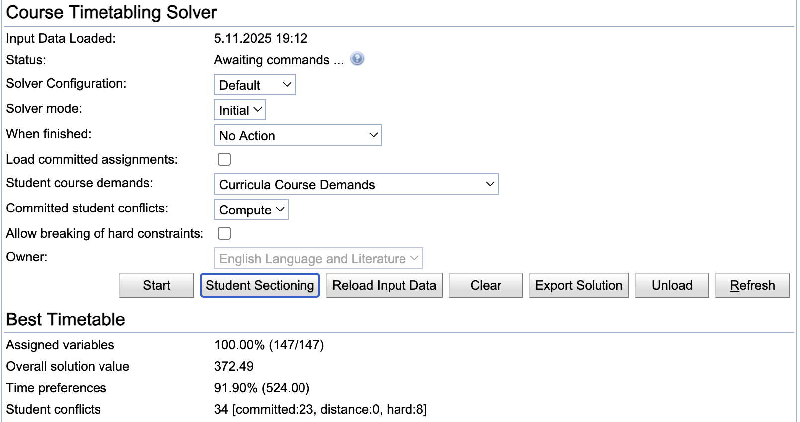{:class='screenshot'}

# 4. Look at the properties of the timetable

Before you look at the timetable, it is recommended you look at the properties of the timetable. You can see some of them in the Course Timetabling Solver screen and then look at a different kind of information in the Reports screen.

## 4.1 Properties described in the Solver screen

The first place to find information about the timetable is the Course Timetabling Solver screen. The properties of the timetable you will review is in the Current Timetable section. (Scroll down from “Best Timetable” to see this section.) The most important numbers are Assigned variables and Student conflicts.

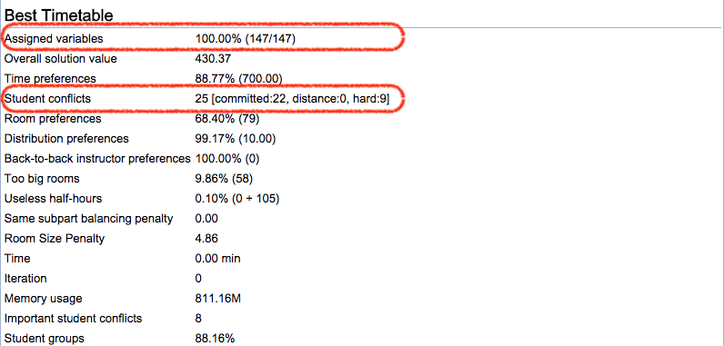{:class='screenshot'}

**Assigned variables:** The percentage indicates for how many classes the solver could find a time and room – for a timetable to be workable, this number should be 100%. The numbers in the parenthesis (e.g., 457/457) indicate for how many classes out of the total number of your loaded classes the solver found a time and room.

**Student conflicts:** If the students from the last like-semester register for the same classes as they did last time, there will be this number of situations when a student wants to take two classes which are not possible to take together (e.g., most likely because they overlap in time). This should be an indication about the number of conflicts there could be between classes for this semester, especially if the curriculum is fairly strict about what the students should take during which semester. You will see more information about these conflicts in the Reports screen.

## 4.2 Reports 

The **Solution Reports** screen has several sections. If you don’t see some of them, it means that there haven’t been problems of that kind, and therefore the section is not displayed.

### Room Allocation

Describes the usage of your rooms based on size (there are a few categories based on size).

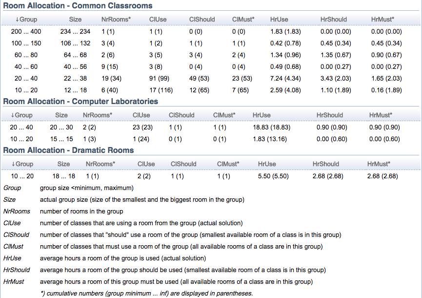{:class='screenshot'}

### Violated Distribution Preferences

This is a list of distribution preferences that have been violated. For example, if your strongly preferred distribution preference for Back-To-Back between class A and class B has been violated, you can be sure that these classes are not back to back in the current timetable.

{:class='screenshot'}

### Instructor Back-To-Back Preferences

Information about instructors whose back-to-back classes are far away from each other – so far away that such assignment of rooms is discouraged or strongly discouraged by the solver.

### Student Conflicts

This is a complete list of student conflicts (their total is the number you could see in the Solver screen). The number in the first column tells you how many students wanted to take both of the classes in the second column during that semester. If the number of conflicts for two classes is too high, you may want to either change the preferences for one of the classes (if both of them have a single time and room that they require) or change the assigned time in the timetable. Such changes are described later in this manual.

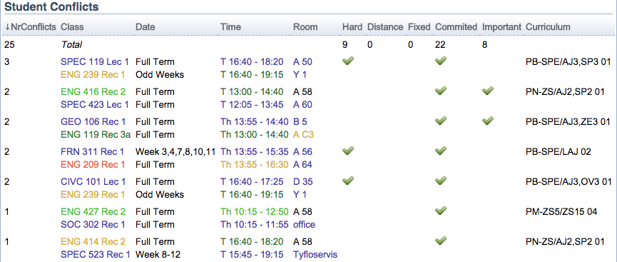{:class='screenshot'}

If you want to print the Reports screen, click the Export PDF button at the bottom of the screen.

Note: there is color-coding in place for the times and rooms both in the violated distribution preferences and for the student conflicts. This color coding is the same as for the preferences you set on classes. If you see a room in blue letters, it means that the class requires this room. If you see a time in dark green letters, it means that this time was set as strongly preferred for the class.

### Section Balancing

This gives you information about those scheduling subparts in which the classes are not distributed very evenly throughout a day. For example, if your subpart has three classes and all the classes are at the same time, then all the classes of this subpart will be listed here, since the solver’s configuration assumes you prefer your classes spread (so that students have options) and the solver wants to warn you that this was not possible for one of your subparts.

# 5. Look at the timetable 

The timetable can then be seen in either the Timetable or the Assigned Classes screen, as described in this chapter.

## 5.1 Timetable

Click on the Courses > Course Timetabling > Timetable Grid in the menu.

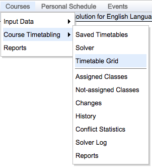{:class='screenshot'}

The Timetable screen that is displayed shows you a time grid (which you also can export

to PDF for printing).

You can choose what information you want to have displayed in the time grid and how by setting the filter in the upper part of the screen. The various options are:

| **Week** | See the whole semester or only a particular week from the semester. |
| **Resource** | Should there be a time grid per room or a time grid per instructor? |
| **Filter** | Specify the resource (e.g., if you only want to see rooms in the KNOY building, write KNOY in the filter text field). |
| **Days** | What days within a week do you want to see? All, All except Saturday, or a particular day (e.g., Monday)? |
| **Times** | What parts of the days do you want to see? The most usual is Daytime. |
| **Display Mode** | “Per Week” displays a week’s schedule of given room or instructor. “Vertical” has days on top, “Horizontal” has days on the left (and times on top). “In Row [horizontal]” has rooms (or instructors) on the left and all the times on top (starting with all Monday times, ending with all Friday times, if your “Day” option is “All except Saturday”). |

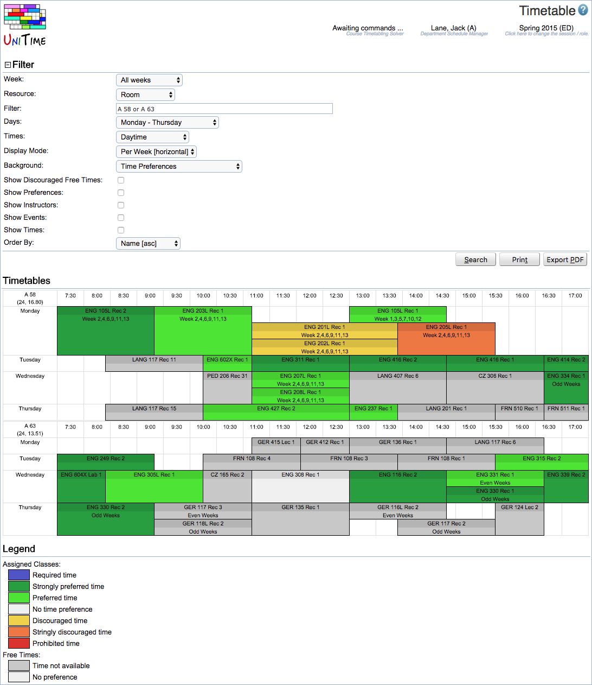{:class='screenshot'}

| **Background** | The background color of classes displayed in the time grid can reflect some properties of the timetable. E.g., if you select “Time Preferences”, the background color expresses whether the class was assigned a required or strongly preferred (etc.) time. The legend of the colors is below the timetable displayed. |
| **Show Discouraged Free Times** | Check this if you want to see useless half-hours in the timetable (not necessary to use). |
| **Show Preferences** | Show time, room preferences and student conflicts in each cell. |
| **Show Instructors** | Show instructor(s) in each cell |
| **Show Events** | Show committed events that are blocking rooms at certain times. |
| **Show Times** | Show assigned time in each cell. |
| **Order By** | Decide the order of rooms/instructors in which their time grids should be displayed. See next page for the Timetable screen with these options displayed. |

Whenever you make a change to the filter, make sure you click “Search” under the filter so that the changes can be applied.

In the time grids, you can click on any class from your departmental set of classes and make changes to the times/rooms (if the time/room is not fixed as “required”). See section 6 “Make changes to the timetable.”

## 5.2 Assigned Classes

Click on Courses > Course Timetabling > Assigned Classes in the menu. In the Assigned Classes screen, a list of your departmental classes appears with assigned times and rooms. There is color-coding in place for times and rooms. For example, if the room is written in blue letters, it means that this room was in the set of required rooms for this class. Or, if the time assignment is in dark green, that time was strongly preferred for that class.

Again, you can click on any class to change its time or room. See section 6 “Make changes to the timetable” for instructions.

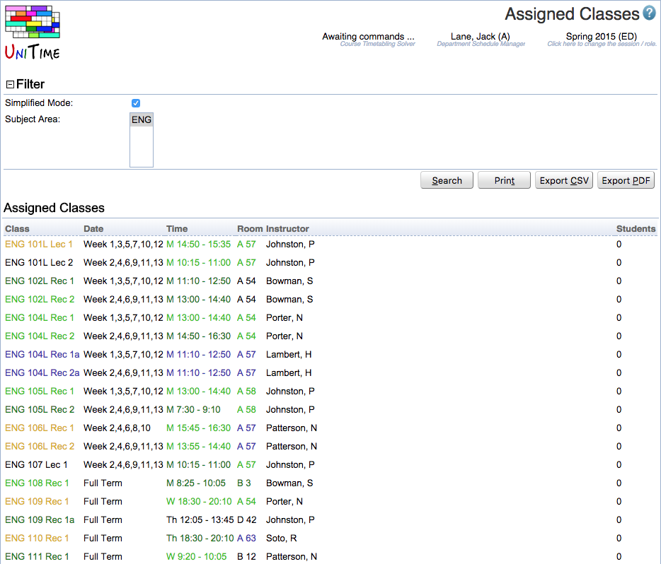{:class='screenshot'}

## 5.3 Instructional Offerings

In the filter in the Instructional Offerings screen, you have the option to check the Timetable.

Click Search and the assigned time and room will be displayed for each of your classes. Also, if you have Preferences displayed in this screen, a blue-outlined square highlights the assigned time in your time grid.

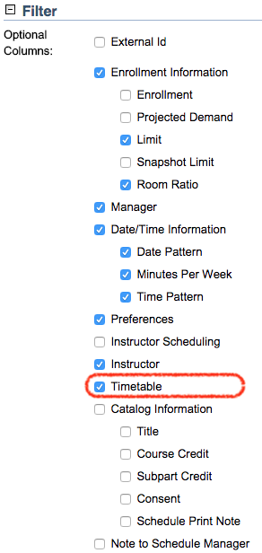{:class='screenshot'}

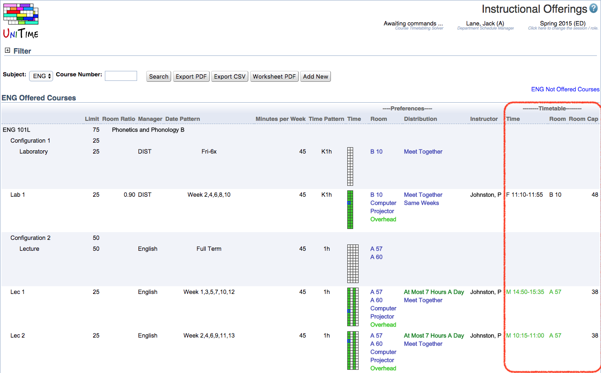{:class='screenshot'}

## 5.4 Classes

As in Instructional Offerings, you can also display the assigned time and room in the list of Classes. In this list, you have more filtering possibilities – you can e.g. filter by instructor, or sort by assigned time, etc. Whenever you change the filter, click Search to return the desired results.

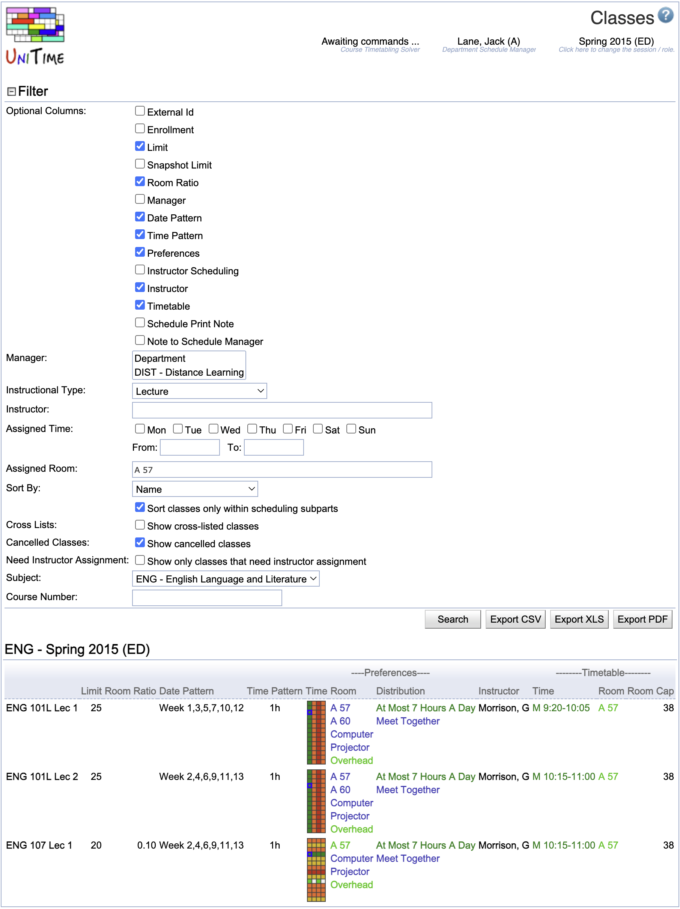{:class='screenshot'}

# 6. Make Changes to the Timetable 

From any screen which displays your timetabled classes (Timetable, Assigned, Reports,…,) clicking on the class number takes you to the **Suggestions** screen. This screen opens in a dialog window.

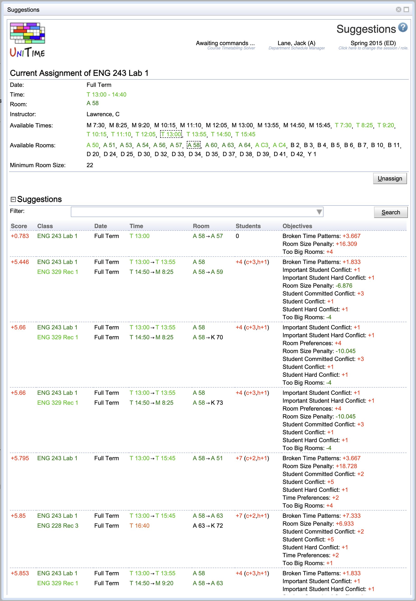{:class='screenshot'}

## 6.1 Description of the Suggestions screen

The **Suggestions** screen has the following parts.

### Filter

The filter allows you to select which sections you want to display in the Suggestions screen and specify the suggestions/placements in which you are interested. The first few items that pertain to Display are self-descriptive.

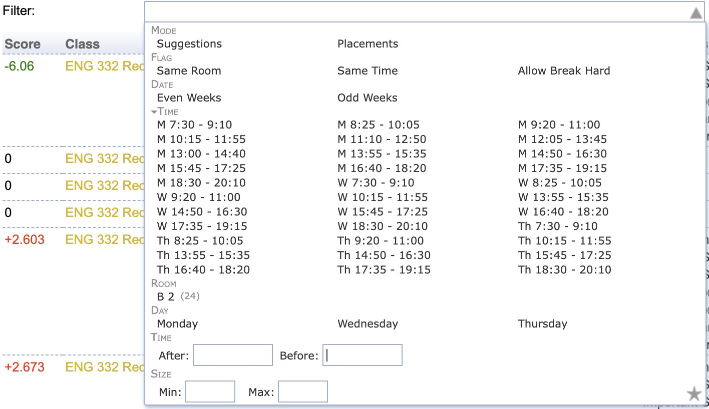{:class='screenshot'}

| **Simplified Mode** | If unchecked, many additional columns appear in the Suggestions and Placements. |
| **Maximum number of suggestions/placements** |  Specify how many suggestions or placements you would like to see in this screen. |

The second part of the filter is not hidden when you fold the filter. All these items apply to the Suggestions and to the Placements parts of the screen.

| **Allow placements** | No Restrictions mean that you can change both time and room. |
| **Text filter** | Specify the kind of suggestions/placements you would like to see. For example, if you are interested in a particular room, enter a room number, and only suggestions/placements with that room number will be displayed. If you want only Monday times, enter “M”, and only items with Monday times will be displayed. |
| **Room size filter** | Filter rooms by size. For example, if you enter 10…20, only the suggestions/placements including rooms of this size will be displayed. |

### Current Assignment

Detailed information about the current assignment of time and room for the class. This section cannot be turned off by the filter. If an item is not applicable for the selected class, it is not displayed (e.g., the Instructor line is not displayed if there is no instructor assigned to teach this class).

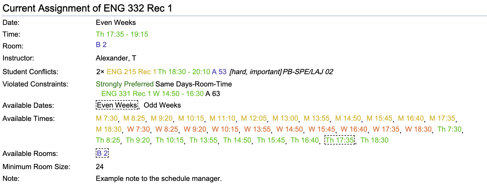{:class='screenshot'}

| **Date** | The date pattern for the class (full term, odd weeks, ….). |
| **Time** |  Time currently assigned to this class (can be changed in this screen). |
| **Room** | Room currently assigned to this class (can be changed in this screen). |
| **Instructor** | The instructor assigned by you to teach this class. |
| **Student Conflicts** | Number of student conflicts there are with which class, if any. |
| **Violated Constraints** | Violated distribution preferences, if any. |
| **Room Locations** | Possible room locations for your class. Click the three dots at the end of the list to see all of these possible locations. |
| **Time Locations**  | Possible time locations for your class, sorted by days and times. Click the three dots at the end of the list to see all of these possible locations. |
| **Minimal Room Size** | The minimal required room size is derived from the class limit and the room ratio entered in the Instructional Offerings. |
| **Note** | Class scheduling note if provided |

### Conflict Table 

This table lists possible times and the student conflicts and violated distribution preferences that will occur if the time is selected for the class – this information should help you decide what time to choose if you want to make a change in time. The underlined time is the current assigned time for the class.

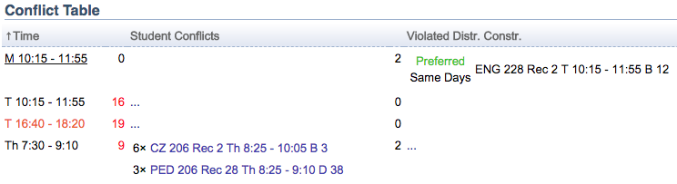{:class='screenshot'}

Click the three dots next to the number of Student Conflicts to see the details of those conflicts. Click the three dots next to the number in the column of Violated Distr. Constr. to see which constraint would be violated if the time on that line is selected.

### Suggestions

A list of possible changes to the time/room assignment for the class. The Score indicates how good/bad the change is for the timetable. The table is by default sorted by Score. Note: you can work with the Filter in the upper part of this screen to look for suggestions that include only a specific time or a specific room.

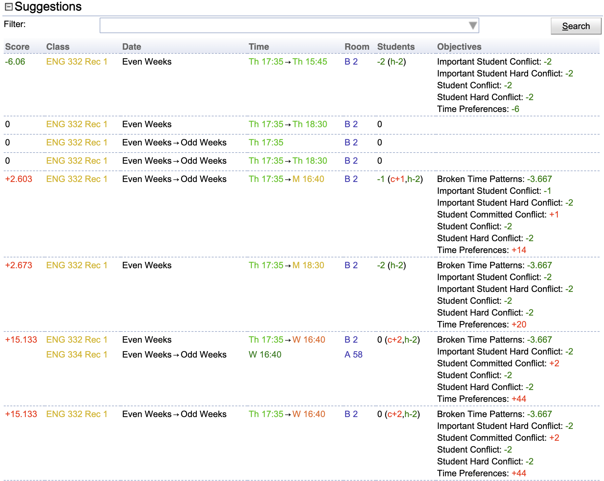{:class='screenshot'}

### Placements

This table tells you what happens if you decide to keep the current room but change the time assignment for the class.

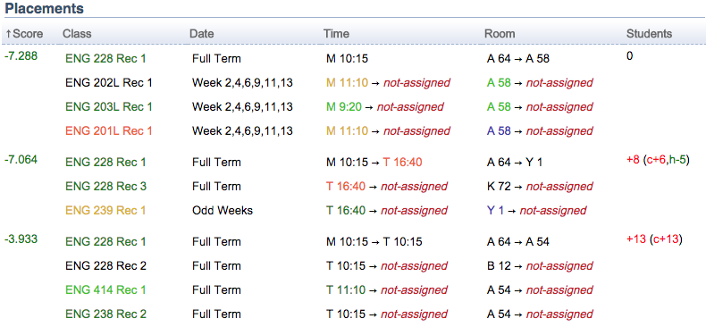{:class='screenshot'}

## 6.2 Making changes to the timetable

You have four options in this **Suggestions** screen to change the time assignment.

* Click on the time you want to assign in the list of time locations in the “Current Assignment” section of the screen.

* Click on the time in the Conflict Table.

* Click on a Suggestion that includes this time assignment. (If there are any listed.)

* Click on a Placement that includes this time assignment. 

You have three options to change the room assignment.

* Click on the room you want to assign in the list of room locations in the “Current Assignment” section of the screen. 

* Click on a Suggestion that includes this room assignment. (If any are listed)

* Click on a Placement that includes this room assignment. 

You will then see the information about your choice in a new section of the **Suggestions** screen, called Selected Assignments. This section shows the selected assignment first and then describes its properties (such as student conflicts etc.). If you wish to proceed and really make this change to the timetable, click Assign. If you don’t want to make this change, just closing the Suggestions window will be appropriate.

Although a number of options exist for making changes to time and room assignments, it is highly recommended that new users limit the changes they make to the possibilities displayed in the Suggestions section. These suggestions include a complete sequence of time and room changes necessary to insure that all classes remain assigned. If classes are left unassigned as the result of a change, a section called Conflicting Assignments is displayed right under Selected Assignments and informs you about the classes that needed to be unassigned so that your choice of time and room could be made possible. You can either leave the resolution of these problems for later (the classes will get to the Non-assigned list after you click Assign for this change, so you can access them through that list later), or you can resolve the problem by either:

* Choosing a suggestion that solves it (the suggestions now include this conflicting class). 

* Clicking on the class that is not assigned and choosing some time and room for it the same way as for the first class. 

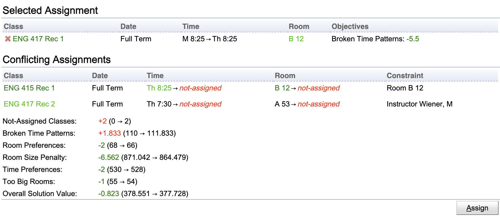{:class='screenshot'}

The Selected Assignments will display the whole history of these changes. None of the changes is really made to the timetable until you click Assign.

When you click Assign, the Suggestions window will automatically be closed. You may need to click Refresh in the page from which you got to the Suggestions window to be able to see the changes that you have made. Otherwise you will only see the situation before the change (the page from which you came is not refreshed automatically).

# 7. Save the Timetable

Go back to the Course Timetabling Solver screen.

* Save the current timetable (down the screen) to the Best Timetable by clicking on **Save to Best**. 

* Save this best timetable so that you can access it later – in the Best Timetable part of the screen, click on **Save as New**

* When you are done with this timetable, click **Unload** in the Course Timetabling Solver screen to unload the timetable from the solver.

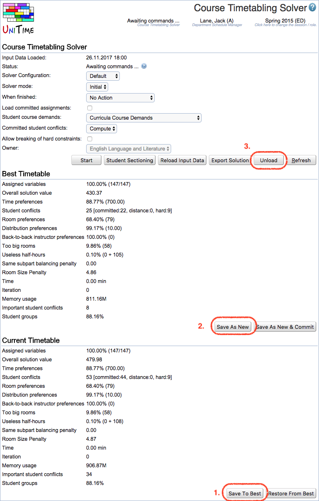{:class='screenshot'}

# 8. Work with the interactive solver 

The “Interactive” configuration of the solver has the highest flexibility for user’s changes. The user can do almost anything in here, including putting classes to prohibited rooms at prohibited times.

## 8.1 Create a new timetable 

* Click on Courses > Course Timetabling > Saved Timetables in the menu. That takes you to the Timetables screen. This screen has a list of your Saved Timetables (the list is empty if you haven’t saved any timetable yet). 

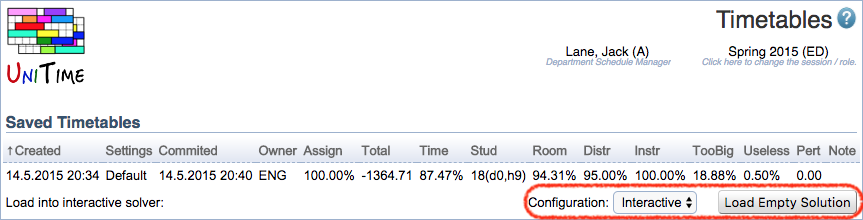{:class='screenshot'}

* Under the list of Saved Timetables, click on the **Load Empty Solutio**n button at the end of the line which starts with “Load into interactive solver:”. The screen will change – a new section called Loaded Timetable will appear at the top of the Timetables screen. 

* Watch the status in the Solver Status. When it says “Awaiting commands…”, click the Refresh button on the right hand side by the end of the Loaded Timetable section of the screen.

What is now available to you is a partial timetable. For classes for which you required a specific time and room (classes for which there is only one option), the solver assigned the required time and room. You can see those classes in the Assigned screen (click on Courses > Course Timetabling > Assigned Classes in the menu). The other classes are listed in the Non-assigned screen (click on the Courses > Course Timetabling > Non-assigned Classes in the menu to get there). You can click these classes one by one and assign times and rooms manually. See instructions in the “Make changes to the timetable” section of this manual.

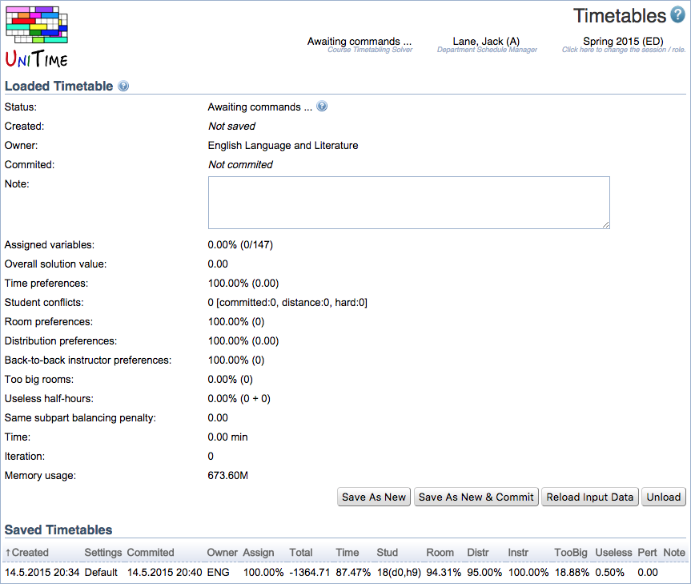{:class='screenshot'}

When you are done making changes, save the timetable as described in 8.3.

## 8.2 Work with an existing timetable

First, you will need to load the existing timetable into the solver.

* Click on Courses > Course Timetabling > Saved Timetables in the menu. That takes you to the Timetables screen. This screen has a list of your Saved Timetables.

* Click on the timetable that you would like to load. This timetable becomes the Selected Timetable in the upper part of the screen.

* In the line with “Load into interactive solver:” which is at the end of the Selected Timetable section, click on the Load button at the end of the line.

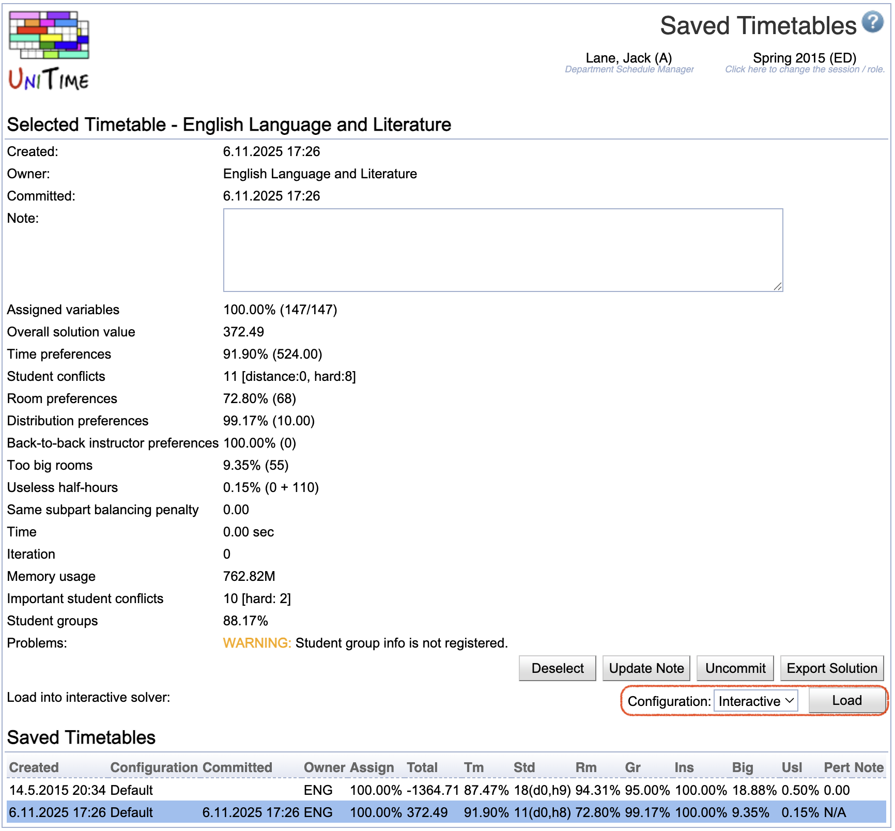{:class='screenshot'}

* Watch the status in the Solver Status. Click Refresh at the end of the Selected Timetable section when the status is “Awaiting commands….” 

{:class='screenshot'}

When the timetable is loaded, you can make any changes as described in the section “Make changes to the timetable.” You can even override required times/rooms in this interactive mode.

## 8.3 Save the timetable from interactive solver

When you are done making changes, save the timetable in the Timetables screen. You do it just by clicking Save as New in the Loaded Timetable section of the screen. (You can click Save if you just want to replace the timetable that you loaded into the interactive solver.) When the timetable is saved (you again see “Awaiting commands…” in the Solver Status window), click Refresh and then Unload on the same line where you found Save as New.

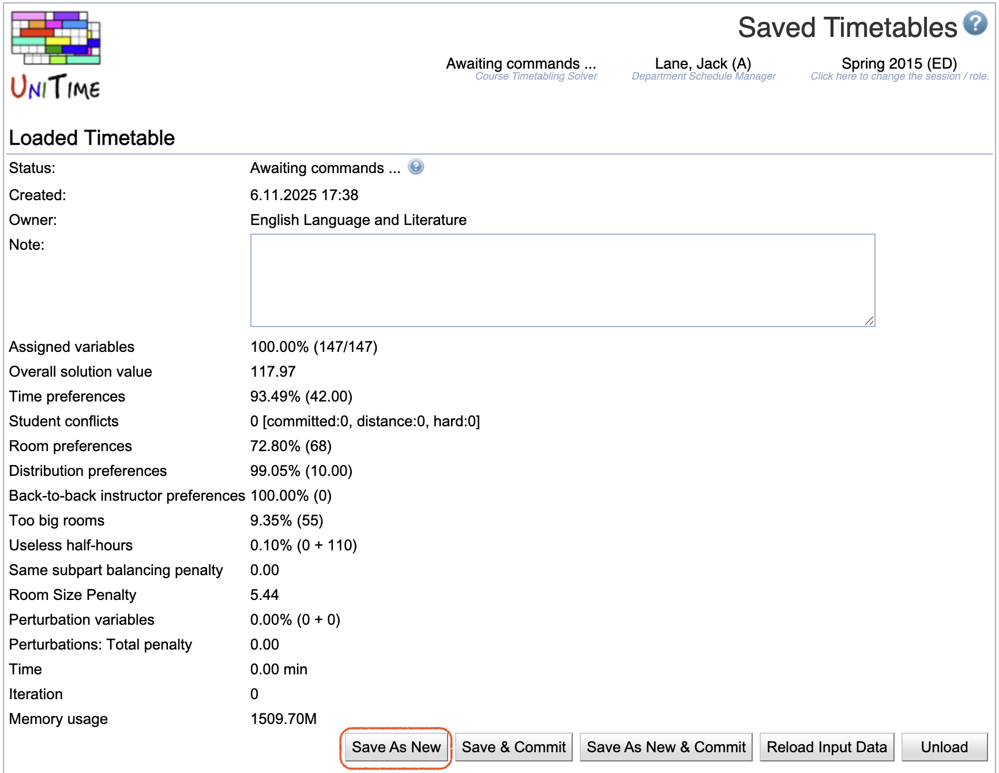{:class='screenshot'}

If you want to return to this timetable later, return to 8.2.

# 9. Commit a timetable 

Committing is publishing your timetable for others to see and to be able to build their timetables on top of yours. By committing, you are saying that this is the timetable you want. Once you commit, the assigned times and rooms become visible to everybody else (the information can be viewed in the Class Assignments screen – this screen is accessed by clicking on the Course Timetabling > Input Data > Class Assignments item in the left hand side menu). Other departments will see student conflicts between your and their classes. Even after you commit, you can make changes to your timetable and commit again until the deadline set by your institutions for departmental timetabling is reached. This should not happen very often.

If the timetable that you want to commit is loaded in the solver (any configuration  – default, interactive, …), proceed as if you wanted to save it, except that instead of clicking “Save” or “Save as New” click “Save & Commit” or “Save as New & Commit”.

{:class='screenshot'}

If the timetable that you want to commit is saved and you don’t want to make any changes to it, go to the Timetables screen, click on the timetable you want to commit, and when it appears in the first part of the screen as the Selected Timetable, scroll to the first row of buttons and click Commit.

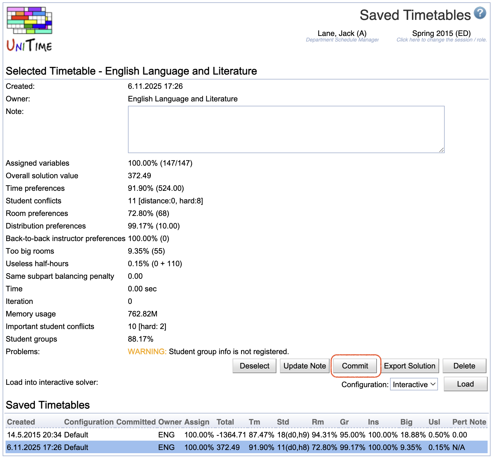{:class='screenshot'}

There is a small chance that the commit won’t be successful – a reason would be that you share a room with another department and that department just committed a timetable that uses that room at the same time as your timetable uses it. Or, you share an instructor with another department and that other department wants him to teach at the same time as you do. If the commit didn’t succeed, you can see what problems there are if you load the timetable again in the interactive mode.

The feedback for you that the timetable has been committed is the date and time in the “Committed” column in the appropriate line in the **Timetables** screen in your list of saved timetables.

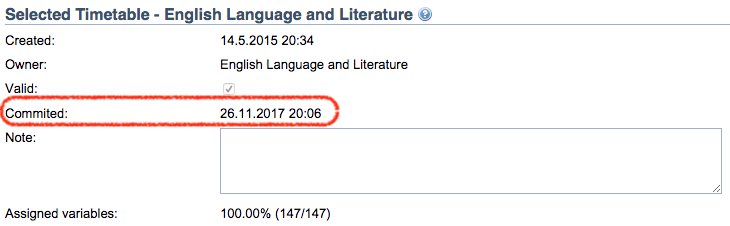{:class='screenshot'}

# 10. Tips and Tricks 

### Exporting the solution

If you need to work with the timetable in other applications (e.g., Access, Excel), you can export the solution in the “comma separated values” (CSV) format. There are two options

1. Export the solution from the Solver (or Timetables) screen. Click Export Solution (when you have the right timetable loaded or selected). In this case, you will only get the departmental timetable (without externally timetabled assignments, such as Large Lectures or Computing Labs)
2. Export the solution from the Class Assignments screen. Set the filter so that Manager is “All”. Click Search. When the page has loaded, click Export Solution.

# Appendix A – List of warnings

| Type | Message | Note |
| INFO | No student enrollments for offering O. | There are no last-like semester student enrollments for instructional offering O. Classes of this offering might require a special attention, since they will not create any student conflicts with other classes. |
| WARN | Class C has no available room(s) (class not loaded). | There are no available rooms for class C. This can, for instance, mean that there are no rooms that are not prohibited by the class preferences and that are of sufficient size. |
| WARN | Class C has no time pattern selected (class not loaded). | Class C does not have a time pattern selected, but it has a non-zero number of minutes per week. |
| WARN | Class C has no available time (class not loaded). | There are no available times for class C. This can, for instance, mean that all the times of the selected time pattern(s) are prohibited by the class preferences. |
| WARN | Class C has no available placement (class not loaded). | Class has available time(s) and room(s) but there is no valid combination (e.g., because of room sharing and/or instructor or room availability).Such a class is only loaded in the interactive mode of the solver. |
| WARN | Class C has no available placement (after enforcing consistency between the problem and committed solutions, class not loaded). | A reason for inconsistency (conflicting constraints & assignments) is provided as the following INFO message – check the solver log in this case. Such a class is only loaded in the interactive mode of the solver. |
| WARN | Unable to assign C <- Time Room (placement not valid) | Assignment from the loaded solution is no longer valid (given time/room became prohibited for some reason). |
| WARN | Unable to assign C <- Time Room : reason | Assignment from the loaded solution is no longer valid (because of some other assignment or a new constraint) |
| WARN | Class C has zero class limit. | Class has zero class limit. Such a class might require special attention since no students will be sectioned in it and therefore it will not create any student conflicts with other classes. |
| WARN | Same instructor and overlapping time required: C1 <- time1 room1, C2 <- time2 room2 | Classes C1 and C2 are requiring same instructor and a single time each, but these times are overlapping (an instructor cannot teach two classes at the same time). |
| WARN | Same room and overlapping time required: C1 <- time1 room1, C2 <- time2 room2 | Classes C1 and C2 are requiring a single time and a same room, but these times are overlapping (a room cannot accommodate two classes at the same time, unless there is a Can Share Room distribution constraint between these classes) |
| WARN | Class C requires an invalid placement time room : reason | Class C requires a single time and a single room, but the given time/room is not valid because of some other (committed) assignment. |
| WARN | Lecture C not found/loaded, but used in distribution preference P | Class C is used by a distribution preference P, but it was not loaded because of some other reason or because it is of different problem (that does not yet contain a committed solution). |
| WARN | Distribution preference P refers to less than two classes. | Distribution preference P contains only one class – it is required that each distribution constraint is defined between two or more classes. |
| WARN | Inconsistent course reservations for course C. | Course reservations of course offering C are inconsistently set on classes of the course offering C. |
| WARN | Cross-listed course C does not have any course reservation. | Cross-listed course offering C does not have any course reservation defined. |
| WARN | Total number of course reservations is below the offering limit for instructional offering O (total<limit). | Total number of course reservations for the instructional offering O is not equal to the appropriate instructional offering limit. It is below that limit. |
| WARN | Total number of course reservations exceeds the offering limit for instructional offering O (total>limit). | Total number of course reservations for the instructional offering O is not equal to the appropriate instructional offering limit. It is above that limit. |
| WARN | No reserved space for students of offering C. | Course reservation of course offering C is zero, but there are some last-like student enrollments for this offering in the database. |
| WARN | Class limit exceed for class C (nrStudents>classLimit) | Section algorithm enrolled more students into the class C than it is allowed by the class limit. Possible reasons:inconsistent course reservations set on classes (e.g., reservation is for 50 students, but only one section of 25 is reserved),total number of course reservations is not equal to offering limit,configuration limit is smaller than total class limit of a scheduling subpart,classes of mixed ownership in a subpart (warning can be ignored in this case) |
| WARN | Student S enrolled to invalid class C. | This can happen in the case of inconsistent course reservations (set on class level) -- there is no class the given student can be enrolled to. |
| WARN | Class C is cancelled (class not loaded). | Class C has been cancelled. |
| WARN | Class C has no date pattern selected (class not loaded). | Class C does not have a date pattern selected (and there is no default date pattern defined). |
| FATAL | Unable to load input data, reason: exception | Do not continue, do not unload the solver, please contact your UniTime support using the Contact Us page. |

