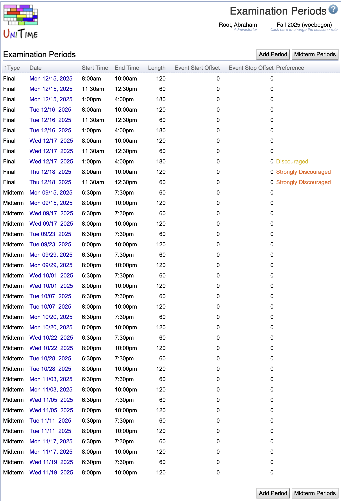
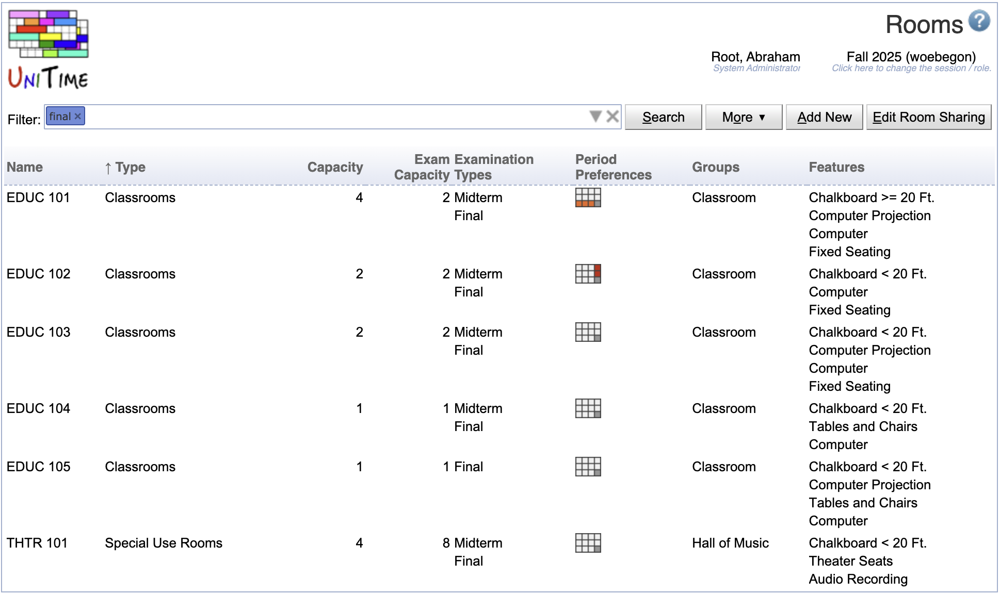
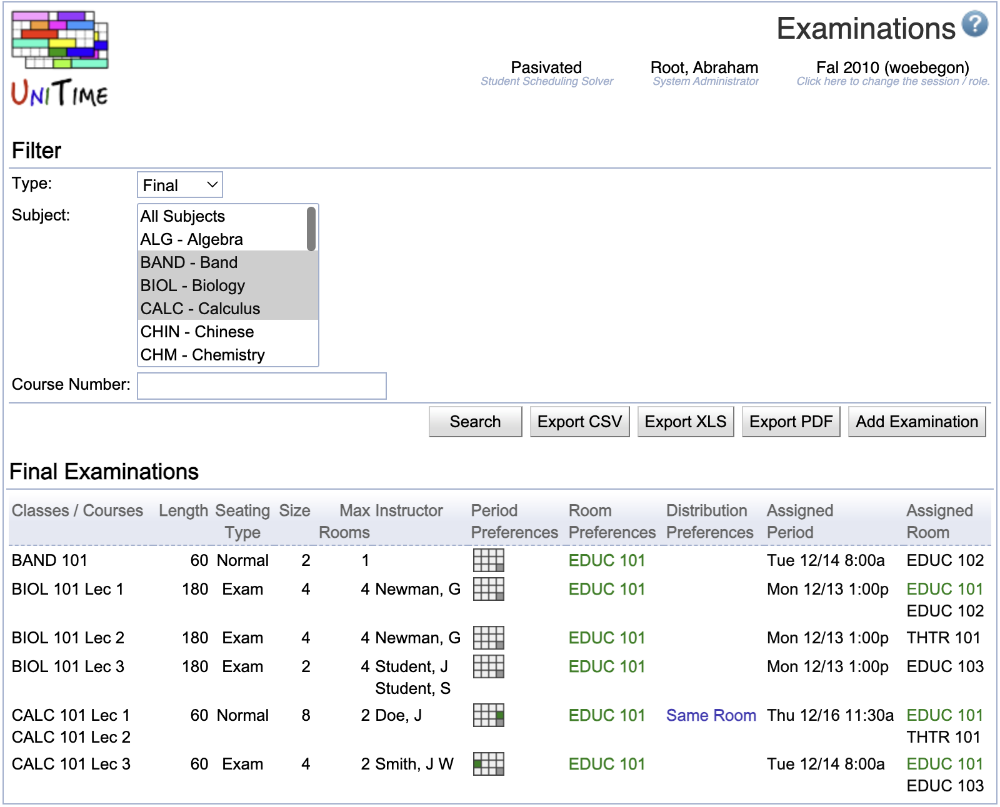
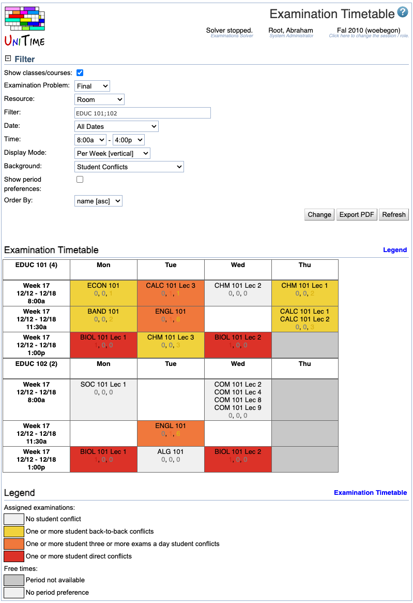
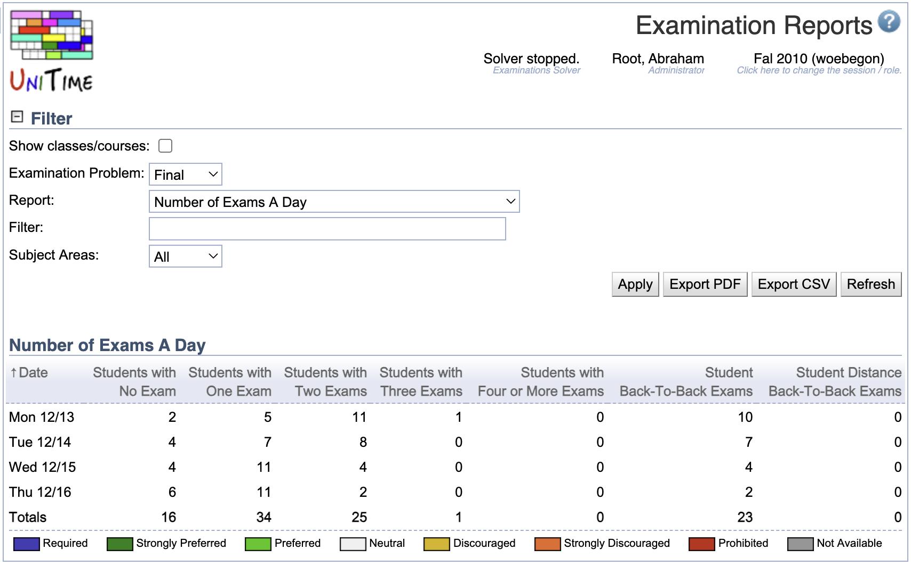
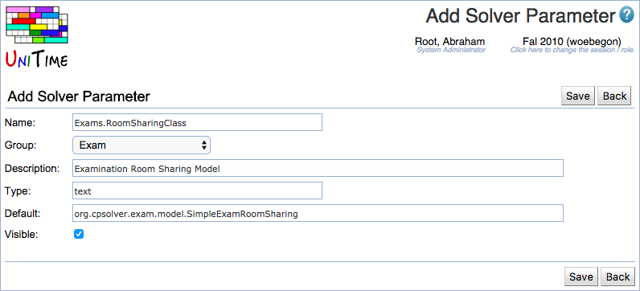
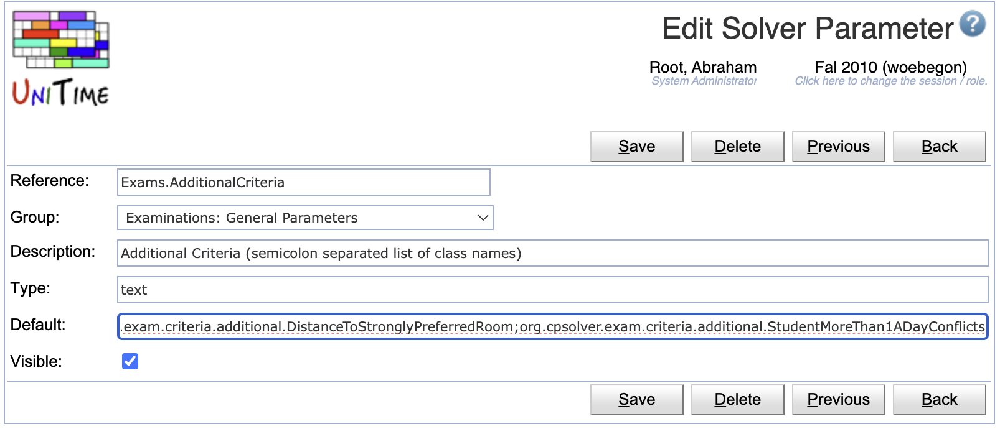
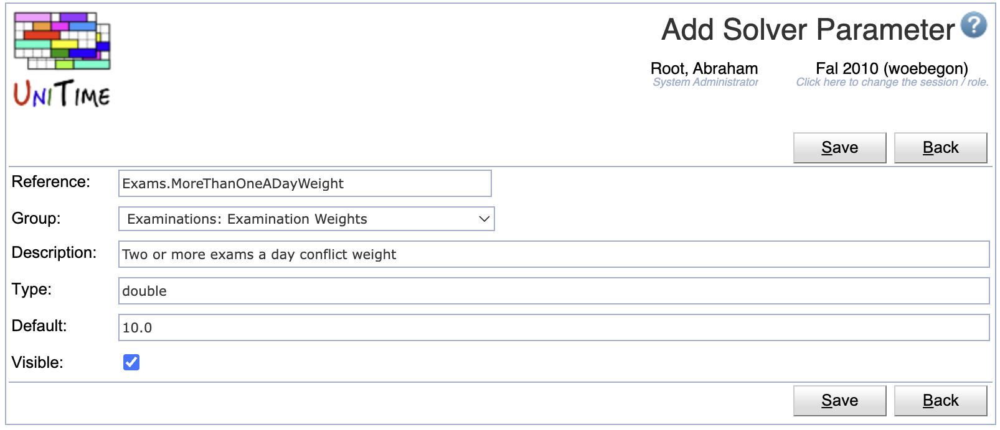

### Table of Contents
{:.no_toc}
* table
{:toc}


# Introduction

UniTime can be used to build an examination schedule that minimizes the number of conflicting exam placements for all students and instructors. Besides direct conflicts, it also minimizes the number of back-to-back exams or students with more than two exams in a day.

Multiple examination problems can be defined, such as final exams, mid-term exams, or evening exams.

For more details about the examination timetabling problem and the available constraints, please see the [Examination Timetabling](../examination-timetabling) document.

# Administration

For examination timetabling to be enabled, the following administration tasks are required. A Session Administrator or the Examination Timetabling Manager typically performs these tasks. The examination timetabling usually happens at the central (academic session) level. The Department Schedule Managers can indicate which courses or classes need an exam, the instructor(s) for the exams, and their preferences and requirements. The examination solver is run by the Examination Timetabling Manager at the central/academic session level for all the departments together. This is because many students may have courses across multiple departments, and it is usually imperative to ensure there are as few student conflicts as possible. 

## Examination Types

The list of available examination problems can be adjusted on the Administration > Other > [Examination Types](../examination-types) page. The System Administrator typically configures the examination types. The page is visible to users with Examination Types permission, and changes can be made with Examination Type Edit permission.

{:class='screenshot'}

Multiple examination types can be defined on the Examination Types page. The examination types are academic session independent; however, only examination types that have some [examination periods](../examination-periods) defined will show on examination pages (e.g., [Examinations](../examinations) page, Type drop down). Similarly, a set of rooms that are available for a particular examination problem (together with their availabilities and default period preferences) can only be defined for examination types that already have some examination periods defined in the academic session.

Examinations of each examination type are timetabled separately. So, for instance, there can be a different examination timetable for midterm and for evening exams during a term, or there can be multiple final examination timetables produced during the summer session (e.g., one for the first half and another for the second half).

Examinations of each examination type can also be published at different times and/or managed by different Examination Managers. This can be defined on the [Examination Statuses](../examination-statuses) page.

If the **Highlight In Events** is checked, examination days (days during which there are examination periods) for this examination type are highlighted in the events.

While there can be many examination types defined, all of them are either of **final** or of **midterm** examination type. This type determines how examination period preferences are displayed, whether midterm or final examination events are created (see the [Events](../events) page), and is used in the status types (see the [Status Types](../status-types) page). This needs to be taken into consideration when a new examination type is being created.

## Examination Periods

The list of **non-overlapping** examination periods for each examination type can be defined on the Administration > Academic Sessions > [Examination Periods](../examination-periods) page. The Session Administrator usually configures the examination types. The Examination Periods permission is needed to access this page.

{:class='screenshot'}

The examination periods can also be rolled forward from the previous academic session, using the Administration > Academic Session > [Roll Forward Session](../roll-forward-session) page, in the **Roll Exam Configuration Data Forward** step. 

All examination periods are relative to the **Exams Begin** date set on the [Academic Sessions](../academic-sessions) screen. If this date is moved, all periods are automatically moved as well.

The **Event Start Offset** can be used to indicate how many minutes before the examination should the room be available for students to enter and sit down, or to prepare the room (rearrange chairs, etc.). Similarly, the **Event Stop Offset** indicates how many minutes after the examination should the room be available for the students to leave the room or to return the room to the state where it was before the examination.


Please note that the [Examinations](../university-timetabling-application#examinations) menu is only available when there is at least one examination period defined for the current academic session.

## Examination Rooms

Besides the examination periods, the list of available rooms needs to be configured for each examination problem. This can be done on the Examination > Input Data > [Rooms](../rooms) page. The Session Administrator or the Examination Scheduling Manager typically performs this task.

{:class='screenshot'}

The page can be filtered by examination type (listed under the Department), and it can list both the normal and examination seating capacities, as well as the period preferences for the selected examination type. When an examination type is selected in the filter (possibly with some other options, such as a room type or a building), the [Edit Room Sharing](../edit-room-departments) button can be used to easily select which of the rooms can be used for the examination timetabling (of the selected type).

Click on a room to see more details on the [Room Detail](../room-detail) screen or make changes using the [Edit Room](../edit-room) screen. On the [Edit Room](../edit-room) screen, there is a checkbox for each examination type (to indicate whether the room can be used for this problem) and the additional examination seating capacity.

{:class='screenshot' style='max-width:500px;'}

### Examination Seating Capacity
The examination timetabling can utilize two capacities: normal and examination seating capacity. An exam that requires normal seating must fit into one or more rooms, considering the room capacity. An exam that requires examination seating must fit into one or more rooms, considering the room's **examination seating capacity**.

### Examination Room Period Preferences
An examination room can also have a preference set for each examination period defined on the [Edit Room](../edit-room) screen. When a period is marked as **Prohibited**, the room cannot be used for examination timetabling during that period. A **Strongly Discouraged** period can only be used if there is a direct preference for the room on the exam. The use of the room during the **Discouraged** periods is minimized.

{:class='screenshot'}

### Room Features and Room Groups
Any global [room features](../room-features) and [room groups](../room-groups) can be used for examination timetabling for setting up preferences. There are no separate room features or groups that could be used only for exams.

### Room Availability
The Examinations > Input Data > [Room Availability](../room-availability) page provides a list of events that overlap with the examination periods of the selected examination problem. This screen is useful when an institution does not use the Event Management section of UniTime and imports information about room availability from external resources (see more about that [here](../custom-room-availability)).

## Student Class Enrollments

To minimize student conflicts, the examination solver requires **student class enrollment** data to exist in UniTime. Students attending an exam are computed from the examination's association with one or more classes or courses.

The student class enrollment data are produced by the [Student Scheduling](../student-scheduling) component of UniTime.

Alternatively, student class enrollment data can be imported from an external system using the Administration > Academic Sessions > [Data Exchange](../data-exchange) page, using the [Student Class Enrollment XML](https://www.unitime.org/interface/studentEnrollmentImport.xml) data format (see the [XML Interfaces](https://www.unitime.org/uct_interfaces.php) for more details). The Student Course Requests XML format can also be used, provided it includes class enrollment data.

## Examination Statuses

The Administration > Academic Session > [Examination Statuses](../examination-statuses) page can be used to change the examination status individually for each examination type. This examination status, if set, overrides the academic session status (for all users).

{:class='screenshot'}

Examination statuses can be defined on the Administration > Other > [Status Types](../status-types) page, by setting the **Apply to Examinations**. The following statuses are created by default:

* **Examination Disabled**,
* **Examination Data Entry**,
* **Examination Timetabling**,
* and **Examination Published**.

This allows for each examination problem to be viewed, edited, timetabled, and published at a different time. Session Defaults falls back to the former behavior (using the status of the academic session instead).

### Examination Managers

It is also possible to attach examination managers to each examination type (for the current academic session). If this relation is defined, only the selected manager(s) can view, edit, or timetable the given examination problem (based on the status). If this relation is NOT defined, all examination managers can view, edit, or timetable all examination problems. Only managers with a role that is academic session dependent and that allows access to the examination solver are listed.

The Examination Statuses permission is needed to access the page. Permission Examination Status Edit is needed to make changes.

# Data Entry

The individual exams can be seen and configured on the Examinations > Input Data > [Examinations](../examinations) screen. Additional distribution constraints between individual exams can be configured using the Examinations > Input Data > [Distribution Preferences](../examination-distribution-preferences) screen.

## Examinations

The Examinations screen provides a list of examinations for the selected problem (examination type), for one, more, or all subject areas at once. The page can also be used to add a new exam, but an exam can also be added directly from the [Instructional Offering Detail](../instructional-offering-detail#examinations) or [Class Detail](../class-detail#examinations) page for the particular course or class, respectively. The two mentioned detail pages also display a list of exams currently configured for the appropriate course or class.

{:class='screenshot'}

### Add/Edit Examination

Each examination has
* a **Name**, which can be automatically generated when left blank (see [Exam Naming Convention](../exam-naming-convention) for more details)
* an examination **Type** which indicates under which problem the exam will be timetabled, and also which periods and rooms can be used
* a **Length** in minutes (an exam can only be placed in a period that is long enough)
* an examination or a normal **Seating Type** indicating which room capacity is going to be used
* a **Maximal Number of Rooms** it can be split in between
    * *Please note that if an exam has zero rooms, it will only have a period assigned.*
* and a **Size** which indicates how many students are expected to attend the exam
    * *The size can be left blank, in which case the number of enrolled students is used.*

The **Print Offset** can be used to shift the examination time by a given number of minutes in the reports. For example, a printed starting time of an exam can be 10 minutes into the examination period.

If an exam has one or more instructors assigned, the possible conflicts for the instructors will be considered.

![Add Examinations(../images/add-examination-1.png){:class='screenshot'}

#### Classes/Courses

The **Classes/Courses** section provides information about the instructional offering components (classes, instructional offering configurations, course offerings, and instructional offerings) whose students need to take this examination. These components define which students are to attend the examination (i.e., students who are enrolled in the classes/courses/etc displayed in this section).

This allows for setting up an exam for multiple classes and/or courses, if needed.

#### Preferences

Similarly to classes, an exam can have period preferences and various room-related preferences. Only rooms that are available for the selected examination type are listed.

Time grids are displayed based on the examination type. For Midterm Examinations, the available time periods are all marked as Prohibited; the user needs to select a different preference level for the time periods that can be used.

#### Clone Examination

Suppose multiple exams need to be configured for the same course (e.g., there could be two or three evening exams for a course during the term). In that case, the **Clone** button on the [Examination Detail](../examination-detail#operations) page can be used to add a new examination with the data pre-populated from the current exam.

## Examination Distribution Preferences

Distribution preferences can be used to provide additional relations between two or more exams. These can be defined on the Examinations > Input Data > [Distribution Preferences](../examination-distribution-preferences) page.

{:class='screenshot'}

Possible distribution preferences:

* **Precedence**
    * Exams are to be placed in the given order.
    * When prohibited or (strongly) discouraged: exams are to be placed in the order reverse to the given one.
* **Same Period**
    * Exams are to be placed in the same period.
    * When prohibited or (strongly) discouraged: exams are to be placed at different periods.
* **Same Room**
    * Exams are to be placed in the same room(s).
    * When prohibited or (strongly) discouraged: exams are to be placed at different rooms.
* **Can Share Room**
    * Examinations can share a room (use the same room during the same period) if the room is big enough.
    * If examinations of different seating types are sharing a room, the more restrictive seating type is used to check the room size.
* **Same Day** (optional)
    * Exams are to be placed on the same day.
    * When prohibited or (strongly) discouraged: exams are to be placed on different days.
    * Not available by default, needs to be registered with the [Examination Same Day Constraint.xml](https://github.com/UniTime/unitime/blob/master/Documentation/Scripts/Examination%20Same%20Day%20Constraint.xml) script. To register, download the XML file and import it on the [Data Exchange](../data-exchange) page, then run the Distribution Types: Same Day (Examination) script on the [Scripts](../scripts) page.

Click on any distribution preference to get to the [Edit Examination Distribution Preference](../edit-examination-distribution-preference) screen. A new distribution preference can be created by clicking the [Add Distribution Preference](../add-examination-distribution-preference) button.

Prohibited or required preferences must be satisfied by the solver (also referred to as *hard constraints*). The (strongly) discouraged or preferred preferences are optimized (the solver tries to satisfy as many as possible, also referred to as *soft constraints*). In the case of distribution preferences set between three or more exams, each violated examination pair is penalized separately, allowing the solver to satisfy as many examination pairs as possible.

# Examination Solver

The examination solver can be run using the Examination > Examination Timetabling > [Examination Solver](../examination-solver) page. Unlike with the course timetabling, only one solution can be saved in the database, directly populating the examination assigned period and room(s). If a solution is already saved, it gets automatically loaded in as well. After loading the data into the solver, please check all the warnings, either directly on the [Examination Solver](../examination-solver) page or on the [Examination Solver Log](../examination-solver-log) page.

{:class='screenshot'}

There are the following properties that can be selected
* The **Examination Problem** (type) that is to be loaded into the solver
* The **Solver Configuration** that is to be used
    * Solver configurations are defined on the Administration > Solver > [Configurations](../solver-configurations) page. Only configurations with the Examination Timetabling Solver appearance are applicable for examination timetabling and have the appropriate parameters available.
* The **Solver mode** indicates whether the solver should consider the existing assignments or not
    * If the **MPP** mode, standing for Minimal Perturbation Problem, is used, the solver will also try to minimize changes to the original timetable
    * The **Initial** mode does not minimize changes (it will still load the existing timetable if it exists)
* The **When finisher** option specifies an automatic operation when the solver run has finished
    * This option does not get used if the solver is stopped manually using the **Stop** button
* Additional parameters can be displayed, depending on the [Solver Parameters](../solver-parameters) defined.

The data can be loaded into the solver using the **Load** button, and the solver can be started using the **Start** button. When no data are loaded into the solver, using **Start** will first load the solver and then start it. This can be combined with the **When finished** parameter, for example, to save and unload the solver once it is done automatically.

The **Stop** button can stop a running solver, or it can be left running until it stops itself. The solver run is typically 30 minutes, which can be adjusted with the other examination solver parameters on the Administration > Solver > [Configurations](../solver-configurations) page. The solver works with two timetables: the current one (displayed on other pages and manually changeable using the [Examination Assignment](../examination-assignment) page) and the best timetable that the solver uses to record the best solution it has seen during the search. To save the current timetable, click the **Save** button. The solver can be unloaded from memory using the **Unload** button.

The **Clear** button will unassign all exams, allowing the solver to start from scratch, even when an existing timetable has been loaded. It can also be used to unassign all exams in the database (delete the existing solution) by using the **Load**, **Clear**, and **Save** buttons in this order.

The **Reload Input Data** button can be used to reload the input data (periods, rooms, examinations, and all their requirements and preferences) without losing the current timetable. This will load everything into the solver, using the newly selected configuration, except for the saved timetable. Afterward, the current timetable will be reassigned to the newly loaded exams. This is very useful if any changes have been made to the input data, without the need to perform **Save**, **Unload**, and **Load** again. Please note that some exams may be left unassigned if their current assignment is incompatible with the changes made to the input data. Please check the solver warnings for any such cases once the reload is done.

The **Save To Best** and **Restore From Best** buttons at the bottom of the page can be used to manually copy the current timetable over to the best or the best to current, respectively.

### Conflict Statistics

If a complete solution (all examinations are assigned) cannot be found, the Examination > Examination Timetabling > [Conflict Statistics](../examination-conflict-based-statistics) page can be used to identify the problems.

{:class='screenshot'}

Please note that many optimizations occur only after a complete solution has been found, so it is essential to ensure that the problem is not over-constrained and that the solver can find a complete solution with all examinations assigned.

## Assigned Examinations

The Examination > Examination Timetabling > [Assigned Exams](../assigned-examinations) and Examination > Examination Timetabling > [Not-assigned Exams](../not-assigned-examinations) pages can be used to see which exams have been assigned or not. The page can display examinations of all or the selected subject area.

{:class='screenshot'}

Besides the assigned period and room(s), additional information about the assigned examination is displayed. This includes the requested seating type, size of the exam, exam instructor(s), soft distribution preferences that are violated, and the number of student conflicts:
* **Direct** conflict is there when a student is attending two exams assigned in the same period
* **N/A** conflict is there when a student is attending an exam at a period when the student is not available (they have a class that overlaps with the period)
* **>2 A Day** conflict is there when a student is attending more than two exams on a day
* **Back-To-Back** conflict is there when a student is attending two exams that are assigned in consecutive periods
    * A distance variant of this conflict also checks the distance between the assigned rooms. There is a conflict if the distance between assigned rooms of consecutive periods are over a given number of meters (configured with the `Back-to-back distance` parameter in the [Solver Configuration](../solver-configurations))

The counts indicate the number of conflicts in which the listed exam is participating. Additional details are shown on the [Examination Assignment](../examination-assignment) page that is opened by clicking on an exam.

The **Show classes/courses** toggle (when the *Filter* is open) allows switching between using the examination name or the list of classes/courses that the exam is put on.

Please note that when the solver is loaded, only exams that have been loaded into the solver will be displayed on the solver-related pages.

### Timetable Grid

The assigned examinations can also be displayed in a grid using the Examination > Examination Timetabling > [Timetable Grid](../examination-timetable) page.

{:class='screenshot'}

The grid can be displayed for a room, an instructor, or a subject area (**Resource** selection). A text **Filter** can filter the rooms, instructors, or subject areas. All periods can be displayed, or they can be restricted to a specific date or week (**Date** selection) and **Time**. The **Display** can be vertical or horizontal, with all periods in one row, or split by week or day. The **Background** can be used to color-code student or instructor conflicts or satisfaction with room, period, or distribution preferences.

The three numbers below each exam indicate the number of **direct**, **>2 exams a day**, and **back-to-back** student conflicts. The direct conflict count also includes cases when the student is not available during the period.

### Changes

The Examination > Examination Timetabling > [Changes](../examination-assignment-changes) page can be used to compare the current timetable with the **Best** timetable (seen by the solver), the **Initial** timetable (original timetable as it was loaded into the solver), or the timetable that is currently **Saved** in the database.

{:class='screenshot'}

# Making Changes

The [Examination Assignment](../examination-assignment) dialog can be used to manually assign an exam or change its assigned period and/or room(s). It opens when an exam on any of the Examination > Examination Timetabling pages is clicked, or when the **Assign** button is used on the [Examination Detail](../examination-detail) page.

{:class='screenshot'}

**Important:** Please note that when the data are loaded into the solver, the in-memory assignments from the current timetable are displayed and can be modified. No changes are made directly in the database, and the user must use the **Save** button on the [Examination Solver](../examination-solver) page once done in order to persist the manual changes made. On the other hand, when the page is used while the data are **not** loaded in the solver, the actual examination assignments stored in the database are displayed and modified. 

For the selected examination, a new period and/or rooms can be selected on this page. If an examination allows for two or more rooms, multiple rooms that are smaller than the room size can be selected in the **Available Rooms** section. The page also displays the number of conflicts that would occur for each period, with more detailed information available when the period is selected.

When one or more examinations conflict with the new assignment, they will be listed in the **New Assignment(s)** table as unassigned, along with this change. The user can then select them and choose a new period and/or room(s) for them. No changes are made until the **Assign** button is clicked, and it is possible to make changes that involve multiple examinations. A typical example is a room swap between two exams.

# Reporting

There are three pages that can be used to provide examination timetabling reports.

### Solver Reports
First, there is the Examinations > Examination Timetabling > [Reports](../examination-reports) page.

{:class='screenshot'}

This page provides a set of reports generated by the examination timetabling solver, which can also be computed directly from the database when the solver is not loaded into memory. The following reports are currently available

1. Exam Assignment Report
    * Name of an examination (or classes/courses for which the examination is held) and time/room assignment, together with details such as room capacity and seating type
2. Room Assignment Report
    * For each room that has at least one examination in it, there is a list of dates, times, and examination names for examinations that take place there
3. Statistics
    * Basic statistics about the examination problem and the solution
4. Period Usage
    * For each examination period, there is a number of classes/courses whose students take an examination during that period, and the total size of these classes/courses
5. Number of Exams A Day
    * For each examination date, there is a number of students taking 0, 1, 2, 3 or more examinations that day
6. Room Splits
    * A list of examinations that will have more than one room, together with the rooms into which they are split
7. Violated Distribution Constraints
    * Distribution Constraints that haven't been met in this examination timetable
8. Direct Student Conflicts
    * A list of classes/courses that have students in common, but their examinations overlap in time
9. More Than 2 Exams A Day Student Conflicts
    * Each line contains three or more examinations held on the same day that all have at least one student in common (the student then has more than two examinations on the same day)
10. Back-To-Back Student Conflicts
    * Pairs of examinations that are held back-to-back and have students in common
11. Individual Student Schedule
    * For each student, there is a list of examinations that the student should take with their period/room assignments
12. Individual Student Conflicts
    * For each student who has a conflict, there is the student listed, the type of his/her conflict, and the examinations that are in conflict
13. Individual Direct Student Conflicts
    * For each student who has overlapping examinations, there is a student listed and his/her examinations that overlap
14. Individual More Than 2 Exams A Day Student Conflicts
    * List of students who have more than two examinations on a day, together with the problematic examinations
15. Individual Back-To-Back Student Conflicts
    * List of students who have back-to-back examinations, together with the examinations (and their period/room assignments)
16. Direct Instructor Conflicts
    * Same as for students
17. More Than 2 Exams A Day Instructor Conflicts
    * Same as for students
18. Back-To-Back Instructor Conflicts
    * Same as for students
19. Individual Instructor Schedule
    * Same as for students
20. Individual Instructor Conflicts
    * Same as for students
21. Individual Direct Instructor Conflicts
    * Same as for students
22. Individual Back-To-Back Instructor Conflicts
    * Same as for students
23. Individual More Than 2 Exams A Day Instructor Conflicts
    * Same as for students

### PDF Reports

Second, there is the Examinations > [Pdf Reports](../examination-pdf-reports) page.

{:class='screenshot'}

These reports are inspired by the legacy reporting that was done at Purdue University, using a PDF or a text file with a monospaced font with hard character limits on field sizes. However, new proportional font **Format**s with no character limits are now also available, including CSV, PDF (new), and XLS. The page can also be used to distribute the report(s) to timetabling schedule managers, instructors, and/or students via email.

### HQL Custom Reports

Lastly, there is the Examinations > [Reports](../hql-reports) page. This page can be used to create custom reports that are computed using [HQL](https://docs.jboss.org/hibernate/orm/6.6/querylanguage/html_single/Hibernate_Query_Language.html) (Hibernate Query Language) to directly query the database. The creation of such reports requires a working knowledge of UniTime's database structure and the Hibernate model.

The Examinations > Reports option menu is only available when at least one examination HQL report has been created or imported.

# Solver Customization

The solver weights and parameters can be customized using the Administration > Solver > [Configurations](../solver-configurations) page. This section includes additional customization options for the solver and/or parameters that are not available by default.

## Application Configuration

A lot of examination-related parameters exists in the [Application Configuration](../application-configuration), starting with `tmtbl.exam.`. In particular, there are 

- parameters related to generating default examination name (`tmtbl.exam.name.` parameters, see [Exam Naming Convention](../exam-naming-convention) for more details)
- ability to enabled/disable conflicts with other events (especially classes) that the students attend (`tmtbl.exam.eventConflicts.<exam_type>`, where `<exam_type>` is the [Examination Type](../examination-types) reference)
  - when enabled, travel time between exams and classes (`tmtbl.exam.eventConflicts.travelTime.classEvent`) and travel time between exams and course-related events with mandatory attendance (`tmtbl.exam.eventConflicts.travelTime.courseEvent`)
- default period start and stop offsets (`tmtbl.exam.defaultStartOffset.<exam_type>` and `tmtbl.exam.defaultStopOffset.<exam_type>` respectively)
- default preferences for class exams (e.g., prefer the same room and/or building as the class was placed in, see `tmtbl.exam.defaultPrefs.*` properties)

## Hard Student Conflicts

By default, direct student conflicts are allowed and only minimized. If direct student conflicts should not be allowed, they can be made hard by setting the `Student.AllowDirectConflicts` to false in the solver configuration. You may need to create a solver parameter for that (using Administration > Solver > [Parameters](../solver-parameters) page).

{:class='screenshot' style='max-width:700px;'}

## Room Sharing

By default, the solver does not allow two or more exams to be placed in the same room during the same period. This can be changed either on an individual basis (by using **Can Share Room** distribution preference between exams that are allowed to be placed in the same room, assuming that the room is big enough) or it can be changed globally for all exams (no exceptions). To allow any two (or more) exams of the same length to share a room, you can use the [SimpleExamRoomSharing](https://github.com/UniTime/cpsolver/blob/master/src/org/cpsolver/exam/model/SimpleExamRoomSharing.java) model instead of the default one. To do so,

Go to Administration > Solver > [Parameters](../solver-parameters) and create `Exams.RoomSharingClass` parameter set to `org.cpsolver.exam.model.SimpleExamRoomSharing` (in the Exam group, see the attached screenshot)
 
{:class='screenshot' style='max-width:700px;'}
Also, you need to remove all the existing **Can Share Room** distribution preferences, or the solver will fall back to using the default room-sharing model.

Please note that the [SimpleExamRoomSharing](https://github.com/UniTime/cpsolver/blob/master/src/org/cpsolver/exam/model/SimpleExamRoomSharing.java) only allows exams of the same length to share a room. The room must be big enough to accommodate all the exams.

## More Than One Exam A Day

If the number of cases when a student has two exams on a day should be minimized, we do have the [StudentMoreThan1ADayConflicts](https://github.com/UniTime/cpsolver/blob/master/src/org/cpsolver/exam/criteria/additional/StudentMoreThan1ADayConflicts.java) additional criterion. If enabled, the solver will also minimize these cases. Conflicts with more than one exam on a day will only be displayed as a total on the [Examination Solver](../examination-solver) page (More Than 1 A Day Conflicts line in the Current/Best Timetable section).

To enable, the `org.cpsolver.exam.criteria.additional.StudentMoreThan1ADayConflicts` class needs to be added to the `Exams.AdditionalCriteria` parameter. On the Administration > Solver > [Parameters](../solver-parameters) page, select the **Examinations: General Parameters** group and update the `Exams.AdditionalCriteria` parameter to
```
org.cpsolver.exam.criteria.additional.DistanceToStronglyPreferredRoom;org.cpsolver.exam.criteria.additional.StudentMoreThan1ADayConflicts
```

{:class='screenshot' style='max-width:700px;'}

Additionally, a new parameter `Exams.MoreThanOneADayWeight` can be created to allow setting a custom weight for these conflicts.

{:class='screenshot' style='max-width:700px;'}

## Same Day Distribution Preference

There is an optional distribution preference type that can be used to require or prefer exams to be placed on the **Same Day**, or to be placed on different days when prohibited or discouraged. To enable this constraint, an admin needs to register it with the [Examination Same Day Constraint.xml](https://github.com/UniTime/unitime/blob/master/Documentation/Scripts/Examination%20Same%20Day%20Constraint.xml) script. To register the constraint, download the XML file and import it on the [Data Exchange](../data-exchange) page, then run the Distribution Types: Same Day (Examination) script on the [Scripts](../scripts) page.

Once registered, the Same Day distribution type will appear on the Administration > Solver > [Distribution Types](../distribution-types) page and become available on the [Examination Distribution Preferences](../examination-distribution-preferences) page.
