### Table of Contents
{:.no_toc}
* table
{:toc}

# The Student Scheduling Assistant

 

The Student Scheduling Assistant was created to help students quickly build a workable class schedule.  It takes a list of courses a student is interested in and determines the class sections the student needs to take in order to get as many of the courses being requested as possible.  The Student Scheduling Assistant tries to calculate a schedule for the student based on the following criteria:

* the student’s priority for the course

* the student’s free time requests

* the student must be able to attend all parts of the course

* provide as many of the selected courses as possible

* the distance between back-to-back classes (if distance between two classes is greater than a normal person can cover during the break time a roadrunner icon is displayed)

* whether an overlap is allowed between two classes

* keep existing schedule as much as possible

* alternative courses are only used if a selected course is not available

* a section choice that prevents the fewest future students from also getting the course

 

Once the assistant has suggested a schedule, a student can make changes to the schedule until they find a combination of times for the classes that meets their needs.

 

**Note:**  Many sections only have one or two spaces available in them at any given time, if the Student Scheduling Assistant suggests one of these sections, it is a good idea to submit the schedule quickly by pressing the ‘**Submit Schedule**’ button in order to be registered for it in myPurdue.  This is because the spaces may be taken by another student since the assistant does not block other students from registering for a suggested section.

 

## Navigating to the Student Scheduling Assistant

 

To use the Scheduling Assistant, go to myPurdue.purdue.edu and enter your career account name and password on the log in screen and press the ‘**Login**’ button.

 

{:class='screenshot'}

 

Find the ‘**Registration**’ item along the top of the page and click on it.

 

{:class='screenshot'}

 

 

 

 

Find the ‘**Register for Classes**’ box and click the ‘**Use Scheduling Assistant**’ link.

 

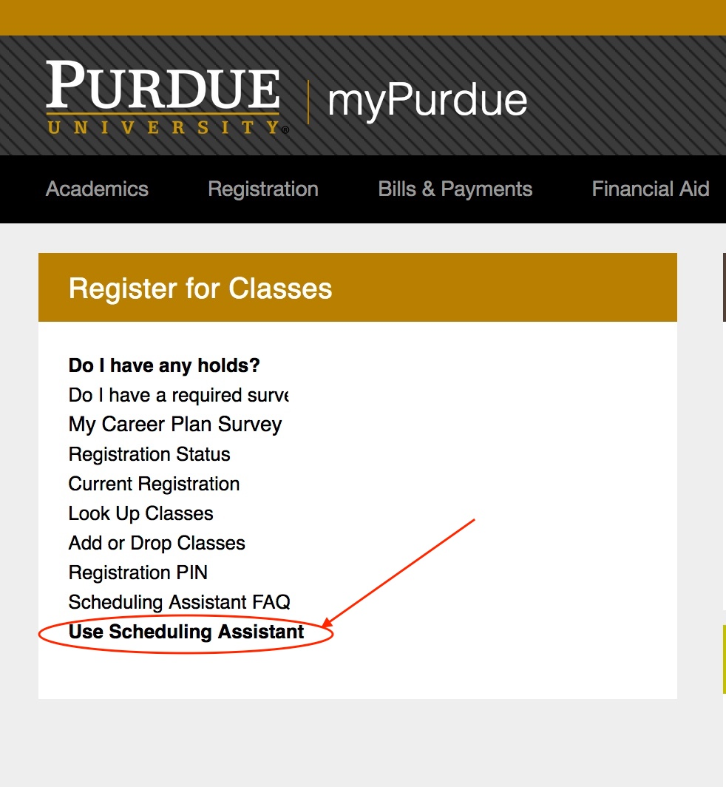{:class='screenshot'}

 

You will then be prompted to enter the registration PIN you received from your advisor.

 

{:class='screenshot'}

 

If you do not know your PIN, select the ‘**Cancel**’ button and use the Scheduling Assistant without the ability to submit the course schedule created to myPurdue.  If the ‘**Submit Schedule**’ button is present and you have not successfully entered your PIN, you will be prompted to enter your PIN when the button is pressed.  If you do not correctly enter your PIN at this time, the request will not be submitted.

 

Review the ‘**Session**’ in the upper right corner to ensure the correct term is being used for registration.

 

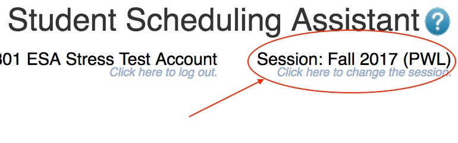{:class='screenshot'}

If the term listed is incorrect, click on the term that is listed.  If there are multiple terms available for scheduling, a dialog with term choices will appear.  Select the term in which you want to register.

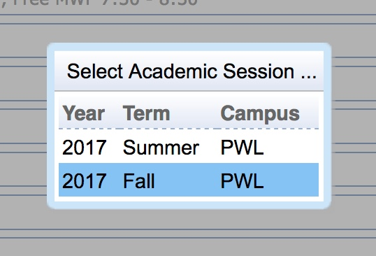{:class='screenshot'}

The term in the upper right hand corner will reflect the term you selected.

 

 

## Configuring Your Course Requests

 

Depending on the status of your course registration, there are two possible screens you may be taken to when you enter the Scheduling Assistant.

 

### Case 1: not previously registered for any courses

 

If you have not previously registered for any courses, the Student Scheduling Assistant will display the Course Requests grid for entering your course requests.

 

{:class='screenshot'}

 

If you have an existing plan in myPurduePlan, you can use the ‘**Degree Plan**’ button from the Course Requests grid to import courses from your myPurduePlan planner.

 

Enter all courses you wish to take in the Course Requests grid.  You should enter the courses in descending order from your highest priority to your lowest priority.  If there is an alternative to any specific course you want to take, you can enter that information by using the ‘**+**’ sign in the text box with the course.  This will add an indented line underneath the course request that can be used enter an alternative course request.  The ‘**+**’ sign can be selected as many times as needed.   Also, if you want to take a specific number of courses in order to make progress toward a degree, you may request a set of alternative courses that are acceptable if any course in the prioritized list is not available.

 

From the Course Requests grid you can add courses to your list by clicking the magnifying glass icon ({:class='icon'}). This brings up a dialog that allows you to search for courses.  You can enter a course number or a set of words that may be found in the title of the course.  The Course Finder dialog will display a set of courses that match your search criteria. You can click on each course listed to see more details about it from the course catalog.

 

{:class='screenshot'}

 

Once you have found the course you are looking for, double click the course to select it.  This closes the window and populates the appropriate field in the Course Requests grid.

 

In addition to using the magnifying glass icon ({:class='icon'}) to bring up the Course Finder dialog, you can type your search directly into an input box and it will show you a drop down list of the courses that match your search criteria.  You can then select a course from the drop down.

 

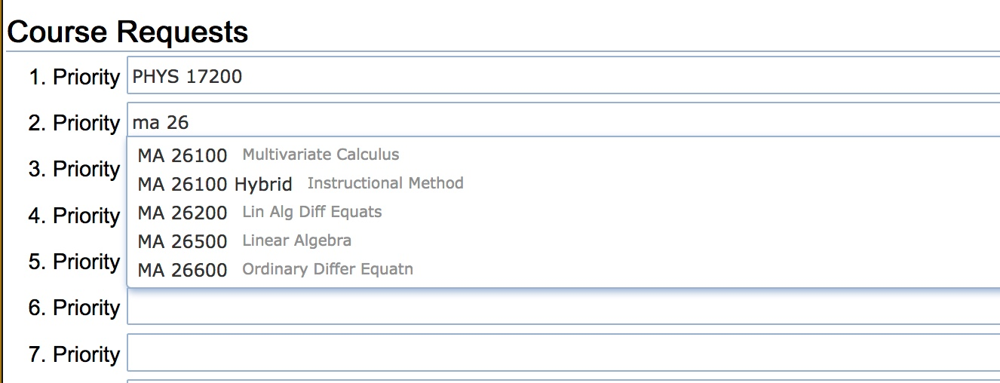{:class='screenshot'}

 

 

**Note:**  The Student Scheduling Assistant may suggest multiple suffixed course offerings for a course number.  These are different variations of the same course.  These suffixes will not be shown in myPurdue.  You should pay attention to the suffix to make sure you select the correct version for your needs.  For example, if you want to take an honors version of a course, you would pick the one with an H suffix and the word “Honors” in the title.

 

 

 

You can also use the magnifying glass icon ({:class='icon'}) to enter free time requests from the course finder dialog.  To use the course finder dialog to enter a free time request, select the ‘**Free Time**’ tab and click on each half hour grid square that should be free and a free time request will be built in the text box.  Clicking on a grid square a second time will de-select it.  Press the ‘**Select**’ button or use the enter key to insert the free time request into the Course Requests grid.

 

{:class='screenshot'}

 

It is also possible to enter free time requests by typing them into the input box and selecting a suggestion.

 

**Note:** A high priority free time request may prevent the Student Scheduling Assistant from placing you into a lower priority course if that course meets during the requested free time.

 

 

 

Continue filling in the course request input boxed until you have entered all your course and free time requests.

 

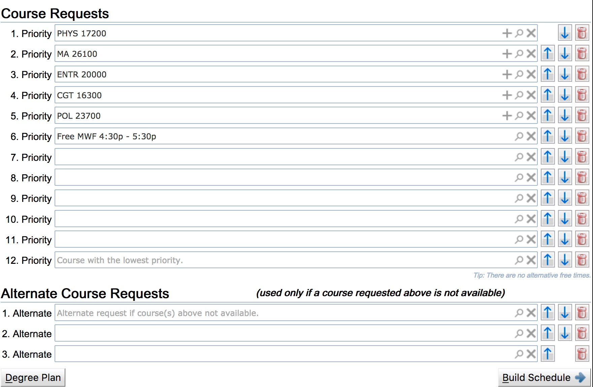{:class='screenshot'}

 

Once you have entered your course and free time requests, press the ‘**Build Schedule**’ button to get a suggested schedule.

 

{:class='screenshot'}

 

 

 

### Case 2: you have an existing schedule

 

If you have an existing schedule, you will be shown your current list of classes.

 

{:class='screenshot'}

 

If you wish to add or remove courses from your schedule you can navigate to the Course Requests grid as described below.

 

 

 

When adding classes to an existing schedule, the scheduling assistant tries to retain existing time placements; however, it will move class times in order to provide a more complete schedule.  Because of this, if you wish to guarantee that a time is retained on a particular class, you should select the lock icon ({:class='icon'}) next to that class before navigating to the Course Requests grid.

 

{:class='screenshot'}

 

**Note:**  If you have been administratively pre-enrolled in courses such as those affiliated with learning communities, it is strongly recommended that you lock all associated courses to ensure the assistant does not try to move you into a different section prior to navigating to the Course Requests grid.

 

To navigate to the Course Requests grid and modify your course request, select the ‘**Add/Drop Courses**’ button.

 

{:class='screenshot'}

 

 

 

The Course Requests grid will list all courses you are currently registered for with a grey background and dark grey checkmark (

{:class='screenshot'}) next to them.

 

{:class='screenshot'}

 

You can make changes to this list by adding courses to the empty spots in the grid.  To remove courses use the trashcan icon ({:class='icon'}) to the right of the line associated with the course. To change priorities use the up ({:class='icon'}) and down ({:class='icon'}) arrows. To submit a free time request use the magnifying glass icon ({:class='icon'}) to take you to the Course Finder dialog where you can build a free time request. More experienced users may also enter a time statement covering the desired free time. To pull in additional course requests from your myPurduePlan use the ‘**Degree Plan**’ button.

 

For more detailed information on the actions you can take on the Course Requests grid see **Case 1** above.

 

Once you have modified your course and free time requests, press the ‘**Build Schedule**’ button in the bottom right hand corner of the page to get a suggested schedule.

 

{:class='screenshot'}

 

 

 

# Registering For Your Suggested Schedule

 

Once you have a suggested schedule, you should note the number of available spaces in the classes.

 

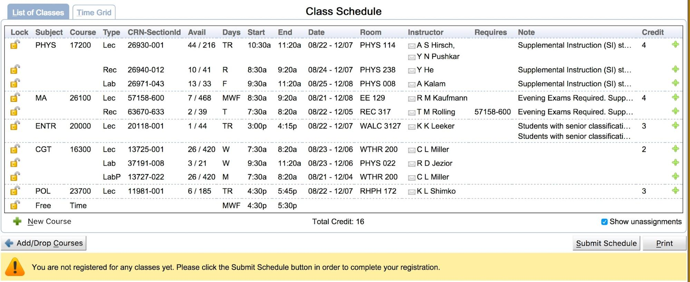{:class='screenshot'}

 

The information in the ‘**Avail**’ column of the ‘**List of Classes**’ tab of the Class Schedule will list how many seats are still available out of the total seats available for a section. If a class is filling up and the time is acceptable to you, you may want to complete registration for the class quickly by pressing the ‘**Submit Schedule**’ button in the bottom right hand corner of the page so that you are officially enrolled in that class.  Otherwise, other students seeking this class may enroll in the last the available space ahead of you.

 

{:class='screenshot'}

 

**Note:**  If a class requires permission of an instructor or department, it will be noted in the ‘**Requires**’ column for that class.  The permission must be recorded in the system before you will be able to successfully enroll in the class.

 

You can also view your suggested schedule as a time grid by selecting the ‘**Time Grid**’ tab.

 

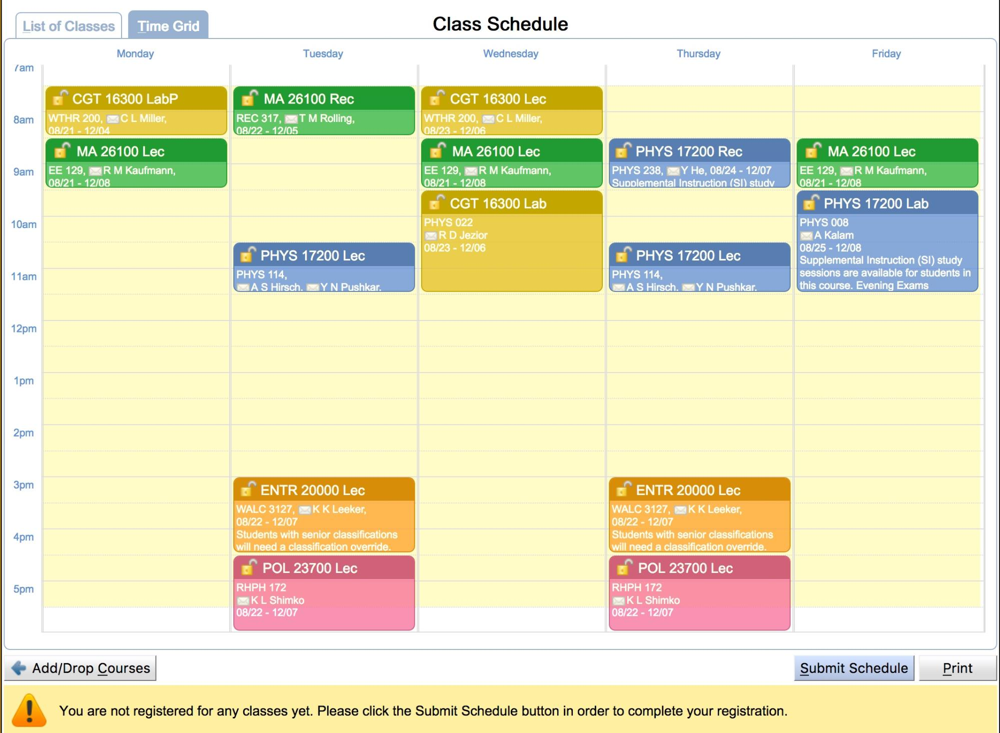{:class='screenshot'}

 

Review the suggested schedule.  If you are happy with the schedule, press the ‘**Submit Schedule**’ button.

 

{:class='screenshot'}

 

This will send the request to myPurdue for additional validation, and you will be registered for all courses that pass validation by myPurdue.  If any course fails validation, information about the failure will be shown in the lower portion of the screen.  All successful registrations will be displayed immediately in the Scheduling Assistant.  For some examples of messages that may be seen when myPurdue validation fails go to the ‘**Messages from myPurdue**’ section at the end of this document.

 

Alternatively, you can enter the CRNs listed on the ‘**List of Classes**’ tab into myPurdue to register for the classes.  The CRN is the first 5 digits of the number listed in the CRN column.  The three digits after the ‘-’ are the three digit section number used by myPurdue.

 

{:class='screenshot'}

 

**Note:**  In UniTime the same CRN may be listed multiple times for a course.  If a CRN is listed multiple times, it only needs to be entered into myPurdue once.

 

 

 

Once you have registered for courses in myPurdue, that information will flow back into UniTime and after a short delay, should be reflected in the Student Scheduling Assistant.  You should be able to see this update by pressing the ‘**Student Scheduling Assistant**’ menu item or refreshing the page.  If this is the first time you have ever registered at Purdue, you may need to log out and log back in the see your enrollments.  If you have used the ‘**Submit Schedule**’ button in the Scheduling Assistant, and all sections were successfully enrolled, you will see a ‘**Success!**’ message and each section will have a green checkmark (

{:class='screenshot'}) listed next to it.

 

{:class='screenshot'}

 

**Note:**  If you receive an error message rather than a ‘**Success!**’ message, it is your responsibility to look at the error message and take the appropriate action.  If you are unsure what action to take, consult your academic advisor.

 

 

 

## Making Changes to Your Schedule

 

If you wish to make changes to your schedule, first decide if there are any classes that you want to keep at the suggested time.  Any such classes should be locked.  This can be done on the ‘**List of Classes**’ tab by clicking the lock icon ({:class='icon'}) next to a class.  You do not have to lock any of the classes.

 

{:class='screenshot'}

 

It is also possible to lock a class on the ‘**Time Grid**’ tab table by clicking the lock icon ({:class='icon'}).

 

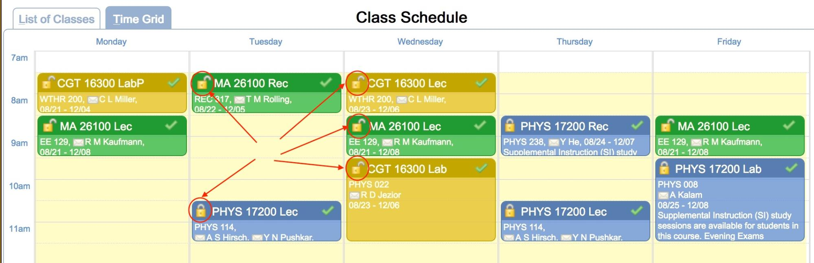{:class='screenshot'}

 

Classes can be unlocked at any time by clicking the lock icon a second time.

 

If you want to change the courses in your suggested schedule, you can press the ‘**Add/Drop Courses**’ button and go back to the Course Requests grid.

 

Another method for adding a course to your schedule is to click the green plus icon ({:class='icon'}) with the ‘**New Course**’ label next to it at the bottom left of the ‘**List of Classes**’ tab.

 

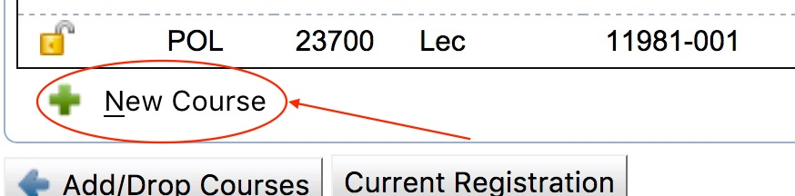{:class='screenshot'}

 

This will bring up the new course selection dialog.

 

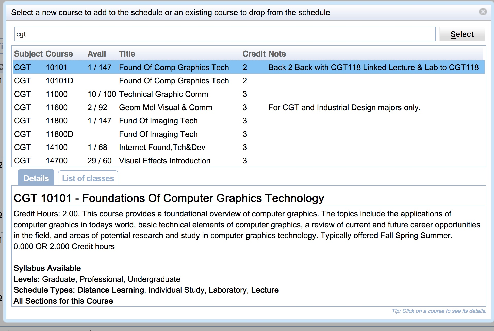{:class='screenshot'}

 

Once you have selected the course you want to add, it will take you to the Choices dialog which shows you the options for adding the course into your schedule.  The course you are adding will be shown in blue. If there are any changes to the schedule for other courses, they will be shown in black.  If there are any courses that will be removed from the schedule, they will be shown in red.  To complete the addition of the course, select the choice you want.

 

{:class='screenshot'}

 

It is also possible to delete a course from your schedule by clicking a section of the course on the ‘**List Of Classes**’ tab or the ‘**Time Grid**’ tab and selecting the ‘**Drop …**’ button in the Alternatives dialog.

 

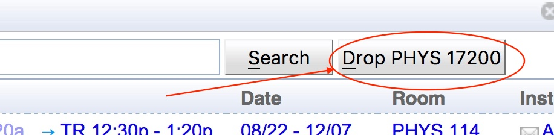{:class='screenshot'}

 

 

If you want to see the courses you are currently registered for, press the ‘**Current Registration**’ button.

 

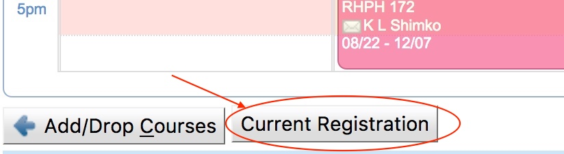{:class='screenshot'}

 

**Note:** Clicking on the ‘**Current Registration**’ button will discard any unsubmitted changes you have made to your schedule.

 

To change the time or location of a class, click on the class and the Student Scheduling Assistant will provide you with a list of alternatives for changes that can be made to move the class.

 

{:class='screenshot'}

 

This list may contain alternatives that shuffle one or more classes in addition to the individual class that was selected.  If you do not like any of the alternatives you can just click outside the window and no changes will be made to your suggested schedule.  If you like one of the alternatives, you can click on it and your suggested schedule will be updated to reflect the change.

 

**Note:**  If a class is offered at the same time in multiple rooms, the first alternatives will be for room changes for that class followed by time changes.

 

**Note:**  The best alternative for any relocation of a class is shown, not all possibilities.  The assistant does not show multiple rooms for a time move

 

**Note:** If a class becomes unassigned as a result of an alternative, it is shown in red.

 

**Note:**  The filter can be used to change the list of alternatives shown.  You can hover your mouse over the filter field to see instructions on how to use the filter.

 

When you mouse over an alternative, a pop-up of the schedule grid showing the complete schedule with the change will be displayed.

 

{:class='screenshot'}

 

Once you have selected a change, you are returned to the ‘**Time Grid**’ tab or the ‘**List of Classes**’ tab, and your schedule will be updated with the selection.

 

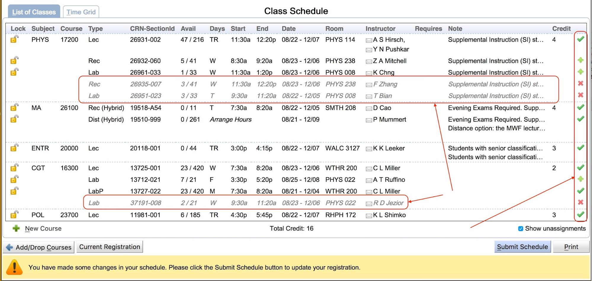{:class='screenshot'}

 

If you are already registered for classes and making changes to your suggested schedule you will see both the added and removed classes in the ‘**List of Classes**’ tab.  The added classes have a green plus icon ({:class='icon'}) in the last column.  The unchanged classes have a green check icon({:class='icon'}) in the last column.  The removed classes are in greyed italic font and have a red ‘X’ icon ({:class='icon'}) in the last column.  You can use these indicators to determine which CRNs will be added and dropped when the ‘**Submit Schedule**’ button is pressed to update your registration in myPurdue.  Once you have completed all of your changes to your schedule, click the ‘**Submit Schedule**’ button to submit your registration changes to myPurdue.

 

{:class='screenshot'}

 

## Printing Your Schedule

 

If you want to have a printed copy of your schedule, you can press the ‘**Print**’ button in the lower right hand corner and it will print to the local printer.  If a printed copy is not needed you can log out of the system.

 
{:class='screenshot'}

 

 

The print output formats your suggested schedule grid and class list into one document.

 

 

 

 

## Subscribing to a Calendar Feed of Your Schedule

 

If you would like to subscribe to a calendar feed of your schedule in UniTime, select the ‘**Personal Schedule**’ menu item.

 

{:class='screenshot'}

 

Once you are on the Personal Schedule page select the ‘**Export**’ button on the right hand side of the page above the schedule.

 

{:class='screenshot'}

 

This will display a menu of exports that can be run for your personal schedule.  Select the ‘**Export iCalendar**’ item from the list of options displayed.

 

{:class='screenshot'}

 

 

 

A dialog will appear with a URL that can be used with your calendar tool of choice to subscribe to your personal schedule for the academic term.  Follow your calendaring tool’s instructions for subscribing to the calendar URL provided.

 

{:class='screenshot'}

 

**Note:**  Subscribing to the URL provided rather than just importing it into your calendar allows your calendar to be automatically updated if changes are made to the courses in your schedule and when evening and final exams are published.

 

 

 

 

 

 

 

 

 

## Messages from myPurdue

 

The Scheduling Assistant communicates with myPurdue to validate your PIN when you first begin using it and it also communicates with myPurdue to validate your schedule request and enroll you into the courses that pass validation when the ‘**Submit Schedule**’ button is pressed.  This section contains some samples of messages that may be returned to you as a result of the interaction between myPurdue and the Scheduling Assistant.  The examples are not meant to be an exhaustive collection of all messages that could be received.  You need to look at any error messages returned and determine the action that you need to take.  If you are unsure what action needs to be taken, you should contact your advisor.

 

When you first click on the ‘**Scheduling Assistant**’ menu item, it will check with myPurdue to see if you are eligible to register for classes at that time.  The best situation is you are eligible to register at that time and you have entered a valid PIN.  In this case, no message will appear at the bottom of the screen and when you are on the ‘**List of Classes**’ tab or the ‘**Time Grid**’ tab you will have the ‘**Submit Schedule**’ button available to you.  If you have not submitted your schedule to myPurdue, there will also be a message stating:

 

***You have made changes to your schedule.  Please click the Submit Schedule button to update your registration.***

 

reminding you to submit it at the bottom of the screen.

 

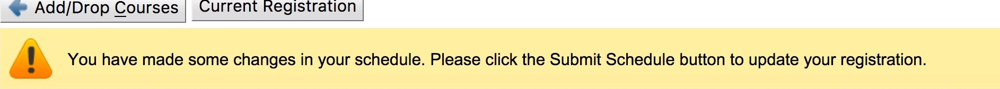{:class='screenshot'}

 

The ‘**Submit Schedule**’ button allows you to transmit your schedule to myPurdue once you are happy with it.  The ‘**Submit Schedule**’ button sends your schedule request to myPurdue for additional validation and registers you to all courses that pass validation.  If you have requested a course(s) to be dropped you will see the following message asking for confirmation before the system proceeds to drop the course(s):

 

***Together with other registration changes, the course ... will be dropped. Do you want to proceed?***

 

{:class='screenshot'}

 

When all courses pass validation and your are registered into your courses you receive a **‘Success!**’ message in response from myPurdue and the courses have a check icon({:class='icon'}) in the last column indicating the you are enrolled.

 

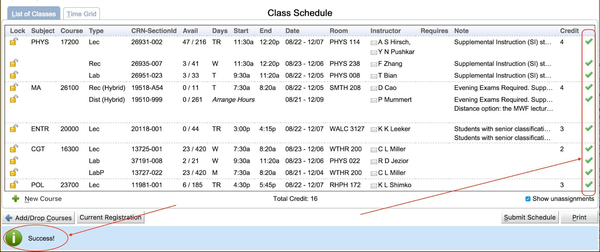{:class='screenshot'}

 

As mentioned earlier, when you first enter the Scheduling Assistant, it communicates with myPurdue to see if you are eligible to register for classes at that time.  There are a variety of messages that may be returned if you are not eligible to register for classes at the time the check is made.  Messages from myPurdue are displayed to you at the bottom of the screen.  If you not eligible to register, you can still use the Scheduling Assistant to look at potential course schedules, in some cases the ‘Submit Schedule’ button will still be present.  At the time you click the ‘Submit Schedule’ button, it will perform the eligibility to register checks again, if the checks are successful, it will attempt to register you to your course schedule, if the checks fail, you will receive an error message.

 

Below is a sampling of messages that may be returned from myPurdue indicating you will not be able to register for classes.

 

 

***Your PIN is invalid.***

 

{:class='screenshot'}

 

 

***Holds prevent registration.***
***Student Status prevents registration.***

{:class='screenshot'}

 

 

If a course request fails to pass validation by myPurdue when you press the ‘**Submit Schedule**’ button, messages will be displayed at the bottom of the screen noting the reason the validation failed and the courses themselves be listed in red and will still have a plus icon ({:class='icon'}) as well as an exclamation icon ({:class='icon'}) in the last column to indicate a problem occurred.  Any courses that passed validation will have a check icon ({:class='icon'}) in the last column indicating you were successfully registered for that course.

 

There are various reasons a course request may not pass myPurdue validation.  It is your responsibility to look at the message returned and take the appropriate action.  If you are unsure what to do, you should contact your advisor.

 

Below are a few samples of messages you may receive from myPurdue when a course request does not pass validation.

 

***…:  Permission from Department Prerequisite error.  See the Schedule of Classes.***

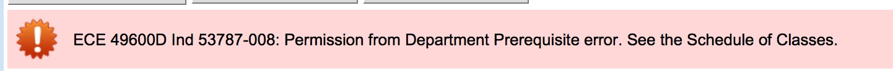{:class='screenshot'}

 

 

***…:  Field of Study Restriction - Major***

{:class='screenshot'}

 

 

***…: Prerequisite error.  See the Schedule of Classes.***

{:class='screenshot'}

 

 

 
