### Table of Contents
{:.no_toc}
* table
{:toc}

# Student Scheduling Dashboard Manual

The purpose of the document is to provide a user guide for the functionality contained within the UniTime Student Scheduling Dashboard.  The Student Scheduling Dashboard is available to users with a variety of User Roles within the UniTime system.  The Scheduling Dashboard is only available to users with the following roles:

* Administrative Roles

* Student Advisor

* Department Schedule Manager

* Instructor

* View All

* View Department 

Depending on the User Role which is used to access the Scheduling Dashboard differing functionality is available.  In general the Scheduling Dashboard allows users to see data in the following broad categories:

* Course Schedule Data

* Student Data

* Change Log Data Related to Student Registrations

Depending on the User Role assigned to a user, access to the data in the above categories may be limited or not available.  This guide will make an effort to point out which data and actions are available to the various User Roles an individual may have.

**Note:** This documentation will use the terms UniTime Student Scheduling Dashboard, UniTime Scheduling Dashboard, Student Scheduling Dashboard, Online Student Scheduling Dashboard interchangeably.

# Accessing the Student Scheduling Dashboard

When a user logs into UniTime, if the users default user role has access to the Scheduling Dashboard in the academic session in which the user is logged in, then a menu item for The Scheduling Dashboard should be visible.  If the Scheduling Dashboard is not visible, then the user may need to switch to a different role or a different academic session.

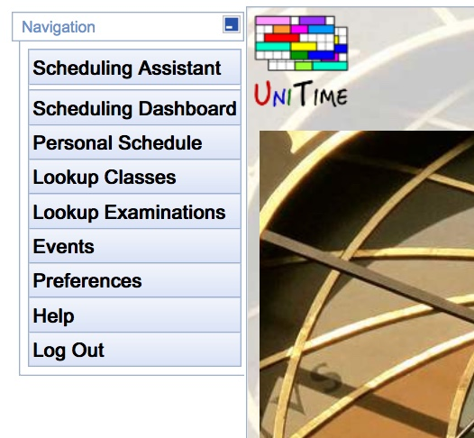{:class='screenshot'}

The user can see their role listed under their name at the top of the page and see the academic session is listed in the top right hand corner of the page.

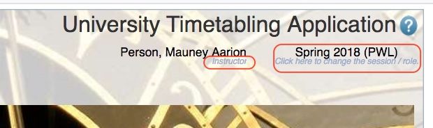{:class='screenshot'}

The role listed under the user’s name determines the functionality available to the user in the Scheduling Dashboard.  Before selecting the Scheduling Dashboard menu item, the user should review their user role and academic session to ensure they are accessing the Scheduling Dashboard with the functionality for the role they are operating within and the academic term they wish to work with.

If a user needs to change the role or academic session this can be accomplished by clicking on the label for the academic session.

{:class='screenshot'}

This brings up the “Select User Role” page.  The user can then review the combinations of roles and academic sessions available to them and select the one to use.  For purposes of this documentation, the user will select their “Student Advisor” role.

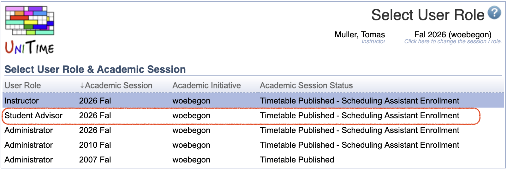{:class='screenshot'}

Once a role is selected, the role listed under the user’s name will be updated to reflect the selected role. The academic session listed in the upper right hand corner will reflect the selected academic session.

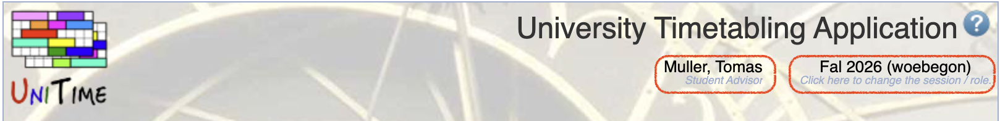{:class='screenshot'}

Once the user has determined they are using the desired user role and academic session they can click the “Scheduling Dashboard” menu item.

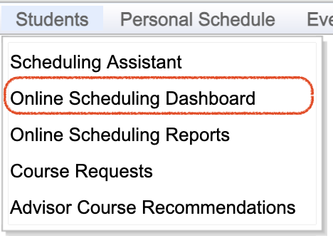{:class='screenshot'}

This will take the user to the “Online Student Scheduling Dashboard” page.

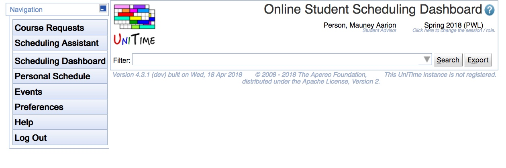{:class='screenshot'}

# Using the Student Scheduling Dashboard Filter

The filter at the top of the “Online Student Scheduling Dashboard” page controls the search criteria used to display data on the page.  When the user accesses the “Online Student Scheduling Dashboard” page for the first time the filter will be blank. Once the user has entered a search criteria in the filter and performed a search the page will remember the last search performed by the user and automatically populate the filter with that search criteria

the next time the user accesses the page.

**Note:** In addition to any search criteria entered into the Filter, the data displayed in the Scheduling Dashboard is also filtered by the access to the data granted by a user’s role.

**Note:** It is very important for the user to enter search criteria into the filter.

If the user enters no search criteria, the Online Student Scheduling Dashboard will return data for all students and all courses.  This returns a very large volume of data and the user’s browser will struggle or fail to render the data returned.

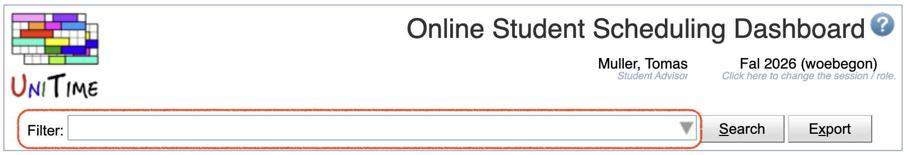{:class='screenshot'}

## Typing into the Filter

If the user knows the data they wish to search for they can type the search criteria directly into the filter and it will begin to show “suggestions” for filter parameters.

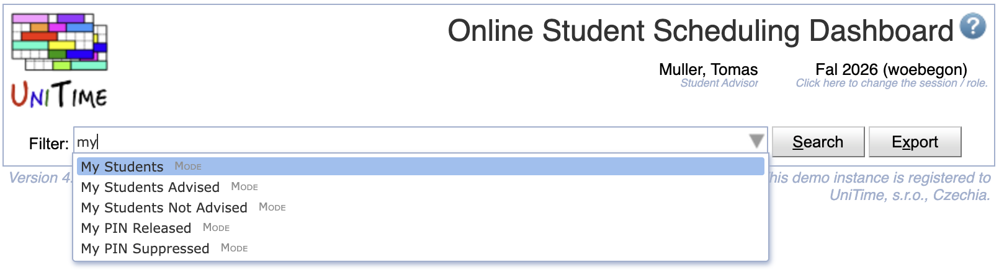{:class='screenshot'}

The user can then select an item shown in the “suggestions” or the user can continue to type and press enter.  This will then show the search criteria item with a colored background that indicates the search criteria been added to the filter.

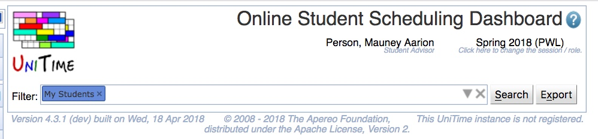{:class='screenshot'}

Typing into the filter also provides the ability to add search criteria that are not available from the Filter Drop Down.  The following tags are the additional tags (search categories) available to the user when typing into the Filter:

* **credit:**  - this tag allows the user to filter on the number of credits the students are registered for, e.g., ‘credit:18..22’ would returns data for students who are registered for 18 through 22 credits.

* **overlap:** - this tag allows the user to filter on the amount of time the students have overlapping classes in their schedules, e.g., ‘overlap:>=30’ would return students who have 30 or more minutes of overlapping classes.

* **time:** - this tag allows the user to filter on the start time of classes, e.g., ‘time:8:30pm’ returns records for all students that have at least one class that begins at 8:30 pm.

* **room:** - this tag allows the user to filter on the building or room a class is in, e.g., ‘room:"CL50 224"’ would return all records where there is a class a student is enrolled into that meets in the room CL50 224.  ‘room:CL50’ would return all records where there is a class a student is enrolled into that meets in the building CL50.

* **limit:** - this allows the user to limit the number of records displayed to a maximum of the number specified, e.g., ’limit:5’ would limit the number of records displayed to 5.

* **operation:**  - this is only valid for the Change Log Tab.  It allows the user to filter the data on the Change Log Tab by the operation, e.g., ‘operation:eligibility’ would retrieve only change log entries associated with eligibility checks.

* **result:**  - this is only valid for the Change Log Tab.  It allows the user to filter the data on the Change Log Tab by the result, e.g., ‘result:failure’ would retrieve only change log entries with a result of failure.

* **message:**  - this is only valid for the Change Log Tab.  It allows the user to filter the data on the Change Log Tab by a substring of the message returned, e.g., ‘message:changed’ would return any change log entries whose message contains the word changed.

* **over:** - this is only valid for the Change Log Tab.  It allows the user to filter the data on the Change Log Tab by the amount of time in seconds the API call associated with the action in the change log took to complete, e.g., over:30 returns any actions in the change log that took over 30 seconds to complete.

In addition to the tags described above, it is also possible to use the following operations by typing into the filter:

* **and** - used to indicate the statements on each side of the “and” must be true, e.g. ‘credit:>=15 and overlap:>20’ would return all records where students are enrolled in 15 or more credit hours and have more than 20 minutes of overlapping class time.  

* **or** - used to indicate that one of the statements on each side of the “or” must be true, e.g., ‘credit:<5 or credit:>18’ would return records where students were either enrolled in less than 5 credit hours or more than 18 credit hours.

* **()** - used to group a set of “and” or “or” operations to create more complex queries, e.g., “(credit:<5 or credit:>18) and overlap:>10” would return records where students were enrolled in classes that overlapped for more than 10 minutes and were enrolled in either fewer than 5 credits or more than 18 credits.

* **>** - used with tags that take numbers.  This will return records with a value greater than the number that follows, e.g. ‘overlap:>5’ would return all records where a student has enrolled in more than 5 minutes of overlapping classes.

* **>=** - used with tags that take numbers.  This will return records with a value greater than or equal to the number that follows, e.g. ‘overlap:>=5’ would return all records where a student has enrolled in 5 or more minutes of overlapping classes.

* **<** - used with tags that take numbers.  This will return records with a value less than the number that follows, e.g. ‘credit:<5’ would return all records where a student has enrolled less than 5 credit hours.

* **<=** - used with tags that take numbers.  This will return records with a value less than or equal to the number that follows, e.g. ‘credit:<=5’ would return all records where a student has enrolled 5 credit hours.

* **..** - used with tags that take numbers.  This allows the user to specify a range of values, e.g. ‘credit:15..20’ would return student enrolled in from 15 through 20 credit hours.

The user can repeat this process to add as many search criteria to the filter as desired. The user can also use the Filter Drop Down to add additional search criteria.  When the user is satisfied with their search criteria they press the “Search” button to perform the search.

## Using the Filter Drop Down

If the user is unsure of the search they need to use, they can use the drop down within the filter to enter their search criteria.  To access the drop down within the filter the user clicks on the inverted triangle on the right hand side of the filter box.

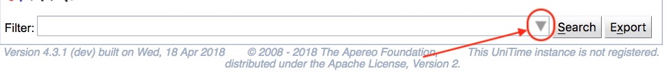{:class='screenshot'}

This causes the Filter Drop Down to appear.

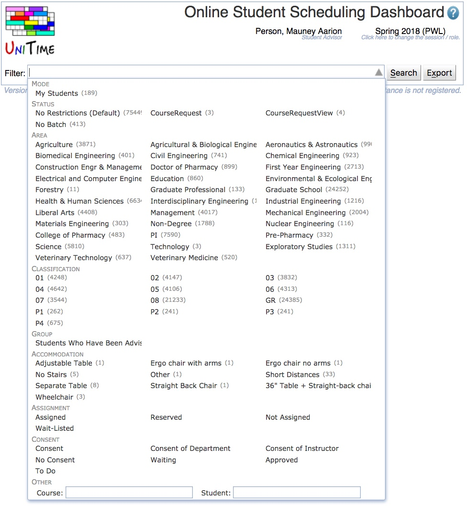{:class='screenshot'}

The filter drop down lists the various pieces of data available to be used as search criteria for retrieving data within the Scheduling Dashboard.

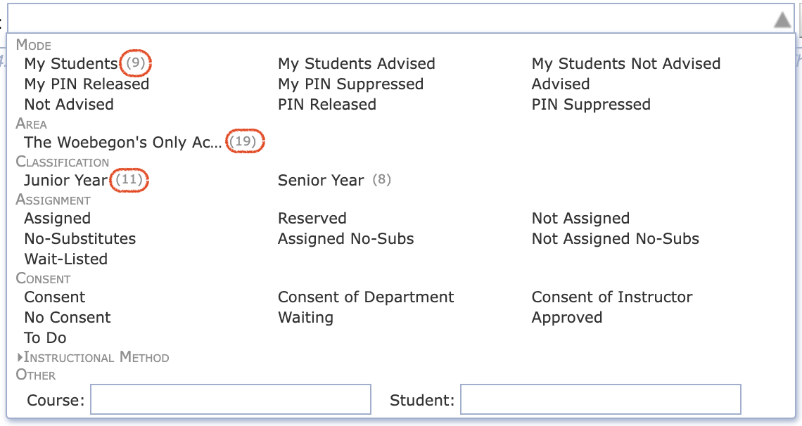{:class='screenshot'}

When known, next to each item that can be selected is a count of records that will be returned as a result of using that item as a search criteria in conjunction with the other items already selected in the search criteria.

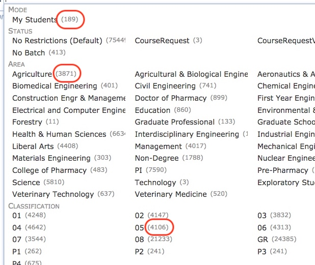{:class='screenshot'}

At the bottom of the filter is a text box for entering “Course” search criteria (e.g., COM 11400) and a text box for entering “Student” search criteria (e.g., John Doe).

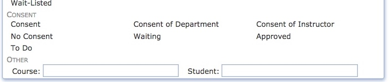{:class='screenshot'}

To build a query the user selects items from the Filter Drop Down.  As the user selects items in the Filter Drop Down, the possible items to select within the drop down change dynamically to reflect the restrictions placed on the search.

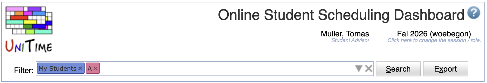{:class='screenshot'}

When the user is done building their search criteria they click outside of the Filter Drop Down to return to the Filter Box.

{:class='screenshot'}

The user can then type in additional search criteria if they wish.  When the user is satisfied with their search criteria they press the “Search” button to perform the search.

## Clearing the Filter

The search criteria entered in the Filter can be cleared by either backspacing over the criteria or by pressing the x icon on the right hand side of the filter box.

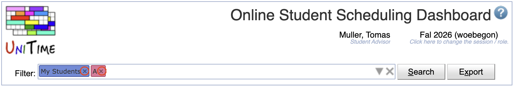{:class='screenshot'}

In addition to backspacing over a search criteria item it is also possible to remove a single search criteria item by click the x icon on the right side of the item.

{:class='screenshot'}

# Using the Student Scheduling Dashboard

The data retrieved by doing a search using the criteria entered in the Filter is available to the user in a set of tabs.  Each tab provides a specific view into the data.  The Enrollments Tab shows the data organized by Course Offering.  The Student Tab shows the data organized by Student.  The Change Log Tab, which is not available to all users, shows the change log data associated with the information retrieved by the search criteria.  The user can switch between the Enrollments Tab, the Students Tab and the Change Log Tab by clicking the desired tab name.

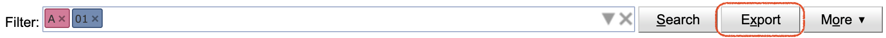{:class='screenshot'}

The data displayed on the selected tab of the Student Scheduling dashboard may be exported in comma separated format by pressing the “Export Button” to the right of the Filter.

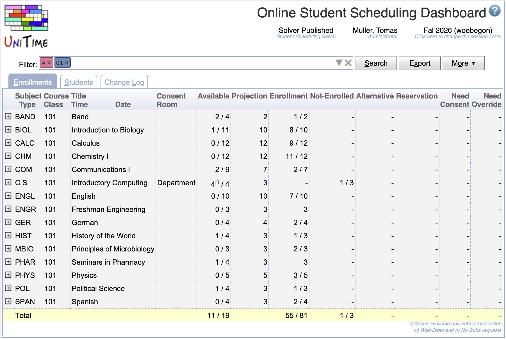{:class='screenshot'}

## Using the Enrollments Tab

The Enrollments Tab provides a course centric view into the student scheduling data displayed in the Dashboard.  This tab displays the data grouped by course.

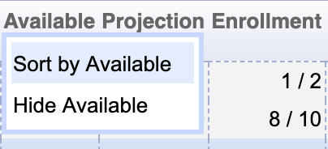{:class='screenshot'}

The data on the Enrollments Tab can be sorted by any column listed on the table.  To do this click on the column label for the column to sort.  The first click on the column sorts the table by the data in ascending order.  The second click on the column sorts the table by the data in descending order.  It is also possible to use the drop down menu on the “More” button to select the column to sort.

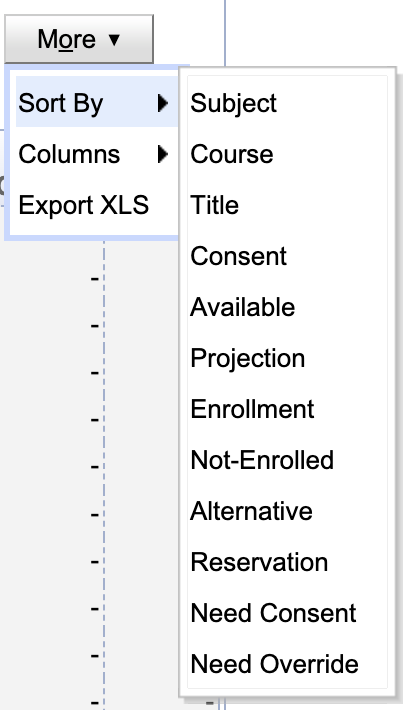{:class='screenshot'}

If the user clicks on the plus icon (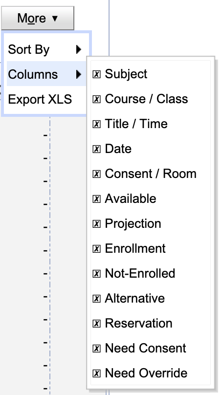{:class='icon'}) next to a course it will expand the data displayed to include each class section that makes up the course.

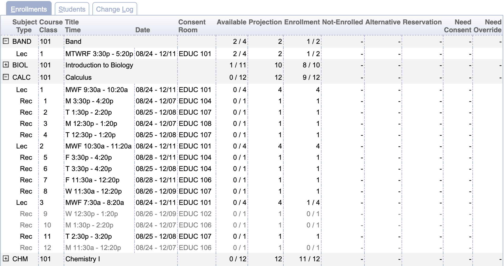{:class='screenshot'}

Once the class data is expanded, if the user clicks on the minus icon (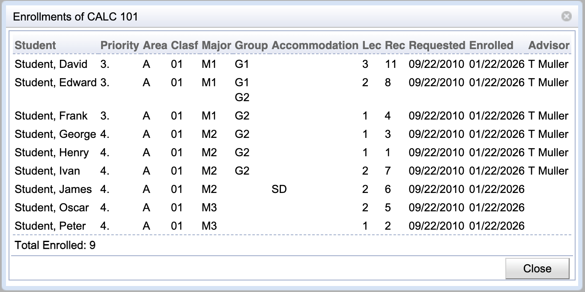{:class='icon'}) next to a course it will hide the class section data.

### Interpreting the Data on the Enrollments Tab

The Enrollments Tab was designed to display a large amount of data in a compact format.  The following is a description of each data column displayed on the page:

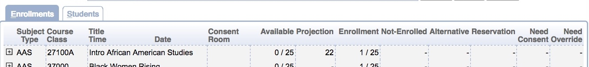{:class='screenshot'}

* **Subject** - This label applies to the course level data displayed.  This is the subject area abbreviation for the course displayed.

* **Type** - This label applies to the individual class sections listed under a course if the plus icon (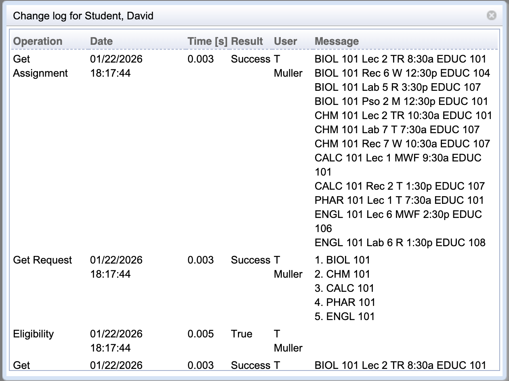{:class='icon'}) next to it has be clicked to show the class section data.  If a class section is displayed, its instructional type will be listed in this column.

* **Course** - This label applies to the course level data displayed.  This is the course number for the course displayed.

* **Class** - This label applies to the individual class sections listed under a course if the plus icon ({:class='icon'}) next to it has be clicked to show the class section data.  If a class section is displayed, the value here is the external id of the class.

* **Title** - This label applies to the course level data displayed. This is the title for the course displayed.

* **Time** - This label applies to the individual class sections listed under a course if the plus icon ({:class='icon'}) next to it has be clicked to show the class section data.  If a class section is displayed, its time statement is listed here.

* **Date** - This label applies to the individual class sections listed under a course if the plus icon ({:class='icon'}) next to it has be clicked to show the class section data.  If a class section is displayed, the dates it is offered are listed here.

* **Consent** - This label applies to the course level data displayed.  If a course requires a student to obtain consent of the department or instructor, the type of consent required is listed here.

* **Room** - This label applies to the individual class sections listed under a course if the plus icon ({:class='icon'}) next to it has be clicked to show the class section data.  If a class section is displayed and it is assigned to a room, the room is listed here.

* **Available** - This label applies to both the course and class level data.  The column has two numbers separated by a slash (/).  The first number is the total number of unused space in the course or class.  The second number is the size limit for the course or class.  For example: 5 / 25 would mean there are 5 available spaces in a class that holds 25 students.

* **Projection** - This label applies to both the course and class level data.  The column lists the UniTime projected number of enrollments for a course or class.

* **Enrollment** - This label applies to both the course and class level data. When the search criteria used in the Filter does not restrict the student population then a single number which is the total number of students enrolled in the course or class is displayed.  For example, if there 20 students enrolled in a class then the number 20 would be displayed.  When the search criteria used in the Filter restricts the student population for the data displayed in this column, there will be two numbers separated by a slash (/).  For example, if 3 of the students in the population retrieved by the search criteria in the Filter are enrolled in the class and in total there are 20 students enrolled in the class, then the number displayed would be 3 / 20.

* **Not Enrolled** - This label applies to both the course and class level data. When the search criteria used in the Filter does not restrict the student population, then a single number equal to the total number of students who have the course listed in their course request but are not enrolled in the course, is displayed.  For example, if there 2 students who requested a course but did not receive it, then the number 2 would be displayed.  When the search criteria used in the Filter does restrict the student population for the data displayed in this column, there will be two numbers separated by a slash(/).  For example, if 1 of the students in the population retrieved by the search criteria in the Filter requested the course but did not receive it and in total there are 2 students who requested the course but did not receive it, then the number displayed would be 1 / 2.

* **Alternative** - This label applies to both the course and class level data. When the search criteria used in the Filter does not restrict the student population then a single number which is the total number of students who have the course listed in their course request as an alternative is displayed.  For example, if there 5 students who requested a course as an alternative then the number 5 would be displayed.  When the search criteria used in the Filter does restrict the student population for the data displayed, this column will have two numbers separated by a slash(/).  For example, if 2 of the students in the population retrieved by the search criteria in the Filter requested the course as an alternative and in total there are 5 students who requested the course as an alternative, then the number displayed would be 2 / 5.

* **Reservation** - This label applies to both the course and class level data. When the search criteria used in the Filter does not restrict the student population, a single number equal to the total number of students who have been placed into the course or class as the result of a reservation is displayed.  For example, if there were 3 students who were placed into a course as a result of a reservation then the number 3 would be displayed.  When the search criteria used in the Filter does restrict the student population for the data displayed the in this column will be two numbers separated by a slash(/).  For example, if 1 of the students in the population retrieved by the search criteria in the Filter was placed into a course as a result of a reservation and in total there are 3 students who were placed into a course as a result of a reservation, then the number displayed would be 1 / 3.

* **Need Consent** - This label applies to both the course and class level data. When the search criteria used in the Filter does not restrict the student population then a single number which is the total number of students who required some form of consent to enroll in the course or class is displayed.  For example, if there were 4 students who required some form of consent to enroll in a course then the number 4 would be displayed.  When the search criteria used in the Filter does restrict the student population for the data displayed the in this column will be two numbers separated by a slash(/).  For example, if 2 of the students in the population retrieved by the search criteria in the Filter required some form of consent to enroll in a course and in total there are 4 students who required some form of consent to enroll in a course, then the number displayed would be 2 / 4.

* **Need Override** - This column is only populated if UniTime is integrated with a system that will inform UniTime of the need for overrides.  This label applies to both the course and class level data. When the search criteria used in the Filter does not restrict the student population then a single number which is the total number of students who require an override to enroll in the course or class is displayed.  For example, if there were 6 students who require an override to enroll in a course then the number 6 would be displayed.  When the search criteria used in the Filter does restrict the student population for the data displayed the in this column will be two numbers separated by a slash(/).  For example, if 2 of the students in the population retrieved by the search criteria in the Filter require an override to enroll in a course and in total there are 6 students who require an override to enroll in a course, then the number displayed would be 2 / 6.

### Drilling Down into the Student Data in the Enrollments Tab

Depending on the permissions granted to a user by their user role, a user may be able to drill down deeper into the data displayed on the Enrollments Tab.

#### The Enrollments Pop-Up

When the user clicks on a course or class that is listed on the Enrollments Tab an Enrollments pop-up window listing the students retrieved by the search criteria in the Filter is displayed. 

 **Note:** This pop-up may not display all students enrolled in the course or class if the search criteria in the Filter has restricted the set of students returned.

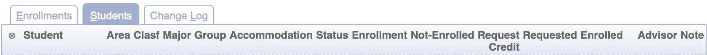{:class='screenshot'}

The Enrollments pop-up lists the following basic information about the students enrolled in the course or class the meet the search criteria in the Filter.

* **Student** - the name of the student

* **Priority** - the priority the student listed the course in their course request.

* **Area** - the college of the student

* **Clasf** - the classification of the student

* **Major** - the major of the student

* **Lec, Lab, Rec, Dist, etc.** - The instructional type of the section is the column label for the section the student is enrolled into.  The data is the External Id of the section the student is enrolled into.

* **Requested** - The date the student added the course to their course request.

* **Enrolled** - The date the student was enrolled into the course or class.

**Note:** The data in this pop-up can be sorted by clicking on any column label displayed.

#### The Classes Pop-up

From the Enrollments pop-up depending on the privileges granted in the user’s role, the user may be able to click on an individual student listed in the Enrollments pop-up and drill down to see the student’s course requests and/or schedule.

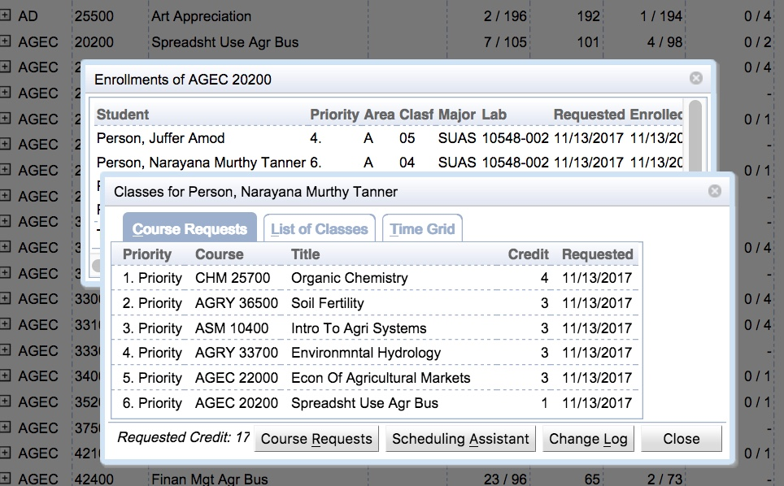{:class='screenshot'}

The Classes has multiple tabs and various buttons that may be displayed to a user depending on the permissions granted by their user role.  The possible tabs and buttons that may be displayed are as follows:

* **Course Requests Tab** - This tab lists the student’s course requests with alternates in priority order.

* **List of Classes Tab** - This tab displays the student’s course schedule in text format as the student would see it in the Scheduling Assistant.

* **Time Grid Tab** - This tab displays the student’s course schedule in time grid format as the student would see it in the Scheduling Assistant.

* **Course Requests Button** - If the student has a student status that allows the student to use the Course Requests Page and the user’s role has the permission to view the Course Requests Page as the student, then this button will be visible to the user.

* **Scheduling Assistant Button** - If the student has a student status that allows the student to use the Scheduling Assistant Page and the user’s role has the permission to view the Scheduling Assistant Page as the student, then this button will be visible to the user.

* **Change Log Button** - If the user’s role allows the user to view the student scheduling change log for the student, then this button will be visible to the user.  

* **Close** - This button closes the pop-up.

#### The Change Log Pop-up

From the Classes pop-up depending on the privileges granted in the user’s role, the user may be able to click the Change Log button in the Classes pop-up and drill down to see the change log associated with a student’s course requests and/or schedule.

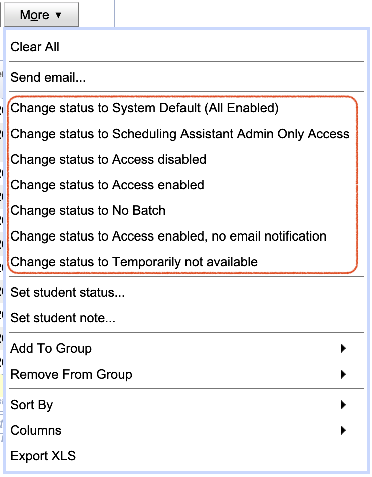{:class='screenshot'}

The Change Log pop-up lists the following information about the changes associated with a student:

* **Operation** - The operation used to make the change.

* **Date** - The date and time the change was made.

* **Time** - If the operation was timed, the amount of time it took to complete the operation.

* **Result** - An indicator of whether an operation was successful or not.

* **User** - The user who performed the operation.

* **Message** - A message associated with the operation that was performed.

**Note:** The data in this pop-up can be sorted by clicking on any column label displayed.

To get more detailed information about a change the user can click on the change which will bring up the Change Message pop-up.

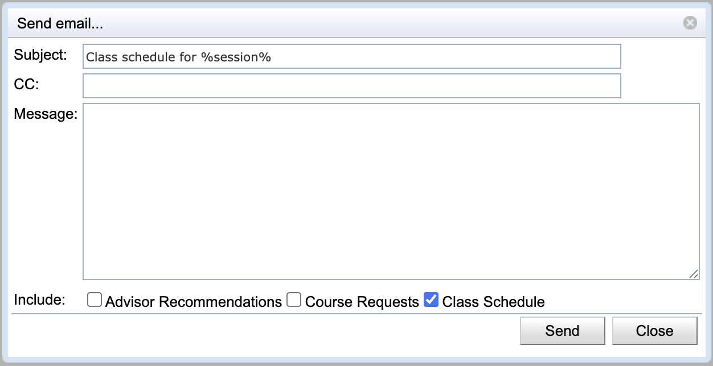{:class='screenshot'}

The data displayed on the Change Message pop-up for a change log entry will vary based on the change that occurred.  If the change log entry is associated with a student’s schedule, the entry will contain detailed information about the schedule before and after any changes were made.  The change log entry will also contain the JSON Proto Buffer of the message used to make the change.

## Using the Students Tab

The Students Tab provides a course centric view into the student scheduling data displayed in the Dashboard.  This tab displays the data grouped by student.  In addition, depending on the permissions granted to the user by their user role, it allows the user to perform actions on selected students listed in the dashboard.

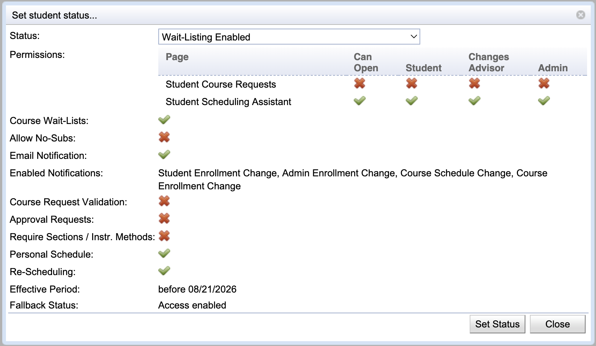{:class='screenshot'}

The data on the Students Tab can be sorted by any column listed on the table.  To do this click on the column label for the column to sort.  The first click on the column sorts the table by the data in ascending order.  The second click on the column sorts the table by the data in descending order.  It is also possible to use the drop down menu on the “More” button to select the column to sort.

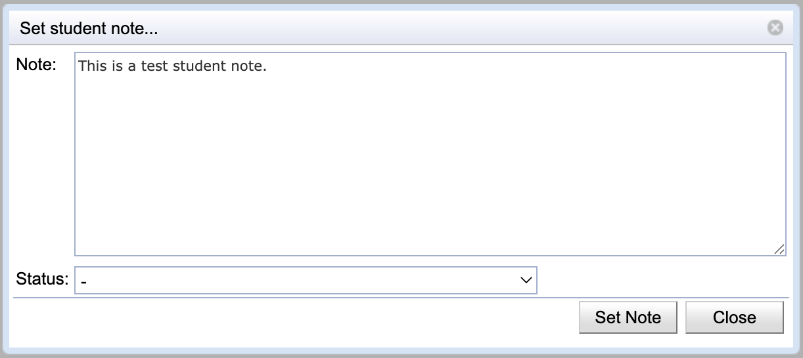{:class='screenshot'}

### Interpreting the Data on the Students Tab

The Students Tab was designed to display a large amount of data in a compact format.  The following is a description of each data column displayed on the page:

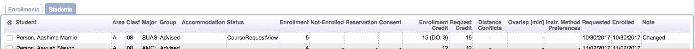{:class='screenshot'}

* **⊗** - This column contains a check box for each student that the user can perform an action on.  Clicking the ⊗ label after students have been selected brings up a list of actions the user can perform.

* **Student** - The name of the student

* **Area** - The college of the student

* **Clasf** - The classification of the student

* **Major** - The major of the student

* **Accommodation** - If a student requires an accommodation that affects their course schedule, then the code for the accommodation is displayed in this column.  This column is only visible if there is at least one student in the data returned by the search criteria in the filter that requires an accommodation.

* **Status** - If the student has a student scheduling status that has been set to a value other than the session default, then the value is displayed in this column.

* **Enrollment** - The number of courses the student is enrolled into.  This column is only visible if there is at least one student in the data returned by the search criteria in the filter that has an enrollment

* **Not-Enrolled** - The number of courses the student has requested but is not enrolled into.  This column is only visible if there is at least one student in the data returned by the search criteria in the filter that has at least one course request that the student is not enrolled into.

* **Reservation** - The number of reservations provided to a student to place the student into a particular course or class. This column is only visible if there is at least one student in the data returned by the search criteria in the filter that required a reservation.

* **Consent** - The number of courses the student is enrolled in that required some form of consent for the student to enroll into the course.  This column is only visible if there is at least one student in the data returned by the search criteria in the filter that required consent.

* **Enrollment Credit** - This column displays the total number of credits in which a student is enrolled.  If the student is enrolled into a configuration of a course that is online (DO) or hybrid (B/H) then the total credit of courses labeled online or hybrid will be broken out inside of parentheses.  This column is only visible if there is at least one student in the data returned by the search criteria in the filter that is enrolled into a course.

* **Request Credit** - This column display the range of credits that may be generated by a student’s course request.  This column is only visible if there is at least one student in the data returned by the search criteria in the filter that has saved course requests.

* **Distance Conflicts** - This column displays the number of distance conflicts a student has and next to it in parentheses the number of minutes of the longest distance conflict.  This column is only visible if there is at least one student in the data returned by the search criteria in the filter that has a distance conflict.

* **Overlap [min]** - This column displays the number of minutes of overlapping classes a student has.  This column is only visible if there is at least one student in the data returned by the search criteria in the filter that has overlapping classes.

* **Free Time [min]** - This column displays the number of minutes that the student is in class during a window of time the student has requested as Free Time.  This column is only visible if there is at least one student in the data returned by the search criteria in the filter that has a class overlapping their Free Time request.

* **Instr. Method Preferences** - This column displays the number of instructional method preferences a student listed in their course request.  If the student is not enrolled in any courses or received all of their instructional method preferences the number of instructional method preferences is displayed.  If the student is enrolled in courses and is not enrolled in a class that matches their instructional method preferences, then the number displayed will be the number of instructional method preferences the student had that were met followed by a slash (/) and the number of instructional method preferences the student requested, e.g., 1 / 2.  This column is only visible if there is at least one student in the data returned by the search criteria in the filter that has an instructional method preference.

* **Section Preferences** - This column displays the number of class section preferences a student listed in their course request.  If the student is not enrolled in any courses or received all all of their class section preferences the number of class section preferences is displayed.  If the student is enrolled in courses and is not enrolled in a class that matches their class section preferences, then the number displayed will be the number of class section preferences the student had that were met followed by a slash (/) and the number of class section preferences the student requested, e.g., 0 / 1.  This column is only visible if there is at least one student in the data returned by the search criteria in the filter that has a class section preference.

* **Requested** - The last date the student added a course to their course request.

* **Enrolled** - The last date the student enrolled into a course.

* **Note** - If someone has placed a note on the student, this column displays the note.

### Drilling Down into the Student Data in the Students Tab

Depending on the permissions granted to a user by their user role, a user may be able to drill down deeper into the course data for a student.  The user may be able to click on an individual student listed on the Students Tab and drill down to see the student’s course requests and/or schedule.

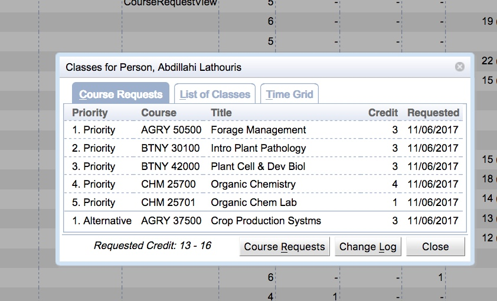{:class='screenshot'}

This is the same Classes Pop-up that can be reached from drilling down into the Enrollments Pop-up from the Enrollments Tab.

### Using the Students Tab to Perform an Action

Depending on the permissions granted to a user by their user role, a user may be able to take an action on a select student or set of students.

In order to see the actions available to take on a student the user can select the checkbox in the leftmost column next to the student’s name and then click the **⊗** icon at the top of the column of checkboxes. This will bring up a menu that lists the actions the user can take.

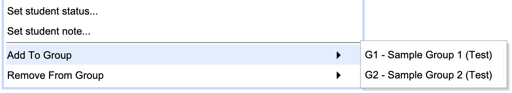{:class='screenshot'}

Another option to see the actions available to take on a student is to select the checkbox next to the student’s name and then click the “More” button to the right hand side of the Filter at the top of the page. This will also bring up the menu that lists the actions the user can take.

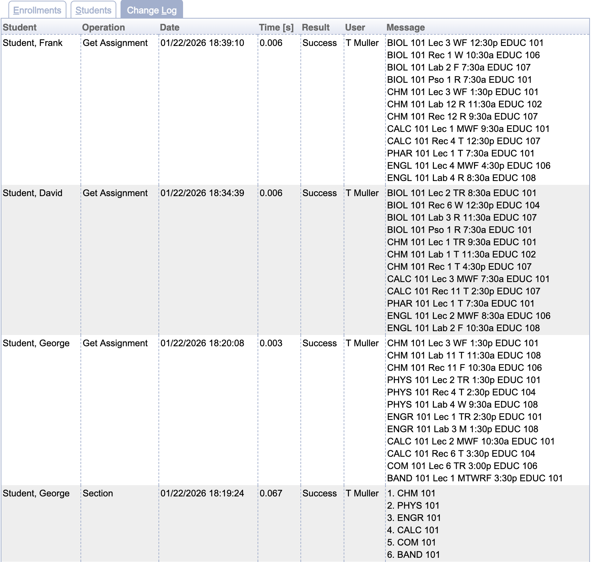{:class='screenshot'}

There are six basic actions that can be performed from the Students Tab.  They are as follows:

* Request Update

* Check Override Status

* Validate Overrides

* Change or Set a Student’s Scheduling Status

* Add a Student to or Remove a Student from  a Student Group

* Set a Note on a Student.  

**Note:** The actions available to a user depend on the systems UniTime is integrate with and the  permissions granted to the user by their user role.

#### Request Update

Selecting the “Request Update” acton allows a user to send a message to another system requesting an update message be sent from that system to UniTime containing the data for the selected students.

**Note:** This functionality is only available when UniTime is integrated with a system that can be queried by UniTime to provide this information.

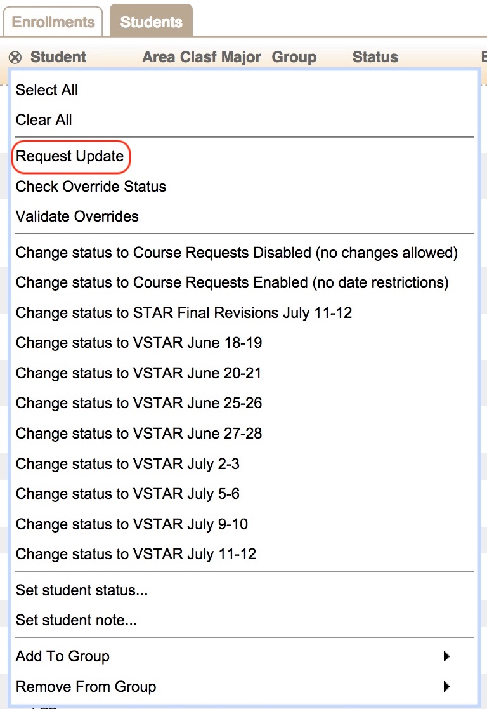{:class='screenshot'}

The update message may take a few seconds to be received and responded to by the other system.  The next time the user presses the search button after the message and its response have been processed, the data displayed to the user should contain the latest information about the student from the other system.

#### Check Override Status

Selecting the “Check Override Status” action triggers UniTime to send a message to the Special Registration system for each known override request of the selected students requesting the current status of the override request.

**Note:** This functionality is only available when UniTime is integrated with a system that can be queried by UniTime to provide this information.

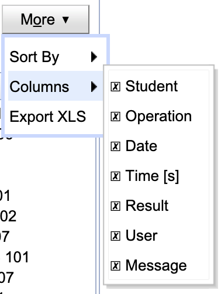{:class='screenshot'}

#### Validate Overrides

Selecting the “Validate Overrides” action triggers UniTime to send a message to the Special Registration system for each of the selected students that revalidates whether the request overrides are still needed.

**Note:** This functionality is only available when UniTime is integrated with a system that can be queried by UniTime to provide this information.

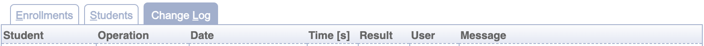{:class='screenshot'}

#### Change or Set a Student’s Scheduling Status

Three options are available for setting the Scheduling Status of the student or set of students that have been selected.

The first option is to select the “Change Status to …” option that corresponds with the status that the user wishes to set on the students.

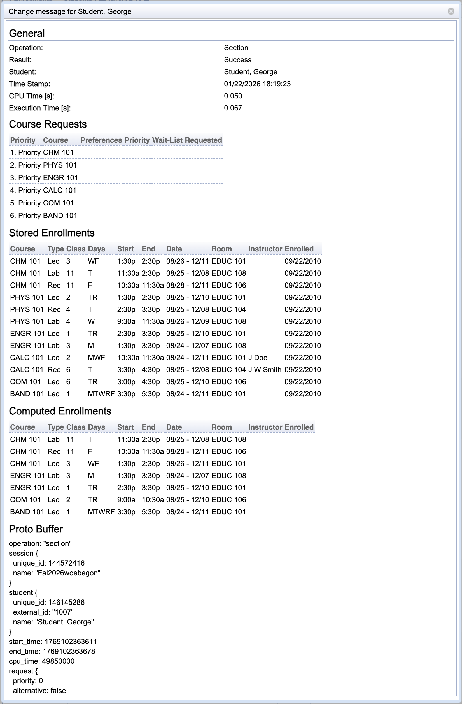{:class='screenshot'}

The second option is to select the “Set student status …” option.

{:class='screenshot'}

This will open the “Set student status...” dialog.  The “Set student status...” dialog provides more detailed information about each status available when the user selects the status in the “Status” drop down.

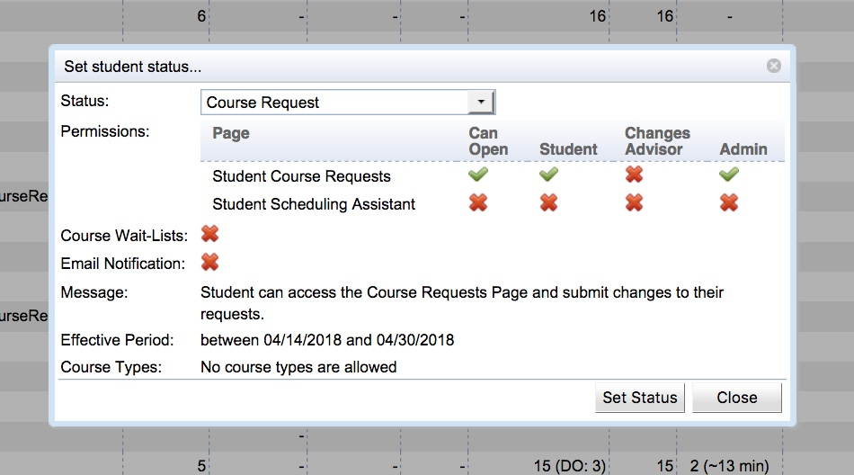{:class='screenshot'}

The “Set student status...” dialog provides the following information about each status:

* **Permissions** - This section lists whether the status grants access to the Student Course Requests page or the Student Scheduling Assistant page and which user roles it is granting the access to.

* **Course Wait-Lists** - This section indicates whether the users with this status are allowed to use the UniTime course wait listing functionality. 

* **Email Notification** - This indicates whether the student will receive an email notification from UniTime whenever a change is made to their data using the Student Course Requests page or the Student Scheduling Assistant page.

* **Message** - If a message is defined for the status, it will be displayed here.

* **Effective Period** - This lists the dates the status will provide the Permissions listed above.

* **Course Types** - If the status is set to restrict the student to a specific course type, then it would be listed here.  If there is no course type then it states “No course types are allowed” which means the student can only request course that have not been give a course time which is all courses that do not have a course type assigned.

The “Set Status” button in the bottom right hand corner of the dialog is used to update the selected students with the selected Status.  The “Close” button in the bottom right hand corner of the dialog exits the dialog without making any changes to the selected students.

The third option is to set the status at the same time a note is added to the student or group of students.  This is described later in this document under the “Set a Note on a Student” section.

#### Add a Student To or Delete a Student From a Student Group

The user can click on either the “Add to Group” or “Remove from Group” action to add the selected students to a Student Group or remove the select students from a Student Group.

**Note:**  A user can only add or remove students from a Student Group if the user has permission to take that action on the selected students.

{:class='screenshot'}

Clicking the “Add to Group” or the “Remove From Group” actions brings up of a list of groups available to the user to assign to the student.  Clicking a Group makes the change.

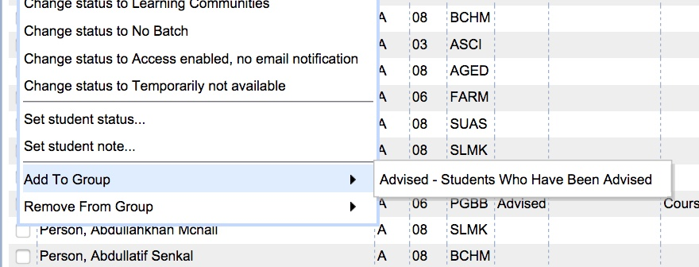{:class='screenshot'}

#### Set a Note on a Student

Clicking the “Set student note…” action brings up a dialog where the user can add or edit a note that is displayed in the Scheduling Dashboard for the selected students.  The dialog also allows the user to set the Scheduling Status for the selected students.

{:class='screenshot'}

The “Set student note...” dialog provides a text box for the user to enter or edit a note that will be displayed for the selected students on the Scheduling Dashboard.  If the user does not select a “Status” (a Status of ‘-’) and clicks the “Set Note” button then the Note will be stored and no changes will be made to the scheduling statuses of the selected students.  If the user selects the “Close” button no changes will be made.

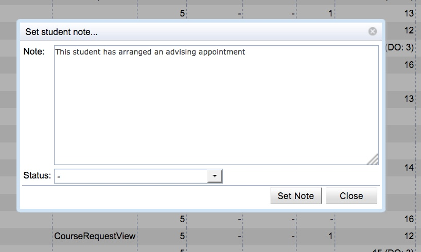{:class='screenshot'}

If the user selects a “Status” the dialog will show the same information about the selected Status as is shown in the “Set student status…” dialog.  If the user clicks the “Set Note” button with a Status selected, the Note and the Scheduling Status for the selected students will be updated.  If the user clicks the “Close” button, then no changes will be made.

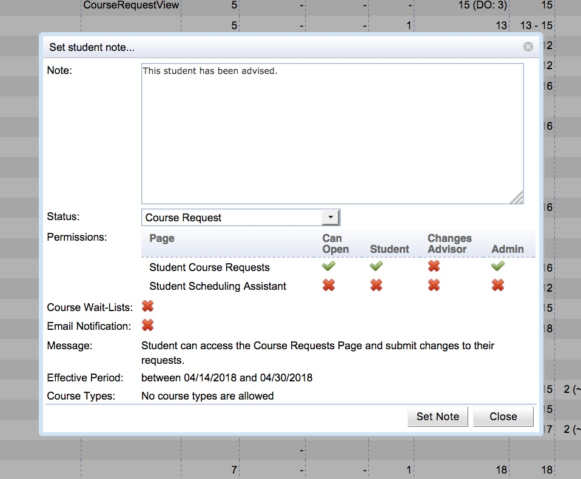{:class='screenshot'}

## Using the Change Log Tab

The Change Log Tab provides users with an administrative role the ability the view the change log for the student scheduling data displayed in the Dashboard.  This tab displays the data grouped by change.

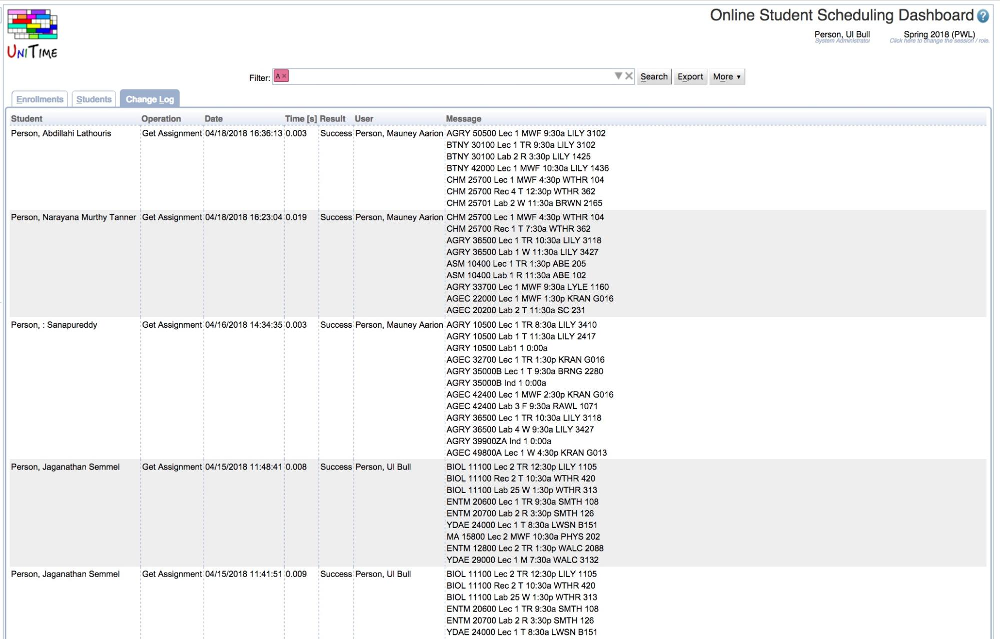{:class='screenshot'}

The data on the Change Log Tab can be sorted by any column listed on the table.  To do this click on the column label for the column to sort.  The first click on the column sorts the table by the data in ascending order.  The second click on the column sorts the table by the data in descending order.  It is also possible to use the drop down menu on the “More” button to select the column to sort.

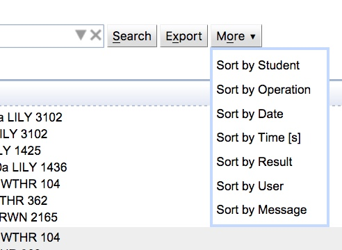{:class='screenshot'}

### Interpreting the Data on the Change Log Tab

The Change Log Tab was designed to display a large amount of data in a compact format.  The following is a description of each data column displayed on the page:

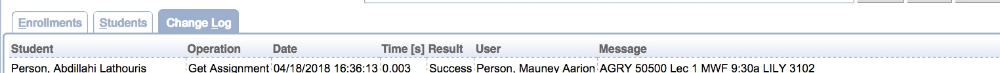{:class='screenshot'}

* **Student** - The name of the student associated with the change.

* **Operation** - The operation used to make the change.

* **Date** - The date and time the change was made.

* **Time** - If the operation was timed, the amount of time it took to complete the operation.

* **Result** - An indicator of whether an operation was successful or not.

* **User** - The user who performed the operation.

* **Message** - A message associated with the operation that was performed.

### Drilling Down into the Change Log Data in the Change Log Tab

A user can drill down deeper into the change log data for a student.  The user can click on an individual student listed on the Change Log Tab and drill down to see the detailed information for the change listed.  Clicking on a change brings up the Change Message pop-up.

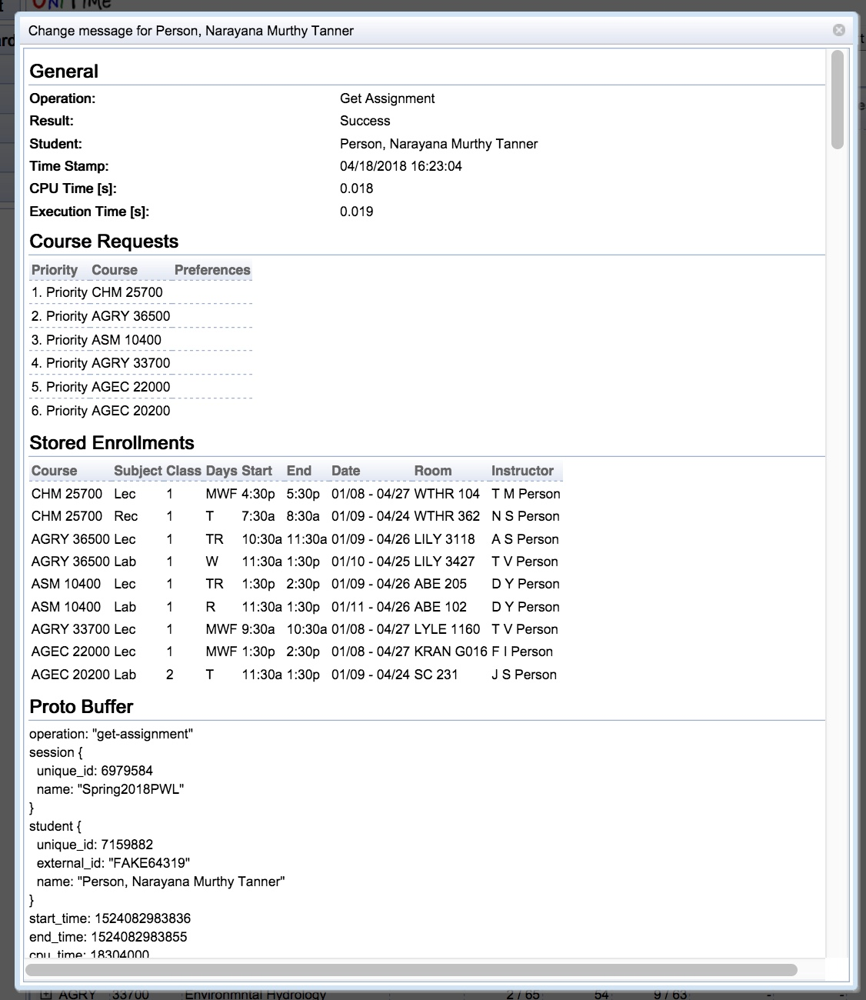{:class='screenshot'}

The data displayed on the Change Message pop-up for a change log entry will vary based on the change that occurred.  If the change log entry is associated with a student’s schedule, the entry will contain detailed information about the schedule before and after any changes were made.  The change log entry will also contain the JSON Proto Buffer of the message used to make the change.

# User Roles and the Student Scheduling Dashboard

The documentation above mentioned many times that the data and actions available to a user are governed by the user role used to access the Student Scheduling Dashboard.   The roles covered are as follows:

* Administrative Roles

* Student Advisor

* Department Schedule Manager

* Instructor

* View All

The goal of this section it to provide some guidance on what data and actions should be available for various roles listed above.

## Administrative Roles

Users who access the Student Scheduling Dashboard with one of the various Administrative roles defined in the system have access to all data and functionality available within the Dashboard.

## Student Advisor

Users who access the Student Scheduling Dashboard with the Student Advisor role will have access to the Enrollments and Students tabs.  Users with the Student Advisor role can see data for all students.  They have the ability in the filter to restrict the data to “My Students”.  The Student Advisor role users will be able to drill down into the data on both of these tabs and can perform a subset of the actions available.  They can set the scheduling status for a student to any scheduling status that has been marked as usable by advisors.  If no scheduling statuses of this type are available, then Student Advisors cannot change a student’s scheduling status.  Student Advisors can add or remove their students from any student group that is of a type that is manageable by advisors.  If no student groups of this type exist, then functionality to Add or Remove Student Groups is not available.  Student Advisors can see the change log for individual students.

## Department Schedule Manager

Users who access the Student Scheduling Dashboard with the Department Schedule Manager role will have access to the Enrollments and Students tabs.  Users with the Department Schedule Manager role can only see data for the courses in the subject areas they manage and for the students enrolled into those courses.  The Department Schedule Manager role users are able to drill down into the data on both of these tabs but cannot perform any actions on the students.

## Instructor

Users who access the Student Scheduling Dashboard with the Instructor role will be able to see the Enrollments and Students tabs of the dashboard but may not see any data unless they are listed on a course as a coordinator at the offering level.  If the user is listed on a course as a coordinator at the offering level, then they can only view data for that course.  Users with the Instructor role cannot drill down to see a individual student’s schedule.  Users with the Instructor role cannot perform any actions on the students.

## View All

Users who access the Student Scheduling Dashboard with the View All role will have access to the Enrollments and Students tabs.  Users with the View All role can see data for all students.  The View All role users are able to drill down into the data on both of these tabs but cannot take any action on the students.

## View Department

Users who access the Student Scheduling Dashboard with the View Department role will have access to the Enrollments and Students tabs.  Users with the View Department role can only see data for the courses in the subject areas for their department and for the students enrolled into those courses.  The View Department role users are able to drill down into the data on both of these tabs but cannot perform any actions on the students.

