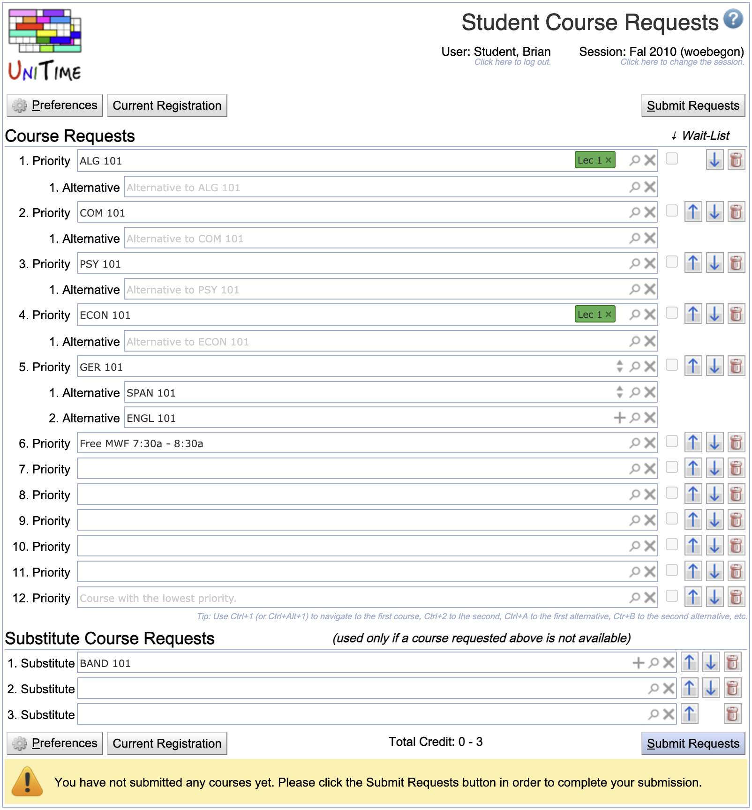
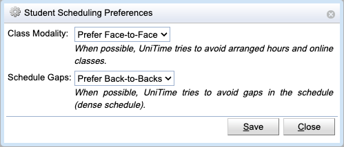

### Table of Contents
{:.no_toc}
* table
{:toc}

# Introduction

Student scheduling, sometimes called *student sectioning*, involves assigning students to classes (course sections) based on their individual course demands. It consists of courses that have already been timetabled, students and their individual course demands, and producing a class schedule for each student. It is modeled as an assignment of student course requests with enrollments, i.e., valid combinations of classes that the student needs to take to enroll in a course. There are various hard constraints, such as students not having a time conflict (unless allowed, in which case the overlapping time is to be minimized), classes and courses being limited in size, or restrictions limiting who can attend a particular class or course. It is also an optimization problem, combining a long list of various criteria, such as maximizing the number
of courses each student gets, considering student and course priorities, student preferences, penalizing alternatives and substitutes, minimizing distance conflicts or travel times, etc. In the rest of this section, the most interesting aspects of the student scheduling problem are discussed.

### Course Structure
Each course may be offered in multiple [configurations](../instructional-offering-configuration), such as face-to-face or online, each with multiple components (subparts), such as a lecture and a lab. Each subpart may contain multiple alternative classes. A student requesting a course will get one class of each subpart of a single configuration. There can be additional parent-child relations between individual classes, which also must be followed. So, for example, a student may get Lec 1 - Lab 1, Lec 1 - Lab 2, Lec 2 - Lab 3, or Lec 2 - Lab 4 class combination if attending the course face-to-face, or Dist 1 when attending the course online. Each class can also have a limit, allowing only a certain number of students to get in.

### Reservations and Restrictions
Access to courses or certain components of courses, such as configurations or individual classes, may be restricted with [reservations](../reservations). A reservation reserves a certain number of seats in the course, or some of its components, for a particular group of students, e.g., identified by their study program. A restriction does not reserve any space, but the students must follow it. For example, a student of an online program may be restricted to the online course configuration, while other students may freely choose between the two configurations, assuming space is available. Similarly, there can be 100 spaces in a course reserved for students of a Computer Science major, or the space in one of the Labs may be reserved for a particular cohort.

### Alternative and Substitute Courses
A student may provide alternatives to each course. The aim is to get a given number of courses, and one or more alternative courses can be provided for each course. It is also possible to provide substitute courses that can act as alternatives to any other course requests except those that have been marked as no-sub by the advisors (typically those that the student must take). The order in which the courses are requested is also important, as it helps us to break the ties, e.g., when it is not possible to get both courses because they are overlapping in time, or when there are more students requesting the course than the space available.

### Student Preferences and Requirements
A student can indicate which course configurations and/or classes are preferred for each course. It is also possible to provide free time requirements, which can act as unavailabilities (i.e., a student cannot get a class at the time) or preferences (i.e., an overlapping time with the free time should be minimized), depending on the position of the free time among the courses.

Students may also indicate whether they prefer online or face-to-face classes and whether back-to-backs are preferred or discouraged. For the Summer terms, which are organized into three four-week modules, it is also possible to indicate during which modules the student can have classes and whether they can attend classes on campus.

### Student and Course Request Priorities
Student and course request priorities have been added to help students graduate on time and to deal with popular courses of limited capacity. First of all, advisors may indicate courses as vital to the student, which means that the student absolutely needs the course (or one of the provided alternatives) to progress towards their degree. Moreover, students are divided into priority students (such as athletes and students in university bands and orchestra), students near graduation (with 100 or more credits earned), senior students (60 or more credits), and the rest. Vital course requests take priority over student priorities.

### Batch vs Online
Student scheduling in UniTime can be done in two modes. In **batch** mode, the [Student Scheduling Solver](../student-scheduling-solver) is used to compute individual student schedules for all (or a selected population of) students simultaneously. This is an optimization process aimed at maximizing the number of courses students can take, as well as considering various optimization criteria, including travel times and the aforementioned preferences and priorities. This process includes a pre-registration step where students provide information about the courses they need (usig [Student Course Requests](../student-course-requests)), along with additional preferences, alternatives, and requests for free time.

The **online** student scheduling serves students as they come. They can use the [Student Scheduling Assistant](../student-scheduling-assistant) to either modify their existing schedule or create a new one from scratch (e.g., if only the online mode is used, or the student did not complete the batch for some reason).

The two modes are not mutually exclusive. Typically, the online mode is enabled once the students have been provided their initial schedule using the pre-registration & batch process. In this case, the students use the [Student Scheduling Assistant](../student-scheduling-assistant) to make changes to their schedule, and possibly wait-list for 
courses that are currently full.

### Student Scheduling Prerequisites
The student scheduling component requires that the course timetabling be already completed with the course timetabling solution(s) saved and committed. Additionally, it makes use of [Reservations](../reservations), the [Associated Course](../edit-course-offering#details) relations, and two [distribution preferences](../distribution-preferences):
* **Linked Classes**: Classes (of different courses) are to be attended by the same students. For instance, if class A1 (of course A) and class B1 (of course B) are linked, a student requesting both courses must attend A1 if and only if they also attend B1.
* **Ignore Student Conflicts**: All student conflicts between the given classes are to be ignored.

Besides the courses and the course timetable, the student scheduling also needs to have **students** imported, possibly with their course requests when the batch is used without doing [pre-registration](../student-course-requests) in UniTime. Students cannot be entered directly in UniTime; the expectation is that they will be imported from an external Student Information System. This can be done using the [Students XML](https://www.unitime.org/interface/studentInfoImport.xml) or the [Student Course Requests XML](https://www.unitime.org/interface/woebegonStudents.xml) format using the Administration > Academic Sessions > [Data Exchange](../data-exchange) page (see [XML Interfaces](https://www.unitime.org/uct_interfaces.php) for more details).

# Batch Student Scheduling

The batch student scheduling is done using the Students > [Batch Solver](../student-scheduling-solver) page. The student schedules are computed using the student course requests that can be either filled in by students in UniTime using the [Student Course Requests](../student-course-requests) page (see below) or imported using the Administration > Academic Sessions > [Data Exchange](../data-exchange) page using the [Student Course Requests XML](https://www.unitime.org/interface/woebegonStudents.xml) format (see [XML Interfaces](https://www.unitime.org/uct_interfaces.php) for more details).

To enable pre-registration, the [academic session](../academic-sessions) needs to be in a status that allows for Student Scheduling: Course Requests (see [Status Types](../status-types) for more details), the students need to exist in UniTime, and if an external authentication is used (such as [LDAP](../LDAP), [CAS](../CAS), or [OAuth2](../OAuth2)), their external IDs must match the user ID of the authenticated user. Such users will be granted the [Student role](../roles) upon logging in to UniTime and will have the related [permissions](../permissions). 

## Advisor Course Recommendations

It is possible to use UniTime for advising. Advisors can use the [Online Student Scheduling Dashboard](../online-student-scheduling-dashboard) to monitor their students' and their (pre-)registration progress. They can use the [Advisor Course Recommendations](../advisor-course-recommendations) page to change their students' status and provide a list of courses that they need to register for.

Please note that the [Advisor Course Recommendations](../advisor-course-recommendations) page is an optional component and does not need to be used for students to pre-register. And even when used, students still need to use the [Student Course Requests](../student-course-requests) page, which will get pre-populated with the advisor course recommendations, and need to **Submit** the page to complete their pre-registration.

{:class='screenshot'}

When opened, the advisor can look up a student, and the page gets pre-populated with the existing data. A different student can also be looked up by clicking the **Lookup Student** button or when the student's name or ID is clicked. If advisor course recommendations from multiple academic sessions can be viewed and/or edited, an academic session can be selected afterward. It can be changed at any time by clicking the term field. When there are any unsubmitted changes, the user is prompted when leaving the page or changing the student or session.

The page automatically offers course suggestions as the course name is being typed in (but it is possible to put in free text too), fills in credits, counts the credit totals, etc. When submitted, there is a PDF version generated that can be printed and signed by the student. It is also possible to email the document to the student (with the advisor on CC) when the page is submitted (and the Send email confirmation toggle is checked). In this case, the Send email... dialog pops up after the form has been successfully submitted, and the user can provide an additional message and email address if needed.

The page also allows for a student status change when submitted. This eliminates the need for the advisor to also use the [Online Student Scheduling Dashboard](online-student-scheduling-dashboard) to change the student status (e.g., to let the student fill in his/her course requests). UniTime keeps a record of these advisor course recommendations for possible auditing/reporting (what students requested versus what they have been advised, list students who have already been advised that did not fill their course requests in, etc.). Some of these can be seen on the [Online Student Scheduling Dashboard](online-student-scheduling-dashboard).

### Recommendation Settings
The student advisors can be defined on the Administration > Academic Sessions > [Student Advisors](../student-advisors) page. If an external authentication is used (such as [LDAP](../LDAP), [CAS](../CAS), or [OAuth2](../OAuth2)), their external IDs must match the user ID of the authenticated user. Such users will be granted the [Advisor role](../roles) upon logging in to UniTime and will have the related [permissions](../permissions). 

The page requires the *Advisor Course Requests* permission. A user (typically an advisor) can look up and see advisor recommendations for all students; he/she may be only allowed to edit no students, only his/her students, or all students (depending on the *Student Scheduling Advisor Can Modify All Students* or *Student Scheduling Advisor Can Modify My Students* permissions).

The following additional flags can be provided by the advisor (for each course request) when enabled:

* Course Priority: **Critical**, **Important**, or **Vital**
    * Courses of elevated priority take precedence before other courses in the solver
    * See the `unitime.acrf.setCriticalCourses` configuration setting on the [Application Configuration](../application-configuration) screen

* Wait-Listing: **No-Sub** or **Wait-List**
    * *No-Sub* indicates that a course cannot be replaced by a substitute course
    * *Wait-List* indicates that the course cannot be replaced by a substitute course and will be wait-listed when the student cannot get in during the batch
    * See the `unitime.acr.waitlist` configuration setting on the [Application Configuration](../application-configuration) screen

## Student Course Requests

Students can use the [Student Course Requests](../student-course-requests) page to fill in the courses they would like to get, together with their alternatives, substitutes, course preferences, and free time requests.

{:class='screenshot'}

The Student Course Requests page can be used to collect course requests (course pre-registrations) from students. It is a variant of the [Student Scheduling Assistant](../student-scheduling-assistant) page that is used during online scheduling, without the ability to create a student schedule right away. Course requests can be collected during the timetabling process, once it is known which courses will be offered. Once student course requests are collected, the [Student Sectioning Solver](../student-scheduling-solver) can be used to create an optimized schedule for all the students. After that, online student scheduling can be enabled, allowing students to use the [Student Scheduling Assistant](../student-scheduling-assistant) page to review their schedule and make any necessary modifications.

A student may request one or more courses, ordered by their priority. Each course may include any number of alternatives. Preferences can be set on individual classes and/or for [instructional method](../instructional-methods) when the course has multiple configurations with different methods (e.g., Face-to-Face and Online). The student may also mark the class and instructional method preferences as required. This is not enabled by default as it effectively restricts the list of available enrollments into the course to those that include the class(es) or instructional method(s) that are marked as required. It is possible to type in the course name or part of its title directly into the page and use the available suggestions to find the matching course, or click the  icon to open the [Course Finder](../course-finder) dialog. Please note that on the [Course Finder](../course-finder) dialog, the *List of Classes* is only available, and the preferences can be set only after the course timetable has been published.

Free time requirements can also be put in the **Course Requests** table. They can be either typed in (day or days of the week + start time + end time) or selected using the [Course Finder](../course-finder) dialog by clicking the  icon. The position of a free time request is quite important. Any courses below the free time cannot overlap with the free time (the free time has higher priority), while courses above the free time are allowed to overlap. The solver will try to minimize the overlapping time in this case.

Additional substitute courses can be entered in the **Substitute Course Requests** table at the bottom of the page. Unlike with alternatives, the substitute course (possibly also with alternatives provided) can substitute any of the above courses to ensure the student will get the desired number of courses. Only courses that are marked with the Wait-List or No-Sub toggle (when allowed) cannot be substituted.

The **Preferences** button allows students to indicate their preference for class modality (face-to-face or online) and schedule gaps (prefer or avoid back-to-back classes).

### Course Requests Settings
In order for students to have access to the [Student Course Requests](../student-course-requests), the *Student* role needs to have *Student Scheduling Can Register* [permission](../permissions). The *Student Scheduling Can Require Preferences* permission is needed to be able to mark class and instructional method preferences as required.

If student statuses are being used (see Administration > Other > [Student Status Types](../student-scheduling-status-types)), the student's status must allow for **Registration** for the page to be available and **Student Register** to make changes. The default student status is set on the Administration > Academic Sessions > [Academic Sessions](../academic-sessions) page; individual student statuses can be set on the [Online Student Scheduling Dashboard](online-student-scheduling-dashboard) or by advisors using the [Advisor Course Recommendations](../advisor-course-recommendations) page.

Students may or may not have the ability to indicate that a course can be wait-listed when it is not available (assuming that the course in question allows for wait-listing), or not replaced by a substitute (No-Sub). The ability to indicate the desire to wait-list a course is included in the [student scheduling status](../student-scheduling-status-types). A wait-listed or no-sub course cannot be replaced by a substitute course; however, alternative courses are possible.

Courses of a particular [Course Type](../course-types) can be made unavailable for students to select on the [Student Course Requests](../student-course-requests) page, when the appropriate course type is not allowed on the [student scheduling status](../student-scheduling-status-types). Such a course does not show up in the [Course Finder](../course-finder) dialog. Courses controlled by a [department](../departments) that does not have **Student Scheduling** enabled will also not be available for the students to find and select. This can be further adjusted using the [Student Scheduling Rules](../student-scheduling-rules).

The available options on the **Student Scheduling Preferences** dialog can be adjusted by various `unitime.enrollment.studentPrefs.*` parameters on the [Application Configuration](../application-configuration) page. Namely:

{:class='screenshot'}

* Set `unitime.enrollment.studentPrefs.enabled` to enable or disable student preferences dialog (defaults to true, **Preference** button will not show when disabled)
* Set `unitime.enrollment.studentPrefs.datesAllowed` to `true` to allow for selection of the start and/or end dates. This is typically only enabled for Summer terms, as all automatically scheduled classes must fall into the selected dates.
* Set `unitime.enrollment.studentPrefs.reqOnlineAllowed` to `true` to allow students to Require Online as their class modality. This is typically only enabled for Summer terms as all automatically scheduled classes would have to be online (be arranged hours with no required room, have no room, or have only a pseudo room that does not check for room conflicts).
* Set `unitime.enrollment.studentPrefs.customNote` to a custom message (HTML format) to be displayed in the dialog.

When `unitime.sectioning.alternativeCourse` is set to `true`, the [Edit Course Offering](../edit-course-offering) page can be used to provide a **Default Alternative Course Offering** for a course that will be used when the student requests the course without providing any alternatives.

A custom course request validation can be implemented using the [CourseRequestsValidationProvider](https://github.com/UniTime/unitime/blob/master/JavaSource/org/unitime/timetable/onlinesectioning/custom/CourseRequestsValidationProvider.java) interface. This interface also provides an API for checking a student's eligibility to submit their course requests. This is used at Purdue University to check the student's ability to register for the selected courses and to request overrides for any potential registration errors. For example, please see the Purdue-specific [UniTime Course Requests User Manual](course-requests-purdue)

[Page access control](../access-statistics#access-control) is available for the page. It can be configured using the following properties:
* `unitime.accessControl.sectioning.activeLimitInMinutes`
    * Number of minutes of inactivity for the user to get the Inactive Warning.
    * Defaults to 15 minutes.
* `unitime.accessControl.sectioning.maxActiveUsers`
    * Maximal number of users using the page at the same time (not set or zero for disabled).
    * Not set by default.

## Student Scheduling Solver

Once students have filled out their [student course requests](../student-course-requests) or the requests have been imported from an external system, the [Student Scheduling Solver](../student-scheduling-solver) page can be used to run the solver and produce individual student class schedules.

{:class='screenshot'}

There are the following properties that can be selected
* The **Solver Configuration** that is to be used
    * Solver configurations are defined on the Administration > Solver > [Configurations](../solver-configurations) page. Only configurations with the Student Scheduling Solver appearance are applicable for student scheduling and have the appropriate parameters available.
* The **Solver mode** indicates whether the solver should consider the existing assignments or not
    * If the **MPP** mode, standing for Minimal Perturbation Problem, is used, the solver will also try to minimize changes to the original timetable
    * The **Initial** mode does not minimize changes (it will still load the existing timetable if it exists)
    * The **Projection** mode can be used to optimize the location of the remaining space in the courses
        * This can be used, e.g., if only certain groups of students are being batched
        * The selected **Projected student course demands** (such as curricula or last-like enrollment) are loaded together with the course requests to fill in the remaining space; while the projected requests have much lower priority, the solver can use them to move students away from classes that will be needed for the students that come later (and, e.g., only using the online student scheduling).
* The **When finisher** option specifies an automatic operation when the solver run has finished
    * This option does not get used if the solver is stopped manually using the **Stop** button
* The **Student weights** parameter defines whether the order of the courses on the [Student Course Requests](../student-course-requests) page is used (the **Priority** option), or ignored with all courses being considered equally (the **Equal** option).
    * The **Equal** option is typically only used when requests are imported from an external system with no particular priority order.
* The **Student Filter** can be used to restrict the population of students that are to be loaded into the solver.
    * Other students who are already enrolled will still count toward the class, configuration, course, and reservation limits.
    * This allows for scheduling the students in phases or waves, or separately for each department.
    * The format of the Filter has the same format as the [Filter](../scheduling-dashboard-filter) on the [Online Student Scheduling Dashboard](../online-student-scheduling-dashboard) page, e.g., `area:A` or `major:M1 or major:M2` or `group:"My Students" and not major:M3`
* Additional parameters can be displayed, depending on the [Solver Parameters](../solver-parameters) defined.

The data can be loaded into the solver using the **Load** button, and the solver can be started using the **Start** button. When no data are loaded into the solver, using **Start** will first load the solver and then start it. This can be combined with the **When finished** parameter, for example, to save and unload the solver once it is done automatically.

The **Stop** button can stop a running solver, or it can be left running until it stops itself. The solver run is typically 8 hours, which can be adjusted with the other student scheduling solver parameters on the Administration > Solver > [Configurations](../solver-configurations) page. The solver works with two student schedules: the current one (displayed on other pages and manually changeable using the [Batch Student Solver Dashboard](../batch-student-solver-dashboard) page) and the best schedule that the solver uses to record the best solution it has seen during the search. To save the current student schedule, click the **Save** button. The solver can be unloaded from memory using the **Unload** button.

The **Clear** button will unassign all student schedules, allowing the solver to start from scratch, even when existing schedules have been loaded. It can also be used to unassign all student schedules in the database (delete the existing solution) by using the **Load**, **Clear**, and **Save** buttons in this order.

The **Reload Input Data** button can be used to reload the input data (courses with their structure, timetable, and reservations, student course requests) without losing the current student schedule. This will load everything into the solver, using the newly selected configuration, except for the saved student schedules. Afterward, the current student schedule will be reassigned to the newly loaded requests. This is particularly useful when changes have been made to the input data, eliminating the need to perform **Save**, **Unload**, and **Load** again. Please note that some requests may be left unassigned if their current assignment is incompatible with the changes made to the input data. Please check the solver warnings for any such cases once the reload is done.

The **Save To Best** and **Restore From Best** buttons at the bottom of the page can be used to copy the current schedule over to the best manually or vice versa.

### Solver Configuration

Optimization weights and other parameters can be adjusted on the Administration > Solver > [Configurations](../solver-configurations) page. Student scheduling solver configurations have the **Student Scheduling Solver** appearance.

The solver is working with variables (one variable is a requested course or free time, including its alternatives) and values (one value is a valid combination of sections for the course or its alternative). Besides of hard constraints that cannot be violated (class/configuration/course limits, time conflicts, reservations, linked sections, availability for students with teaching assignments, etc.), the batch solver tries to maximize the weighted sum of all assigned variables (course/free-time requests). The weight is computed using the request priority, the alternativity of the course in the request (1st alternative has a lower weight than the main course, etc.), distance conflicts and time overlaps (when allowed), and section and instructional method preferences. There are also additional penalties for classes that are without a time assignment, to promote section balancing, minimize changes (in MPP mode), and to keep students of the same group together. The solver can also consider last-like student demands or curricula to ensure that students avoid sections that are expected to be needed by students who have yet to arrive. These projected demands can be also used to compute expectations for the online student scheduling solver (which considers a few more weights, namely avoiding over-expected sections, considering current selection and locked sections, etc.).

The base weights for the priority-based weighting (course priorities are considered) are 0.501 for the first priority course, 0.251 for the second priority course, 0.126 for the third priority course, etc. (using 0.501^n, where n is 0, 1, 2, ...). So, getting the first priority and nothing else has a slightly higher weight than all the other courses. However, the alternatives are also factored in using the 0.501 factor, so the 1st alternative of the 1st priority course has the same weight as the 2nd priority course, etc.

As for the other weights, the time conflict can eat up to 1/2 of the weight of the lower priority course, proportional to how much time is being overlapped.

The following weights are much lower, mostly to provide order to the available enrollments:
- Each distance conflict takes 5% of the weight of the lower priority course (20% for the students that require short distances, see [Student Accommodations](../student-accommodations)).
- An enrollment without time assignment(s) is also penalized by deducting up to 1% of its weight (proportional to how many sections have no time assigned).
- There is up to a 0.5% penalty for section balancing
- Up to 10% for the distance to the original assignment (when MPP mode is used, penalizing a different time more than a different room)
- Up to 10% for the preferences (e.g., penalizing enrollment in a section that is not preferred, if there is a preference)
- Up to 10% for keeping students in the same group (for groups of [Student Group Type](../student-group-types) that have the *Keep Students Together* flag set)

Free time requests also play a role. If a course is below a free time request (in the priority), it cannot overlap with the free time. If it is above the free time request, the time conflicting with the free time is considered (in the same way as a time conflict between two courses).

Teaching assignments can prohibit time overlaps (a student cannot enroll in a class that overlaps with their time assignment) or minimize time overlaps (there is a penalty for overlapping time with a teaching assignment). When the [instructor scheduling](instructor-scheduling) module of UniTime is used to assign teaching assistants, this can be configured for each assignment (e.g., a TA must be available for the sections they are teaching, but may have a time conflict during the lecture).

The solver does not guarantee that it will just maximize the course request priority. The requests may be prioritized one level lower due to other penalties (especially those lower on the list, where time and distance conflicts can play a bigger role), but typically not more.

Vital (critical) course requests (and possibly also priority students) are handled by assigning them first and not allowing the solver to make a change that would favor a course request that is not critical over a critical one (despite their priorities). There are no additional weights associated with these. Moving the priority course requests to the top of the list of requested courses also helps the solver to ensure it gets as many of those assigned as possible.

### Student Priority

It is possible to prioritize some students over others. There can be six priority groups (Priority, Senior, Junior, Sophomore, Freshmen, and Normal). Students can be assigned to a particular priority group (other than Normal) via the [student groups](../student-groups) feature. So, for instance, a Priority group can be created for students who should be assigned first. For the solver to recognize the groups, there needs to be an appropriate solver parameter created (Administration > Solver > [Parameters](../solver-parameters) page, e.g., `Load.PriorityStudentFilter` for priority students, `Load.SeniorStudentFilter` for senior students, etc.) and populated with a student filter that would match the students that should have that priority. Here is an example of Priority group matching the `Load.PriorityStudentFilter`. 

{:class='screenshot' style='max-width:600px;'}

### Student Schedule Quality

Starting with UniTime 4.4, additional student schedule quality criteria have been introduced in the student scheduling solver. These include:
- **Lunch Breaks** (allow time for lunch): there is a lunch conflict created when the student has two classes on a day that overlap with the lunch period of 11 am - 1 pm, with less than 30 minutes in between
- **Travel Time**: there is a conflict proportional to the travel time (in minutes) between two classes on the same day that are less than 1 hour apart (or less than 2 hours apart when the travel time is longer than the break time of the first class)
- **Back-to-Back**: there is a (negatively weighted) conflict for any two classes that are back-to-back and on the same day (the idea is to minimize gaps, so we want more classes clustered together)
- **Workday**: there is a conflict when the student has two classes that have more than six hours between the start of the first one and the end of the second one; the conflict is proportional to the number of hours over this limit (e.g., if the two classes span 8 hours, the penalty is 2) -- again the idea is to make the schedule more compact, without unnecessary gaps
- **Too Early**: there is a conflict when the class starts before 8:30 am (proportional to the time of the class before 8:30)
- **Too Late**: there is a conflict when the class ends after 5:30 pm (proportional to the time of the class after 5:30)

All these can be configured using the solver parameters using the [Solver Configurations](../solver-configurations) page.

## Published Runs

When test runs are enabled (the user has the *Student Sectioning Solver Publish* [permission](../permissions)), the **Publish** button (on the [Student Scheduling Solver](../student-scheduling-solver) page) can be used to save the solution under the [Published Schedule Runs](../published-schedule-runs) page without actually saving the student class enrollments in the database. This can be very useful for conducting periodic (e.g., nightly) test runs during pre-registration, without saving any student schedules in the database yet.

{:class='screenshot'}

There can be only one published solver run per academic session, but UniTime will retain a history of previously published runs. A published run can be visible to other users who have the permissions to see the [Student Sectioning Dashboard](../batch-student-solver-dashboard) and/or the [Published Schedule Runs](../published-schedule-runs) page.

A published solver run is visible to all users who have the Student Scheduling and Student Sectioning Solver Dashboard and/or Student Sectioning Solver Reports permissions (possibly including advisors, departmental schedule managers, and instructors). It is indicated in the solver status (below the page name) as 'Solver Published'. A published solver run is static (it is loaded in the solver, but cannot be started or modified using the Scheduling Assistant dialog on the dashboard).

It is possible to extend the **When finished** solver parameter to allow for `Publish` or `Publish and Unload` in the [Solver Configurations](../solver-configurations).

To Administration > Academic Sessions > [Task Scheduler](../task-scheduler) page can be used to schedule the periodic test runs using the [Student Scheduling: Start Test Run](https://github.com/UniTime/unitime/blob/master/Documentation/Scripts/Student%20Scheduling%20Start%20Test%20Run.xml) script. To register the script, download the linked XML and import it using the [Data Exchange](../data-exchange) page.

# Online Student Scheduling

*Work in progress...*

## Student Scheduling Assistant

## Re-Scheduling & Wait-Listing
