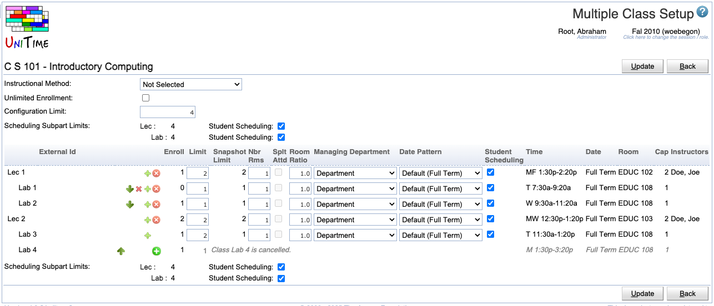

## Screen Description

In the Multiple Class Setup screen it is possible to set properties on the class level (as opposed to setting them on the scheduling subpart level in the [Instructional Offering Configuration](instructional-offering-configuration) screen) - there is a line for each class for a given configuration in the instructional offering.

## Details

* **Configuration Limit**
	* Number of students you want to allow to register for the instructional offering in this configuration (in most cases, same as the instructional offering limit, which is in most cases the same as the course limit - with the exception of cross-listed courses)

* **Scheduling Subpart Limits**
	* The totals of class limits for each scheduling subpart (class limits can be changed in this screen)
	* **Up** and **down** arrows
		* When classes are grouped, it is possible to move a class to a different group - for example, if recitations are grouped with lectures, you can move a recitation from one lecture to another
		* Useful when e.g. adding a recitation to a lecture in the middle of the list of classes
	* **Trashbin icon**
		* Click on this icon to delete the class on the same line as the trash bin
		* If you delete a class that has other classes grouped underneath, the grouped classes will be deleted as well
	* **+ icon**
		* Click on this icon to add a class of the same instructional type with the same parameters
		* If you click on this icon on the line with a class that has more classes grouped underneath, the whole group is added (for example, if you click on a lecture that has a recitation underneath, another lecture together with another recitation is added)

* **Enroll**
	* Number of enrolled students (if enrollment data is available)

* **Limit**
	* Set up the limit for a given class
	* If you need to set the limit for a class to zero, make sure that you set the Room Ratio to the size of the room that you want for the class - in this case, Room Ratio has a special meaning
	* To be able to set variable limits per class, you need to change the property "Show the option to set variable class limits" in the [Manager Settings](manager-settings) screen (menu: Preferences → Settings) before you edit this configuration

* **Room Ratio**
	* The ratio of the required room size to the class limit
		* Room Ratio = Room Size / Limit per Class
	* In almost all cases, this should be one
	* Some exceptions to the norm
		* You need a room for fewer students than the class limit (Room Ratio is less than one)
			* Example: A course has a PSO class for 100 students, but the schedule deputy knows that there will never be more than 50 students at a time in this PSO. Hence this PSO can be set up with Limit per Class = 100 and Room Ratio = 0.50, which means that the application will look for a room of size 50 or more (0.5*100=50).
		* You need a room for a class with zero limit. In this case, Room Ratio needs to contain the required room size.
			* Example: You set up a course with zero limit where all students require name raises. You plan on enrolling 20 students per class. Then the Room Ratio should be set to 20. In this situation, the above formula for Room Ratio does not apply. The Room Ratio will be used as the room size needed.

* **Number of Rooms**
	* Number of rooms that you need for a class (usually one)

* **Managing Department**
	* Determines who will assign time and room to this class (for example, whether it is the Large Lecture Room manager, the departmental schedule deputy, or the Computing Lab manager)
	* The managing department also determines the set of rooms and/or times (time patterns) that you can use when you set up preferences
	* For Managing Department other than "Departmental" you usually cannot set the preference level "Required" in the preferences on the subparts or on the classes (in the [Edit Scheduling Subpart](edit-scheduling-subpart) or in the [Edit Class](edit-class) screens)

* **Date Pattern**
	* Indicates which weeks during the semester the class is taught
	* "Default" means that the date pattern is inherited from the scheduling subpart
	* If you need to use a pattern that does not appear in the list, use the form in the [Contact Us](contact-us) screen (under Help)

* **Timetable**
	* **Time** and **Room** assigned to the class if a timetable has been created (the loaded timetable is displayed; if none is loaded, the selected one is displayed; if none is selected, then the committed timetable is displayed)

* **Display Instructors**
	* When checked (and it is checked by default), the instructor's name will be displayed in the online Schedule of Classes
	* When not checked, the instructor's name will not be displayed in the online Schedule of Classes - the name not to be displayed is in italics wherever it is listed ([Instructional Offerings](instructional-offerings), [Instructional Offering Detail](instructional-offering-detail), [Scheduling Subpart Detail](scheduling-subpart-detail), [Classes](classes), ...)
	* **All** - check or uncheck for all classes

* **Student Scheduling**
	* When checked (and it is checked by default), the class will be available to students during student scheduling
	* When not checked, the class will be treated as with zero limit during student scheduling (only students with individual reservations will be able to get in) - the class not to be displayed is in italics wherever it is listed ([Instructional Offerings](instructional-offerings), [Instructional Offering Detail](instructional-offering-detail), [Scheduling Subpart Detail](scheduling-subpart-detail), [Classes](classes), ...)
	* **All** - check or uncheck for all classes

## Operations

* **Update** (Alt+U)
	* Save changes and go back to the [Instructional Offering Detail](instructional-offering-detail) screen.

* **Back** (Alt+B)
	* Go back to the [Instructional Offering Detail](instructional-offering-detail) screen without saving any changes.

{:class='screenshot'}
