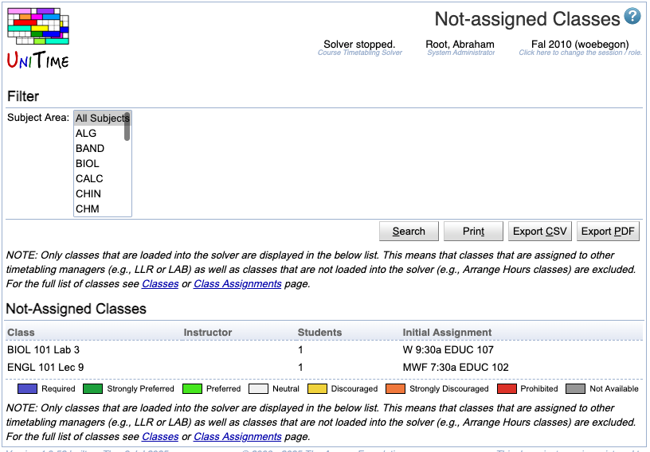

## Screen Description

The Not-Assigned Classes screen lists classes of the selected/loaded timetable that currently do not have time and room assigned. When a timetable is loaded, it is possible to click on any of them to see more information about the class and/or to assign time and room manually.

## Filter

* **Subject Area**
	* Select the subject area for which the not-assigned classes should be displayed
	* Note: only the classes of the selected/loaded timetable will be displayed - it is possible that there are classes of a given subject area that are timetabled by a different timetabling manager and therefore are a part of a different timetable

Click **Apply** to apply a change in the filter

## Not-assigned Classes

For each class in the list, the following columns are displayed:

* **Class**
	* Subject area, course number, instructional type and class number within that type (for example, ECET 107 Lab 1)

* **Instructor**
	* Instructor(s) assigned to this class for whom conflict checking is performed

* **Students**
	* Number of last-like students that are sectioned into this particular class

* **Initial Assignment**
	* Time and room assigned to this class before some change caused the class to lose this assignment

Click on any line with a class to get to the [Suggestions](suggestions) screen for that class - you will be able to find reasons for unassignment and possible time and room placements there.

## Operations

* **Apply**
	* Apply the changes made to the filter

* **Export PDF**
	* Export the list of not assigned classes into a PDF document

* **Refresh**
	* Refresh the screen
		* Necessary if time and room was assigned manually to a class in the [Suggestions](suggestions) screen - the list of not-assigned classes is not refreshed automatically

{:class='screenshot'}
