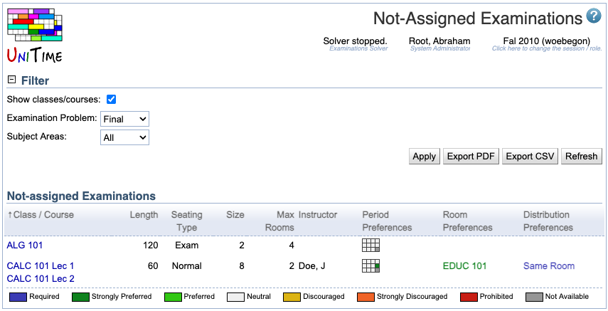

## Screen Description

The Not-Assigned Examinations screen provides a list of examinations that have not yet been assigned period and room(s).

{:class='screenshot'}

## Filter

* **Show classes/courses**
	* Show classes/courses instead of examination name
		* When checked, names of all classes/courses that are associated with the exam are listed
		* When unchecked, the examination name is printed

* **Examination Problem**
	* Final or Midterm examinations

* **Subject Areas**
	* Select a subject area for which you want to display the examinations or select "All" to display examinations for all subject areas

## Not-assigned Examinations

A list of examinations that do not have assigned periods and rooms

* **Classes/Courses**
	* Classes/Courses whose students should take this examination
	* Displayed if the "Show classes/courses" checkbox is checked in the Filter part

* **Examination**
	* Name of the examination
	* Displayed if the "Show classes/courses" checkbox is unchecked in the Filter part

* **Seating Type**
	* Requested seating type (Normal or Exam - this influences the number of seats available)

* **Size**
	* Examination size (number of seats needed in a room or rooms)

* **Instructor**
	* Instructor for the examination

* **Period Preferences**
	* Preferences for time periods for the examination

* **Room Preferences**
	* Room preferences for the examination

* **Distribution Preferences**
	* Examination Distribution Preferences for the examination

## Operations

* **Apply**
	* Apply changes made in the Filter section

* **Export PDF**
	* Export the list of unassigned examinations into a PDF file

* **Refresh**
	* Refresh the list of unassigned examinations
