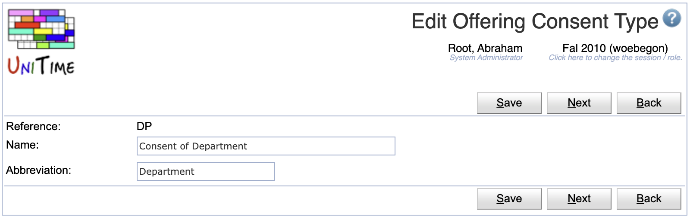
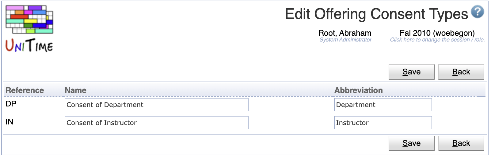

## Screen Description

The Offering Consent Types page can be used to change names and abbreviations of existing offering consent types.

{:class='screenshot'}

In UniTime, a consent can be given either by an instructor (course coordinator) or by a department (department scheduling manager). If a course requires a consent, a student enrolled in the course is in a waiting for consent state until the appropriate manager (course coordinator or scheduling manager) gives the consent or rejects the student from the course. The consent can be given using the [Online Student Scheduling Dashboard](online-student-scheduling-dashboard). This technique provides an alternative to reservations which need to be given before a student enrolls in a course, and unlike the reservations, consents are approved (or rejected) after the fact (i.e., once a student is enrolled in a course).

## Details

A consent type has a reference (which cannot be changed), a name and an abbreviation. Both names and abbreviations must be unique.

## Operations

The table can be sorted by any of its columns, just by clicking on the column header and the sorting option that opens.

### Edit Offering Consent Type
Click a particular offering consent type to make changes.

{:class='screenshot'}

* Click **Save** to make changes, **Back** to return to the list without making any changes
* Click **Previous** or **Next** to save the changes and go to the previous or next offering consent type, respectively

### Edit Offering Consent Types
Click **Edit** to edit all offering consent types

{:class='screenshot'}

* Click **Save** to make changes, **Back** to return to the list without making any changes

### Export CSV/PDF
Click the **Export CSV** or **Export PDF** to export the list of offering consent types to a CSV or PDF document, respectively.

