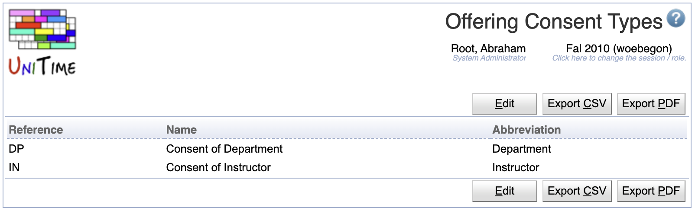

## Screen Description

The Offering Consent Types page can be used to change names and abbreviations of existing offering consent types.

In UniTime, a consent can be given either by an instructor (course coordinator) or by a department (department scheduling manager). If a course requires a consent, a student enrolled in the course is in a waiting for consent state until the appropriate manager (course coordinator or scheduling manager) gives the consent or rejects the student from the course. The consent can be given using the [Online Student Scheduling Dashboard](online-student-scheduling-dashboard). This technique provides an alternative to reservations which need to be given before a student enrolls in a course, and unlike the reservations, consents are approved (or rejected) after the fact (i.e., once a student is enrolled in a course).

## Details

A consent type has a reference (which cannot be changed), a name and an abbreviation. Both names and abbreviations must be unique.

## Operations

A particular consent type can be changed by clicking the appropriate line. All consents can be edited at once by clicking the **Edit** button.

{:class='screenshot'}
