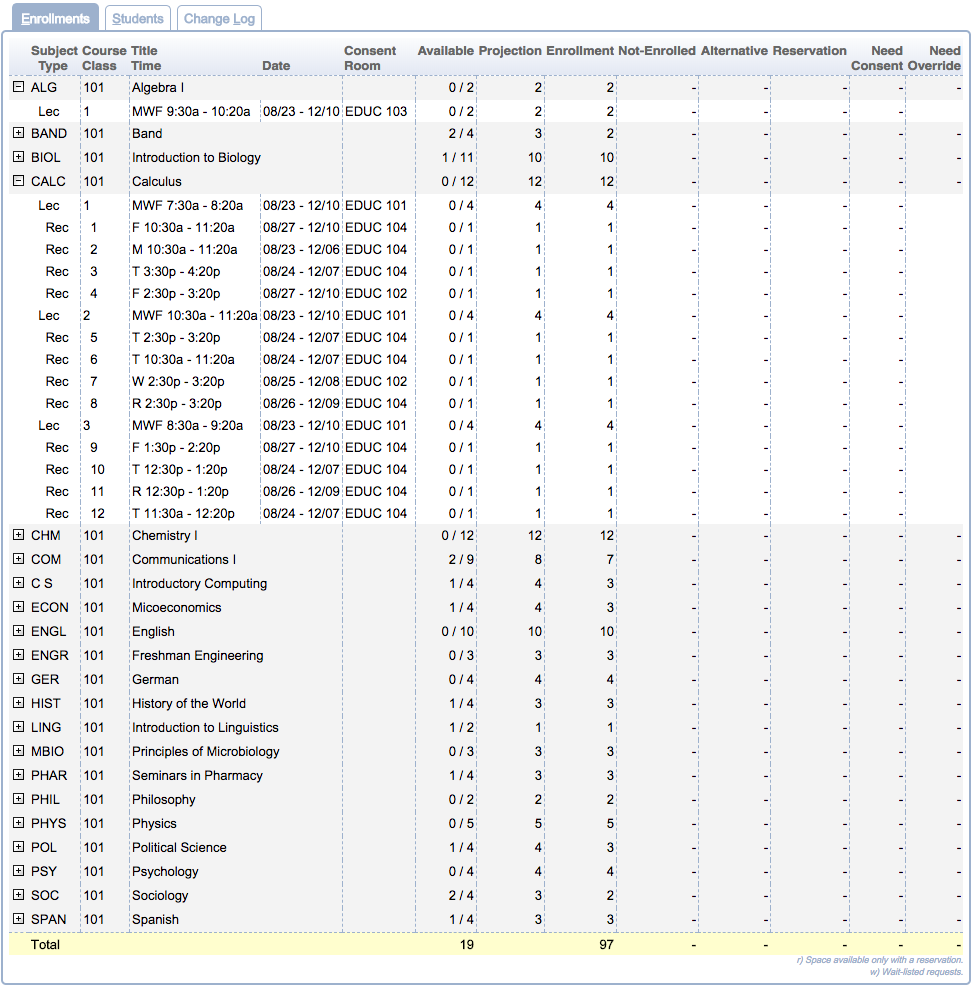
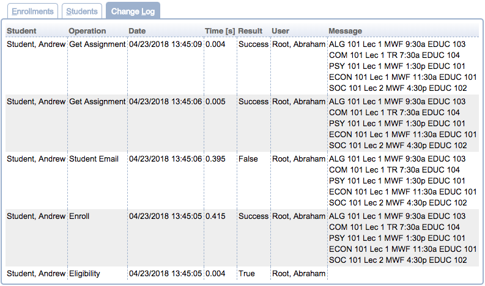
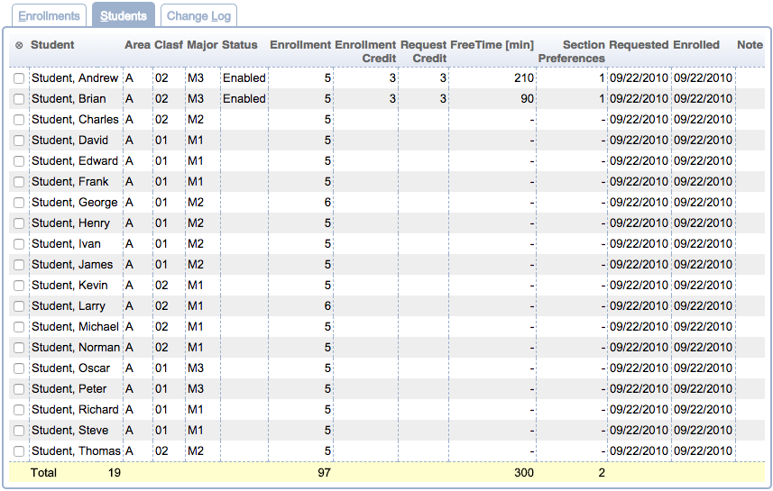

## Screen Description

The Online Student Scheduling Dashboard screen provides a tool for displaying a given set of course requests/student enrollments or students. The page also displays information from the sectioning log (either for a particular student or by a given filter). The page is available for administrators, scheduling deputies (can approve consent), student advisors (can change student enrollment), and course coordinators (can approve consent of instructor). Course coordinators can only see courses that are assigned to them. The page has extensive filtering capabilities (by the student, group, curriculum, course, subject, consent, ...). It is possible to email students and/or change their scheduling status (admin only).

{:class='screenshot'}

## Filter

The filter at the top of the Online Student Scheduling Dashboard page controls the search criteria used to display data on the page. When the user accesses the Online Student Scheduling Dashboard page for the first time the filter will be blank. Once the user has entered search criteria in the filter and performed a search the page will remember the last search performed by the user and automatically populate the filter with that search criteria the next time the user accesses the page.  See [Scheduling Dashboard Filter](scheduling-dashboard-filter) for more details.

**Note:** In addition to any search criteria entered into the Filter, the data displayed in the Scheduling Dashboard is also filtered by the access to the data granted by a user’s role.

## Details

The page shows up to three tabs - **Enrollments** with detailed information about courses and classes, **Students** with enrollment information ordered by students, and **Change Log** with a list of changes in enrollments. See the description for each of them below.

## Enrollments

{:class='screenshot'}

* A column with clickable plus signs that enable unfolding of a course into lines with individual classes

* **Subject / Type**
	* Subject area on the line with a course
	* Instructional Type on the line with a class

* **Course / External Id**
	* Course number on the line with a course
	* External Id or section number on the line with a class

* **Title / Time**
	* Course title on the line with a course
	* Assigned time of a class

* **Date**
	* Dates during which the class is taught

* **Consent / Room**
	* Type of required consent for a course (if empty, no consent is required)
	* Room where a class is taught

* **Available**
	* Total number of available seats / total number of seats
	* The column has two numbers separated by a slash (/).  The first number is the total number of unused space in the course or class.  The second number is the size limit for the course or class.  For example: 5 / 25 would mean there are 5 available spaces in a class that holds 25 students.

* **Projection**
	* Total number of projected students for the course or class

* **Snapshot Limit**
	* The course / class snapshot limit (a limit taken at a certain time)

* **Enrollment**
	* Number of students enrolled into the course or class (filtered by filtering criteria)
	* When the search criteria used in the Filter does not restrict the student population then a single number which is the total number of students enrolled in the course or class is displayed.  For example, if there 20 students enrolled in a class then the number 20 would be displayed.  When the search criteria used in the Filter restricts the student population for the data displayed in this column, there will be two numbers separated by a slash (/).  For example, if 3 of the students in the population retrieved by the search criteria in the Filter are enrolled in the class and in total there are 20 students enrolled in the class, then the number displayed would be 3 / 20.

* **Not-Enrolled**
	* Number of students who have requested the course or class but are not enrolled in it (filtered by filtering criteria)
	* When the search criteria used in the Filter does not restrict the student population, then a single number equal to the total number of students who have the course listed in their course request but are not enrolled in the course, is displayed.  For example, if there 2 students who requested a course but did not receive it, then the number 2 would be displayed.  When the search criteria used in the Filter does restrict the student population for the data displayed in this column, there will be two numbers separated by a slash(/).  For example, if 1 of the students in the population retrieved by the search criteria in the Filter requested the course but did not receive it and in total there are 2 students who requested the course but did not receive it, then the number displayed would be 1 / 2.

* **Alternative**
	* Number of students who have requested the course (as an alternative) or class but are not enrolled in it (filtered by filtering criteria)
	* When the search criteria used in the Filter does not restrict the student population then a single number which is the total number of students who have the course listed in their course request as an alternative is displayed.  For example, if there 5 students who requested a course as an alternative then the number 5 would be displayed.  When the search criteria used in the Filter does restrict the student population for the data displayed, this column will have two numbers separated by a slash(/).  For example, if 2 of the students in the population retrieved by the search criteria in the Filter requested the course as an alternative and in total there are 5 students who requested the course as an alternative, then the number displayed would be 2 / 5.

* **Reservation**
	* Number of students enrolled into the course or class via a reservation (filtered by filtering criteria)
	* When the search criteria used in the Filter does not restrict the student population, a single number equal to the total number of students who have been placed into the course or class as the result of a reservation is displayed.  For example, if there were 3 students who were placed into a course as a result of a reservation then the number 3 would be displayed.  When the search criteria used in the Filter does restrict the student population for the data displayed the in this column will be two numbers separated by a slash(/).  For example, if 1 of the students in the population retrieved by the search criteria in the Filter was placed into a course as a result of a reservation and in total there are 3 students who were placed into a course as a result of a reservation, then the number displayed would be 1 / 3.

* **Need Consent**
	* Number of students who need consent of instructor to be able to take the course (filtered by filtering criteria)
	* When the search criteria used in the Filter does not restrict the student population then a single number which is the total number of students who required some form of consent to enroll in the course or class is displayed.  For example, if there were 4 students who required some form of consent to enroll in a course then the number 4 would be displayed.  When the search criteria used in the Filter does restrict the student population for the data displayed the in this column will be two numbers separated by a slash(/).  For example, if 2 of the students in the population retrieved by the search criteria in the Filter required some form of consent to enroll in a course and in total there are 4 students who required some form of consent to enroll in a course, then the number displayed would be 2 / 4.

* **Need Override**
	* This column is only populated if UniTime is integrated with a system that will inform UniTime of the need for overrides.  This label applies to both the course and class level data. When the search criteria used in the Filter does not restrict the student population then a single number which is the total number of students who require an override to enroll in the course or class is displayed.  For example, if there were 6 students who require an override to enroll in a course then the number 6 would be displayed.  When the search criteria used in the Filter does restrict the student population for the data displayed the in this column will be two numbers separated by a slash(/).  For example, if 2 of the students in the population retrieved by the search criteria in the Filter require an override to enroll in a course and in total there are 6 students who require an override to enroll in a course, then the number displayed would be 2 / 6.

Click on any class or course to get to its [Enrollments](enrollments-of-class-or-course) dialog (which shows a list of enrolled students together with some additional information).

## Students

{:class='screenshot'}

* Note: some columns need not be displayed in the table if they are not applicable to the current situation⊗ (an optional column for the student selection checkboxes)
	* Click on this column header to open a menu with possible actions (most actions are available only when at least one checkbox in this column is checked for some student)
		* **Select All**
			* Select all students in the list (check all the checkboxes)
		* **Clear All**
			* Clear all checkboxes
		* **Send email...**
			* Send email to the selected students via [Send email...](send-email) screen that will pop up
		* **Mass cancel...**
			* Cancel the schedule(s) for all selected students and inform the students about it by email in the [Mass cancel...](mass-cancel) screen that will pop up
		* **Change status to Status**
			* These options are for changing the student's status; the status types can be defined through the [Student Scheduling Status Types](student-scheduling-status-types) screen
			* **Change status to System Default (All Enabled)**
				* This is the only status type that is always present
		* Set student status...
			* Change student status using the **Set student status...** dialog which provides additional information about the selected status.
		* Set student note...
			* Change student note

* **External Id** (optional column)
	* Student's external id (university id)

* **Student**
	* Name of the student

* **Area**
	* Academic area (e.g., college of the student)

* **Clasf**
	* Academic classification (e.g., year/semester of study)

* **Degr**
	* Student's degree

* **Major**
	* Student's major

* **Minor**
	* Student's minor

* **Accommodation**
	* If a student requires an accommodation that affects their course schedule, then the code for the accommodation is displayed in this column.
	* This column is only visible if there is at least one student in the data returned by the search criteria in the filter that requires accommodation.

* **Group**
	* Student group or groups that the student is associated with.
	* Additional group columns may appear for groups of certain types. For example, if there are student groups of type COHORT, there will be a COHORT column containing cohorts that the student is associated with.

* **Status**
	* If the student has a student scheduling status that has been set to a value other than the session default, then the value is displayed in this column.
	* See the description of the [Student Scheduling Status Types](student-scheduling-status-types) screen for more details

* **Enrollment**
	* The number of courses the student is enrolled into.
	* This column is only visible if there is at least one student in the data returned by the search criteria in the filter that has an enrollment.

* **Not-Enrolled**
	* The number of courses the student has requested but is not enrolled into.  This column is only visible if there is at least one student in the data returned by the search criteria in the filter that has at least one course request that the student is not enrolled into.

* **Reservation**
	* The number of reservations provided to a student to place the student into a particular course or class. This column is only visible if there is at least one student in the data returned by the search criteria in the filter that required a reservation.

* **Consent**
	* The number of courses the student is enrolled in that required some form of consent for the student to enroll into the course.  This column is only visible if there is at least one student in the data returned by the search criteria in the filter that required consent.

* **Pending Overrides**
	* The number of pending override requests that the student has. This column is only visible if there is at least one student in the data returned by the search criteria in the filter that has a pending override.

* **Enrollment Credit**
	* This column displays the total number of credits in which a student is enrolled.  If the student is enrolled into a configuration of a course that is online (DO) or hybrid (B/H) then the total credit of courses labeled online or hybrid will be broken out inside of parentheses.  This column is only visible if there is at least one student in the data returned by the search criteria in the filter that is enrolled into a course.

* **Requested Credit**
	* This column displays the range of credits that may be generated by a student’s course request.  This column is only visible if there is at least one student in the data returned by the search criteria in the filter that has saved course requests.

* **Distance Conflicts**
	* This column displays the number of distance conflicts a student has and next to it in parentheses the number of minutes of the longest distance conflict.  This column is only visible if there is at least one student in the data returned by the search criteria in the filter that has a distance conflict.

* **Overlap [min]**
	* This column displays the number of minutes of overlapping classes a student has.  This column is only visible if there is at least one student in the data returned by the search criteria in the filter that has overlapping classes.

* **Free Time [min]**
	* This column displays the number of minutes that the student is in class during a window of time the student has requested as Free Time.  This column is only visible if there is at least one student in the data returned by the search criteria in the filter that has a class overlapping their Free Time request.

* **Instr. Method Preferences**
	* This column displays the number of instructional method preferences a student listed in their course request.  If the student is not enrolled in any courses or received all of their instructional method preferences the number of instructional method preferences is displayed.  If the student is enrolled in courses and is not enrolled in a class that matches their instructional method preferences, then the number displayed will be the number of instructional method preferences the student had that were met followed by a slash (/) and the number of instructional method preferences the student requested, e.g., 1 / 2.  This column is only visible if there is at least one student in the data returned by the search criteria in the filter that has an instructional method preference.

* **Section Preferences**
	* This column displays the number of class section preferences a student listed in their course request.  If the student is not enrolled in any courses or received all all of their class section preferences the number of class section preferences is displayed.  If the student is enrolled in courses and is not enrolled in a class that matches their class section preferences, then the number displayed will be the number of class section preferences the student had that were met followed by a slash (/) and the number of class section preferences the student requested, e.g., 0 / 1.  This column is only visible if there is at least one student in the data returned by the search criteria in the filter that has a class section preference.

* **Requested**
	* Date of student's requests

* **Enrolled**
	* Date of student's enrollments

* **Advisor**
	* This column displays the advisor or advisors that the student has assigned.
		* This column is only visible if there is at least one student in the data returned by the search criteria in the filter that has an advisor.

* **Advised Credit**
	* For the students that have been advised, this column displays the credit number provided by the advisor (the Total Priority Credit Hours from the Advisor Course Recommendations page), but the color indication shows how the recommendations are followed.
	* So, the student can have a similar number of credits requested, but when he/she puts different courses in the color will go from green to orange to red based on the percentage we no longer show.
	* More details are available on mouse-over and when the student line is clicked.
	* This column is only visible if there is at least one student in the data returned by the search criteria in the filter that has been advised.

* **Missing Courses**
	* This column displays the number of courses the student did __not__ place on their Student Course Requests page that the advisor recommended.
	* Missing critical courses are marked in **red** (with critical or cr next to the number in superscript), other missing primary courses are listed after the number. There is also a mouse-over that will explain the numbers, together with listing the key changes.
	* The Missing Courses will sort by the critical numbers first, other missing primary courses second.
	* This column is only visible if there is at least one student in the data returned by the search criteria in the filter that has been advised.

* **Not-Enrolled Courses**
	* This column lists the number of courses that the advisor recommended and the student put on the Course Requests form, however, the student is not enrolled in the course (or any of the advisor-provided alternative).
	* The number of not-enrolled critical courses is highlighted the same way as in the Missing Courses column (in red with cr superscript). The courses are listed on the mouseover.
	* This column is only visible if there is at least one student in the data returned by the search criteria in the filter that has been advised.

* **Note**
	* If someone has placed a note on the student, this column displays the note.

* **Emailed**
	* Information about emails sent to the student

Click on any student to get to the screen with [Classes](classes-for-student) for that student.

## Change Log

{:class='screenshot'}

For the Change Log, the Filter can be used with further parameters

* **operation:** Operation that was executed during a change

* **user:** User that has made a change

* **result:** Result of the change

The Change Log table has the following columns

* **Student**
	* Name of the student whose enrollments have changed

* **Operation**
	* Operation that was performed

* **Date**
	* Date and time of the change

* **Time**
	* If the operation was timed, the amount of time it took to complete the operation.

* **Result**
	* Result of the change (indicates e.g. whether the operation was successful or not)

* **User**
	* User who has performed the change

* **Message**
	* More details about the change (such as information about the class that was subject to the change)

Click on any change in the change log to get to its [Change message](change-message-for-student) screen with more detailed information about the change.

## Operations

* **Search**
	* Apply the criteria from the Filter

* **Export**
	* Export table in CSV format

* **More**
	* When showing **Students** table
	* **Select All**
		* Select all students in the list (check all the checkboxes)
	* **Clear All**
		* Clear all checkboxes
	* **Send email...**
		* Send email to the selected students via [Send email...](send-email) screen that will pop up
	* **Mass cancel...**
		* Cancel the schedule(s) for all selected students and inform the students about it by email in the [Mass cancel...](mass-cancel) screen that will pop up
	* **Change status to Status**
		* These options are for changing the student's status; the status types can be defined through the [Student Scheduling Status Types](student-scheduling-status-types) screen
		* **Change status to System Default (All Enabled)**
			* This is the only status type that is always present
	* Set student status...
		* Change student status using the **Set student status...** dialog which provides additional information about the selected status.
	* Set student note...
		* Change student note
	* **Sort By**
		* Select column that will be used to sort the table

