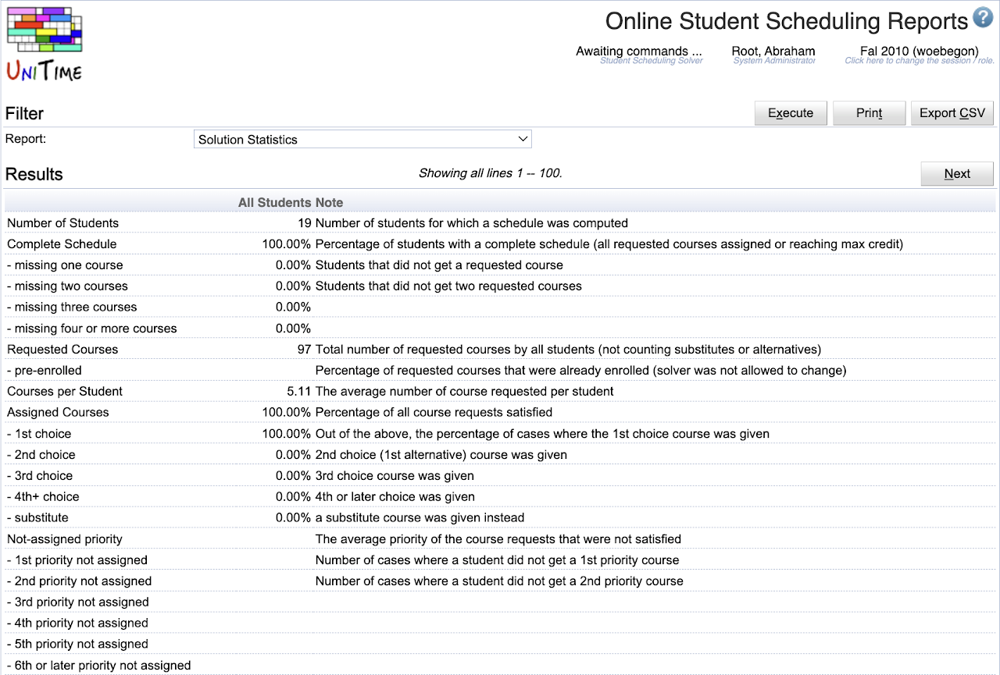

## Screen Description

The Online Student Scheduling Reports page offers a list of standard reports computed from the online student scheduling server data. The page is only available when the online scheduling is enabled, and the online scheduling solver server is loaded for the current academic session.

{:class='screenshot'}

## Details

* **Report**
	* List of available reports

* **Results**
	* Computed report

## Operations

* **Execute**
	* Run the report, show the resultant data

* **Print**
	* Run the report, format the report in a more printer-friendly way, and open up the print dialog.

* **Export CSV**
	* Run and export the report in a CSV format.
