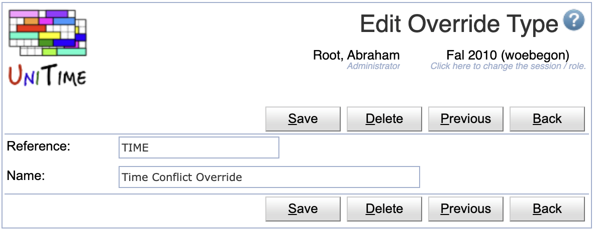

## Screen Description

The Override Types page allows to define the types of overrides that can be enabled or disabled on the [Course Offering Edit](edit-course-offering) page.  This functionality is used when UniTime is integrated with a Student Information System that allows the students to request overrides for rejected enrollment requests.

{:class='screenshot'}

## Details

* **Reference**
	* The code used by the Student Information System to apply the override type

* **Name**
	* A description of the override type

Click on any line with an override type to get to its [Edit Override Type](edit-override-type) screen.

## Operations

The table can be sorted by any of its columns, just by clicking on the column header and the sorting option that opens.

### Add Override Type
Click **Add** to add a new override type

{:class='screenshot'}

* Click **Save** to create a new override type
* Click **Back** to return to the list without making any changes

### Edit Override Type
Click a particular override type to make changes or to delete the override type

{:class='screenshot'}

* Click **Save** to make changes, **Back** to return to the list without making any changes
* Click **Previous** or **Next** to save the changes and go to the previous or next override type respectively
* Click **Delete** to delete the override type.

### Edit Override Types
Click **Edit** to edit all override types

{:class='screenshot'}

* Use the  icon to add a new line and  to delete a line
* Click **Save** to make changes, **Back** to return to the list without making any changes

### Export CSV/PDF
Click the **Export CSV** or **Export PDF** to export the list to a CSV or PDF document respectively
