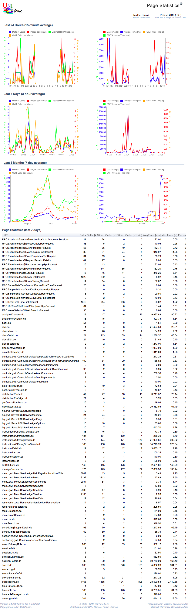
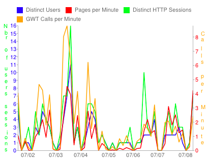
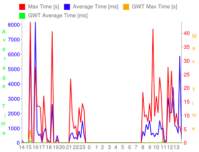

## Screen Description

 The Page Statistics page provide some basic information about usage of UniTime pages during the past 24 hours, 7 days, and 3 months. It also provides some basic information about each page and GWT/RPC asynchronous calls.

 The page is based on the [QueryLog]( https://github.com/UniTime/unitime/tree/master/JavaSource/QueryLog.hbm.xml). It may take a bit of time (usually a couple of minutes) for the charts to be computed and the page to appear.

## Details

 For each time frame (last 24 hours, 7 days, and last 3 months), two charts are computed. Each point (horizontally) represents a time window of 15 minutes, 3 hours, 7 days respectively. The chart on the left (see the example below) contains the average number of users, the average number of distinct HTTP sessions (with the vertical axe on the left), the average number of displayed pages, and the average number of GWT calls per minute (with the vertical axe on the right).

{:class='screenshot'}

{:class='screenshot'}

 The chart on the right (see the example below) contains maximal and average time that was need to generate a page, and maximal and average time needed for a GWT/RPC asynchronous call. The average times have the vertical axe on the left (in milliseconds) and the maximal times have the axe on the right size (in seconds).

{:class='screenshot'}

 Below the charts, there is the Page Statistics table. It is computed from the queries during the last 7 days. For each page and/or GWT/RPC asynchronous call, it contains how many times it was executed; how many times it was executed and the execution took more than 10 ms, 100 ms, and 1 minute respectively. Average and maximal execution times are also provided. There is also the number of cases when the execution ended up in with an exception. The Page Statistics table can be ordered by any column. To do that, click on the particular column.
