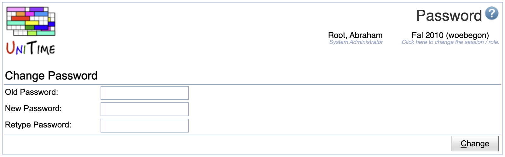
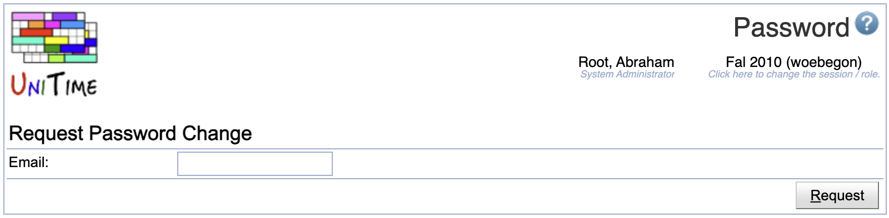

## Screen Description

The Password page can be used to change password or to request a new password for an existing user (manager, instructor, student, or advisor).

The page is only available when database authentication (via the [Users](users-database-authentication) page) is being used.

### Change Password

Click Preferences > Change Password to change password

{:class='screenshot'}

Type in the existing and the new password and click **Change** to change your password.

### Request Password

Click the *Forgot your password?* link on the Log in screen to request a new password

{:class='screenshot'}

Type in the user's email and click **Request**. If the provided email address is matched to an existing user, an email with a temporary reset password link is sent to the provided email address.