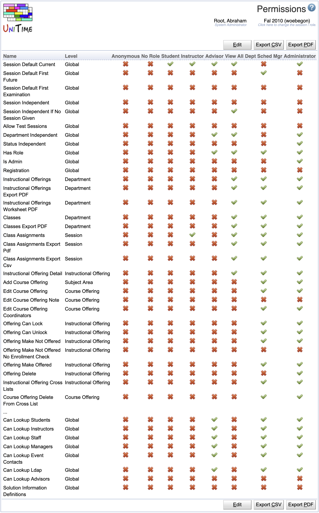

## Screen Description

The table in the Permissions screen lists all the roles in UniTime and all the permissions that these roles have or do not have. A new role can be added by a user from the [Roles](roles) page. The permissions granted to each role can be changed by clicking on the line with that role or changes can be performed in bulk by clicking on the **Edit** button.

{:class='screenshot'}

## Details

Since UniTime 3.4, there is a permission for each page and/or operation (see [Right]( https://github.com/UniTime/unitime/tree/master/JavaSource/org/unitime/timetable/security/rights/Right.java) enum for the full list). The roles are no longer used directly by UniTime, instead there is a mapping between a role and a set of these permissions (which is defined on this Permissions page). Each permission consist of a **right** (of the [Right]( https://github.com/UniTime/unitime/tree/master/JavaSource/org/unitime/timetable/security/rights/Right.java) enum), a **level** (an object type on which it is to be evaluated) and a permission check. For a user to have access, he/she has to have the right, and the permission check must succeed on the given object (e.g., an academic session, a department, a class, or a room). The object type is shown in the Level column on the Permissions page, next to the Name of the right it applies to. The rights with level Global do not evaluate on a particular object per se, they apply globally (like traditional role permissions) and there is no permission check.

Permissions work together with the academic session and department statues. An academic session has a status (see [Academic Sessions](academic-sessions) page), which can be overridden by a department status (see [Departments](departments) page). These statuses are defined on the Administrator > Other > [Status Types](status-types) page, and each status has a set of toggles (defined by the [DepartmentStatusTypes.Status]( https://github.com/UniTime/unitime/tree/master/JavaSource/org/unitime/timetable/model/DepartmentStatusType.java#L42) enum). Each permission can take the status of the academic session (and/or the department) into account as needed.

In other words, having a particular permission **DOES NOT** necessary mean that the appropriate page is available for any data (e.g., Class Edit permission does not grant an ability to edit every class in UniTime). Each permission also consists of a permission check which usually include:

* Check that the object in question is of the department and the academic session of the current authorization (role and academic session selection) of the user.

* Check that the academic and/or department status allows for the object to be viewed and/or edited. See [Status Types](status-types) for the existing statuses.
	* For event permissions, check that the event status of the appropriate room allows for the room to be requested / approved. See [Event Statuses](event-statuses) page and the event [approval workflow & permissions](event-detail#approval-workflow--permissions).

* Few additional, permission specific checks. For instance, only a room that does not have any events already booked in can be deleted.

These checks are implemented by the classes in [org.unitime.timetable.security.permissions](https://github.com/UniTime/unitime/tree/master/JavaSource%2Forg%2Funitime%2Ftimetable%2Fsecurity%2Fpermissions) package.

For instance, see the [ClassEdit](https://github.com/UniTime/unitime/tree/master/JavaSource/org/unitime/timetable/security/permissions/CoursePermissions.java#L251) permission. A given class can be edited by a user if

* user's current role has the Class Edit permission enabled (otherwise the permission check is not even executed)

* the appropriate offering either does not need to be locked (student online scheduling is not enabled) or is already locked (from students to be able to get in)

* and either one of the following is true:
	* user is associated with the controlling department of the class (class → controlling course → subject area → department) and the session / (managing) department state allows for OwnerEdit
	* user is associated with the managing department of the class (class → manager, e.g., an external department assigned to the class on the [Instructional Offering Configuration](instructional-offering-configuration) page) and the session / (managing) department state allows for ManagerEdit

Also, some of the above can be overridden by having the Session Independent, Department Independent, or Status Independent rights (see the [department check]( https://github.com/UniTime/unitime/tree/master/JavaSource/org/unitime/timetable/security/permissions/SimpleDepartmentPermission.java#L55)) in the current role. A user with a session independent role does not need to be associated with a particular academic session to be able to access it (e.g., a System Administrator can manage all academic sessions in the system). A user with a department independent role does not need to be associated with all the departments to be able to see / make changes to all the objects of a particular type in an academic session (e.g., an Examination Manager can edit or timetable any examination). Users with a status independent role can make changes despite the current academic session and/or department status. Please note, that a user with a department independent role still needs to be associated with at least one department of the academic session (on the [Timetable Managers](timetable-managers) page), as there is no direct relation between timetabling managers and academic sessions (it goes through the departments).

This quite complicated model is in there to allow for the control to pass from schedule deputies (responsible for data entry and timetabling of some (departmental) classes) to some central office (or offices) for timetabling. It is also needed to be able to timetable (and/or enter data for) different problems at different time. For instance, large lecture room classes are timetabled first, while schedule deputies are still able to work on the input data for their departmental problems but can no longer change requirements for the large classes.

## Operations

The table with permissions has roles on top and permissions on the left. Roles can be hidden by clicking on the table header and unchecking roles that the user does not wish to display.

The table can be sorted by any of the column headers - click on the column header and then on **Sort by ...**

Click on any line edit a particular permission (check to which of the existing roles it applies), or click on the **Edit** button to edit all the combinations of roles and their permissions at once.

Permissions page can be accessed by users with Permissions permission, but only users with Permission Edit permission can make changes.
