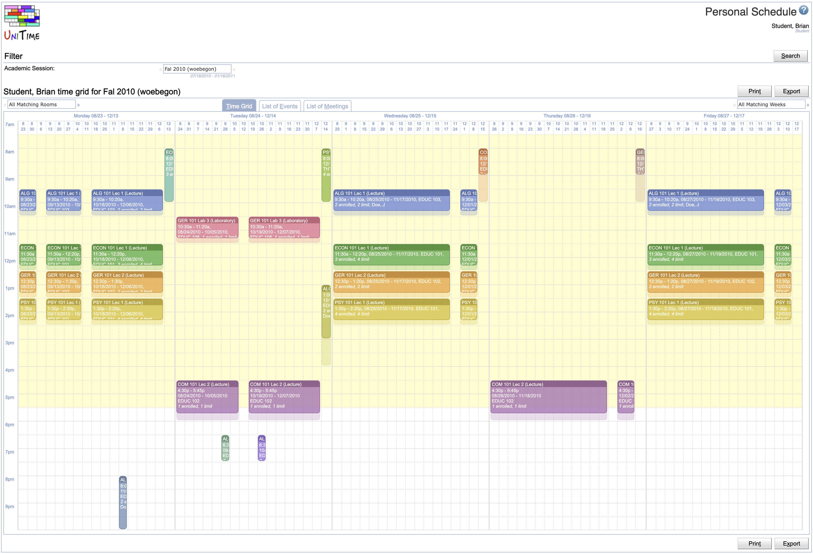
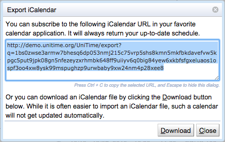

## Screen Description

Personal Schedule page is a variant of the [Events](events) page that allows to see a schedule of a person.

{:class='screenshot'}

The page displays a personal schedule of the user. This includes all events requested by the user. For students, it also includes all classes and examinations he/she is enrolled and the related course related events. For instructors, it includes all classes and examinations they are assigned to.

Users with Event Lookup Schedule permission can lookup a schedule of another person using the **Lookup** button.

A useful feature is the ability to export the personal schedule as an iCalendar URL that can be inserted in your favourite calendar application and that always returns an up-to-date calendar. To get the URL, select the Export iCalendar option under the **Export** button. The following dialog appears and the url can be copied into the clipboard.

{:class='screenshot'}

**Note:** The personal schedule is available for students and instructors only if the academic session is in a status that includes no-role class schedule, midterm exam schedule, and / or final exam schedule (the status type's properties can be changed in the [Edit Status Type](edit-status-type) screen).
