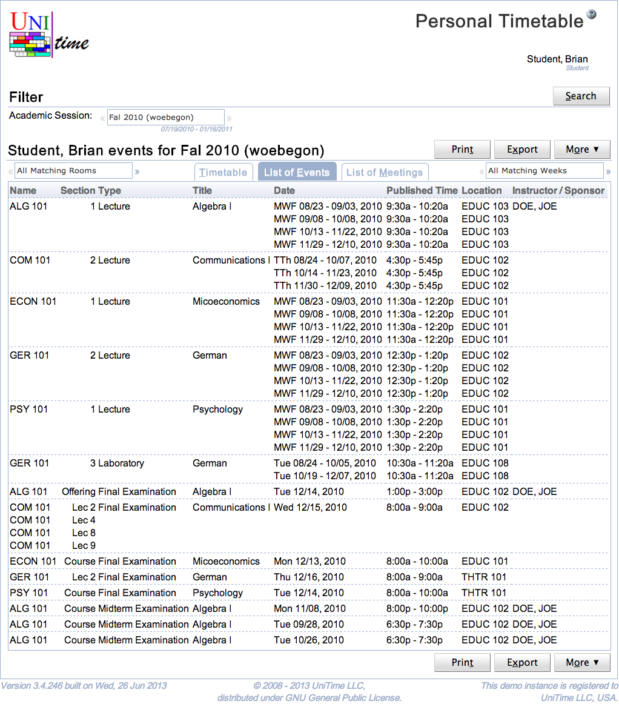

## Screen Description

Personal Timetable page is a variant of the [Events](events) page that allows to see a timetable of a person.

{:class='screenshot'}

The page displays a personal timetable of the user. This includes all events requested by the user. For students, it also includes all classes and examinations they are enrolled and the related course related events. For instructors, it includes all classes and examinations they are assigned to.

Users with Event Lookup Schedule permission can lookup a timetable of another person using the **Lookup** button.

A useful feature is the ability to export the personal schedule as an iCalendar URL that can be inserted in your favorite calendar application and that always returns an up-to-date calendar for the selected academic session. To get the URL, select the Copy iCalendar URL option under the **Export** button. The following dialog appears and the url can be copied into the clipboard.

{:class='screenshot'}

Note: The personal timetable is available for students and instructors only if the academic session is in a status that includes no-role class schedule, midterm exam schedule, and / or final exam schedule (the status type's properties can be changed in the [Edit Status Type](edit-status-type) screen).
