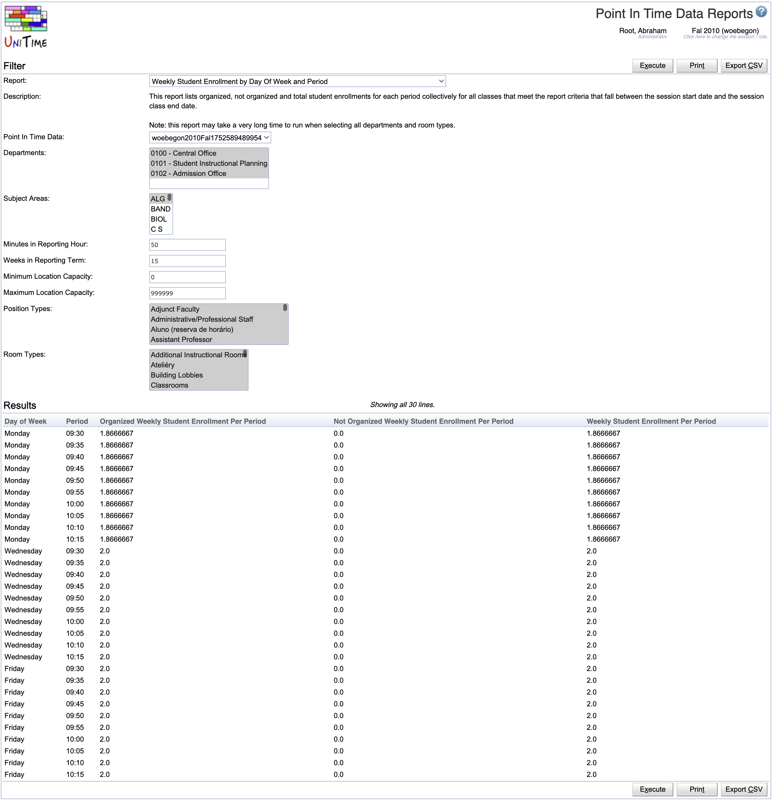

## Screen Description

The Point In Time Data Reports page contains a set of standard reports that are calculated from the static Point In Time Data snapshots for a session.  Please contact us at [support@unitime.org](mailto:support@unitime.org) if you would like to sponsor the development of a particular report.

{:class='screenshot'}

The page is only available when there is at least one [Point In Time Data Snapshot](point-in-time-data-snapshots) created.

## Details

The following reports can be run from the Point In Time Data Reports Page:

* **Weekly Student Class Hour Report For Department By Class** - This report lists organized, not organized and total class hours for each class that occur between the session start date and the session class end date for the selected department.
	* Department - The department to use when generating this report.

* **Weekly Student Class Hour Report For Department By Instructor Position** - This report lists organized, not organized and total class hours and student class hours for instructor position that occur between the session start date and the session class end date for the selected departments.
	* Departments - The set of departments to use when generating this report.

* **Weekly Student Class Hour Report For Department By Instructor** - This report lists organized, not organized and total class hours and student class hours for instructor that occur between the session start date and the session class end date for the selected departments.
	* Departments - The set of departments to use when generating this report.

* **Departmental Weekly Student Class Hour Report** - This report lists organized, not organized and total class and student class hours for each department that occur between the session start date and the session class end date.

* **Room Utilization** - This report lists organized, not organized and total room and student class hours for each location that is used between the session start date and the session class end date.
	* Departments - The set of departments to use when generating this report.
	* Room Types - The set of room types to use when generating this report.

* **Room Type Utilization by Department** - This report lists organized, not organized and total room and student class hours for each room type controled by a department that is used between the session start date and the session class end date.
	* Departments - The set of departments to use when generating this report.
	* Room Types - The set of room types to use when generating this report.

* **Weekly Student Enrollment by Day Of Week and Period** - This report lists organized, not organized and total student enrollments for each period collectively for all classes that meet the report criteria that fall between the session start date and the session class end date.
	* Departments - The set of departments to use when generating this report.
	* Subject Areas - The set of subject areas to use when generating this report.
	* Position Types - The set of position to use when generating this report.
	* Room Types - The set of room types to use when generating this report.

* **Organized Weekly Student Class Hours by Day Of Week and Hour of Day** - This report lists organized student class hours for each hour in the day collectively for all classes that fall between the session start date and the session class end date.

* **Organized Weekly Student Class Hours by Building by Day Of Week and Hour of Day** - This report lists organized student class hours by building for each hour in the day collectively for all classes that fall between the session start date and the session class end date.

* **Weekly Student Class Hours by Instructional Type by Day Of Week and Hour of Day** - This report lists student class hours by instructional type for each hour in the day collectively for all classes that fall between the session start date and the session class end date.

* **Organized Weekly Student Class Hours by Department by Day Of Week and Hour of Day** - This report lists organized student class hours by department for each hour in the day collectively for all classes that fall between the session start date and the session class end date.

* **Organized Weekly Student Class Hours by Subject Area by Day Of Week and Hour of Day** - This report lists organized student class hours by subject area for each hour in the day collectively for all classes that fall between the session start date and the session class end date.

In addition to any report specific parameters listed above, all reports support the following parameters:
* Point In Time Data - The Point In Time Data snapshot to use for report.
* Minutes in Reporting Hour - The number of minutes an institution considers to be a standard reporting hour.
* Weeks in Reporting Term - The number of weeks an institution considers to be a standard reporting term.

## Operations

* **Execute** - Run the selected report and display the output in the Results section of the page

* **Print** - Run the report and send the output to the browsers print functionality.

* **Export CSV** - Run the report and write the output to a comma separated format file.

## Notes

Related Configuration Properties:

* `unitime.pointInTimeData.standardMinutesInReportingHour` - defines the default number of minutes displayed in the Minutes in Reporting Hour parameter.  The default value is 50.

* `unitime.pointInTimeData.standardWeeksInReportingTerm` - defines the default number of weeks displayed in the Weeks in Reporting Term parameter.  The default value is 15.

* `unitime.pointInTimeData.hourlyReportsStartOnTheHalfHour` - defines whether the hourly reports start on the half hour or at the top of the hour.  The default value is true which means the reports start on the half hour.
