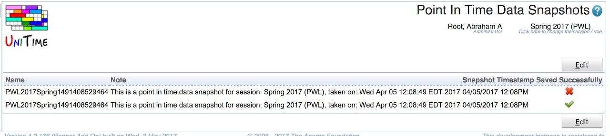

## Screen Description

 The **Point In Time Data Snapshots** page allows the user to manage the Point In Time Data snapshots that have been imported for the session.  It provides an interface to update the default name and note for the snapshot so the user can make it more descriptive.  It also provides information about whether the snapshot is complete or failed to fully save successfully.

## Details

 Since UniTime 4.2 the ability to export and import Point In Time Data snapshots to be used for reporting has existed.  The purpose of this page is to allow the user to manage these snapshots.

## Operations

 Information about a particular Point In Time Data snapshot can be changed by clicking the appropriate line. Data about all Point In Time Data snapshots can be edited at once by clicking the **Edit** button.

## Notes

 To create a Point In Time Data snapshot go to the [Data Exchange](data-exchange) page and in the Data Export section select "Point-In-Time Data" and press the "Export" button.  Once the export complete save the output file and use the [Data Exchange](data-exchange) page to import the file.  A Point In Time Data export can be done in one instance of UniTime and imported into a different instance of UniTime if one would like to have a separate instance of UniTime that is only used for reporting.

 Related Configuration Parameter:

* **unitime.pointInTimeData.standardClassMeetingLengthInMinutes** - Defines the number of minutes that are considered to be a standard hour of class at the institution.  This is related to actual class times for students, not reporting hours.  This value is used in the Point In Time Data XML export to determine the 5 minute periods a class is considered to be in session.  It is used in cases where a classes minutes per meeting is greater than the time the class is scheduled into a room.  It is used to calculate embedded break time for these classes so the number of 5 minute periods the class is meeting match the number of class minutes per meeting.  This parameter defaults to 50 minutes.

{:class='screenshot'}
