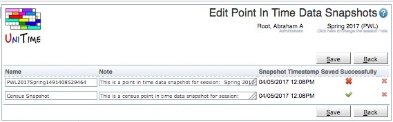

## Screen Description

The **Point In Time Data Snapshots** page allows the user to manage the Point In Time Data snapshots that have been imported for the session.  It provides an interface to update the default name and note for the snapshot so the user can make it more descriptive.  It also provides information about whether the snapshot is complete or failed to fully save successfully.

{:class='screenshot'}

## Details

Since UniTime 4.2 the ability to export and import Point In Time Data snapshots to be used for reporting has existed.  The purpose of this page is to allow the user to manage these snapshots.

The table has the following fields:

* **Name**
    * The name of the Point In Time Data Snapshot that is displayed in drop down menus.  UniTime creates a default name for each snapshot in the XML when it is exported.  It is expected this page will be used to update the name to something more meaningful.

* **Note**
    * A note providing more information about the Point In Time Data Snapshot.  UniTime creates a default note for each snapshot in the XML when it is exported.  It is expected this page will be used to update the note to be more descriptive.

* **Snapshot Timestamp**
    * The date and time the snapshot was taken.  UniTime sets this date in the xml file when the snapshot is exported.  The snapshot timestamp is not editable.

* **Saved Successfully** 
    * Indicates whether or not the XML import of the Point In Time Data Snapshot completed successfully.  If an import of a Point In Time Data Snapshot is not successful, the data is corrupt and the snapshot should be deleted.

## Operations

The table can be sorted by any of its columns, just by clicking on the column header and the sorting option that opens.

### Edit Point In Time Data Snapshot
Click a particular snapshot to make changes or to delete the snapshot

{:class='screenshot'}

Once the import of a Point In Time Data Snapshot has completed if the snapshot has not been "Saved Successfully" it should be deleted.  The data is corrupt and will not produce accurate reports.

* Click **Save** to make changes, **Back** to return to the list without making any changes
* Click **Previous** or **Next** to save the changes and go to the previous or next snapshot respectively
* Click **Delete** to delete the snapshot

### Edit Point In Time Data Snapshots
Click **Edit** to edit all snapshots

{:class='screenshot'}

* Use the  to delete a line
* Click **Save** to make changes, **Back** to return to the list without making any changes

### Export CSV/PDF
Click the **Export CSV** or **Export PDF** to export the list to a CSV or PDF document respectively

## Notes

To create a Point In Time Data snapshot go to the [Data Exchange](data-exchange) page and in the Data Export section select "Point-In-Time Data" and press the "Export" button.  Once the export complete save the output file and use the [Data Exchange](data-exchange) page to import the file.  A Point In Time Data export can be done in one instance of UniTime and imported into a different instance of UniTime if one would like to have a separate instance of UniTime that is only used for reporting.

Related Configuration Parameter:

* `unitime.pointInTimeData.standardClassMeetingLengthInMinutes` - Defines the number of minutes that are considered to be a standard hour of class at the institution.  This is related to actual class times for students, not reporting hours.  This value is used in the Point In Time Data XML export to determine the 5 minute periods a class is considered to be in session.  It is used in cases where a classes minutes per meeting is greater than the time the class is scheduled into a room.  It is used to calculate embedded break time for these classes so the number of 5 minute periods the class is meeting match the number of class minutes per meeting.  This parameter defaults to 50 minutes.
