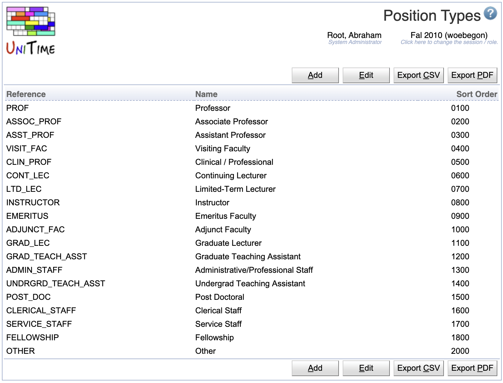
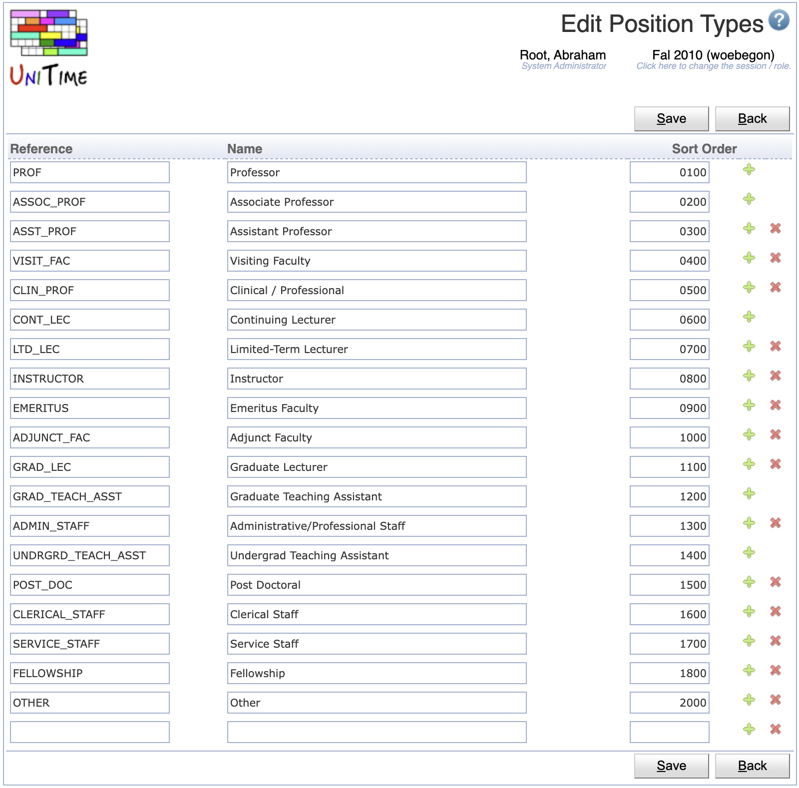

## Screen Description

The Position Types page can be used to define position types. These are used on the instructors (see [Instructors](instructors) page), each instructor can have a position type selected. Position types are not used directly by UniTime, but they can be handy for reporting purposes.

{:class='screenshot'}

## Details

Each position type has a reference, a name, and a number that is used for ordering position types. All fields are required and must be unique.

The position type reference is also used in the [Staff XML](https://www.unitime.org/interface/staffImport.xml) import file.

Position types are academic session independent, relation between position types and instructors is rolled forward with the instructors. The Position Types page can be accessed with the Position Types permission, changes are permitted with the Position Type Edit permission.

## Operations

The table can be sorted by any of its columns, just by clicking on the column header and the sorting option that opens.

### Add Position Type
Click **Add** to add a new position type

{:class='screenshot'}

* Click **Save** to create a new position type
* Click **Back** to return to the list without making any changes

### Edit Position Type
Click a particular position type to make changes or to delete the position type

{:class='screenshot'}

* Click **Save** to make changes, **Back** to return to the list without making any changes
* Click **Previous** or **Next** to save the changes and go to the previous or next position type respectively
* Click **Delete** to delete the position type. Position types that are being used cannot be deleted.

### Edit Position Types
Click **Edit** to edit all position types

{:class='screenshot'}

* Use the  icon to add a new line and  to delete a line
* Position types that are being used cannot be deleted
* Click **Save** to make changes, **Back** to return to the list without making any changes

### Export CSV/PDF
Click the **Export CSV** or **Export PDF** to export the list of position types to a CSV or PDF document respectively