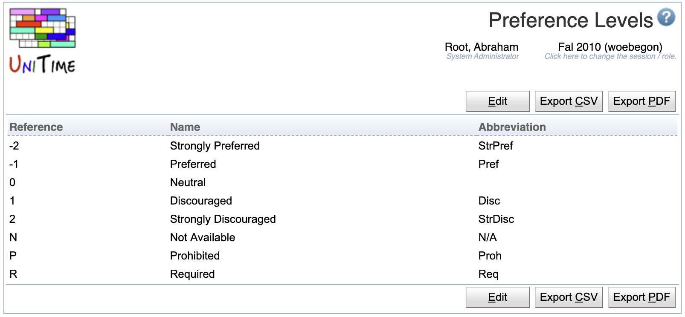
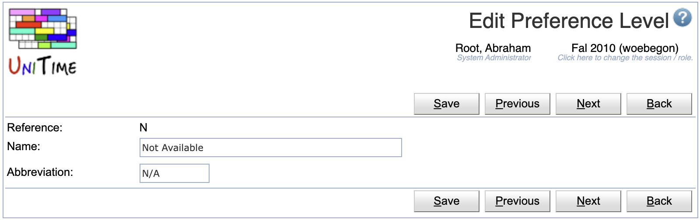
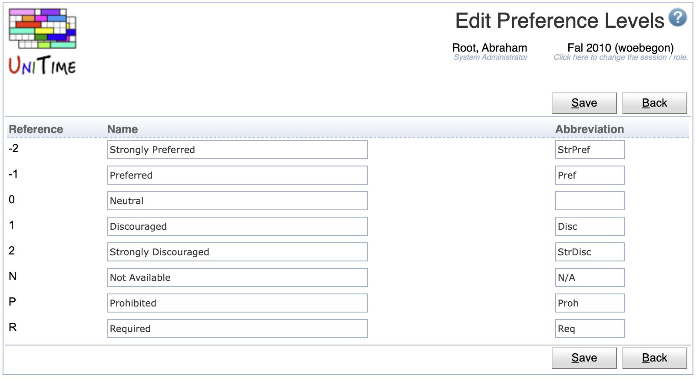

## Screen Description

The Preference Levels screen can be used to change the labels or abbreviations of the UniTime preference levels.

{:class='screenshot'}

It is not possible to define additional preference levels or delete any of the existing ones.

## Operations

The table can be sorted by any of its columns, just by clicking on the column header and the sorting option that opens.

### Edit Preference Level
Click a particular preference level to make changes.

{:class='screenshot'}

* Click **Save** to make changes, **Back** to return to the list without making any changes
* Click **Previous** or **Next** to save the changes and go to the previous or next preference level, respectively

### Edit Preference Levels
Click **Edit** to edit all preference levels

{:class='screenshot'}

* Click **Save** to make changes, **Back** to return to the list without making any changes

### Export CSV/PDF
Click the **Export CSV** or **Export PDF** to export the list of preference levels to a CSV or PDF document, respectively.

