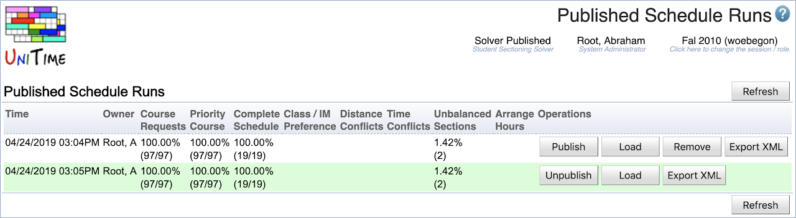

## Screen Description

Since UniTime 4.4, a batch student scheduling solver run can be published. There can be only one published solver run for each academic session, but UniTime will retain a history of the previous runs that have been published. A published run can be visible to other users that have the permissions to see the Student Sectioning Dashboard and/or Published Schedule Runs page.

{:class='screenshot'}

## Details

A published solver run is visible to all users that have the Student Scheduling and Student Sectioning Solver Dashboard and/or Student Sectioning Solver Reports permissions (possibly including advisors, departmental schedule managers, and instructors). It shows in the solver status (below the page name) as Solver Published. A published solver run is static (it is loaded in the solver, but cannot be started or modified using the Scheduling Assistant dialog on the dashboard).

The Published Schedule Runs shows all runs that have been published so far. The one that is currently published has a light green background.

## Operations

* **Publish** ... publish a previous solver run (instead of the one that is currently published)

* **Unpublish** ... unpublish the currently published run

* **Remove** ... delete a previous solver run

* **Export XML** ... export the solver run (as gzipped XML that the solver can read); this file can be imported on the Data Exchange page (in which case it gets loaded into the batch student scheduling solver)

* **Load** ... load the run into the solver for the user (this allows the user to explore the solution some more, e.g., to run the solver or to make changes)

## Notes

* The Student Sectioning Solver Publish permission is needed for a user to be able to publish a scheduled run or to use the Published Schedule Runs page (Publish button will appear on the Student Scheduling Solver page).

* It is possible to extend the **When finished** solver parameter (`StudentSctBasic.WhenFinished`) to allow for `Publish` or `Publish and Unload` in the [Solver Configurations](solver-configurations).

* The currently published run also shows on the Manager Solvers page with the Solver Published status.

* To Administration > Academic Sessions > [Task Scheduler](task-scheduler) page can be used to schedule the periodic test runs using the [Student Scheduling: Start Test Run](https://github.com/UniTime/unitime/blob/master/Documentation/Scripts/Student%20Scheduling%20Start%20Test%20Run.xml) script. To register the script, download the linked XML and import it using the [Data Exchange](data-exchange) page.
