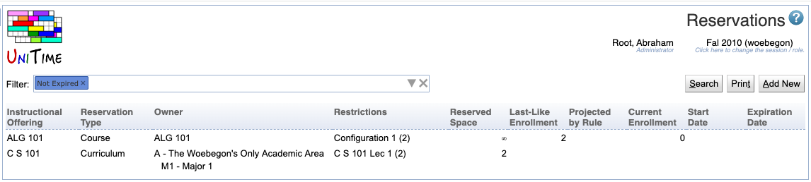

## Screen Description

The Reservations screen provides an overview of all reservations in a given academic session. It is possible to filter the list by different criteria, sort the table by different columns and click on any of the reservations to get to its [Edit Reservation](edit-reservation) screen.

{:class='screenshot'}

## Details

### Filter

* Enter the search criteria into the text box next to **Filter**:
	* Click the  icon to open the filter
		* It is possible to filter expired / not-expired reservations
		* It is possible to filter by reservation type
		* It is possible to filter by department(s)
		* It is possible to filter by subject area(s) or course(s)
		* It is possible to filter by date (reservations not expired at given date)
	* Different search criteria can be also typed in, providing suggestions as you type
	* When the text field is left blank, you will see all the reservations

* Click **Search** to apply the search criteria

### Table

The list of reservations resulting from the search has the following columns

* **Instructional Offering**
	* The instructional offering on which the reservation has been made
	* If the reservation is on a particular class/subpart/configuration, this will be denoted in the Restrictions column

* **Reservation Type**
	* Individual, Student Group, Curriculum, or Course

* **Owner**
	* The particular student, student group, curriculum or course for which the reservation has been made
	* For student groups, there is a number in parenthesis next to the group name - it indicates how many students this reservation affects; that is, how many students there are in the student group

* **Restrictions**
	* Restrictions within the instructional offering regarding which part(s) of the instructional offering the reservation is set on
	* The number in parenthesis indicates what capacity the sections in the restrictions have (it is then possible to compare them to the number in the Reserved Space column)

* **Reserved Space**
	* Number of reserved spaces
	* ∞ if the whole part of an instructional offering is reserved

* **Last-Like Enrollment**
	* Number of students from the last-like semester that match the reservation

* **Projection by Rule**
	* Number of projected students that match the reservation

* **Current Enrollment**
	* Number of currently enrolled students that match the reservation

* **Stat Date**
	* Date upon which the reservation will become active (optional)
	*  If there is no start date, the reservation is active until it expires

* **Expiration Date**
	* Date upon which the reservation expires, i.e., the reserved spaces are made available for other students
	* If there is no expiration date displayed, the reservation does not expire

If the reservation is in grey letters, it is not editable (either you do not have the right to edit it or, during student scheduling, you need to go through the [Instructional Offering Detail](instructional-offering-detail) screen to first lock the instructional offering to be able to make changes and then make changes from the [Instructional Offering Detail](instructional-offering-detail) screen, the section Reservations).

Click on any column header and then on the "Sort by..." menu item that pops up to sort by that column.

Click on any line with a reservation (if it is in black letters) to go to its [Edit Reservation](edit-reservation) screen to make changes.

## Operations

* **Print**
	* Print the list of reservations

* **Add New**
	* Go to the [Add Reservation](add-reservation) screen to add a new reservation
