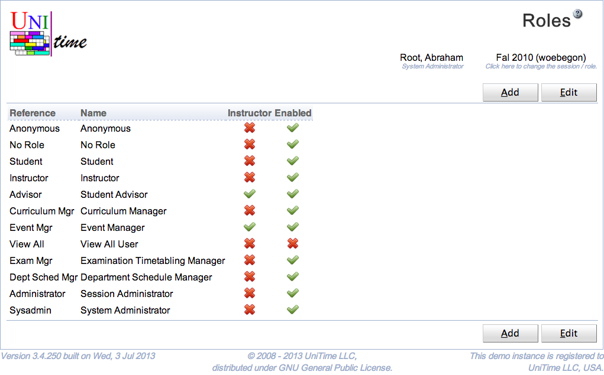

## Screen Description

The Roles page can be used to manage roles in UniTime. A role is a collections of permissions that are managed on the [Permissions](permissions) page. Unauthenticated users have **Anonymous** role, authenticated users with an appropriate record (with the matching external id) in the students table have **Student** role, instructors have **Instructor** role, and timetabling managers have one or more roles that are assigned to them on the [Timetable Managers](timetable-managers) page. Authenticated users with no match against students, instructors, and timetabling managers have the **No Role** role.

## Details

A role has a reference and a name. It can be enabled or disabled. A disabled role cannot be assigned to any authenticated user.

Some roles can be assigned to instructors (and other department personell) using the [Instructor Roles](instructor-roles) page. This allows schedule managers or event managers to dedicate some role to additional members of the department without cluttering the [Timetable Managers](timetable-managers) page too much. For instance, certain departmental users may be allowed to approve / reject events that are requested in the event rooms of the department.

The reference of the roles **Anonymous**, **No Role**, **Student**, and **Instructor** role cannot be changed and these roles cannot be deleted. They can be disabled though. The **anonymous** role is useful when certain pages (e.g., [Events](events) page) are to be available to unauthenticated users. The **no role** role can be used when anyone at the university (who can be authenticated within UniTime, e.g., using [LDAP authentication](LDAP)) can for instance request an event (e.g., [Add Event](add-event) page) see a timetable of a room (e.g., [Room Timetable](room-timetable) page).

## Operations

To edit or delete a role, click on the appropriate line, [Edit Role](edit-role) page will appear. All the roles can be edited on the [Edit Roles](edit-roles) page. To do so, click on the **Edit** button.

A new role can be added on the [Edit Roles](edit-roles) page (button **Edit**) or using [Add Role](add-role) page (button **Add**).

The table can be ordered by any of the columns. To do so, click on the column header and select Sort by <column name> option.

{:class='screenshot'}
