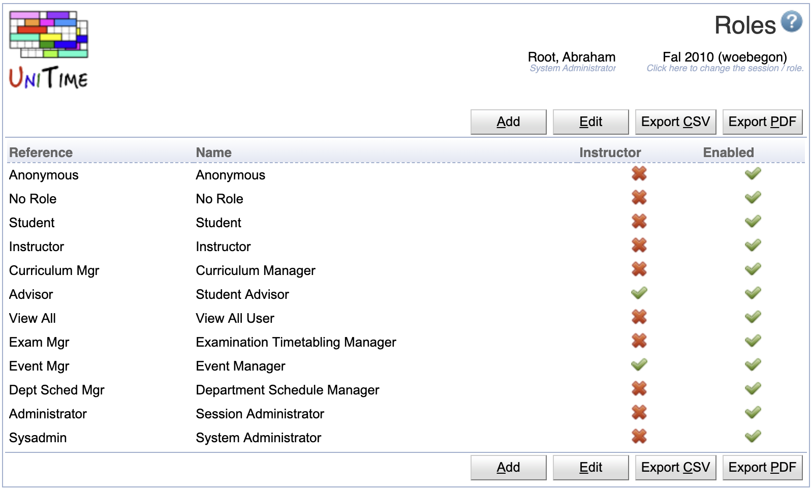

## Screen Description

The Roles page can be used to manage roles in UniTime. A role is a collection of permissions that are managed on the [Permissions](permissions) page. Unauthenticated users have **Anonymous** role, authenticated users with an appropriate record (with the matching external ID) in the student table have **Student** role, instructors have **Instructor** role, advisors have the **Advisor** roles, and timetabling managers have one or more roles that are assigned to them on the [Timetable Managers](timetable-managers) page. Authenticated users with no match against students, instructors, advisors, and timetabling managers have the **No Role** role.

{:class='screenshot'}

## Properties

A role has a reference and a name. It can be enabled or disabled. A disabled role cannot be assigned to any authenticated user.

A role has a reference and a name. When Instructor toggle is checked, the role can be assigned to an instructor (or any departmental personnel) using the [Instructor Roles](instructor-roles) page. When the toggle is unchecked, the role can be only used on the [Timetable Managers](timetable-managers) page. Roles that are not enabled can be assigned to managers (or instructors), but they will not get assigned to the authenticated users.

The default [timetable manager](timetable-managers) roles are:
* **System Administrator** - user who has access to all screens and can do anything
* **Session Administrator** - user who has access everything related to the academic session(s) they are associated with (through their department)
* **Departmental Schedule Manager** - user who has access to and can change the input course timetabling and examination data of certain department(s)
* **Curriculum Manager** - user who has access to and can change the curricula for their department
* **Examination Timetabling Manager** - user who has access to and can change and timetable examinations for the academic session of their department
* **Event Manager** - user who can approve or reject events for rooms in their department
* **View All User** - user who has access to the (timetabling) data of all departmental schedule managers but cannot make any changes

Additional roles that are **NOT** granted through the [Timetable Managers](timetable-managers) page:
* **Student** - granted through the student data (students are not entered directly in UniTime, but they can be imported using the [Data Exchange](data-exchange) page)
* **Instructor** - granted through the [Instructors](instructors)
* **Advisor** - granted through the [Student Advisors](student-advisors) page
* **No Role** - authenticated user without any other role (e.g., to see and request events)
* **Anonymous** - not authenticated users (for pages that allow for unauthenticated access)

The reference of the roles **Anonymous**, **No Role**, **Student**, and **Instructor** role cannot be changed, and these roles cannot be deleted. They can be disabled though. The **anonymous** role is useful when certain pages (e.g., [Events](events) page) are to be available to unauthenticated users. The **no role** role can be used when anyone at the university (who can be authenticated within UniTime, e.g., using [LDAP authentication](LDAP)) can for instance request an event (e.g., [Add Event](add-event) page) see a timetable of a room (e.g., [Room Timetable](room-timetable) page).

## Operations

### Add Role
A new role can be added by clicking the **Add** button.

{:class='screenshot'}

* Click **Save** to create a new rule
* Click **Back** to return to the list without making any changes

### Edit Role
To edit or delete a role, click on the appropriate line.

{:class='screenshot'}

* Click **Save** to make changes, **Back** to return to the list without making any changes
* Click **Previous** or **Next** to save the changes and go to the previous or next role respectively
* Click **Delete** to delete a role. Roles that are being used cannot be deleted.

### Edit Roles
All the roles can be edited at once when the **Edit** button us used.

{:class='screenshot'}

* Use the  icon to add a new line and  to delete a line
* Roles that are being used cannot be deleted.
* Click **Save** to make changes, **Back** to return to the list without making any changes

### Other

The table can be ordered by any of the columns. To do so, click on the column header and select **Sort by ...** option. Use **Export CSV** or **Export PDF** to export the table in the appropriate format.
