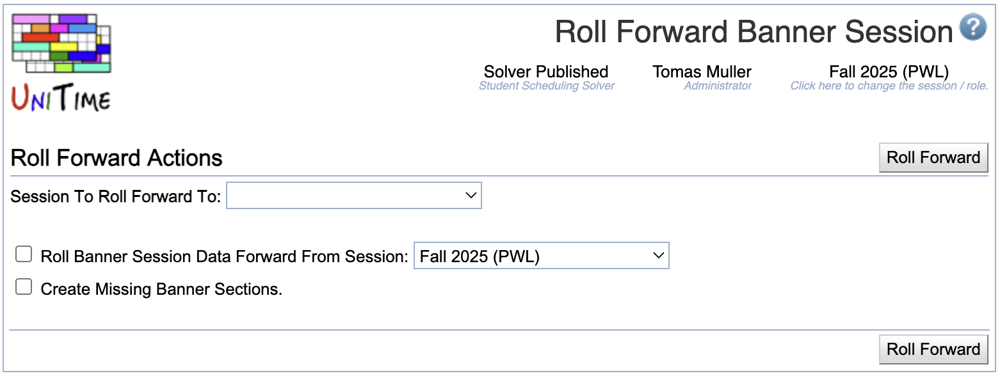

## Screen Description

The Roll Forward Banner Session page is used to roll forward the Banner data associated with a UniTime session to the next like session.  Depending on the amount of data you have this roll forward can take a long time.  It copies all Banner related data from the session select to roll forward from to the session selected to roll forward to. When rolling forward the data for a session the roll creates the Banner session data so you do not have to create it yourself.  You will need to update the Banner CRN data for the session when it is done.

{:class='screenshot'}

## Details

Select target academic session (**Session To Roll Forward To**), check **Roll Banner Data Forward** toggle and select source academic session (which should be the same as was used for rolling classes forward). Hit **Roll Forward** button.
