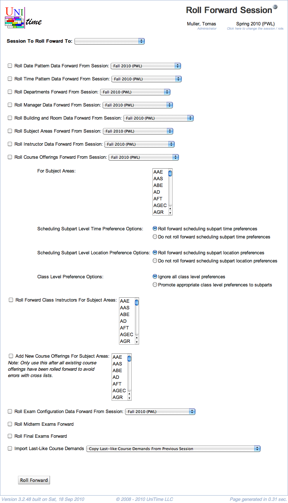

## Screen Description

The Roll Forward Session screen provides a method for populating session data for a new session with data from previous session(s). For example, when setting up Fall 2008, class data can be rolled forward from Fall 2007, while instructor data can be rolled forward from Spring 2008.

{:class='screenshot'}

## Details

* **Session To Roll Forward To**
	* Select the session for which you need to populate data
		* Only sessions with Initial Data Load status can be selected (status of a session can be changed on [Academic Sessions](academic-sessions) page).
		* A new session can be created using the Add Session button on [Academic Sessions](academic-sessions) page.

**Note:** Data can be rolled forward only from sessions that have different status than Initial Data Load.

In the rest of the screen, check the checkbox for each type of data that should be rolled forward to the session selected at the top of the screen and select the session from which the type of data should be taken. The data will be rolled forward after you click the Roll Forward button. You can select as many checkboxes as you need. It is advisable to roll-forward items in the order they are listed on this page.

The page needs to be used in at least two steps. In the first step, the first eight items can be rolled forward (all up to Roll Subject Areas). All the remaining items, starting with instructor data, can be rolled forward in the second step, once the departments and subject areas have been populated.

**Note:** If the session is already populated with some data of the given type, the roll-forward will refuse to continue (e.g., if there are already some time patterns created for the new session, the roll-forward page will not be able to roll forward Time Pattern Data).

### Available Items

The following items need to be rolled forward first, preferably all together or in the following order.

* **Roll Departments Forward From Session**
	* Copy departments from the selected academic session.
* **Roll Session Configuration Forward From Session**
	* Copy session configuration from the selected academic session.
	* Session configuration contains application configuration, standard notes, event room notes, and break times that are applied directly to the session and/or its department(s). Individual room notes and break times are rolled forward with the rooms.
* **Roll Manager Data Forward From Session**
	* Copy [timetabling managers](timetable-managers) (their departments) from the selected academic session.
* **Roll Building and Room Data Forward From Session**
	* Copy [buildings](buildings) and [rooms](rooms) from the selected academic session. This also include all the room features and room groups.
* **Roll Date Pattern Data Forward From Session**
	* Copy [date patterns](date-patterns) from the selected academic session.
	* Please note that the date patterns are relative to the **Session Start Date** set on the [Academic Session](academic-sessions).
* **Roll Time Pattern Data Forward From Session**
	* Copy [time patterns](time-patterns) from the selected academic session.
* **Roll Learning Management System Data Forward From Session**
	* Copy [learning management systems](learning-management-systems) from the selected academic session.
* **Roll Subject Areas Forward From Session**
	* Copy [subject areas](subject-areas) from the selected academic session.

For the following items, departments and subject areas **must** be rolled forward first. It is advised to roll items in the following order as there are additional dependencies, such as room preferences require rooms, class instructors require course offerings and instructor data, etc.

* **Roll Instructor Data Forward From Session**
	* Copy [instructors](instructors) and their attributes from the selected academic session and the selected departments
* **Roll Course Offerings Forward From Session**
	* Copy [courses](instructional-offerings) and all their structure all the way up to classes from the selected academic session and the selected subject areas
	* Select how scheduling subpart, class, and distribution preferences should be rolled forward
	* It is not possible to copy class preferences by default, enable by setting `unitime.rollforward.allowClassPrefs` in the [Application Configuration](application-configuration)
	* To reset class suffixes and external IDs during the roll forward, set `unitime.rollforward.resetClassSufix` to true in the [Application Configuration](application-configuration)
	* Cancelled classes can be either not copied, or copied as they are or as opened
* **Roll Forward Class Instructors For Subject Areas**
	* Copy [instructor class assignments](assign-instructors) from the selected subject areas
	* These are copied over from the original classes (that were used in the previous step)
* **Roll Forward Offering Coordinators For Subject Areas**
	* Copy offering coordinator assignments from the selected subject areas
	* These are copied over from the original instructional offerings (that were used in the previous step)
* **Roll Forward Teaching Request For Subject Areas**
	* Copy [teaching requests](setup-teaching-requests) from the selected subject areas
	* These are copied over from the original instructional offerings (that were used in the previous step)
* **Add New Course Offerings For Subject Areas**
	* Create new courses (that exist in the course catalog imported from an XML file, but do not exist in the academic session) for the selected subject areas
	* **Note:** Only use this after all existing course offerings have been rolled forward to avoid errors with cross lists
* **Roll Exam Configuration Data Forward From Session**
	* Roll forward [examination periods](examination-periods) from the selected academic session
* **Roll Midterm Exams Forward**
	* Roll forward all midterm examinations (examinations of midterm [examination type](examination-types)) from the selected academic session
	* Select whether to copy examination preferences over
* **Roll Final Exams Forward**
	* Roll forward all final examinations (examinations of final [examination type](examination-types)) from the selected academic session
	* Select whether to copy examination preferences over
* **Import Last-Like Course Demands**
	* Import last-like course demands using one of the possible choices:
		* Copy last-like course demands from the previous session (from the original courses that were used in the previous step)
		* Use previous' session student class enrollments
		* Use previous' session student course requests
		* Use previous' session student [point in time snapshot](point-in-time-data-snapshots) of student class enrollments (select which one, there must be at least one for this option to work)
* **Roll Curricula Forward From Session**
	* Copy [curricula](curricula) from the selected academic session
	* This will also roll academic areas, classifications, majors, minors, and projection rules forward (if these are not already present in the target academic session)
* **Roll Reservations Forward From Session**
	* Copy selected [reservations](reservations) from the selected academic session and subject areas
	* For each reservation type, a default start/end expiration dates, for reservations that have these filled in
* **Roll Scheduled Tasks Forward From Session**
	* Copy [scheduled tasks](task-scheduler) from the selected academic session
	* All dates are relative to the **Session Start Date** set on the [Academic Session](academic-sessions)

## Operations

* **Roll Forward**
	* Populate the data of the new session (set at the top of the screen) with the selected data
