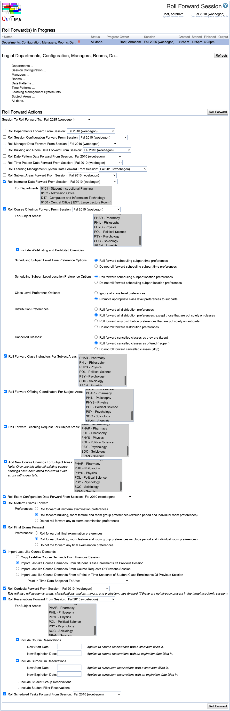

## Screen Description

The Roll Forward Session screen provides a method for populating session data for a new session with data from previous session(s). For example, when setting up fall 2008, class data can be rolled forward from fall 2007, while instructor data can be rolled forward from spring 2008.

## Details

* **Session To Roll Forward To**
	* Select the session for which you need to populate data
		* Only sessions with Initial Data Load status can be selected (status of a session can be changed on [Academic Sessions](academic-sessions) page).
		* A new session can be created using the Add Session button on [Academic Sessions](academic-sessions) page.

Note: Data can be rolled forward only from sessions that have different status than Initial Data Load.

In the rest of the screen, check the checkbox for each type of data that should be rolled forward to the session selected at the top of the screen and select the session from which the type of data should be taken. The data will be rolled forward after you click the Roll Forward button. You can select as many checkboxes as you need. It is advisable to roll-forward items in the order they are listed on this page.

Note: If the session is already populated with some data of the given type, the roll-forward will refuse to continue (e.g., if there are already some time patterns created for the new session, the roll-forward page will not be able to roll forward Time Pattern Data).

## Operations

* **Roll Forward**
	* Populate the data of the new session (set at the top of the screen) with the selected data

{:class='screenshot'}
