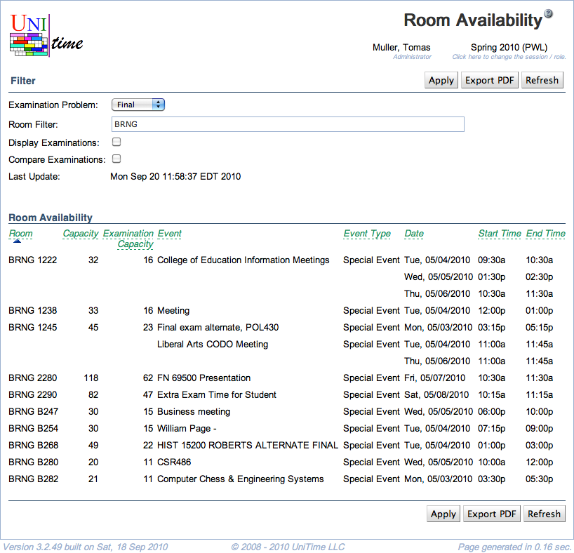

## Screen Description

 The Room Availability screen provides a list of events that overlap with the examination periods of the selected examination problem. This screen is useful when an institution does not use the Event Management section of UniTime and imports information about room availability from external resources (see more about that [here](custom-room-availability)).

## Filter

* **Examination Problem**
	* Final or Midterm examinations

* **Room Filter**
	* Filter by building abbreviation or room number

* **Display Examinations**
	* By default (when unchecked), the examinations of the selected problem are not displayed in the Room Availability screen
	* When checked, the examinations are included in the events scheduled into given rooms

* **Compare Examinations**
	* Compare examinations with examination events
		* This is useful if event information comes from an external source to verify that the same information is present in this application
		* Only examinations with a difference are listed

* **Last Update**
	* Date and time of the last update of room availability from an external source (if events are processed in a different application)

## Room Availability

* **Room**
	* Room label

* **Capacity**
	* Room seating capacity

* **Examination Capacity**
	* Room examination seating capacity

* **Event**
	* The name of the event that is in the room

* **Event Type**
	* Course event, Final examination event, ...

* **Date**
	* Date of the event

* **Start Time**
	* Time when the event starts

* **End Time**
	* Time when the event ends

## Operations

* **Apply**
	* Apply changes made to the filter

* **Export PDF**
	* Export the room availability table into a PDF document

* **Refresh**
	* Refresh the screen
		* Also refresh the room availability information if it is coming from an external source

{:class='screenshot'}
